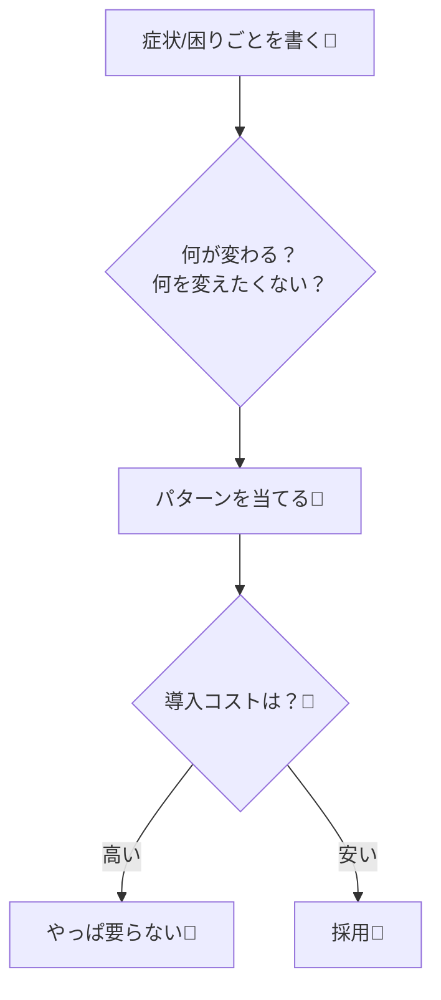

# 第01章：GoFってなに？暗記じゃなく“使い分け”📚🙂


## ねらい 🎯

* **GoF（23個のデザインパターン）**を「暗記リスト」じゃなくて、**“困りごと解決の辞書”**として理解する🙂✨
* 「設計ってなに？」がまだフワッとしててもOK！まずは
  **困りごと → パターン名 → うれしいこと/注意点**
  この順番で話せるようになる🌸
* これから先の章で迷子にならないように、**学び方の型**を手に入れる🧭💕

---

## 到達目標 ✅

この章が終わったら、次のことができればOKだよ☺️✨

* 「GoFって何？」を**30秒で説明**できる⏱️
* 「パターン名」より先に、**困りごと（症状）**を言葉にできる🗣️
* 生成/構造/振る舞いの3分類を、**ざっくり一言で言える**（細かい説明はまだ不要）🧁
* 「それ、今はパターン要らないかも」も言える（これ超大事！）🛑💡

---

## 手順 🧩

### 1) GoFの正体を1分でつかむ 🐣

GoFはざっくり言うと、

* **よくある設計の困りごと**を
* **よく効く解き方**にまとめて
* **名前をつけて共有しやすくしたもの**

…だよ📚✨
ポイントは「**正解の実装集**」じゃなくて「**会話のための単語帳**」ってこと🙂

---

### 2) なんで“今でも”学ぶの？🕰️✨

理由はシンプルで、GoFを知るとこうなる👇

* チームで「それStrategyっぽいね」みたいに**会話が速くなる**🚀
* 変更が来ても「変わる場所」が見えるから、**怖さが減る**😌
* “場当たり的に増えるif/switch”が減って、**読めるコードになりやすい**📖✨

そして大事な現実👇
C#は便利機能が増えていて、GoFを“軽く”書ける場面も多いけど、
**「困りごとをどう分けて、どこを安定させるか」**は今も変わらないよ🙂🧠

---

### 3) 3分類を「一言」で覚える（ここだけ！）🍡

細かい定義は後でいいから、まずはこの感覚だけ👇

* **生成（Creational）**：作るのがツラい → **作り方を整理する** 🏭
* **構造（Structural）**：つなぐのがツラい → **組み立て方を整理する** 🧩
* **振る舞い（Behavioral）**：流れ/ルールがツラい → **動き方を整理する** 🎭

---

### 4) “暗記じゃない”学び方のコア 🧠✨

パターンは、いつもこの順番で考えると強いよ👇

1. **症状（困りごと）**を書く 📝
2. **何が変わる？**（増える？条件が増える？種類が増える？）🔁
3. **何を変えたくない？**（既存コード？呼び出し側？テスト？）🧱
4. それに合うパターンを当てる 🎯
5. **導入コスト**（クラス増える/理解増える）も見積もる 💸😵
6. 「やっぱ要らない」も選べるようにする 🛑🙂

---




### 5) 1個だけ“困りごと例”を見てみる（雰囲気でOK）🔥

たとえば、こんなの👇
「支払い方法が増えるたびに、注文処理の中の分岐が増えていく…」😵‍💫

```csharp
// ありがちなイメージ（今は“雰囲気”だけでOK！）
if (paymentType == PaymentType.CreditCard) { /* ... */ }
else if (paymentType == PaymentType.BankTransfer) { /* ... */ }
else if (paymentType == PaymentType.PayPay) { /* ... */ }
// さらに通知や状態も絡むと…地獄へ🔥
```

この“症状”は、将来こんな方向に繋がりやすいよ👇（今は覚えなくてOK✨）

* 「処理の方針を差し替えたい」→ **Strategy**っぽい🎯
* 「状態によって振る舞いが変わる」→ **State**っぽい🚦
* 「生成の分岐がつらい」→ **Factory**系っぽい🏭

ここで大事なのは、
**“Strategyを使うべき！”じゃなくて、症状から方向を考える**こと🙂🌸

---

### 6) この教材の“進め方”を頭に入れる（超重要）🧭✨

この教材は毎章、いつも同じ流れで進むよ👇

* ねらい → 到達目標 → 手順 → 落とし穴 → 演習 → チェック

これで「今日は何してるんだっけ？」って迷子になりにくい☺️🫶

---

## よくある落とし穴 ⚠️😵

* **パターン名を先に覚えようとして挫折**する📚💥
* “かっこいい抽象”を作って満足して、**読みにくくなる**🌀
* 「何でもパターンで解決！」になって、**逆に複雑化**する😇
* サンプルをコピペして「動いた！」で終わり、**自分の困りごとに繋がらない**🔌💤

---

## ミニ演習（10〜30分）📝🍰

次の3つを、メモ帳でもNotionでも何でもいいから書いてね🙂✨

### ① 過去コードの“つらかった瞬間”を3つ書く 😵‍💫

例（こんな感じでOK）👇

* 「種類が増えるたびにifが増えた」
* 「初期化が長すぎて何が必要か分からない」
* 「テストで差し替えたいのにnewが直書きで詰んだ」

### ② それぞれを3分類に当てはめる 🍡

* 生成っぽい？🏭
* 構造っぽい？🧩
* 振る舞いっぽい？🎭

※迷ったら“っぽい”でOK！正解探しはしない🙂💕

### ③ いちばん痛かった1個を、1文で言う 🗣️

* 「◯◯が増えるたびに、△△が増えて怖い」みたいに✨

---

## 自己チェック ✅🌸

次の質問に、サクッと答えられたら合格だよ🎉

* 「GoFって何？」→ **困りごと解決の辞書**って言える🙂📚
* 生成/構造/振る舞いを**一言で**言える🍡
* 自分の過去の“つらい”を**最低1つ**、言葉にできた📝✨
* 「今は導入しない」も選べそう（コストが高いなら戻す！）🛑💡

---

※注：この第1章は定義・考え方が中心で、内容が時期によって大きく変わりにくいテーマです。今回はこのチャット上の制約でオンライン検索を実行できていませんが、バージョン依存が出る章（.NETやツール、定番NuGetの最新事情など）は、検索できる状態で最新情報を反映する前提で進めてください🙏🙂
