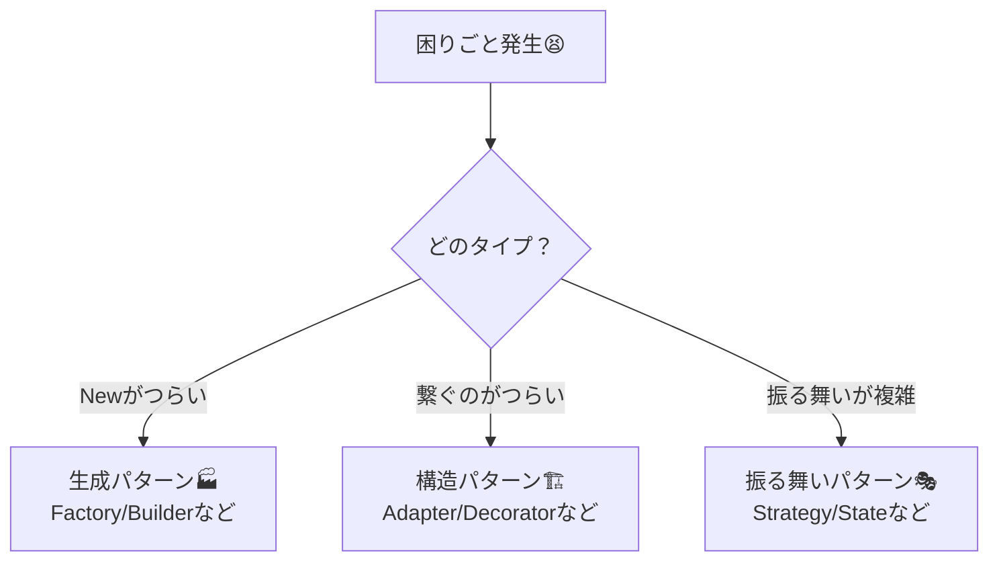

# 第02章：まず最初に：設計で一番損するパターンの覚え方🧠💦

## ねらい 🎯

* 「パターン名 → 実装」の順で覚えるクセを、今日でやめる🙅‍♀️💦
* 「困りごと → 原因 → 変わる点/変えたくない点 → 解決策」の順で考える“型”を身につける🧩✨
* 学習中に起きがちな **過剰抽象化** と **パターン収集癖** を避ける🚫📚

---

## 到達目標 🌸

* どの章でも、まず **困りごとテンプレ** を埋められる📝✨
* 困りごとから逆引きして「候補パターン」を2〜3個出せる🔎💡
* 「今回は採用しない」も、理由つきで言える🙆‍♀️✅（これ超大事！）

---

## 手順 🧭（この章の“やり方”が今後ずっと共通だよ✨）

### 1) まず“困りごと”を1行で言う🙂

例：

* 「支払い方法が増えるたびに `switch` が増えてつらい😵」
* 「`new` が連鎖してテスト差し替えが地獄😇」
* 「引数が多すぎて呼び出しが読めない💦」

ここでのコツ👇

* **“今つらい症状”をそのまま言葉にする**（賢く言わなくてOK）😊

---

### 2) 困りごとテンプレを埋める📝✨（最重要！）

このテンプレを、章ごとに毎回埋めるよ〜！🌷
（NotionでもMarkdownでもメモアプリでもOK）

**困りごとテンプレ（コピペして使ってOK）🧾**

* **症状（何がつらい？）**：
* **いつ困る？（変更が入る場面）**：
* **原因（なぜつらい？）**：
* **変わる点（これ増える/変わる）**：
* **変えたくない点（ここは安定させたい）**：
* **制約（既存コードを壊せない/期限/チーム事情など）**：
* **候補（パターン名 or 方針）**：
* **採用判断（やる/やらない・理由1行）**：

💡コツ：

* **「変わる点」と「変えたくない点」** が分けられたら勝ち🏆✨
* GoFはここを分けるための道具箱だよ🧰

---

### 3) “3分類”に当てはめて、候補を出す🏷️✨

困りごとが出たら、まずこれ👇のどれっぽいかを決める！

* **生成（newがつらい）** 🏭

  * 例：生成分岐が増える、初期化が複雑、テスト差し替えが困難
* **構造（つなぐ/包む）** 🏗️

  * 例：既存コードを壊さず拡張したい、外部I/Fが合わない
* **振る舞い（分岐・状態・手順がつらい）** 🎭

  * 例：if/switch地獄、状態が増えて破綻、手順が固定できない

この分類ができると、暗記じゃなくて **“探せる”** になるよ🔎✨

---

### 4) 逆引きミニ辞書を作る📚🔁（覚えなくていい仕組み）

「症状 → 候補」を短くメモしていくと最強💪✨
最初はこれだけでOK👇（増やしすぎない！）

* **new地獄（生成分岐）** → Factory Method / Abstract Factory 🏭
* **引数が多い・段階的に作りたい** → Builder 🧱
* **テンプレから複製したい** → Prototype 🧬
* **型/I/Fが合わない** → Adapter 🔌
* **機能を後付けで足したい** → Decorator 🎁
* **入口だけ簡単にしたい** → Facade 🚪
* **if/switchが増える** → Strategy / State / Command（後で学ぶよ）🎭
* **手順の骨格は固定・一部だけ差し替え** → Template Method 🧩

ポイント👇

* これは“暗記帳”じゃなくて **“索引”** だよ📖✨
* 覚えなくてOK！探せればOK！😊

---

### 5) 最後に“採用判断メモ”を1行で残す🖊️✅

毎章の最後に、必ずこれを書く！

例：

* 「今回はFactory Method採用：支払い方法が増え続けるから、生成分岐を呼び出し側から追い出す🙂」
* 「今回はBuilder不採用：引数は増えないし、今はコンストラクタで十分😊」
* 「今回はAdapter採用：外部APIのDTOが変でも、ドメイン側を守りたい💪」

この1行があるだけで、数章後に迷子にならないよ🧭✨

---

## よくある落とし穴 💥（ここで損しがち！）

### 落とし穴1：パターン名から入って「使いどころ迷子」😵‍💫

* 「Factoryって何だっけ…？」で止まる
  ➡️ **症状から入る** と止まらないよ🔎✨

### 落とし穴2：“正解の実装”探しで時間が溶ける🫠

* ネットの神実装を追いかけて疲れる
  ➡️ まずは **小さく・テストが通る** が正解✅🧪

### 落とし穴3：抽象を増やしすぎて読めなくなる📦📦📦

* interface/抽象クラスを増やすほど、初心者ほど混乱しやすい💦
  ➡️ **「変わる点」だけ** を小さく抽象化しよう🙂✨

### 落とし穴4：AIが出した“それっぽい設計”を丸飲み🤖🍽️

AIは便利だけど…

* “汎用フレームワーク化”しがち
* クラスが増えがち
  ➡️ AIに頼むなら、**テンプレに沿って** こう聞くのがコツ👇

**AIへの聞き方（短くて強い）🧠✨**

* 困りごと（症状）
* 変わる点 / 変えたくない点
* 禁止：汎用フレームワーク化、過剰抽象
* ゴール：最小のクラス数、テストしやすさ

---

## ミニ演習（10〜30分）🧪🌷

### 演習1：困りごとテンプレを“自分の保管場所”に作る📝

* Notion/Markdown/メモ帳どれでもOK🙆‍♀️
* とにかく「いつでも貼れる状態」にする✨

### 演習2：過去のコードから“つらかった箇所”を1つ選ぶ😵➡️🙂

次のどれかでOK👇

* `switch` が増えてしんどい
* `new` が連鎖してしんどい
* 引数が増えてしんどい
* 外部I/Fが合わなくてしんどい

それを **テンプレで全部埋める** 📝✨

### 演習3：採用判断メモを1行だけ書く🖊️

* やる/やらない、どっちでもOK🙆‍♀️
* 「理由1行」が大事✅

---

## 自己チェック ✅🌟

* 困りごとテンプレを“毎章”埋められる状態になってる？📝
* 「変わる点」と「変えたくない点」を言葉で分けられる？🧩
* 候補パターンを2〜3個出して、**不採用も選べる**？🙆‍♀️
* 最後に“採用判断メモ1行”が残ってる？🖊️✨
