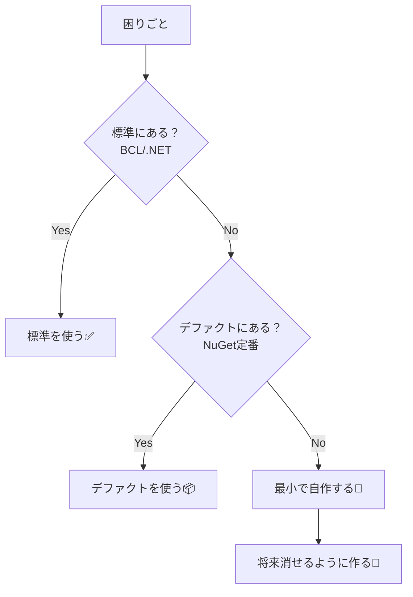

# 第03章：この教材の“縛り”を確認（標準/デファクト中心）🪢✅


## ねらい 🎯

* 「GoFを学ぶ＝クラス図を量産する」にならないように、学び方の“型”を先に固定します🙂
* **標準（BCL / .NET）と現場のデファクト**を中心に、パターンを“自然に”体験します✨
* 「パターンのためだけの汎用フレームワーク」を作って迷子になるのを防ぎます🧭💦

---

## 到達目標 🏁

この章が終わったら、次ができるようになります😊

* 「まず標準を探す → 次にデファクト → 最後に最小の自作」の順で判断できる🔍✅
* “作りすぎ”の兆候（危険サイン）を3つ以上言える🚨
* `IEnumerable/yield`、`Stream`の重ね合わせ、`Microsoft.Extensions.*`（DI/Logging）で
  「あ、これGoFっぽい！」を体感できる🎉

---

## 手順 🧩✨

### 1) この教材の最重要ルールは「標準ファースト」🥇

GoFって、そもそも **“よくある困りごと”に名前を付けた辞書**みたいなものです📚🙂
だから、まずは **すでに世の中が勝ち筋として固定した道具**を使います。

* 標準（BCL / .NET）：そのまま使える、みんな知ってる、将来も壊れにくい🧱
* デファクト：現場で「それで行こう」が成立してる定番（特に `Microsoft.Extensions.*` 系）🔌
* 自作：**“その問題”にだけ効く、最小サイズ**（増殖禁止）🐣

> ✅ 合言葉：**「自作は“最後の手段”、しかも“最小”」** 🪄

---

### 2) 「自作していいもの／ダメなもの」を仕分ける✂️🙂

この教材で作ってOKなのは、だいたいこの2種類だけです👇

* **業務モデル（例：Order, Money）**：学習用の小ささならOK🛒
* **その章の困りごとを解くための“最小の差し替え点”**：1〜2ファイル程度に収める📄

逆に、ダメなのはこれ👇（“それっぽい”ほど危険💣）

* 汎用Builder基盤（どのクラスにも使える感じのやつ）🧱🚫
* 汎用Mediator基盤（全イベント・全通信を支配するやつ）📡🚫
* 自作DIコンテナ（だいたい沼）🕳️🚫
* 自作Logger（ログの仕様決めから始まって終わる）📝🚫
* 「GoF用ベースクラス群」「共通抽象レイヤ」みたいな“万能っぽい箱”📦🚫

---

### 3) 標準で体験できる「GoFっぽさ」ベスト3を触ってみる👆✨

#### A. `IEnumerable` と `yield`（Iteratorの“超軽量版”）🧺🌸

「列挙したい」だけなら、Iterator用クラスを量産しなくても、`yield return` で十分なことが多いです🙂

```csharp
public sealed class Order
{
    private readonly List<string> _items = new();

    public void AddItem(string name) => _items.Add(name);

    // “順番に取り出す”という意図が、yieldでスッと書ける✨
    public IEnumerable<string> GetItems()
    {
        foreach (var item in _items)
        {
            yield return item;
        }
    }
}

// 使う側（foreachできる＝列挙の契約が統一される😊）
var order = new Order();
order.AddItem("Cake");
order.AddItem("Tea");

foreach (var item in order.GetItems())
{
    Console.WriteLine(item);
}
```

ポイント💡

* **呼び出し側は「どう保持してるか」を知らなくてOK**🙆‍♀️
* 「列挙」という共通操作に寄せられる（設計が軽くなる）🪶

---

#### B. `Stream` の重ね合わせ（Decoratorの王道）💧🎁

`Stream` は「包んで機能を足す」が最初から得意です✨
**暗号化・圧縮・バッファ・読みやすさ**が、重ねるだけで変えられます🙂

```csharp
using System.IO;
using System.IO.Compression;

var path = "orders.json.gz";

// FileStream（本体）に、GZipStream（圧縮）を“後付け”して、さらにStreamWriterで文字を書きやすくする✨
await using var file = File.Create(path);
await using var gzip = new GZipStream(file, CompressionLevel.Optimal);
await using var writer = new StreamWriter(gzip);

await writer.WriteLineAsync("{\"orderId\": 1, \"total\": 1200}");
```

ポイント💡

* **既存の型を変えずに機能を足していける**🎁
* 組み合わせで能力が増える（Decoratorの気持ちよさ）✨

---

#### C. `Microsoft.Extensions.*`（DI/Loggingは“まずこれ”）🔌📝

`Microsoft.Extensions.DependencyInjection` や `Microsoft.Extensions.Logging` は、現場の定番として超強いです💪
「差し替え」「ログ統一」を、**自作せずに**体験できます🙂

```csharp
using Microsoft.Extensions.DependencyInjection;
using Microsoft.Extensions.Logging;

var services = new ServiceCollection();

services.AddLogging(b => b.AddConsole());
services.AddTransient<OrderService>();

using var provider = services.BuildServiceProvider();
var svc = provider.GetRequiredService<OrderService>();

svc.PlaceOrder();

public sealed class OrderService
{
    private readonly ILogger<OrderService> _logger;

    public OrderService(ILogger<OrderService> logger)
    {
        _logger = logger;
    }

    public void PlaceOrder()
    {
        _logger.LogInformation("Order placed! 🎉");
    }
}
```

ポイント💡

* ログは **「どこで」「何を」出すか**が大事で、仕組みは標準に寄せるのが勝ち📝✨
* DIも “差し替え点を登録に集約” できるのが嬉しい🔌

（この系統は Microsoft が提供している標準的な土台なので、迷ったらまず乗っかるのが安全です🙂）

---

### 4) “作りすぎ”の危険サイン（この3つが出たら止まる🛑）🚨

1つでも当てはまったら、いったん深呼吸〜😮‍💨💦

1. **「汎用化したくなってきた」**（あらゆるケースに対応したい…）
2. **「抽象が先、具体が後」**（interfaceだけ増えて動くものがない）
3. **「新しい章なのに、共通基盤が増える」**（章の目的がズレてる）

---

### 5) 学びをブレさせない“超シンプル判断フロー”🧭

困りごとが出たら、この順でチェックします👇

1. 標準にある？（BCL / .NET / `Microsoft.Extensions.*`）🔍
2. 現場定番（デファクト）で解ける？（特に公式寄りのNuGet）📦
3. それでも無理なら、**その困りごと専用で最小に自作**🐣
4. そして最後に…「これ、将来消せる？」で自問する🧹✨

---




## よくある落とし穴 😵‍💫💦

* 「GoFを学ぶ＝クラス図が増えるほど正しい」と思ってしまう📈❌
* “自作の抽象”が増えて、読むだけで疲れるコードになる😵
* 便利そうで「万能クラス（God Object）」が誕生する👑💥
* DI/Loggingを自作して、GoFどころじゃなくなる🕳️

---

## 演習（10〜30分）📝🌸

### 演習1：自作禁止リストを作る（自分専用）🪓🚫

次のテンプレをそのまま埋めてOKです🙂

* ❌ 自作DIコンテナ
* ❌ 自作Logger
* ❌ 汎用Builder基盤
* ❌ 汎用Mediator基盤
* ❌ 「GoF用共通抽象レイヤ」

そして最後に1行だけ👇

* ✅ 自作していいのは「章の困りごと専用で最小」だけ🐣✨

---

### 演習2：`yield` を1回だけ書く🧺

* `Order` に `GetItems()` を作って、`foreach` で回してみる🙂
* “列挙”っていう共通操作に寄せられるのを体感する✨

---

### 演習3：`Stream` を3段重ねしてみる（ファイル→圧縮→文字）💧🎁

* `FileStream` + `GZipStream` + `StreamWriter` で1行だけ保存する
* 「包んで足す」感覚を体で覚える🎉

---

## 自己チェック ✅✅✅

* 「標準→デファクト→最小自作」の順で判断できる🙂
* “作りすぎサイン”を3つ言える🚨
* `yield` と `Stream` の重ね合わせが、GoFっぽい理由を説明できる✨
* 次章以降で「新しい汎用基盤を作りたくなったら止まる」って決めた🛑😊

---

※補足（学び方のコツ）📌
この章の題材（`IEnumerable/yield`、`Stream`、`Microsoft.Extensions.*`）は定番なので大きくは揺れにくいです🙂
ただし「最新の推奨や注意点」は、使うAPIの公式ドキュメントの更新履歴やサンプルでサクッと確認する癖を付けると安心です✨
（GoFの勉強が、古い流儀のまま固定されるのを防げます🧠🌸）
