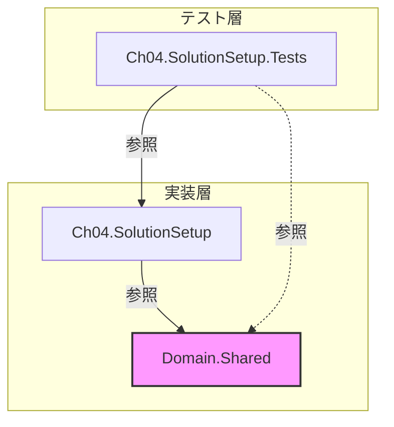

# 第04章：Visual Studioで学習用ソリューションを作る📁✨


## ねらい 🎯

* 章が進んでも迷子にならないように、学習用の“型”（フォルダ構成・命名・テストの置き場所）を固定するよ📌
* 演習コードは**捨てやすい**のが正義✨ だから「小さく作って、すぐ直せる」構成にしていくよ🧹🧡
* あとでGoFを入れても破綻しないように、**依存の向き**（どこに何を置くか）を先に整えるよ🧭

---

## 到達目標 ✅

* 新しい章（Console + Test）を**5分以内**で追加できる⏱️✨
* “共通ドメイン”と“章ごとの実装”がゴチャ混ぜにならない🧩
* テストが毎章ついていて、安心してリファクタできる🧪🌸
* Gitのコミットが「章単位」でキレイに切れている🐙✨（GitHub想定）

---

## 手順 🛠️

### 1) まずはフォルダ構成を決める📁（これが一番大事！）

おすすめはこの形👇（シンプル＆増えても崩れにくい✨）

```text
GofPatternsLearning/
  GofPatternsLearning.sln
  src/
    Domain.Shared/
    Ch04.SolutionSetup/
  tests/
    Ch04.SolutionSetup.Tests/
```

* `src/`：本体コード（章ごとのConsoleアプリやライブラリ）
* `tests/`：テスト（章ごとに対応するTestsプロジェクト）
* `Domain.Shared/`：**共通の最小ドメイン**（増やしすぎ禁止🚫）

> ポイント💡：
> 共通化は“便利”に見えるけど、早い段階でやりすぎると地獄になる😇
> **「共通は最小、章は独立」**が勝ちパターンだよ🏆✨

---




### 2) Visual Studioでソリューションを作る🧰✨

1. Visual Studio → **新しいプロジェクトの作成**
2. 「空のソリューション」または「ソリューション」作成（無ければ一旦Consoleで作ってOK）
3. ソリューション名：`GofPatternsLearning`
4. 保存場所：`GofPatternsLearning/`（フォルダ名と揃えると超ラク💕

> ここで、ソリューション（.sln）をリポジトリのルート直下に置くのがコツだよ📌

---

### 3) 章の“ひな形”プロジェクト（Console + Test）を作る🧩🧪

この章（第4章）用に、まずは1セット作っちゃうよ！

* 本体：`src/Ch04.SolutionSetup`（Console）
* テスト：`tests/Ch04.SolutionSetup.Tests`（MSTest推奨）

Visual Studioの操作：

1. ソリューション右クリック → **追加** → **新しいプロジェクト**
2. Console App（.NET）を選ぶ → 名前 `Ch04.SolutionSetup` → 場所は `src/`
3. 同じようにテストプロジェクト（MSTest） → 名前 `Ch04.SolutionSetup.Tests` → 場所は `tests/`
4. `Ch04.SolutionSetup.Tests` から `Ch04.SolutionSetup` に参照追加（プロジェクト参照）🔗

---

### 4) CLI（dotnet）でも作れるようにしておく💻✨（VS Code派にも優しい）

Visual Studio派でも、**CLIが使えると爆速**になる場面が多いよ🔥
（章追加を5分でやるには、CLIが強い💪）

```bash
mkdir GofPatternsLearning
cd GofPatternsLearning

dotnet new sln -n GofPatternsLearning

mkdir src tests
dotnet new console -n Ch04.SolutionSetup -o src/Ch04.SolutionSetup
dotnet new mstest  -n Ch04.SolutionSetup.Tests -o tests/Ch04.SolutionSetup.Tests

dotnet sln add src/Ch04.SolutionSetup
dotnet sln add tests/Ch04.SolutionSetup.Tests

dotnet add tests/Ch04.SolutionSetup.Tests reference src/Ch04.SolutionSetup
```

動作確認も一気にいくよ✨

```bash
dotnet test
```

---

### 5) “共通ドメイン”は Library プロジェクトで最小だけ置く🧁

第9章で共通ドメインを作る予定だけど、置き場所はここで決めちゃう📌
`src/Domain.Shared` を作って、必要になったら少しずつ増やす（増やしすぎ禁止🚫）

```bash
dotnet new classlib -n Domain.Shared -o src/Domain.Shared
dotnet sln add src/Domain.Shared
```

> そして、**各章のプロジェクトが必要になったら参照**するだけ✨
> 「共通を触る＝全章に影響」になるから、慎重にね🥺

---

### 6) Directory.Build.props（任意だけど超おすすめ✨）

“毎回同じ設定を各csprojに書かない”ための仕組みだよ📦
これがあると、章が増えても統一感が保てる✨

ルートに `Directory.Build.props` を作る👇

```xml
<Project>
  <PropertyGroup>
    <Nullable>enable</Nullable>
    <ImplicitUsings>enable</ImplicitUsings>
    <LangVersion>latest</LangVersion>
    <TreatWarningsAsErrors>false</TreatWarningsAsErrors>
  </PropertyGroup>
</Project>
```

* `Nullable enable`：バグ減る！未来の自分が助かる！🥹✨
* `LangVersion latest`：新しいC#機能が自然に使える💎
* `TreatWarningsAsErrors` は最初は `false` でOK（学習が止まるとつらい😵）

---

### 7) Solution Folderで見た目も整える🧺✨（混乱防止）

Visual Studioのソリューション内に、見た目のフォルダを作るよ！

* `src`
* `tests`

そこに各プロジェクトを入れていくと、章が増えてもスッキリ🌿

---

### 8) Git運用（章単位コミット）🐙✨

この教材は「小さく成功」して進むのが大事だから、コミットも小さく📌

おすすめのコミット粒度👇

* `ch04: create solution + base projects`
* `ch04: add shared domain project skeleton`
* `ch04: add first test + CI-ready dotnet test`

> AI補助（OpenAI系 / Copilot）を使うなら、
> 「コミット前に差分レビュー」だけは必ず自分でやろうね👀✨
> “増やしすぎ”を早めに止められるから👍

---

## よくある落とし穴 💣

* **共通化しすぎ問題**：`Domain.Shared` が太って、全部が絡まる😱
  → 共通は“最小の型”だけ（Order/Money など）に絞る🍰

* **章の独立性が崩れる**：別章のプロジェクト参照を貼り始めると地獄😇
  → “章は基本独立”！共有は `Domain.Shared` 経由だけにする🧭

* **テストが後回しになる**：その瞬間からリファクタ怖いマンになる😵
  → 章プロジェクト作ったら、同時にTestsも作る🧪✨

* **バージョン情報の確認をサボる**：.NET / VS は更新で表示やテンプレが変わる🔄
  → 迷ったら「Visual Studioの新規プロジェクト検索」と「dotnet --info」で即確認💡

* **Windowsのパス長で詰む**（たまにある）📏💦
  → ルートを深くしすぎない（例：`C:\repo\GofPatternsLearning\` みたいに浅め）

---

## ミニ演習（10〜30分）🏃‍♀️💨

次の条件を満たす“テンプレ章”を1つ完成させよう✨

1. `Ch04.SolutionSetup`（Console）を作る
2. `Ch04.SolutionSetup.Tests`（MSTest）を作る
3. テストから本体に参照を貼る
4. `dotnet test` が通る✅
5. Gitで1コミットする🐙✨

テストは超ミニでOKだよ👇

```csharp
using Microsoft.VisualStudio.TestTools.UnitTesting;

namespace Ch04.SolutionSetup.Tests;

[TestClass]
public class SmokeTests
{
    [TestMethod]
    public void Always_Pass()
    {
        Assert.IsTrue(true);
    }
}
```

---

## 自己チェック ✅

* 新しい章（Console + Tests）を、同じ構成でサクッと増やせる？📁✨
* `src/` と `tests/` が分かれていて、探し物で迷わない？🧭
* `dotnet test` を打ったら、いつでも緑になる？🟩🧪
* 共通化は最小で止まってる？（“便利だから…”で増やしてない？）😇

---
