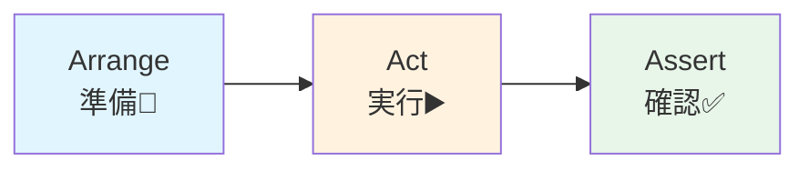

# 第05章：テストの最小セット：AAAだけ覚える🧪🌸


※この章は内容が比較的「変わりにくい」領域（テストの考え方・書き方）です。ただし各ツールの細かなUIや推奨設定は更新されるので、困ったら公式ドキュメントの更新日もチェックしてね🔎✨

---

## ねらい🎯

* テストを「バグ取り」じゃなくて、**設計の安全網🛡️**として使えるようになる
* テストの書き方は難しい流派が多いけど、まずは **AAA（Arrange/Act/Assert）だけ**覚えて勝てるようにする💪🌷
* 次の章以降（GoF）でリファクタしても、**仕様を壊してないって自信が持てる**状態を作る✨

---

## 到達目標✅

* **AAA**で「読めるテスト」が書ける📖✨
* **例外テスト**（失敗すべきときに失敗する）を書ける🔥
* **境界値テスト**（0、-1、空文字など）を“自然に”足せる🧠💡
* **1テスト＝1主張**（大事なこと1個だけ確認）で書ける🎯

---

## 手順🧭（AAAを体に入れる）

### 0) AAAって何？（これだけでいい）🫶

* **Arrange**：準備（テストしたい状況を作る）🧰
* **Act**：実行（本番コードを1回呼ぶ）▶️
* **Assert**：確認（期待した結果かチェック）🔍✅

テストは「読める仕様書」になるのが理想だよ📘✨
（＝未来の自分を助けるメモ📝）

---




## 1) まずは最小ドメインで練習する🍰

GoFの前に「テストの練習台」が必要だよね😊
ここでは **Money** と **Order** の超ミニでいくよ🛒✨

## 本番コード（最小）🧱

```csharp
using System;
using System.Collections.Generic;
using System.Linq;

public readonly struct Money
{
    public decimal Amount { get; }

    public Money(decimal amount)
    {
        if (amount < 0) throw new ArgumentOutOfRangeException(nameof(amount), "金額は0以上");
        Amount = amount;
    }

    public static Money operator +(Money a, Money b) => new Money(a.Amount + b.Amount);
}

public sealed record OrderLine(string Sku, int Quantity, Money UnitPrice)
{
    public Money Subtotal => new Money(UnitPrice.Amount * Quantity);
}

public sealed class Order
{
    private readonly List<OrderLine> _lines = new();

    public IReadOnlyList<OrderLine> Lines => _lines;

    public Money Total => _lines.Aggregate(new Money(0m), (sum, line) => sum + line.Subtotal);

    public void AddItem(string sku, int qty, Money unitPrice)
    {
        if (string.IsNullOrWhiteSpace(sku)) throw new ArgumentException("SKU必須", nameof(sku));
        if (qty <= 0) throw new ArgumentOutOfRangeException(nameof(qty), "数量は1以上");
        _lines.Add(new OrderLine(sku, qty, unitPrice));
    }
}
```

---

## 2) AAAで書く：まずは「例外テスト」から🧨

「失敗すべき入力で、ちゃんと失敗する」って超大事！
変な値が入っても黙って進むと、後で地獄になる…😇🔥

## Moneyの例外テスト（AAAの超基本）🧪

```csharp
using Microsoft.VisualStudio.TestTools.UnitTesting;
using System;

[TestClass]
public class MoneyTests
{
    [TestMethod]
    public void Ctor_Negative_ThrowsArgumentOutOfRangeException()
    {
        // Arrange
        var amount = -1m;

        // Act
        void Act() => _ = new Money(amount);

        // Assert
        Assert.ThrowsException<ArgumentOutOfRangeException>(Act);
    }
}
```

ポイント💡

* Arrange：`amount = -1m` を用意
* Act：実行は **関数に包む**（例外を拾うため）
* Assert：`ThrowsException` で確認🔥

---

## 3) AAAで書く：正常系（期待した結果）🌸

次は「普通に使ったらこうなる」を固定するよ🧁✨

## Orderの合計が増えるテスト🛒

```csharp
using Microsoft.VisualStudio.TestTools.UnitTesting;

[TestClass]
public class OrderTests
{
    [TestMethod]
    public void AddItem_WhenValid_IncreasesTotal()
    {
        // Arrange
        var order = new Order();
        order.AddItem("A-001", 2, new Money(100m));

        // Act
        order.AddItem("B-009", 1, new Money(50m));

        // Assert
        Assert.AreEqual(250m, order.Total.Amount);
    }
}
```

**1テスト＝1主張**のコツ🎯

* ここでは「合計が 250 になる」だけに集中！
* `Lines.Count` も見たくなるけど…その気持ちをグッと抑えて、別テストに分けると壊れにくいよ✨

---

## 4) 境界値テスト：DataRowでサクッと増やす📚✨

境界値は **0 / -1 / null / 空文字** あたりが定番だよ🧊🔥
MSTestなら `DataTestMethod` が便利！

```csharp
using Microsoft.VisualStudio.TestTools.UnitTesting;
using System;

[TestClass]
public class OrderValidationTests
{
    [DataTestMethod]
    [DataRow(0)]
    [DataRow(-1)]
    [DataRow(-99)]
    public void AddItem_InvalidQuantity_Throws(int qty)
    {
        // Arrange
        var order = new Order();

        // Act
        void Act() => order.AddItem("A-001", qty, new Money(100m));

        // Assert
        Assert.ThrowsException<ArgumentOutOfRangeException>(Act);
    }
}
```

「テスト増やすのめんどい…😵」を **DataRow** が救ってくれる💖

---

## 5) 例外テスト（async版）も1回だけ押さえよう⏳✨

非同期で例外を投げるメソッドなら、こう👇
（今は「形」を覚えればOK！）

```csharp
using Microsoft.VisualStudio.TestTools.UnitTesting;
using System;
using System.Threading.Tasks;

[TestClass]
public class AsyncExceptionTests
{
    [TestMethod]
    public async Task DoAsync_WhenBad_Throws()
    {
        // Arrange
        Task Act() => ThrowAsync();

        // Act & Assert
        await Assert.ThrowsExceptionAsync<InvalidOperationException>(Act);
    }

    private static Task ThrowAsync() => Task.FromException(new InvalidOperationException("だめ"));
}
```

---

## 6) テスト命名：迷ったらコレで固定📛✨

おすすめはこのどれか（チームで統一できれば勝ち）🎉

* `Method_Scenario_Expected`（一番わかりやすい）

  * 例：`AddItem_WhenValid_IncreasesTotal`
* `Method_State_Expected`（状態がある系）

  * 例：`Ctor_Negative_ThrowsArgumentOutOfRangeException`

コツ💡

* **「何をしたら」「どうなる」**が入ってればOK🙆‍♀️✨
* 英語がつらければ、最初は短くてもいいよ（慣れが大事）🌱

---

## 7) よくある落とし穴⚠️（ここだけは避けて〜😵）

## 落とし穴①：実装の細部をテストして壊れがち🧨

* ❌ privateメソッドの動きを直接検証したくなる
* ❌ 内部のListの中身を細かく見すぎる
* ✅ 「公開された振る舞い（結果）」を見るのが基本✨

## 落とし穴②：Arrangeがデカすぎて読めない📚💥

* テストは「準備コード」が伸びると急に読みにくい😇
* ✅ まずは **テスト内に全部書く**（最初はそれでOK）
* ✅ つらくなったら **小さなヘルパー関数**だけ作る（“汎用基盤”は作らない）🧁

例：小さなヘルパー（OKな範囲）🍰

```csharp
private static Order CreateOrderWithA001()
{
    var order = new Order();
    order.AddItem("A-001", 2, new Money(100m));
    return order;
}
```

## 落とし穴③：1テストでAssertしすぎて、原因が分からない😵

* ✅ 「1つ壊れたら、1つの理由で壊れる」ようにするとデバッグが楽✨

---

## 8) （任意）FluentAssertionsを使うと読みやすい🍯✨

標準の `Assert` でも全然OK！
でも「読みやすさ」だけ欲しいなら、定番の **FluentAssertions** が人気だよ🫶

例（雰囲気だけ）👇

```csharp
// using FluentAssertions;
Action act = () => new Money(-1m);
act.Should().Throw<ArgumentOutOfRangeException>();
```

※導入は「チーム方針」で決めればOK。無理に入れなくて大丈夫🙆‍♀️🌸

---

## 演習📝✨（10〜30分）

## 演習1：失敗するテストを先に1本書く🔥

1. `Order.AddItem("", 1, new Money(100m))` が例外になるテストを書く
2. テストが **先に落ちる**のを確認してから、本番コードを直す（または確認する）✅

## 演習2：1テスト＝1主張に分ける🎯

次の2つを別テストに分けて書いてみよう✨

* 合計が増える
* 明細が増える

---

## 自己チェック✅（ここが通れば次へGO🎉）

* AAAでテストが書けて、**テストだけ読めば仕様が分かる**📖✨
* 例外テストが書ける（`ThrowsException` / `ThrowsExceptionAsync`）🧨
* 境界値（0/-1/空/Null）を「反射で」足せる🧠💡
* 1テスト＝1主張にできてる🎯🌸

---

次の章以降、GoFでリファクタしていくときに、この章のテストが「守護神」になるよ🛡️👼✨
