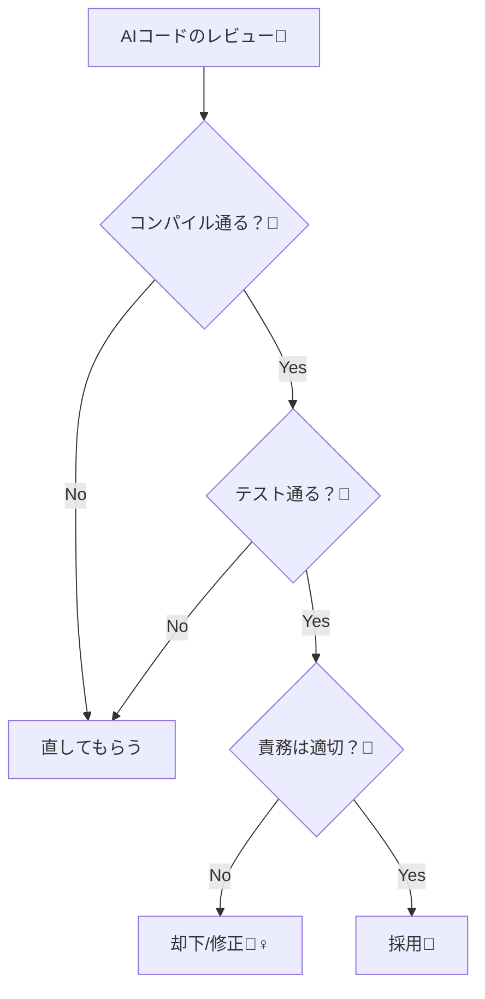

# 第06章：AI補助（Copilot/Codex）の正しい使い方🤖✍️


## ねらい 🎯✨

* AIを「設計を良くする道具」として使って、開発スピードを上げるよ🚀
* でも依存しすぎずに、**責務・命名・テスト**は自分の頭で守れるようになるよ🧠🛡️
* AIがやりがちな「過剰抽象」「余計なクラス増殖」を見抜けるようになるよ👀⚠️

---

## 到達目標 ✅🌸

* AIに頼むときの**依頼テンプレ**を作って、毎回ブレずに指示できる📄✨
* AIが出したコードを、**採用/修正/却下**できる（理由も言える）🙆‍♀️🛠️🙅‍♀️
* 変更を小さくして、テストで安全に進められる🧪🧡
* 「AIが書いたからOK」じゃなく、**自分の品質基準**で仕上げられる💎

---

## 手順 🧭💨

### 1) まず最初に：AIの“担当範囲”を決めよう✂️🤝

AIに頼むのはここ👇（雛形・作業量が多いところ）

* テストの雛形（AAAの形）🧪
* DTOや小さな変換コード（例：JSON→モデル）🔁
* 既存コードのリファクタ案（ただし採用判断は自分）🧹
* 例外メッセージの整形、ログ文の候補📝

AIに頼まない（or そのまま採用しない）のはここ👇（設計の核）

* 「どこが責務の境界か」🧩
* 「どの抽象が必要か（interfaceを切るか）」🏗️
* 「命名（ドメイン語彙）」📛
* 「仕様の最終判断（何を保証するか）」📌

> ざっくり言うと、AIは“手”🖐️、あなたは“脳”🧠だよ！

---

### 2) AIに投げる前に「失敗するテスト」を1本作る🧪🔥

AIに一発で正解を書かせようとすると、だいたい迷子になるよ〜😵‍💫
だから先に「こう動いてほしい！」をテストで固定するのが強い💪✨

* Arrange：準備
* Act：実行
* Assert：期待

例（雛形だけ）👇

```csharp
using Microsoft.VisualStudio.TestTools.UnitTesting;

[TestClass]
public class OrderServiceTests
{
    [TestMethod]
    public void PlaceOrder_WhenTotalIsNegative_ShouldThrow()
    {
        // Arrange

        // Act

        // Assert
    }
}
```

ここまで作ったら、AIに「このテストを通す最小実装」を作らせるのが超やりやすいよ🤖✅

---

### 3) 依頼テンプレを使って“ブレない指示”にする📄✨

AIにお願いするときは、毎回これを埋めるだけでOK🙆‍♀️
（コピペ用テンプレ👇）

```text
【目的】
- 何をしたいか（例：OrderServiceのPlaceOrderを実装してテストを通したい）

【背景/前提】
- いま困っていること（例：分岐が増えそう、例外の扱いが曖昧）

【制約（重要）】
- .NET標準クラスを優先して使う
- パターンのための汎用フレームワークは作らない
- 新しいクラス追加は“必要最小限”のみ
- public APIを増やしすぎない
- 例外/Dispose/戻り値の契約を明確に

【入力（貼り付けるもの）】
- 既存コード
- テストコード（特に期待）
- 関連するモデル（Order, Moneyなど）

【期待する出力】
- 変更差分（どのファイルに何を追加/変更）
- 追加した理由（1～3行でOK）
- 想定される落とし穴（あれば）

【禁止事項】
- 過剰抽象（不要なinterface量産）
- 意味の薄いBaseクラス量産
- 仕様を勝手に増やす（勝手な要件追加）
```

ポイントは「制約」と「禁止事項」だよ⚠️
ここが薄いと、AIは“親切すぎて”盛りがち😇💦

---

### 4) AIの出力は「最小差分」に誘導する✂️🧩

AIにはこう言うと良い感じになりやすいよ👇

* 「**既存の構造を大きく変えないで**、テストを通す最小変更にして」
* 「追加するクラスは最大でも1〜2個まで」
* 「まずはベタでもいいから動かして、次に整理案を出して」

最初から“完璧設計”を狙うと、抽象が増えて学習も壊れる😵
**小さく動かす → 直す**が勝ち🏆✨

---

### 5) AI出力レビューは「5点セット」で機械的にやる👀🧰

AIが書いたコードは、感想じゃなくチェックで裁くよ✅
この5つだけ毎回見ると、事故が激減する🚧✨

1. **コンパイルできる？**（まずここ！）🔧
2. **テストが通る？**（通らないなら差分を小さく戻す）🧪
3. **責務が混ざってない？**（1クラスが何でも屋になってない？）🧩
4. **契約が明確？**（例外・戻り値・null・境界値）📌
5. **依存が増えてない？**（呼び出し側が具体型を知りすぎてない？）🧷

> ここで「うわ、よく分からん抽象が増えた…😇」ってなったら、ためらわず却下でOK🙅‍♀️✨

---




### 6) “採用しない”を怖がらない🙅‍♀️💗

AIは便利だけど、**採用する義務はない**よ😌
むしろ、初心者のうちはこういう判断が育つ🌱

* 「今回はクラス増えすぎだから、ベタ実装で行く」
* 「interface切るのは早い。まずは分岐を1箇所に寄せる」
* 「命名がドメインに合わないから、そこだけ直す」

---

### 7) 差分を小さくしてコミットも小さく🐣📌

AIを使うと変更がドバッと増えがち！
だからルール👇

* 1コミット = 1目的（例：テスト1本通す）🎯
* 途中で混ざったら分ける（整形とロジックは別）🧼
* 「戻せる状態」を常にキープ🪃✨

---

## 落とし穴 🕳️😵‍💫

* **過剰抽象の押し売り**：interface/Factory/Builderが急に増える📈💦
* **勝手な要件追加**：「ついでに便利機能」みたいなのを盛る🍰
* **命名がふわふわ**：「Manager」「Helper」「Processor」が増える☁️
* **例外やDisposeが雑**：資源管理や例外契約があいまいになる⚠️
* **“それっぽい設計”に騙される**：読めないのにカッコいいやつ😇

対策はシンプル👇

* **禁止事項を最初に書く**🧷
* **新規クラス数に上限**を付ける🧱
* **テストが通る最小差分**に縛る🧪

---

## 演習（10〜30分）🧁⏰

### 演習A：依頼テンプレを“自分の言葉”にする📝💕

1. 上のテンプレをコピペして、自分が使いやすい形に整える
2. 「禁止事項」を3つ追加する（例：Baseクラス禁止、静的グローバル禁止…など）
3. いつでも貼れる場所に置く（メモ帳・Notion・READMEなど）

### 演習B：テスト雛形をAIに作らせてレビューする🧪🤖👀

1. 仕様を1行で書く（例：「合計金額がマイナスなら例外」）
2. AIに「MSTestでAAAのテスト雛形だけ作って」と依頼
3. 出てきた命名・Arrange/Act/Assertの分離をチェック
4. ダメならプロンプトを直して再依頼（差分小さく！）🔁✨

### 演習C：AIの“やりすぎ抽象”を削る🧹🔥

1. AIに少し大きめの実装を出させる
2. 「必要ない」と思う抽象を1個消して、まだ読めるか確認
3. 消しても困らなければ、その抽象は不要だったってこと😉✨

---

## チェック ✅🎀

* 依頼テンプレを使って、毎回同じ粒度で頼めてる？📄
* AI出力を「採用/修正/却下」できた？（理由も言えた？）🗣️
* 追加クラスが増えすぎてない？（“読むコスト”が爆増してない？）📚💦
* テストが仕様の拠り所になってる？🧪
* 「責務・命名・契約（例外/戻り値）」は自分で握れてる？🧠🛡️
