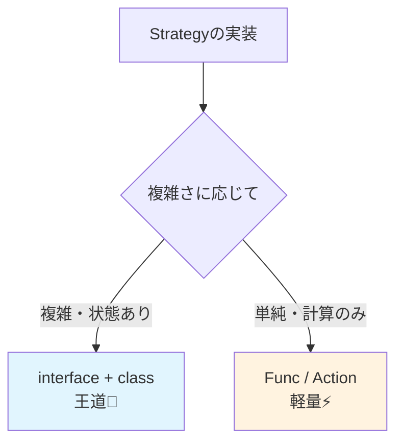

# 第07章：C#の言語機能で“パターンが軽くなる”話✨🧡


## ねらい 🎯

GoFの考え方はそのままに、C#の言語機能（record / with / デリゲート / switch式 / パターンマッチ）で、**実装を「重たくしない」**コツをつかむよ〜😊✨
パターンを学び始めの時期ほど、ついクラス増やしがちなので、**“軽くできるところは軽く”**を身につけよう！🌸

---

## 到達目標 ✅

* 「Strategy（方針の差し替え）」を **interface版** と **Func版** で書き比べて、状況で選べる🧠✨
* `record` と `with` を使って、**不変っぽいデータ（値オブジェクト/DTO）を安全に扱える**📦💕
* `switch` **式** と **パターンマッチ**で、`if/switch`のごちゃごちゃを読みやすくできる🔍✨
* 「短くしすぎて読めない」事故を避けられる🚧😵‍💫

---

## 手順 🧭✨

### 1) まず “GoFっぽい要素” と C#機能を対応づける🧩

「GoFを暗記」じゃなくて、「困りごとに対して道具を選ぶ」感覚が大事だよ〜🙂🌷

* **Strategy（方針の差し替え）**

  * しっかり設計：`interface` / クラス
  * 軽くしたい：`Func<>` / `Action<>`（デリゲート）
* **Prototype（コピーで量産）**

  * `record` + `with`
* **分岐地獄の整理（小さく読む）**

  * `switch` **式** + **パターンマッチ**（`is` / プロパティパターン）

> ポイント💡：
> **GoF = “役割の分け方”**、C#機能 = **“書き方を軽くする道具”**。
> 目的が逆転しないようにしようね😺✨

---




### 2) 例題：割引の「方針」を差し替えたい（Strategyの題材）💳🛒

ECあるある：支払い方法や会員ランクで割引が変わるやつ！🍰

まずは最小のドメインを用意（`record`を使うよ）👇

```csharp
public enum PaymentMethod
{
    Card,
    PayPay,
    BankTransfer
}

public readonly record struct Money(decimal Amount)
{
    public static Money Of(decimal amount)
        => amount < 0 ? throw new ArgumentOutOfRangeException(nameof(amount))
                      : new Money(amount);
}

public record Order(
    Guid Id,
    Money Total,
    PaymentMethod PaymentMethod,
    bool IsMember
);
```

---

### 3) Strategy（interface版）…王道で読みやすい👑✨

**「振る舞いに名前が付く」**のが強い！チーム開発で超読みやすい😊

```csharp
public interface IDiscountStrategy
{
    Money CalcDiscount(Order order);
}

public sealed class MemberDiscountStrategy : IDiscountStrategy
{
    public Money CalcDiscount(Order order)
        => order.IsMember ? Money.Of(order.Total.Amount * 0.05m) : Money.Of(0m);
}

public sealed class NoDiscountStrategy : IDiscountStrategy
{
    public Money CalcDiscount(Order order) => Money.Of(0m);
}

public sealed class DiscountService
{
    private readonly IDiscountStrategy _strategy;

    public DiscountService(IDiscountStrategy strategy) => _strategy = strategy;

    public Money CalcFinalTotal(Order order)
    {
        var discount = _strategy.CalcDiscount(order);
        return Money.Of(order.Total.Amount - discount.Amount);
    }
}
```

#### interface版が向いてる時 ✅

* 振る舞いが **複雑** or **状態を持つ**（内部に設定/キャッシュ/依存がある）
* メソッドが1個じゃなく増えそう
* 「この割引は何？」が **名前で説明できたほうが良い**（超大事）📛✨

---

### 4) Strategy（Func版）…小さくて速い💨✨

「割引が1行〜数行」「増えない」「クラス作るほどじゃない」なら超便利🙂🎀

```csharp
public static class DiscountPolicies
{
    public static readonly Func<Order, Money> NoDiscount =
        _ => Money.Of(0m);

    public static readonly Func<Order, Money> Member5Percent =
        order => order.IsMember ? Money.Of(order.Total.Amount * 0.05m) : Money.Of(0m);

    public static readonly Func<Order, Money> PayPayCampaign =
        order => order.PaymentMethod == PaymentMethod.PayPay
            ? Money.Of(300m)
            : Money.Of(0m);
}

public sealed class DiscountServiceFunc
{
    private readonly Func<Order, Money> _discount;

    public DiscountServiceFunc(Func<Order, Money> discount) => _discount = discount;

    public Money CalcFinalTotal(Order order)
    {
        var discount = _discount(order);
        return Money.Of(order.Total.Amount - discount.Amount);
    }
}
```

#### Func版が向いてる時 ✅

* ルールが **短い**（数行で説明できる）
* 差し替え点が **1つ**（計算だけ）
* テストで「この場でラムダ差し替え」したい🧪✨

#### Func版の注意点 ⚠️

* ラムダを短くしすぎると、**意図が消えて読みにくい**😵‍💫
* 依存（ログ/設定/外部I/O）をラムダで抱え始めたら、だいたい **interfaceに戻したほうが幸せ**🍀

---

### 5) switch式 + パターンマッチで「分岐を読みやすく」する🔍✨

「条件が増えると地獄」になりがち。そこで **switch式**と**パターンマッチ**！

#### 例：注文の特徴で割引ルールを切り替える🎛️

```csharp
public static Money CalcDiscountByPattern(Order order)
    => order switch
    {
        // 会員かつ高額なら10%（プロパティパターン✨）
        { IsMember: true, Total: { Amount: >= 10_000m } }
            => Money.Of(order.Total.Amount * 0.10m),

        // 会員なら5%
        { IsMember: true }
            => Money.Of(order.Total.Amount * 0.05m),

        // PayPayなら固定値引き
        { PaymentMethod: PaymentMethod.PayPay }
            => Money.Of(300m),

        _ => Money.Of(0m)
    };
```

#### ここが良いところ 🙌

* 「条件のまとまり」が **上から読める**📖✨
* `if`がネストしないから、脳が疲れにくい😌☕
* 章が進んで Strategy/State に分ける時の “下地” にもなる🌱

---

### 6) record + with で「コピーして一部だけ変える」🧾✨

Prototypeっぽい発想を **C#らしく**軽くできるよ！

```csharp
var order = new Order(
    Id: Guid.NewGuid(),
    Total: Money.Of(12000m),
    PaymentMethod: PaymentMethod.Card,
    IsMember: false
);

// 会員になった注文を作りたい（元は変えない✨）
var memberOrder = order with { IsMember = true };
```

#### with が気持ちいい場面 💕

* 「元データは残したい」
* 「変更は一部だけ」
* テストで “入力→出力” をきれいに保ちたい🧪✨

---

## よくある落とし穴 🕳️😵‍💫

* **短くしすぎて“何してるか分からない”**

  * ラムダ1行に詰めすぎると事故る💥
  * → “名前（メソッド/変数）を付けて読む” を優先😊
* **switchで全部解こうとして巨大化**

  * 条件が増え続けるなら、次の章で **Strategy/State** を検討🌿
* **record万能だと思って何でもrecord化**

  * 「データ中心（値）」に向く✨
  * 「振る舞い中心（状態/副作用）」はクラスでOK🙂

---

## 演習 📝🌸（10〜30分）

### 演習1：Strategyを interface版 と Func版で書き比べる🆚✨

1. `Member5Percent` を **interface版**で作る
2. 同じものを **Func版**で作る
3. 次をメモして、どっちが読みやすいか決める✍️

   * ぱっと見で意図が分かる？
   * テストで差し替えが楽？
   * 将来増えそう？

---

### 演習2：ifの塊を switch式 + パターンマッチに置き換える🔁🔍

* 「会員」「支払い方法」「金額」の3条件で割引を決める `if` を書く
* それを `order switch { ... }` に変換する
* “上から読める”か確認する📖✨

---

### 演習3：record + with で「注文テンプレ」を作る🧾🧁

* `var baseOrder = new Order(...);` を作る
* `with` で3パターン作る

  * 会員注文
  * PayPay注文
  * 高額注文
* それぞれの割引が期待通りか軽くテストする🧪✨

---

## 自己チェック ✅✨

* Strategyを「**interfaceにするべき時**」「**Funcで十分な時**」を説明できる🙂
* `switch`式にした結果、条件が **上から読める**ようになった📖
* `record + with` の “元を壊さずコピー” が自然に使える🧾✨
* 「短くすること」より「意図が伝わること」を優先できる💛

---

### おまけメモ 📌🙂

C#の言語バージョンや .NET の世代で、書けるパターンマッチが増えたりするよ〜✨
細かい差分は **Microsoft公式の C# 言語リファレンス**をチラ見しておくと安心！🧠📚
