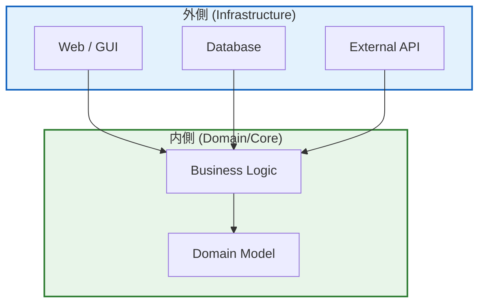

# 第08章：“依存の向き”の超入門（外側と内側）🧭🏠


## ねらい 🎯✨

* アプリを「内側（業務ルール）」と「外側（UI/DB/HTTPなどI/O）」に分けて考えるクセをつけるよ🙂
* GoFパターンが“内側を守る”ための道具になってるイメージを作るよ🛡️🧩

---

## 到達目標 ✅🌸

* 「これは内側？外側？」をサクッと分類できる（迷ったら“変わりやすいか”で判断）🧠
* “依存の向き”のルールを言葉で説明できる（内側は外側を知らない）🔁
* 境界（内↔外）に「インターフェース」を置く意味がわかる🔌

---

## 手順 🧭🪄

### 1) まず“内側”と“外側”をざっくり定義しよう 🏠🌍

* **内側（Core / Domain）**：業務ルール・計算・状態・不変条件（例：注文の合計、金額はマイナス禁止）🧾💰
* **外側（Infrastructure）**：画面、DB、ファイル、メール送信、HTTP、クラウド、フレームワーク…みたいなI/O全部📦🌐

💡コツ：**“明日変わりそう”なものほど外側**だと思ってOK！
例）支払いサービスのAPI変更、メール仕様変更、DBをSQLite→SQL Server…とかね😵‍💫

---

### 2) “依存の向き”のルールはこれだけ！➡️⬅️

**内側は外側を知らない**（＝参照しない、newしない、型も出さない）🙅‍♀️
**外側が内側に合わせる**（＝外側が内側に依存する）🧩

イメージ図（超大事）👇

* 外側 → 内側（OK）✅
* 内側 → 外側（NG）❌

```text
[ UI / DB / HTTP / Email ]  --->  [ Application / Domain ]
          外側（変わる）                 内側（守る）
```

---




### 3) 例題（ミニEC）で分類してみるよ🛒🍰

* **内側**：`Order`、`Money`、合計計算、状態遷移（Paid/Cancelledなど）🧾
* **外側**：クレカ決済API、メール送信、DB保存、Web画面📧💳🗄️

ここで“よくある事故”がこれ👇

* `OrderService` の中で `HttpClient` 作って決済API叩く（内側が外側に依存しちゃう）💥
* `Order` の中でDB保存しちゃう（ドメインがインフラを抱える）💥

---

### 4) 境界には「インターフェース」を置くとキレイ✨🔌

内側に「こういうことをしたい」を**契約（インターフェース）**として置くよ。
外側がそれを実装するよ。これで依存の向きが守れる🙂

例：支払い（外側の実装に任せたい）💳

✅ 内側（Application側）に“契約”だけ置く

```csharp
public interface IPaymentGateway
{
    Task ChargeAsync(Guid orderId, int amountYen, CancellationToken ct);
}
```

✅ 内側は“契約”にだけ依存して使う（外側の型は出てこない）

```csharp
public sealed class OrderService
{
    private readonly IPaymentGateway _payment;

    public OrderService(IPaymentGateway payment)
        => _payment = payment;

    public async Task PayAsync(Order order, CancellationToken ct)
    {
        // 内側の判断（業務ルール）🧠
        if (order.IsCancelled) throw new InvalidOperationException("Cancelled");

        await _payment.ChargeAsync(order.Id, order.TotalAmountYen, ct);

        order.MarkAsPaid();
    }
}
```

✅ 外側（Infrastructure側）が実装する（ここは好きに変わってOK）🌐

```csharp
public sealed class HttpPaymentGateway : IPaymentGateway
{
    private readonly HttpClient _http;

    public HttpPaymentGateway(HttpClient http) => _http = http;

    public Task ChargeAsync(Guid orderId, int amountYen, CancellationToken ct)
    {
        // ここで外部APIにHTTP送信（外側）📡
        return Task.CompletedTask;
    }
}
```

---

### 5) “組み立て”は外側でやる（Composition Root）🧩🧷

「どの実装を使うか」を決めるのは外側のお仕事！
内側は“選ばない”。内側は“契約通りに使うだけ”🙂

最小の手動new例👇（DIは後の章で本格的にやるよ）

```csharp
var http = new HttpClient();
IPaymentGateway gateway = new HttpPaymentGateway(http);
var service = new OrderService(gateway);
```

---

### 6) ここでGoFが効いてくるイメージ 🎭✨

* **Strategy**：支払い方針、割引方針など“方針の差し替え”💡
* **Factory**：外側実装の選択をまとめる🏭
* **Adapter**：外部APIレスポンスを内側の型に変換する🔌
* **Decorator/Proxy**：ログ・リトライ・キャッシュを外側で付け足す🎁

つまり、**GoFは「内側を外側の変化から守る」場面でめちゃ使える**ってこと🛡️

---

## よくある落とし穴 ⚠️😵‍💫

* **全部を抽象化し始める**：最初は境界（I/O）のところだけでOK！🙆‍♀️
* **内側にDTOや外部APIの型を混ぜる**：内側は“自分の言葉（ドメイン語）”で話す🗣️
* **インターフェースが“なんでも屋”になる**：`IPaymentGateway` は支払いだけ、みたいに細く保つ✂️
* **外側の都合で内側をゆがめる**：DBの都合でドメインが変な形になるのはあるある…🥲（まず内側の自然さ優先）

---

## 演習（10〜30分）✍️🌷

### 演習1：境界（I/O）を3つ書き出す📝

次の中から、あなたの例題に合わせて **I/Oを3つ**書いてね：

* 決済（外部API）💳
* 通知（メール/Slack等）🔔
* 保存（DB/ファイル）🗄️

👉 それぞれに「変わりそう度（高/中/低）」も付けると最高！✨

### 演習2：内側→外側の依存を1つだけ剥がす🪓

今のコードで「内側が外側をnewしてる」箇所を1つ探して、

* 内側にインターフェース（契約）を置く
* 外側に実装を置く
  に分けてみてね🙂

### 演習3：テストしやすさチェック🧪

`OrderService` をテストするとき、外部APIを呼ばずに済む？
済まないなら、`IPaymentGateway` のダミー（Fake）を作って差し替えられるようにしてみよう🧸

---

## 自己チェック ✅💖

* 「UI/DB/HTTP/メール」は外側って即答できる？🌍
* 「注文合計の計算・状態遷移」は内側って言える？🏠
* 内側が外側の型（HttpClientとか）を**直接**参照してない？🔍
* “どの実装を使うか”を決めてる場所が、外側に寄ってる？🧩
* 境界にあるインターフェースが、欲張って巨大化してない？🐘💦
