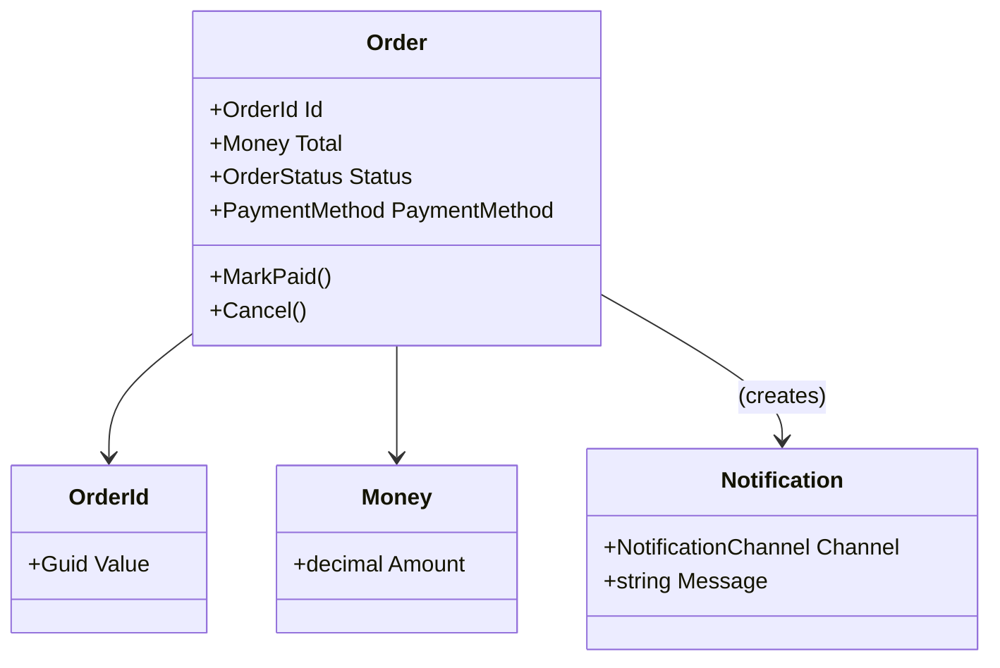

# 第09章：例題ドメインの準備（小さくてOK）🛒🍰


## ねらい 🎯

* これからの章（生成/構造/振る舞い）で使い回せる「小さなECドメイン」を、**最小**で用意するよ🙂
* “作り込みすぎ”を避けて、後の章で「改善できる余白」を残すよ✨

---

## 到達目標 ✅

* **Order / Money / PaymentMethod / Notification** の最小モデルがある
* **不変条件は1つだけ**入っている（この章では「Moneyはマイナス禁止」）💰🚫
* JSON用のDTO（データ受け渡し用）を **System.Text.Json** で扱える 🧾✨
* テストが2〜3本あって、次章以降のリファクタで壊れない土台ができてる 🧪🌸

---

## 手順 🧭✨

### 1) まず「最小セット」を決めよう 📝

この章で作るのは、ほんとにこれだけ👇

* Money（金額）
* OrderId（注文ID）
* Order（注文）…状態（New/Paid/Cancelled）だけ持つ
* PaymentMethod（支払い方法）…最初は enum でOK
* Notification（通知）…最初は「何を誰へ送るか」だけ

ポイントはこれ👇

* 「あとで増やせる」形にする（最初から完璧を目指さない）🥺💦
* “パターン用の汎用基盤”は作らない（ここはドメイン土台だけ）🙅‍♀️

---

### 2) Money を作る 💰✨（不変条件はここに集中）

不変条件は **amount >= 0** だけ入れるよ🙂

* ここをしっかりさせると、後の章で安心してリファクタできる 🧸

#### Money.cs

```csharp
using System;

namespace Domain.Shared;

public readonly record struct Money
{
    public decimal Amount { get; }

    public Money(decimal amount)
    {
        if (amount < 0)
            throw new ArgumentOutOfRangeException(nameof(amount), "Money must be >= 0.");

        Amount = amount;
    }

    public static Money Zero => new(0m);

    public static Money operator +(Money a, Money b) => new(a.Amount + b.Amount);

    public override string ToString() => $"{Amount:0.##} JPY";
}
```

> この段階では「通貨」も「小数桁」も作り込みしないよ🍰
> 必要になった章で、ちゃんと改善しようね✨

---

### 3) OrderId を “型” にする 🪪✨（超小さいけど効く）

IDを Guid のまま使うと、別IDと混ざりやすいのが地味につらい😵
なので **OrderId型**にしちゃうよ。

#### OrderId.cs

```csharp
using System;

namespace Domain.Shared;

public readonly record struct OrderId(Guid Value)
{
    public static OrderId New() => new(Guid.NewGuid());
    public override string ToString() => Value.ToString("N");
}
```

---

### 4) OrderStatus（状態）を enum で持たせる 🧁

この章のミニ演習にもある「最小の状態」を先に入れちゃう🙂

#### OrderStatus.cs

```csharp
namespace Domain.Shared;

public enum OrderStatus
{
    New,
    Paid,
    Cancelled
}
```

---

### 5) PaymentMethod を enum で置く 💳✨

後で Factory/Strategy/State などに繋げるため、最初はベタでOK👍

#### PaymentMethod.cs

```csharp
namespace Domain.Shared;

public enum PaymentMethod
{
    CreditCard,
    BankTransfer,
    ConvenienceStore
}
```

---

### 6) Order を最小で作る 🛒✨（状態遷移だけ）

Orderは「注文の核」だけ持つよ🙂

* Id
* Total（Money）
* Status（OrderStatus）
* PaymentMethod

#### Order.cs

```csharp
using System;

namespace Domain.Shared;

public sealed class Order
{
    public OrderId Id { get; }
    public Money Total { get; private set; }
    public OrderStatus Status { get; private set; }
    public PaymentMethod PaymentMethod { get; private set; }

    public Order(OrderId id, Money total, PaymentMethod paymentMethod)
    {
        Id = id;
        Total = total;
        PaymentMethod = paymentMethod;
        Status = OrderStatus.New;
    }

    public void MarkPaid()
    {
        if (Status != OrderStatus.New)
            throw new InvalidOperationException("Only New order can be paid.");
        Status = OrderStatus.Paid;
    }

    public void Cancel()
    {
        if (Status == OrderStatus.Paid)
            throw new InvalidOperationException("Paid order cannot be cancelled.");
        Status = OrderStatus.Cancelled;
    }
}
```

> 状態遷移の例外メッセージは「契約」だよ🧾✨
> 後の章で Proxy / Decorator / State / Command などの題材にしやすくなる👍

---

### 7) Notification を “データ” として置く 🔔✨

通知はこの段階では「どのチャネルで、どこへ、何を」だけ🙂

#### Notification.cs

```csharp
namespace Domain.Shared;

public enum NotificationChannel
{
    Email,
    Sms,
    AppPush
}

public sealed record Notification(
    NotificationChannel Channel,
    string Destination,
    string Message
);
```

---




### 8) JSON用DTOを用意して、System.Text.Jsonで変換する 🧾✨

ここが超大事ポイント🙂

* ドメイン（Orderなど）は “業務ルール寄り”
* DTOは “外とやりとりする形”

この分離が、後で Adapter / Facade / Anti-Corruption Layer 的な話に繋がるよ🌈

#### OrderDto.cs

```csharp
using System;

namespace Domain.Transport;

public sealed record OrderDto(
    Guid id,
    decimal total,
    string status,
    string paymentMethod
);
```

#### DtoMapper.cs（まずは関数でOK）

```csharp
using Domain.Shared;

namespace Domain.Transport;

public static class DtoMapper
{
    public static OrderDto ToDto(Order order) =>
        new(order.Id.Value, order.Total.Amount, order.Status.ToString(), order.PaymentMethod.ToString());
}
```

#### JSONシリアライズ例（Consoleで動作確認）🧪

```csharp
using System;
using System.Text.Json;
using Domain.Shared;
using Domain.Transport;

var order = new Order(OrderId.New(), new Money(1200m), PaymentMethod.CreditCard);

var dto = DtoMapper.ToDto(order);

var json = JsonSerializer.Serialize(dto, new JsonSerializerOptions
{
    WriteIndented = true
});

Console.WriteLine(json);
```

---

### 9) テストを最小で3本だけ作る 🧪🌸（壊れない土台）

この章のテストは「守りたい契約」だけでOK🙂

* Moneyはマイナス禁止
* OrderはNewで始まる
* MarkPaidでPaidになる

#### MoneyTests.cs（MSTest例）

```csharp
using System;
using Domain.Shared;
using Microsoft.VisualStudio.TestTools.UnitTesting;

namespace Ch09.Tests;

[TestClass]
public class MoneyTests
{
    [TestMethod]
    public void Money_Negative_Throws()
    {
        Assert.ThrowsException<ArgumentOutOfRangeException>(() => new Money(-1m));
    }
}
```

#### OrderTests.cs

```csharp
using Domain.Shared;
using Microsoft.VisualStudio.TestTools.UnitTesting;

namespace Ch09.Tests;

[TestClass]
public class OrderTests
{
    [TestMethod]
    public void Order_NewlyCreated_IsNew()
    {
        var order = new Order(OrderId.New(), new Money(100m), PaymentMethod.BankTransfer);
        Assert.AreEqual(OrderStatus.New, order.Status);
    }

    [TestMethod]
    public void Order_MarkPaid_ChangesStatusToPaid()
    {
        var order = new Order(OrderId.New(), new Money(100m), PaymentMethod.BankTransfer);
        order.MarkPaid();
        Assert.AreEqual(OrderStatus.Paid, order.Status);
    }
}
```

---

## よくある落とし穴 🕳️💦

* **作り込みすぎる**（項目を増やしすぎて、次章へ進めない）😵
* 「便利そう」で **共通基盤を作り始める**（Factory基盤、通知基盤…など）🙅‍♀️
* DTOとドメインを混ぜて、OrderがJson属性まみれになる 🧼💥
* 不変条件を入れすぎて、今後の章で変更しにくくなる（この章は1個でOK）🧁

---

## 演習（10〜30分）🧩✨

1. Orderに「最小の状態」を入れたか確認（New / Paid / Cancelled）🙂
2. 追加で、次のうち **どれか1つだけ**やってみよう👇

* Cancelのルールを1つ増やしてテストを書く（例：NewならCancelできる）🧪
* DTOをJSONにして出力し、目で確認する 🧾👀
* Notificationを1件作って Console に表示する（まだ送らない！）🔔

---

## チェック ✅🌸

* Moneyのマイナスがテストで止まる 💰🚫
* OrderがNewで始まり、MarkPaidでPaidになる 🛒✨
* JSON用DTOがあり、System.Text.Jsonで出力できる 🧾✨
* ファイル数が増えすぎてない（読み切れる小ささ）📄🙂
