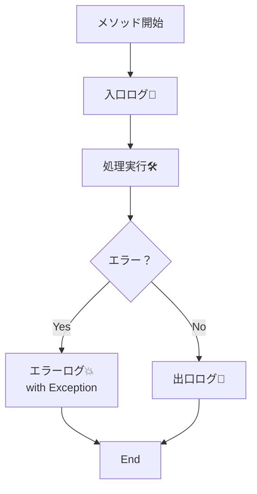

# 第10章：ログは標準の仕組みを使う（デファクト）📝✨


## ねらい 🎯

* 「とりあえず `Console.WriteLine`」を卒業して、**あとから追えるログ**にしていくよ〜😊
* ここで整えたログが、あとで出てくる **Decorator / Proxy** の練習にもつながるよ🎁🪞

---

## 到達目標 ✅

* `ILogger` を使ってログを出せる 🧩
* **ログレベル**（Information / Warning / Error…）を使い分けできる 🎚️
* ログを入れる場所を **入口 / 出口 / エラー** に絞れる 🚪➡️🚪💥
* 「ログを足したいからコード改造しまくり…」を避ける設計の感覚ができる 🧠✨

---

## 手順 🧪🛠️

### 1) まず「ログの基本ルール」を決める（超重要）📌

ログは増やすとキリがないので、最初はこれだけ守ればOK🙆‍♀️

* **入口**：処理が始まったこと（何をする？）🚪
* **出口**：処理が終わったこと（結果は？）🚪
* **エラー**：例外は `LogError(ex, ...)` で残す 💥

そして、メッセージは **構造化ログ**（パラメータ付き）で書くのが定番だよ✨
（文字列補間 `$"..."` じゃなくて `{Name}` みたいに書く）

✅ 良い例：`logger.LogInformation("OrderId={OrderId} Amount={Amount}", orderId, amount);`
⚠️ もったいない例：`logger.LogInformation($"OrderId={orderId} Amount={amount}");`

---




### 2) Consoleアプリに “最小のログ” を導入する 🧁

まずは DI なしで、**LoggerFactoryだけ**で始めよう（スッキリ）😊

```csharp
using Microsoft.Extensions.Logging;

var loggerFactory = LoggerFactory.Create(builder =>
{
    builder
        .SetMinimumLevel(LogLevel.Information)
        .AddSimpleConsole(options =>
        {
            options.SingleLine = true;
            options.TimestampFormat = "HH:mm:ss ";
        });
});

ILogger logger = loggerFactory.CreateLogger("Ch10");

// 入口
logger.LogInformation("Start");

// 何か処理
try
{
    var orderId = "ORD-001";
    var amount = 1200;

    logger.LogInformation("Placing order. OrderId={OrderId} Amount={Amount}", orderId, amount);

    // わざと例外
    if (amount < 0) throw new InvalidOperationException("Amount must be >= 0");

    // 出口
    logger.LogInformation("Order placed. OrderId={OrderId}", orderId);
}
catch (Exception ex)
{
    // エラー（例外は必ず ex 付きで）
    logger.LogError(ex, "Order failed");
}
finally
{
    loggerFactory.Dispose();
}
```

ポイント💡

* `AddSimpleConsole()` で見やすいログになるよ📺✨
* `LogError(ex, "...")` の **ex付き**が超大事！スタックトレース残る🧵

---

### 3) 例題（小さなEC）の `OrderService` にログを入れる 🛒📝

ここからが本題！「入口/出口/エラー」の型を作るよ😊

```csharp
using Microsoft.Extensions.Logging;

public sealed class OrderService
{
    private readonly ILogger<OrderService> _logger;

    public OrderService(ILogger<OrderService> logger)
        => _logger = logger;

    public void PlaceOrder(string orderId, int amount)
    {
        // 入口
        _logger.LogInformation("Enter PlaceOrder. OrderId={OrderId}", orderId);

        try
        {
            if (amount < 0)
            {
                _logger.LogWarning("Invalid amount. OrderId={OrderId} Amount={Amount}", orderId, amount);
                throw new InvalidOperationException("Amount must be >= 0");
            }

            // ここに「支払い」「通知」などが後で増える想定✨
            _logger.LogInformation("Processing... OrderId={OrderId} Amount={Amount}", orderId, amount);

            // 出口
            _logger.LogInformation("Exit PlaceOrder. OrderId={OrderId}", orderId);
        }
        catch (Exception ex)
        {
            // エラー（例外付き）
            _logger.LogError(ex, "PlaceOrder failed. OrderId={OrderId}", orderId);
            throw;
        }
    }
}
```

ここでの“設計のコツ”🧠✨

* `OrderService` は **ログの仕組みを知らない**（= `ILogger` に投げるだけ）
* だから後で Decorator/Proxy で「ログをもっと足す」もやりやすい🎁🪞

---

### 4) いったん「DIなし」で `OrderService` を動かす（最小でOK）🏃‍♀️

`ILogger<OrderService>` が必要なので、`LoggerFactory` から作って渡すよ🧩

```csharp
using Microsoft.Extensions.Logging;

var loggerFactory = LoggerFactory.Create(builder =>
{
    builder.SetMinimumLevel(LogLevel.Information)
           .AddSimpleConsole(o =>
           {
               o.SingleLine = true;
               o.TimestampFormat = "HH:mm:ss ";
           });
});

var logger = loggerFactory.CreateLogger<OrderService>();
var service = new OrderService(logger);

service.PlaceOrder("ORD-002", 1500);

loggerFactory.Dispose();
```

---

### 5) （テストの現実解）ログは「検証」より「邪魔しない」を優先 🧪🌸

ログの内容までガチガチにテストすると、変更で壊れやすい💦
この教材ではまず **NullLogger** を使って、ログを無効化してテストしよう😊

```csharp
using Microsoft.Extensions.Logging.Abstractions;
using Microsoft.VisualStudio.TestTools.UnitTesting;

[TestClass]
public class OrderServiceTests
{
    [TestMethod]
    public void PlaceOrder_Valid_DoesNotThrow()
    {
        var logger = NullLogger<OrderService>.Instance;
        var service = new OrderService(logger);

        service.PlaceOrder("ORD-OK", 1000);
    }

    [TestMethod]
    [ExpectedException(typeof(InvalidOperationException))]
    public void PlaceOrder_Negative_Throws()
    {
        var logger = NullLogger<OrderService>.Instance;
        var service = new OrderService(logger);

        service.PlaceOrder("ORD-NG", -1);
    }
}
```

---

## よくある落とし穴 💣😵

1. **ログ出しすぎ問題** 📣📣📣

* なんでもかんでも `LogInformation` にすると、必要な情報が埋もれるよ〜😭
  ➡️ 最初は「入口/出口/エラー + 重要イベント」だけ！

2. **ログレベルが全部同じ** 🎚️🫠

* 正常系まで `Error` にすると監視が死ぬ
* 逆に障害なのに `Information` だと気づけない
  ➡️ ざっくりでOK：

  * `Information`：通常の流れ
  * `Warning`：想定内だけど怪しい（入力不正、リトライ発生など）
  * `Error`：例外・失敗（ex付き！）

3. **文字列補間でログを書く** 🧵💸

* 構造化されない＆無駄に文字列生成されがち
  ➡️ `{}` プレースホルダ形式にしよう✨

4. **個人情報・秘匿情報を入れる** 🔒⚠️

* パスワード、トークン、カード番号、住所…は基本NG🙅‍♀️
  ➡️ 「マスク」or「入れない」が安全！

---

## ミニ演習（10〜30分）🧁⏱️

**お題：OrderServiceのログを“入口/出口/エラー”に絞って整える🛒📝**

1. `PlaceOrder` の先頭に **入口ログ**を入れる 🚪
2. 正常終了の直前に **出口ログ**を入れる 🚪
3. 例外をキャッチして `LogError(ex, ...)` を入れる 💥
4. 入力不正（amount < 0）のときは `Warning` にする ⚠️
5. テストは `NullLogger` で通す 🧪🌸

---

## 自己チェック ✅🔍

* [ ] `ILogger` を使ってログが出せた 📝
* [ ] ログは「入口/出口/エラー」に絞れてる 🚪➡️🚪💥
* [ ] `LogError(ex, ...)` で例外情報が残ってる 🧵
* [ ] `Warning` と `Information` を使い分けた 🎚️
* [ ] テストでログが邪魔にならない（NullLogger）🧪✨
