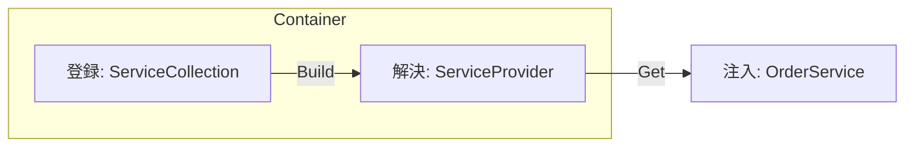

# 第11章：DIは標準の仕組みを使う（デファクト）🧩🔌


## ねらい 🎯✨

* 「`new`のつらさ（依存が増えて、差し替えづらくなる）」を、**DI（依存性注入）**でやわらげるよ🙂
* GoFに入る前に、**差し替えの“土台”**を作っておく（あとでStrategy/Decorator/Factoryなどがスッと入る）🚀
* **標準寄りのDIコンテナ**（`Microsoft.Extensions.DependencyInjection`）で、余計な自作フレームワークを作らずに学ぶよ🧼✨

---

## 到達目標 ✅🌸

この章が終わったら、次ができるようになるよ！

* `ServiceCollection`で **登録（Registration）**→ `ServiceProvider`で **解決（Resolve）**できる 🧩
* `Singleton / Scoped / Transient` の違いを、**「いつ作られて、いつ捨てられる？」**で説明できる ⏳
* テストで **実装を差し替える**（フェイク/スタブ）を、DI登録だけでできる 🧪✨
* 「DIのやりすぎ」を避ける判断ができる（全部コンテナに押し込まない）⚠️🙂

---

## 手順 🛠️🌈

### 1) まずは“手動new”のつらさを1回味わう 😵‍💫🔥

依存が増えると、呼び出し側がごちゃごちゃしてくるよね…！

```csharp
// Program.cs（手動new版）
var notifier = new ConsoleNotifier();
var paymentFactory = new PaymentMethodFactory();
var orderService = new OrderService(paymentFactory, notifier);

await orderService.PayAsync(PaymentKind.CreditCard, new Money(1200));
```

* 依存が増えるたびに `Program.cs` が太る🐷💦
* テストで差し替えたい時に、`new` だらけでつらい😢
* 「どこで何を差し替えるの？」が散らばる🌀

---

### 2) “DIの3語”を押さえる（ここ超大事！）🧠✨

* **登録（Registration）**：`ServiceCollection` に「これ使うよ」を並べる📌
* **解決（Resolve）**：必要になったらコンテナが作って渡す🎁
* **注入（Injection）**：主に **コンストラクタ引数**で渡す（C#の王道）🚪

---




### 3) 例題の最小ドメインを用意（小さくてOK）🛒🍰

※ここは“学習用モデル”だから、作り込み禁止ね😉🧼

```csharp
public readonly record struct Money(decimal Amount)
{
    public Money
    {
        if (Amount < 0) throw new ArgumentOutOfRangeException(nameof(Amount), "Amount must be >= 0");
    }
}

public enum PaymentKind { CreditCard, BankTransfer }

public interface INotifier
{
    void Notify(string message);
}

public sealed class ConsoleNotifier : INotifier
{
    public void Notify(string message) => Console.WriteLine(message);
}
```

支払いは「生成が変わる」ので、まずは最小のFactoryを置く（この章では“差し替え対象”として使うよ）💳

```csharp
public interface IPaymentMethod
{
    string Name { get; }
    Task ChargeAsync(Money amount);
}

public sealed class CreditCardPayment : IPaymentMethod
{
    public string Name => "CreditCard";
    public Task ChargeAsync(Money amount) => Task.CompletedTask;
}

public sealed class BankTransferPayment : IPaymentMethod
{
    public string Name => "BankTransfer";
    public Task ChargeAsync(Money amount) => Task.CompletedTask;
}

public interface IPaymentMethodFactory
{
    IPaymentMethod Create(PaymentKind kind);
}

public sealed class PaymentMethodFactory : IPaymentMethodFactory
{
    public IPaymentMethod Create(PaymentKind kind) => kind switch
    {
        PaymentKind.CreditCard   => new CreditCardPayment(),
        PaymentKind.BankTransfer => new BankTransferPayment(),
        _ => throw new ArgumentOutOfRangeException(nameof(kind))
    };
}
```

最後にサービス本体（依存はコンストラクタで受け取る）✨

```csharp
public sealed class OrderService
{
    private readonly IPaymentMethodFactory _paymentFactory;
    private readonly INotifier _notifier;

    public OrderService(IPaymentMethodFactory paymentFactory, INotifier notifier)
    {
        _paymentFactory = paymentFactory;
        _notifier = notifier;
    }

    public async Task PayAsync(PaymentKind kind, Money amount)
    {
        var method = _paymentFactory.Create(kind);
        await method.ChargeAsync(amount);

        _notifier.Notify($"Paid {amount.Amount} via {method.Name} 🎉");
    }
}
```

---

### 4) DIコンテナに登録して、解決して動かす 🧩➡️🎬

ここからが本番！
`Microsoft.Extensions.DependencyInjection` を使うよ（標準寄りの定番）✨
（コンソールだとNuGet追加が必要なことがあるよ：`dotnet add package Microsoft.Extensions.DependencyInjection`）

```csharp
using Microsoft.Extensions.DependencyInjection;

var services = new ServiceCollection();

// 登録（Registration）📌
services.AddSingleton<INotifier, ConsoleNotifier>();
services.AddSingleton<IPaymentMethodFactory, PaymentMethodFactory>();
services.AddTransient<OrderService>(); // 使うたびに新しく（状態を持たない想定）

// 解決（Resolve）🎁
using var provider = services.BuildServiceProvider();

var orderService = provider.GetRequiredService<OrderService>();
await orderService.PayAsync(PaymentKind.CreditCard, new Money(1200));
```

ポイント😍

* **差し替えは登録箇所に集約**される（呼び出し側がスッキリ）🧼✨
* `OrderService` は「何が注入されるか」を知らない（疎結合）🔌

---

### 5) ライフサイクル（超重要）⏳📦

DIの“事故”はだいたいここから起きるよ…！😇

* `AddSingleton`：アプリ中ずっと1個（共有したい・状態が安全なら）👑
* `AddScoped`：スコープごとに1個（Webだと“1リクエスト1個”のイメージ）🧺
* `AddTransient`：呼ばれるたびに新しい（軽い/状態を持たないもの向き）🫧

**まず最初のおすすめ感覚**（迷ったらこれ）🙂

* 状態を持たないサービス → `Transient`
* 設定/キャッシュ/共有してOK → `Singleton`
* “処理単位”でまとめたい（DBっぽい）→ `Scoped`

---

### 6) コンソールでもScopedを使うなら「スコープを作る」🧺✨

Webみたいに自動でスコープが切られないので、自分で作るよ！

```csharp
using Microsoft.Extensions.DependencyInjection;

var services = new ServiceCollection();
services.AddScoped<CheckoutSession>();
services.AddTransient<OrderService>(); // 例

using var provider = services.BuildServiceProvider();

using var scope = provider.CreateScope();
var session = scope.ServiceProvider.GetRequiredService<CheckoutSession>();
```

---

### 7) テストで“登録だけ”差し替えする 🧪💞

ここがDIの気持ちよさポイント！😍
本番実装を触らず、**テスト側の登録で差し替え**できるよ。

例：支払いFactoryをフェイクに差し替える（章アウトラインのミニ演習の芯）💳🧪

```csharp
using Microsoft.Extensions.DependencyInjection;
using Microsoft.VisualStudio.TestTools.UnitTesting;

[TestClass]
public class OrderServiceTests
{
    [TestMethod]
    public async Task PayAsync_UsesFakeFactory()
    {
        var fake = new FakePaymentMethodFactory();

        var services = new ServiceCollection();
        services.AddSingleton<INotifier, NullNotifier>();
        services.AddSingleton<IPaymentMethodFactory>(fake); // ここが差し替えポイント✨
        services.AddTransient<OrderService>();

        using var provider = services.BuildServiceProvider();

        var sut = provider.GetRequiredService<OrderService>();
        await sut.PayAsync(PaymentKind.CreditCard, new Money(500));

        Assert.AreEqual(PaymentKind.CreditCard, fake.LastRequestedKind);
        Assert.AreEqual(500m, fake.LastChargedAmount);
    }

    private sealed class NullNotifier : INotifier
    {
        public void Notify(string message) { /* 何もしない */ }
    }

    private sealed class FakePaymentMethodFactory : IPaymentMethodFactory
    {
        public PaymentKind? LastRequestedKind { get; private set; }
        public decimal? LastChargedAmount { get; private set; }

        public IPaymentMethod Create(PaymentKind kind)
        {
            LastRequestedKind = kind;
            return new FakePaymentMethod(this);
        }

        private sealed class FakePaymentMethod : IPaymentMethod
        {
            private readonly FakePaymentMethodFactory _parent;
            public FakePaymentMethod(FakePaymentMethodFactory parent) => _parent = parent;

            public string Name => "Fake";
            public Task ChargeAsync(Money amount)
            {
                _parent.LastChargedAmount = amount.Amount;
                return Task.CompletedTask;
            }
        }
    }
}
```

ね？「差し替え」が**登録1行**で済むの、強いよね🥹✨

---

### 8) AI補助（Copilot/Codex）を使うときの“安全プロンプト”🤖🧷

AIに丸投げすると「謎抽象」「DIやりすぎ」が発生しやすい😇💦
なので、**制約を先に縛る**のがコツ！

コピペ用（短め）👇

```text
目的：Microsoft.Extensions.DependencyInjection でDI登録と解決の最小例を作って
制約：自作の汎用フレームワークは禁止。クラス数は最小。コンストラクタ注入のみ。
欲しいもの：ServiceCollection登録 / BuildServiceProvider / GetRequiredService の例
テスト：差し替えは登録側で行う例も1つ
```

レビュー観点（人間が最後に見る👀✨）

* 注入がコンストラクタで完結してる？（`IServiceProvider`直注入してない？）
* 登録が増えすぎてない？（「とりあえず全部」になってない？）
* ライフタイムが雑じゃない？（`Singleton`に`Scoped`混ぜてない？）

---

## よくある落とし穴 ⚠️😵‍💫

* **DIコンテナに全部を押し込む病**：クラス設計が雑でもコンテナで誤魔化しがち😇
* **Service Locator化**：`IServiceProvider` をあちこちに注入して `GetService()` しまくる（依存が隠れて最悪）🫥
* **ライフタイム事故（Captive Dependency）**：`Singleton` が `Scoped` を掴んでしまう（後で爆発）💥
* **IDisposableの破棄忘れ**：`BuildServiceProvider()` したら `using` で包む癖をつける🧹
* **登録の上書きに気づかない**：同じサービスを複数回登録すると、意図せず“後勝ち”になることがある🌀
* **インターフェース分割しすぎ**：1メソッドI/F大量で読むのがしんどい📚💦

---

## 演習（10〜30分）🧪🍀

### 演習1：手動new→DIへ置き換え（最小）🧩✨

* `Program.cs` の `new` を消して、`ServiceCollection` 登録に寄せる
* `OrderService` は変更しない（依存はコンストラクタのまま）

### 演習2：PaymentMethodFactoryをテストで差し替える 💳🧪

* 本番：`PaymentMethodFactory`
* テスト：`FakePaymentMethodFactory` を登録して、呼ばれたか検証
* 検証は「最後に要求された `PaymentKind` が何か」だけでOK🙂

### 演習3：ライフタイムを1回だけ変えて挙動を観察 👀⏳

* `OrderService` を `Transient` → `Singleton` に変える
* 「状態を持つようにしたら何が起きる？」を想像してメモ📝

  * 例：前回の注文情報をフィールドに持つと…？😱

---

## 自己チェック ✅🎀

* `ServiceCollection` に **登録**して、`GetRequiredService` で **解決**できる
* `Singleton / Scoped / Transient` を「いつ作っていつ捨てる？」で説明できる
* テストで「登録だけ」で差し替えできる（本番コードは触らない）
* `IServiceProvider` を業務コードに注入してない（Service Locator化してない）
* DIは“便利だから全部”じゃなく、**差し替えたいところだけ**に効かせられている
