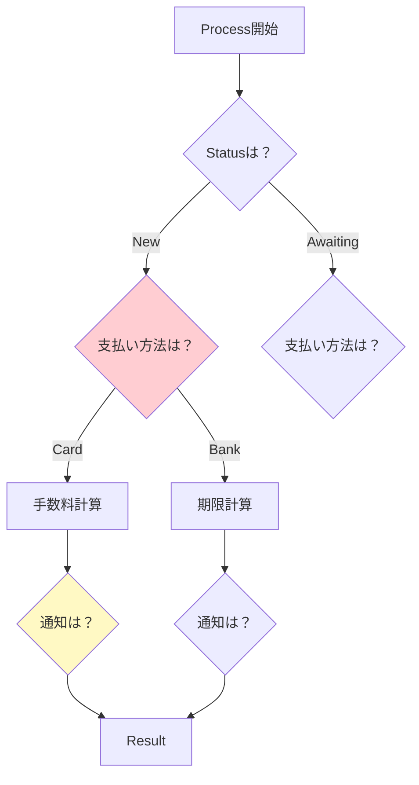

# 第12章：ミニ演習：分岐地獄を1回だけ味わう🔥😵


## ねらい 🎯

* 「変更が入るたびに、if/switchが雪だるま⛄」を**わざと**体験する
* 後の章（Strategy/State/Observer…）で改善したときに「うわ、楽になった…！🥹✨」を感じるための**ビフォー**を作る
* **テストで仕様を固定🧪**して、「壊さずに直す」準備をする

---

## 到達目標 🏁

* 注文処理の中に、**注文状態 × 支払い方法 × 通知手段**の分岐が入り混じったコードが作れる😇（※きれいじゃなくてOK）
* 仕様を固定するテストが書ける（最低6本）🧪✨
* 「どの変更がつらいか」を、**言葉で説明**できる（例：支払い方法追加で3か所直した…😵）

---

## 手順 🛠️✨

### 1) プロジェクトを作る 📁

* Console アプリ：`Ch12.BranchingHell`
* MSTest：`Ch12.BranchingHell.Tests`

（ソリューションに追加するだけでOK🙆‍♀️）

---

### 2) 最小ドメインを用意する（まずは型だけ）🧩

`Domain.cs` を作って、次を置きます👇

```csharp
namespace Ch12.BranchingHell;

public enum OrderStatus
{
    New,
    AwaitingPayment,
    Paid,
    Cancelled
}

public enum PaymentMethod
{
    Card,
    BankTransfer,
    CashOnDelivery
}

public enum NotificationChannel
{
    Email,
    Sms,
    Slack
}

public sealed record Order(string OrderId, decimal Total, OrderStatus Status);

public sealed record ProcessResult(
    OrderStatus NextStatus,
    decimal ChargedAmount,
    string NotificationText,
    NotificationChannel Channel
);
```

ポイント💡

* **enumで増える前提**を作るのがコツ（後で爆発する🔥）
* `decimal` を使うのは「お金はdecimal」が定番だからだよ💰✨

---

### 3) “わざと”全部入りの注文処理を書く（分岐地獄の本体）🔥

`OrderProcessor.cs` を作って、**責務ごちゃ混ぜ**でいきます😈（この章では褒められるやつ）

```csharp
namespace Ch12.BranchingHell;

public sealed class OrderProcessor
{
    public ProcessResult Process(
        Order order,
        PaymentMethod paymentMethod,
        NotificationChannel channel,
        DateTimeOffset now
    )
    {
        // ここから地獄が始まる🔥😵（この章では正解）
        switch (order.Status)
        {
            case OrderStatus.New:
                switch (paymentMethod)
                {
                    case PaymentMethod.Card:
                        {
                            var fee = Math.Round(order.Total * 0.02m, 2);
                            var charged = order.Total + fee;

                            var text = channel switch
                            {
                                NotificationChannel.Email => $"[EMAIL] 注文 {order.OrderId} はカード決済OK！💳 合計 {charged} 円（手数料 {fee} 円）",
                                NotificationChannel.Sms => $"[SMS] 注文 {order.OrderId}：カードOK💳 合計 {charged} 円",
                                NotificationChannel.Slack => $"[SLACK] 注文 {order.OrderId}：カード決済✅ 合計 {charged} 円",
                                _ => throw new ArgumentOutOfRangeException(nameof(channel))
                            };

                            return new ProcessResult(OrderStatus.Paid, charged, text, channel);
                        }

                    case PaymentMethod.BankTransfer:
                        {
                            // 銀行振込は「支払い待ち」にする（よくあるやつ🏦）
                            var due = now.Date.AddDays(3); // 3日後まで
                            var text = channel switch
                            {
                                NotificationChannel.Email => $"[EMAIL] 注文 {order.OrderId} は振込待ちです🏦 期限：{due:yyyy-MM-dd}",
                                NotificationChannel.Sms => $"[SMS] 注文 {order.OrderId}：振込待ち🏦 期限 {due:MM/dd}",
                                NotificationChannel.Slack => $"[SLACK] 注文 {order.OrderId}：振込待ち🏦 期限 {due:yyyy-MM-dd}",
                                _ => throw new ArgumentOutOfRangeException(nameof(channel))
                            };

                            return new ProcessResult(OrderStatus.AwaitingPayment, 0m, text, channel);
                        }

                    case PaymentMethod.CashOnDelivery:
                        {
                            // 代引きは「支払い待ち」扱い（配送時に払う📦）
                            const decimal codFee = 330m;
                            var text = channel switch
                            {
                                NotificationChannel.Email => $"[EMAIL] 注文 {order.OrderId} は代引きです📦 手数料 {codFee} 円（受取時支払い）",
                                NotificationChannel.Sms => $"[SMS] 注文 {order.OrderId}：代引き📦 手数料 {codFee} 円",
                                NotificationChannel.Slack => $"[SLACK] 注文 {order.OrderId}：代引き📦 手数料 {codFee} 円",
                                _ => throw new ArgumentOutOfRangeException(nameof(channel))
                            };

                            return new ProcessResult(OrderStatus.AwaitingPayment, 0m, text, channel);
                        }

                    default:
                        throw new ArgumentOutOfRangeException(nameof(paymentMethod));
                }

            case OrderStatus.AwaitingPayment:
                // “支払い待ち”の扱いも、支払い方法で分岐しがち😵
                switch (paymentMethod)
                {
                    case PaymentMethod.BankTransfer:
                        {
                            // 例：期限過ぎてたらキャンセル（雑ルール）
                            var isExpired = now.TimeOfDay.Hours >= 23; // 23時以降は期限切れ扱い…という雑さ😇
                            var next = isExpired ? OrderStatus.Cancelled : OrderStatus.AwaitingPayment;

                            var text = channel switch
                            {
                                NotificationChannel.Email => $"[EMAIL] 注文 {order.OrderId} は振込確認中です🏦 状態：{next}",
                                NotificationChannel.Sms => $"[SMS] 注文 {order.OrderId}：振込確認中🏦 状態 {next}",
                                NotificationChannel.Slack => $"[SLACK] 注文 {order.OrderId}：振込確認中🏦 状態 {next}",
                                _ => throw new ArgumentOutOfRangeException(nameof(channel))
                            };

                            return new ProcessResult(next, 0m, text, channel);
                        }

                    case PaymentMethod.Card:
                        {
                            // 後からカードに変更した…みたいな想定（仕様ブレの温床😇）
                            var fee = Math.Round(order.Total * 0.02m, 2);
                            var charged = order.Total + fee;

                            var text = channel switch
                            {
                                NotificationChannel.Email => $"[EMAIL] 注文 {order.OrderId}：支払い待ち→カードで決済完了💳 合計 {charged} 円",
                                NotificationChannel.Sms => $"[SMS] 注文 {order.OrderId}：カード決済OK💳 {charged} 円",
                                NotificationChannel.Slack => $"[SLACK] 注文 {order.OrderId}：カード決済OK💳 {charged} 円",
                                _ => throw new ArgumentOutOfRangeException(nameof(channel))
                            };

                            return new ProcessResult(OrderStatus.Paid, charged, text, channel);
                        }

                    case PaymentMethod.CashOnDelivery:
                        {
                            var text = channel switch
                            {
                                NotificationChannel.Email => $"[EMAIL] 注文 {order.OrderId}：代引きのまま配送待ち📦",
                                NotificationChannel.Sms => $"[SMS] 注文 {order.OrderId}：代引き配送待ち📦",
                                NotificationChannel.Slack => $"[SLACK] 注文 {order.OrderId}：代引き配送待ち📦",
                                _ => throw new ArgumentOutOfRangeException(nameof(channel))
                            };

                            return new ProcessResult(OrderStatus.AwaitingPayment, 0m, text, channel);
                        }

                    default:
                        throw new ArgumentOutOfRangeException(nameof(paymentMethod));
                }

            case OrderStatus.Paid:
                {
                    var text = channel switch
                    {
                        NotificationChannel.Email => $"[EMAIL] 注文 {order.OrderId} はすでに支払い済みです✅",
                        NotificationChannel.Sms => $"[SMS] 注文 {order.OrderId}：支払い済み✅",
                        NotificationChannel.Slack => $"[SLACK] 注文 {order.OrderId}：支払い済み✅",
                        _ => throw new ArgumentOutOfRangeException(nameof(channel))
                    };

                    return new ProcessResult(OrderStatus.Paid, 0m, text, channel);
                }

            case OrderStatus.Cancelled:
                {
                    var text = channel switch
                    {
                        NotificationChannel.Email => $"[EMAIL] 注文 {order.OrderId} はキャンセルされました❌",
                        NotificationChannel.Sms => $"[SMS] 注文 {order.OrderId}：キャンセル❌",
                        NotificationChannel.Slack => $"[SLACK] 注文 {order.OrderId}：キャンセル❌",
                        _ => throw new ArgumentOutOfRangeException(nameof(channel))
                    };

                    return new ProcessResult(OrderStatus.Cancelled, 0m, text, channel);
                }

            default:
                throw new ArgumentOutOfRangeException(nameof(order.Status));
        }
    }
}
```

ここでの観察ポイント👀✨

* 「決済」も「通知」も「状態遷移」も、ぜんぶ `Process` に入ってる😇
* `switch` が**入れ子**になってて、追加変更が怖いタイプ😵




---

### 4) テストで“仕様を固定”する（超大事）🧪🌸

`OrderProcessorTests.cs`（MSTest）で、まず6本いきます👇
※ここでは「結果がこうなる」を固定できればOK！

```csharp
using Microsoft.VisualStudio.TestTools.UnitTesting;

namespace Ch12.BranchingHell.Tests;

[TestClass]
public sealed class OrderProcessorTests
{
    [TestMethod]
    public void New_Card_Email_ShouldBecomePaid_AndChargeWithFee()
    {
        var sut = new Ch12.BranchingHell.OrderProcessor();
        var order = new Ch12.BranchingHell.Order("A001", 1000m, Ch12.BranchingHell.OrderStatus.New);

        var result = sut.Process(
            order,
            Ch12.BranchingHell.PaymentMethod.Card,
            Ch12.BranchingHell.NotificationChannel.Email,
            new DateTimeOffset(2026, 2, 5, 10, 0, 0, TimeSpan.FromHours(9))
        );

        Assert.AreEqual(Ch12.BranchingHell.OrderStatus.Paid, result.NextStatus);
        Assert.AreEqual(1020m, result.ChargedAmount); // 2% fee = 20
        StringAssert.Contains(result.NotificationText, "カード決済");
    }

    [TestMethod]
    public void New_BankTransfer_Sms_ShouldBecomeAwaitingPayment()
    {
        var sut = new Ch12.BranchingHell.OrderProcessor();
        var order = new Ch12.BranchingHell.Order("A002", 2000m, Ch12.BranchingHell.OrderStatus.New);

        var result = sut.Process(
            order,
            Ch12.BranchingHell.PaymentMethod.BankTransfer,
            Ch12.BranchingHell.NotificationChannel.Sms,
            new DateTimeOffset(2026, 2, 5, 10, 0, 0, TimeSpan.FromHours(9))
        );

        Assert.AreEqual(Ch12.BranchingHell.OrderStatus.AwaitingPayment, result.NextStatus);
        Assert.AreEqual(0m, result.ChargedAmount);
        StringAssert.Contains(result.NotificationText, "振込待ち");
    }

    [TestMethod]
    public void New_CashOnDelivery_Slack_ShouldBecomeAwaitingPayment()
    {
        var sut = new Ch12.BranchingHell.OrderProcessor();
        var order = new Ch12.BranchingHell.Order("A003", 3000m, Ch12.BranchingHell.OrderStatus.New);

        var result = sut.Process(
            order,
            Ch12.BranchingHell.PaymentMethod.CashOnDelivery,
            Ch12.BranchingHell.NotificationChannel.Slack,
            new DateTimeOffset(2026, 2, 5, 10, 0, 0, TimeSpan.FromHours(9))
        );

        Assert.AreEqual(Ch12.BranchingHell.OrderStatus.AwaitingPayment, result.NextStatus);
        StringAssert.Contains(result.NotificationText, "代引き");
    }

    [TestMethod]
    public void AwaitingPayment_Card_Email_ShouldBecomePaid()
    {
        var sut = new Ch12.BranchingHell.OrderProcessor();
        var order = new Ch12.BranchingHell.Order("A004", 1000m, Ch12.BranchingHell.OrderStatus.AwaitingPayment);

        var result = sut.Process(
            order,
            Ch12.BranchingHell.PaymentMethod.Card,
            Ch12.BranchingHell.NotificationChannel.Email,
            new DateTimeOffset(2026, 2, 5, 10, 0, 0, TimeSpan.FromHours(9))
        );

        Assert.AreEqual(Ch12.BranchingHell.OrderStatus.Paid, result.NextStatus);
        Assert.AreEqual(1020m, result.ChargedAmount);
    }

    [TestMethod]
    public void Paid_Any_Sms_ShouldStayPaid()
    {
        var sut = new Ch12.BranchingHell.OrderProcessor();
        var order = new Ch12.BranchingHell.Order("A005", 1000m, Ch12.BranchingHell.OrderStatus.Paid);

        var result = sut.Process(
            order,
            Ch12.BranchingHell.PaymentMethod.BankTransfer,
            Ch12.BranchingHell.NotificationChannel.Sms,
            new DateTimeOffset(2026, 2, 5, 10, 0, 0, TimeSpan.FromHours(9))
        );

        Assert.AreEqual(Ch12.BranchingHell.OrderStatus.Paid, result.NextStatus);
        StringAssert.Contains(result.NotificationText, "支払い済み");
    }

    [TestMethod]
    public void Cancelled_Any_Slack_ShouldStayCancelled()
    {
        var sut = new Ch12.BranchingHell.OrderProcessor();
        var order = new Ch12.BranchingHell.Order("A006", 1000m, Ch12.BranchingHell.OrderStatus.Cancelled);

        var result = sut.Process(
            order,
            Ch12.BranchingHell.PaymentMethod.Card,
            Ch12.BranchingHell.NotificationChannel.Slack,
            new DateTimeOffset(2026, 2, 5, 10, 0, 0, TimeSpan.FromHours(9))
        );

        Assert.AreEqual(Ch12.BranchingHell.OrderStatus.Cancelled, result.NextStatus);
        StringAssert.Contains(result.NotificationText, "キャンセル");
    }
}
```

テストのコツ🧪✨

* “全部の組み合わせ”はやらなくてOK！まずは代表例だけ🙆‍♀️
* **NextStatus/ChargedAmount/文言の一部**くらいを固定できれば合格🎉

---

### 5) ここで「分岐が増える要因」をメモする📝✨

次の3つ、コードの中で見つけてメモしてね👇（後の章で効く！）

* 状態が増える：`OrderStatus` が増えたら？😵
* 方針が増える：`PaymentMethod` が増えたら？😵
* 通知が増える：`NotificationChannel` が増えたら？😵

---

## よくある落とし穴 ⚠️😵‍💫

* **この章で綺麗にし始める**（我慢！ここは“汚い土台”を作る章😈）
* テストを書かずに次へ進む（後で直すときに、どこ壊したかわからなくなる💥）
* 分岐を「現実離れ」させすぎる（宇宙決済🚀とかやると学びが薄まる🥲）

---

## 演習 💪✨（10〜30分 × 2本）

### 演習1：通知手段を1つ追加してみる📣😇

`NotificationChannel` に `Push` を追加して、通るように直してね📱✨
やってみるとだいたいこうなるはず👇

* `switch(channel)` がいっぱいあるので、修正箇所が増える😵
* 「通知だけ変えたいのに、注文処理の深いところ触る」感じがする😇

### 演習2：支払い方法を1つ追加してみる💸😵

`PaymentMethod` に `GiftCard` を追加🎁

* New の分岐
* AwaitingPayment の分岐
* 例外（default）
  …みたいに、思った以上に直す場所が出てくるはず😵‍💫

### （任意）AI補助でテスト増やす🤖🧪✨

AIに頼むなら、指示はこうするとブレにくいよ👇

* 「MSTestで、AAAで、既存の結果と矛盾しない範囲で、境界ケースのテストを2本追加して」
* 「余計な抽象化（interface追加など）をしないで」

---

## 自己チェック ✅🌸

* [ ] `OrderProcessor.Process` の中に、**状態×支払い×通知**が混ざった分岐がある😇
* [ ] MSTestが6本以上あって、全部グリーン✅
* [ ] `PaymentMethod` や `NotificationChannel` を1つ増やしたとき、**直す場所が複数ある**のを体感した😵
* [ ] 「どの変更がつらいか」を1文で言える📝（例：通知追加だけなのに注文処理に手を入れた…）

---

この章の成果物は、次の章以降で「ここをどう逃がす？」を考えるための最高の材料になるよ🔥✨
