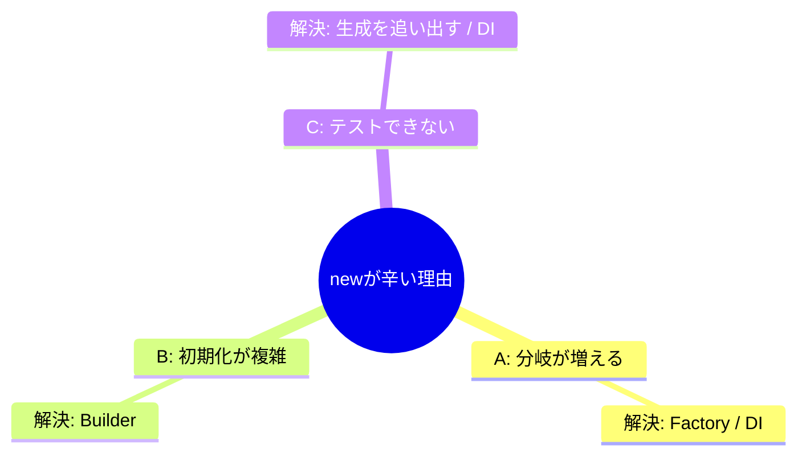

# 第13章：生成の基本：newが辛くなる3つの理由😅


## ねらい🎯

「new するだけなのに、なんかしんどい…😵」が起きる理由を **3種類** に分けて説明できるようにします✨
この3種類がわかると、次の章以降で学ぶ生成パターン（Factory/Builder/Prototype/Singleton など）が「どれを使えばいいか」迷いにくくなります🧭💕

---

## 到達目標✅

この章を終えたら、次ができればOKです😊🌸

* 「newが辛い」状況を **3つ（分岐・初期化・テスト差し替え）** に言い分けできる🗂️
* 自分のコードから「辛さポイント」を **具体的に3か所** 見つけて、分類できる🔎✨
* 分類に合わせて「次に効きそうなパターン」を **仮説** として置ける💡📝（確定じゃなくてOK！）

---

## 手順🧩✨

### 1) “newが辛い”は、だいたいこの3つに分かれるよ😅

#### A. 分岐が増える（種類が増える）🌱➡️🌳

* 例：支払い方法が増えるたびに `switch` が伸びる…📈💦
* 例：通知が Email / SMS / Push で増えて、呼び出し側が「どれをnewするか」知りすぎる🤯

📌 **症状あるある**

* `switch` / `if` が「生成」のために増える
* クラス追加のたびに“呼び出し側”を直すことになる
* 「どの具象クラスを使うか」があちこちに散らばる🧨

✅ こういう時に効きやすい仮説

* Factory Method / Abstract Factory 🏭✨（「どれを作るか」を外に出す）

---

#### B. 初期化が複雑（設定が多い・順番がある）🧱🧵

* 例：`new HttpClient(...)` して、ヘッダ設定して、BaseAddress設定して…が毎回バラバラ😵
* 例：コンストラクタ引数が増えすぎて、呼ぶ側が読めない😭

📌 **症状あるある**

* `new X(a,b,c,d,e,f...)` みたいに引数が多い
* 「途中まで作ったけど未完成」状態が生まれる
* 初期化の順番や必須チェックが散らかる🌀

✅ こういう時に効きやすい仮説

* Builder 🧱✨（「段階的に組み立てる」「検証タイミングを管理する」）

---

#### C. テストで差し替えできない（newが中に埋まってる）🧪🚫

* 例：メソッドの中で `new` して外部通信クラスを作っちゃって、テストが外へ飛ぶ🌐💥
* 例：`DateTime.Now` や `Guid.NewGuid()` みたいな「固定できないもの」とセットで地獄😇

📌 **症状あるある**

* テストで「偽物（フェイク/スタブ）」に差し替えできない
* “外側”（I/O）を叩くテストになって不安定になる⚡
* テストが遅い・落ちる・再現しない🥲

✅ こういう時に効きやすい仮説

* Factory（生成を差し替え可能に）🏭
* DI（登録で差し替え）🔌
* あるいは “生成箇所を1か所に寄せる” だけでもかなり改善✨

---




### 2) 例題（小さなEC）で「辛さ」をわざと見る👀🔥

まずは、ありがちな“生成が混ざったサービス”を見てみます。
（この章は「改善する」より「見抜ける」ことがゴールだよ😊）

```csharp
public enum PaymentMethodType { Card, BankTransfer }

public sealed class OrderService
{
    public string Pay(PaymentMethodType type, decimal amount)
    {
        // ✅ A: 分岐が増える（種類が増えるたびに増える）
        IPaymentGateway gateway = type switch
        {
            PaymentMethodType.Card => new CardPaymentGateway("https://card.example", "API-KEY-XXX"),
            PaymentMethodType.BankTransfer => new BankTransferGateway("bank.example", 443),
            _ => throw new ArgumentOutOfRangeException(nameof(type))
        };

        // ✅ C: テスト差し替えができない（ここでnewすると、テストで偽物にできない）
        var notifier = new EmailNotifier("smtp.example", 587, "user", "pass");

        // ✅ B: 初期化が複雑（引数が多い・設定が多い）
        var receipt = new Receipt(
            orderId: Guid.NewGuid(),
            paidAt: DateTimeOffset.Now,
            amount: amount,
            currency: "JPY",
            customerEmail: "a@example.com"
        );

        var result = gateway.Pay(receipt);
        notifier.Notify($"Paid: {result}");

        return result;
    }
}

public interface IPaymentGateway
{
    string Pay(Receipt receipt);
}

public sealed record Receipt(Guid orderId, DateTimeOffset paidAt, decimal amount, string currency, string customerEmail);

public sealed class CardPaymentGateway : IPaymentGateway
{
    private readonly string _endpoint;
    private readonly string _apiKey;
    public CardPaymentGateway(string endpoint, string apiKey) { _endpoint = endpoint; _apiKey = apiKey; }
    public string Pay(Receipt receipt) => "OK(Card)";
}

public sealed class BankTransferGateway : IPaymentGateway
{
    private readonly string _host;
    private readonly int _port;
    public BankTransferGateway(string host, int port) { _host = host; _port = port; }
    public string Pay(Receipt receipt) => "OK(Bank)";
}

public sealed class EmailNotifier
{
    public EmailNotifier(string host, int port, string user, string pass) { }
    public void Notify(string message) { /* send */ }
}
```

ここで大事なのは「うわ、汚い…」じゃなくて🤣
**どの辛さが混ざってるか、言葉で分けられること**です🗣️✨

* `switch` でどのGatewayを作る → **A 分岐**
* `Receipt` の材料が増えている / 作り方が散る → **B 初期化**
* `EmailNotifier` が中でnewされている → **C テスト差し替え**

---

### 3) 「見つけた辛さ」をメモして、次章の武器にする📝💖

おすすめはこの“3行メモ”です✨（1分でOK）

* 症状：`switch` が増える／引数が増える／テストで差し替えできない
* 原因：種類が増える／初期化が複雑／生成が中に埋まってる
* 仮説：Factory系／Builder／生成を寄せる+差し替え

---

## 落とし穴⚠️🐣

### 落とし穴1：最初からFactoryを量産する🏭🏭🏭💦

「newが嫌だから全部Factory！」は逆効果になりがち😵
まずは **“辛さの種類”がどれか** を当てるのが先です🎯

### 落とし穴2：初期化の辛さを、全部“抽象化”で解こうとする🧩😇

初期化が辛いのに、interface増やしても楽にならないこと多いです🥲
この場合は Builder 的な「組み立て手順の整理」が効くことが多いよ🧱✨

### 落とし穴3：テスト差し替え問題を「気合い」で統合テストに逃げる🧪🔥

もちろん統合テストも大事！でも…
「毎回ネットワーク叩く」みたいになると、学習も開発も疲れちゃう😵‍💫
差し替え点を作るだけで、テストが一気に楽になることが多いです🌸

---

## 演習（10〜30分）🧪📝✨

### 演習1：newハイライト3か所🔎🖍️

手元のコード（例題でも自分のでもOK）で、`new` を3か所探して👇を付けてね😊

* 🅰️ 分岐（種類が増える）
* 🅱️ 初期化（引数/設定が多い・順番がある）
* 🅲 テスト差し替え（中でnewされてる・外部I/O）

### 演習2：1か所だけ“仮説”を立てる💡

3か所のうち **1つだけ** 選んで、次の形で書く✍️✨

* 「この辛さは（A/B/C）なので、（Factory/Builder/差し替え）っぽいかも！」

---

## 自己チェック✅💖

* [ ] 「newが辛い」を **A分岐 / B初期化 / Cテスト差し替え** に分けて説明できる🙂
* [ ] 自分のコードから **3か所** “辛さポイント”を見つけて分類できた🔎✨
* [ ] そのうち1か所について、次章以降で試す **仮説（どのパターンが効きそうか）** を置けた💡📝

---

※補足：この章は「改善」じゃなくて「見抜く」章だよ😉🔍✨ ここができると、次からの吸収がめちゃ速くなります🚀💖
