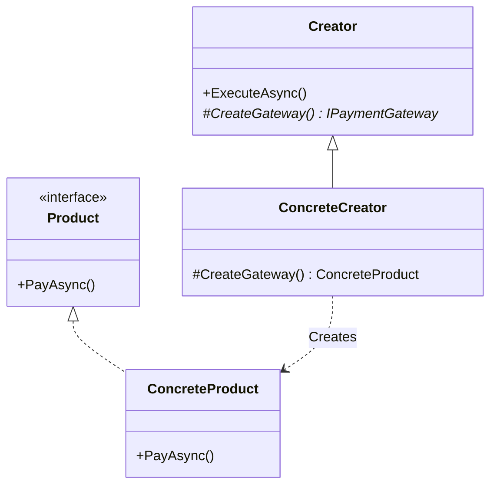

# 第14章：Factory Method ①：考え方（生成を押し出す）🏭


## ねらい 🎯

* 「`new` がつらい…😵」を **“生成の責務”として分離**して、呼び出し側（業務ロジック側）をスッキリさせる✨
* **具体クラス（Concrete）を知らなくてよい状態**を作って、分岐（`if/switch`）と依存を減らす🧹
* 「使うべきか？やめるべきか？」を **条件で言える**ようになる🗣️✅

---

## 到達目標 ✅

* Factory Methodが解く困りごとを **1文で説明**できる（例：「呼び出し側から具体型と分岐を追い出す🏃💨」）
* どこが **変わる点**で、どこを **守りたい点**にするかを分けられる🧠📝
* 最小構成の役割を言える

  * **Creator（作る側の枠）** / **Factory Method（作るメソッド）** / **Product（戻り値の抽象）** 🧩

---

## 手順 🧭（ねらい→判断→形にする）

### 1) まず「痛い `new`」を1つだけ選ぶ 😭➡️🎯

* 例：支払い手段・通知手段・保存先…などで `switch` が増えてる所🔥
* ポイントはここ👇

  * **分岐が増える**（種類が増えそう）
  * **初期化が重い/複雑**（引数だらけ、設定必須、リソース確保）
  * **テストで差し替えたい**（本番API叩きたくない）🧪

### 2) 「作られるモノ」を抽象（interface/基底クラス）に寄せる 🧩✨

* 呼び出し側が知るのは **抽象（契約）だけ**にするのが核心💡
* 例：`CreditCardGateway` を直接知らず、`IPaymentGateway` だけ知る🙂

```csharp
public interface IPaymentGateway
{
    Task PayAsync(decimal amount);
}
```

### 3) 「変わる点」と「変えたくない点」を分ける ✂️🧠

困りごとテンプレ（超重要✨）👇

* 症状：`switch` が増えて読みにくい😵
* 原因：生成（どの具体型を作るか）を業務ロジックが決めている🧨
* 変わる点：支払い手段の種類（カード/銀行/ポイント…）💳🏦🎁
* 変えたくない点：支払いの流れ（検証→請求→結果処理）🧾✅

👉 **Factory Methodは「変わる点＝生成」を外へ押し出す**パターンだよ🏭

### 4) 「作るところ」を Factory Method として切り出す 🪓🏭

Factory Methodの超基本の形👇

* **Creator**：流れ（変えたくない部分）を持つ
* **Factory Method**：生成（変わる部分）を担当する

```csharp
public abstract class PaymentWorkflow
{
    public async Task ExecuteAsync(decimal amount)
    {
        // ここは「変えたくない流れ」✨
        var gateway = CreateGateway(); // ← ここがFactory Method🏭
        await gateway.PayAsync(amount);
    }

    // ここが「変わる点」＝生成 👇
    protected abstract IPaymentGateway CreateGateway();
}
```

### 5) 具体型は「派生側」に押し込む（呼び出し側から消す）🫥✨

```csharp
public sealed class CreditCardPaymentWorkflow : PaymentWorkflow
{
    protected override IPaymentGateway CreateGateway()
        => new CreditCardGateway(); // 具体型はここに隔離🏠
}
```

* これで、**ExecuteAsyncの中から `new CreditCardGateway()` が消える**🎉
* 「流れ」と「生成」が分離されて、読みやすくなる📚✨




### 6) “分岐地獄”をどこへ移したか意識する 🧠🚦

Factory Methodは魔法じゃない🪄

* 分岐（どれを使う？）は **どこかで必ず決める**必要がある
* でも目的はこれ👇

  * 業務ロジックの中に `switch` を置かない
  * 生成の変更が **影響範囲を小さくする**（差分が局所化）🧯

### 7) .NETでの「Factory Methodっぽい感覚」を先にチラ見 👀✨

* `System.Security.Cryptography` の `*.Create()` 系（例：`SHA256.Create()` など）🔐

  * 呼び出し側は「具体実装」を強く意識せず、抽象（基底）で扱える
* `IHttpClientFactory`（`HttpClient` を作る仕組み）🌐

  * 「作り方」や「設定」を呼び出し側から引きはがせる

> ※この章は“考え方”なので、次章で「定番APIを読む👓」に進むよ📚✨

---

## よくある落とし穴 ⚠️😵

* **Factoryが増えすぎる**🏭🏭🏭

  * 1種類しかないのにFactoryを作ると、ただ面倒になる💦
* **戻り値が具体型のまま**（`CreditCardGateway` を返す等）😢

  * それ、抽象化できてなくて効果が薄い…
* **「Factoryっぽいクラス名」を作るのが目的化**📛

  * 大事なのは名前より「責務の分離」だよ🧠✨
* **分岐の移動先がグチャる**🌀

  * 分岐を1カ所に集めるなら、章11のDI（登録）や構成ルートに寄せるのが定番💡

---

## 演習 🧪🛠️（10〜30分）

### 演習1：分岐地獄から「生成責務」を1つだけ抜く🧹✨

1. いまあるコード（第12章の `switch` でもOK）から、分岐を1つ選ぶ🎯

   * 例：`PaymentMethod` で `switch` して `new` してる所💳
2. その分岐に対して、テンプレを埋める📝

   * 症状 / 原因 / 変わる点 / 変えたくない点
3. 「変えたくない点」を **1つのメソッド（流れ）** にする

   * 例：`ExecuteAsync`（検証→支払い→結果処理）
4. 「変わる点（生成）」を **Factory Method** にする

   * `protected abstract IPaymentGateway CreateGateway();`

### 演習2：クラス図（頭の中）を書いてみる🧠🖊️

* `PaymentWorkflow`（Creator）
* `CreateGateway()`（Factory Method）
* `IPaymentGateway`（Product）
* `CreditCardGateway`（ConcreteProduct）
* `CreditCardPaymentWorkflow`（ConcreteCreator）

---

## 自己チェック ✅🔍

* 呼び出し側（業務ロジック）が **具体型を知らなくなった**？🫥
* `switch/new` が **業務ロジックの中心から消えた**？🧹
* 「変わる点（生成）」と「変えたくない点（流れ）」を **分けて説明**できる？🗣️✨
* 新しい種類が増えたとき、修正は **局所（追加）** で済みそう？➕🙂

---

※補足：このチャットでは外部検索が実行できない状態だったため、ここでは安定して通用するGoFの考え方と .NET の定番例（`*.Create()` / `IHttpClientFactory` など）を“概念中心”で整理しています📚✨　APIの細かい仕様や推奨は更新されることがあるので、実装前に公式ドキュメントの最新版もあわせて確認してね👀✅
