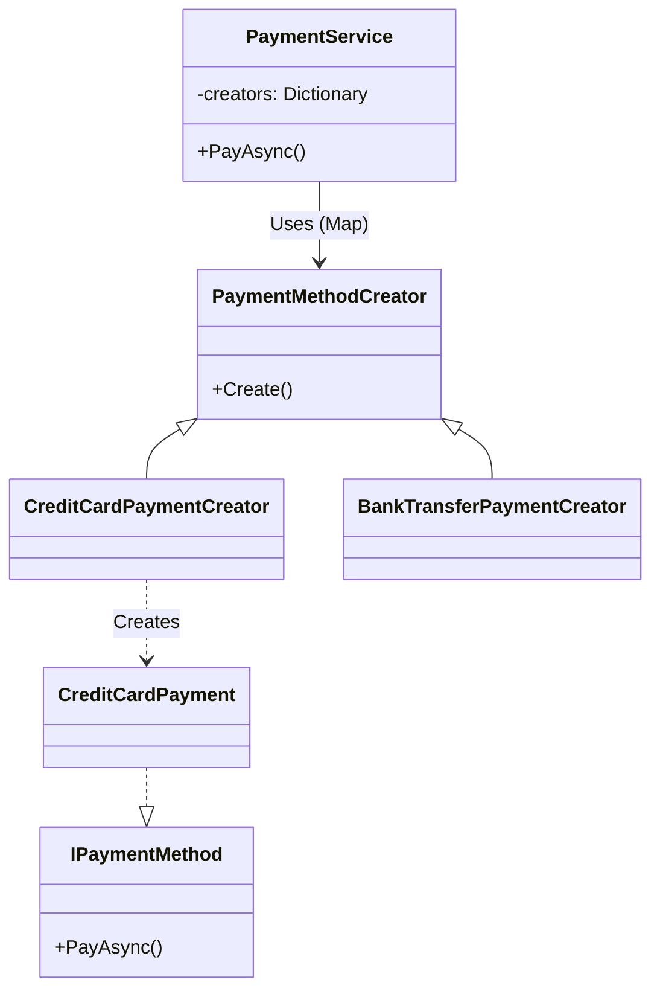

# 第16章：Factory Method ③：演習（支払い手段の生成）💳


## ねらい 🎯

* 注文の支払い処理で増えがちな **if/switch（分岐）** を「生成の責務」として外へ押し出す 🙂
* 「支払い方法が増えるたびにサービス本体を直す」状態から卒業する 🌱
* テストで仕様を固定しながら、安全にリファクタする体験をする 🧪✨

---

## 到達目標 ✅

* 支払い方法（例：クレカ / 銀行振込 / 代引き）を **Factory Method** で生成できる
* 支払い方法を1つ追加するときに、既存の支払いサービス（PayAsyncなど）を **触らずに増やせる**
* テストが「導入前→導入後」どちらでも通り、効果を説明できる 💡

---

## 手順 🧭

### 0) 今回つくる最小の登場人物 👥

* Order：注文（支払い方法の種類を持つ）
* IPaymentMethod：支払い手段の共通インターフェイス
* PaymentService：注文を受けて支払いを実行する「入口」
* PaymentMethodCreator：支払い手段を作る役（ここが Factory Method の主役）🏭

---

### 1) まず「導入前」を作る（分岐がある状態）😅

#### 1-1. ドメイン（Orderなど）📦

```csharp
namespace Ch16.FactoryMethod.Domain;

public enum PaymentMethodType
{
    CreditCard,
    BankTransfer,
    CashOnDelivery
}

public readonly record struct Money(decimal Amount, string Currency);

public sealed record Order(
    string OrderId,
    Money Total,
    PaymentMethodType PaymentMethod
);

public sealed record PaymentResult(
    bool Success,
    string MethodName,
    string Message
);
```

#### 1-2. 支払い手段（最小のダミー実装でOK）💳🏦📦

```csharp
namespace Ch16.FactoryMethod.Payments;

using Ch16.FactoryMethod.Domain;

public interface IPaymentMethod
{
    Task<PaymentResult> PayAsync(Order order, CancellationToken ct = default);
}

public sealed class CreditCardPayment : IPaymentMethod
{
    public Task<PaymentResult> PayAsync(Order order, CancellationToken ct = default)
        => Task.FromResult(new PaymentResult(true, "CreditCard", "カード決済OK"));
}

public sealed class BankTransferPayment : IPaymentMethod
{
    public Task<PaymentResult> PayAsync(Order order, CancellationToken ct = default)
        => Task.FromResult(new PaymentResult(true, "BankTransfer", "振込案内を発行しました"));
}

public sealed class CashOnDeliveryPayment : IPaymentMethod
{
    public Task<PaymentResult> PayAsync(Order order, CancellationToken ct = default)
        => Task.FromResult(new PaymentResult(true, "CashOnDelivery", "代引きで発送します"));
}
```

#### 1-3. 導入前の PaymentService（switchで生成）🔥

```csharp
namespace Ch16.FactoryMethod.App;

using Ch16.FactoryMethod.Domain;
using Ch16.FactoryMethod.Payments;

public sealed class PaymentService
{
    public async Task<PaymentResult> PayAsync(Order order, CancellationToken ct = default)
    {
        // 😵 支払い方法が増えるたびにここが増える（分岐の温床）
        IPaymentMethod method = order.PaymentMethod switch
        {
            PaymentMethodType.CreditCard     => new CreditCardPayment(),
            PaymentMethodType.BankTransfer   => new BankTransferPayment(),
            PaymentMethodType.CashOnDelivery => new CashOnDeliveryPayment(),
            _ => throw new NotSupportedException($"Unsupported: {order.PaymentMethod}")
        };

        return await method.PayAsync(order, ct);
    }
}
```

---

### 2) テストで「現状の仕様」を固定する 🧪🔒

ここが超重要だよ〜！このテストが「安全ベルト」になります 🚗💨

```csharp
using Ch16.FactoryMethod.App;
using Ch16.FactoryMethod.Domain;

namespace Ch16.FactoryMethod.Tests;

[TestClass]
public sealed class PaymentServiceTests
{
    [TestMethod]
    public async Task PayAsync_CreditCard_ReturnsCreditCard()
    {
        var sut = new PaymentService();
        var order = new Order("O-001", new Money(1200m, "JPY"), PaymentMethodType.CreditCard);

        var result = await sut.PayAsync(order);

        Assert.IsTrue(result.Success);
        Assert.AreEqual("CreditCard", result.MethodName);
    }

    [TestMethod]
    public async Task PayAsync_BankTransfer_ReturnsBankTransfer()
    {
        var sut = new PaymentService();
        var order = new Order("O-002", new Money(5000m, "JPY"), PaymentMethodType.BankTransfer);

        var result = await sut.PayAsync(order);

        Assert.IsTrue(result.Success);
        Assert.AreEqual("BankTransfer", result.MethodName);
    }
}
```

ポイント 💡

* 「どのクラスを new したか」ではなく、「結果がどうなったか」を見てるのがエラい 👍
* これならリファクタしても壊れにくいよ〜 🧁✨

---

### 3) Factory Method で「生成の責務」を外へ押し出す 🏭✨

#### 3-1. Creator（生成役）を作る

ここで Factory Method っぽさが出ます！
「外から呼ぶ Create は固定」「中身の生成だけを派生側に任せる」感じだよ 😊

```csharp
namespace Ch16.FactoryMethod.App;

using Ch16.FactoryMethod.Domain;
using Ch16.FactoryMethod.Payments;

public abstract class PaymentMethodCreator
{
    public abstract PaymentMethodType SupportedType { get; }

    // 呼び出し側が使う入口（共通）
    public IPaymentMethod Create()
        => CreatePaymentMethod(); // ← ここが Factory Method（派生が決める）

    // 派生クラスが “何を new するか” だけ決める
    protected abstract IPaymentMethod CreatePaymentMethod();
}
```

#### 3-2. 具体 Creator を支払い方法ごとに作る 💳🏦📦

```csharp
namespace Ch16.FactoryMethod.App;

using Ch16.FactoryMethod.Domain;
using Ch16.FactoryMethod.Payments;

public sealed class CreditCardPaymentCreator : PaymentMethodCreator
{
    public override PaymentMethodType SupportedType => PaymentMethodType.CreditCard;

    protected override IPaymentMethod CreatePaymentMethod()
        => new CreditCardPayment();
}

public sealed class BankTransferPaymentCreator : PaymentMethodCreator
{
    public override PaymentMethodType SupportedType => PaymentMethodType.BankTransfer;

    protected override IPaymentMethod CreatePaymentMethod()
        => new BankTransferPayment();
}

public sealed class CashOnDeliveryPaymentCreator : PaymentMethodCreator
{
    public override PaymentMethodType SupportedType => PaymentMethodType.CashOnDelivery;

    protected override IPaymentMethod CreatePaymentMethod()
        => new CashOnDeliveryPayment();
}
```

---

### 4) PaymentService から switch を消す（Creatorに任せる）🧹✨




PaymentService は「生成の詳細」を知らない状態にするよ〜 😌

```csharp
namespace Ch16.FactoryMethod.App;

using Ch16.FactoryMethod.Domain;

public sealed class PaymentService
{
    private readonly IReadOnlyDictionary<PaymentMethodType, PaymentMethodCreator> _creators;

    public PaymentService(IEnumerable<PaymentMethodCreator> creators)
    {
        // ここで1回だけ “対応表” を作る（以降は分岐しない）✨
        _creators = creators.ToDictionary(x => x.SupportedType);
    }

    public async Task<PaymentResult> PayAsync(Order order, CancellationToken ct = default)
    {
        if (!_creators.TryGetValue(order.PaymentMethod, out var creator))
            throw new NotSupportedException($"Unsupported: {order.PaymentMethod}");

        var method = creator.Create();
        return await method.PayAsync(order, ct);
    }
}
```

---

### 5) テストを「ほぼ変えずに」通す 🧪🎉

コンストラクタが変わったので、Creator を渡すだけに変更します（テストの意図はそのまま）🙂

```csharp
using Ch16.FactoryMethod.App;
using Ch16.FactoryMethod.Domain;

namespace Ch16.FactoryMethod.Tests;

[TestClass]
public sealed class PaymentServiceFactoryMethodTests
{
    private static PaymentService CreateSut()
    {
        var creators = new PaymentMethodCreator[]
        {
            new CreditCardPaymentCreator(),
            new BankTransferPaymentCreator(),
            new CashOnDeliveryPaymentCreator()
        };

        return new PaymentService(creators);
    }

    [TestMethod]
    public async Task PayAsync_CreditCard_ReturnsCreditCard()
    {
        var sut = CreateSut();
        var order = new Order("O-001", new Money(1200m, "JPY"), PaymentMethodType.CreditCard);

        var result = await sut.PayAsync(order);

        Assert.IsTrue(result.Success);
        Assert.AreEqual("CreditCard", result.MethodName);
    }

    [TestMethod]
    public async Task PayAsync_BankTransfer_ReturnsBankTransfer()
    {
        var sut = CreateSut();
        var order = new Order("O-002", new Money(5000m, "JPY"), PaymentMethodType.BankTransfer);

        var result = await sut.PayAsync(order);

        Assert.IsTrue(result.Success);
        Assert.AreEqual("BankTransfer", result.MethodName);
    }
}
```

---

### 6) （任意）DI で “追加点” を登録に寄せる 🔌✨

アプリ側（起動時）にまとめると、拡張がさらに気持ちいいです ☺️

```csharp
using Ch16.FactoryMethod.App;
using Ch16.FactoryMethod.Domain;
using Microsoft.Extensions.DependencyInjection;

var services = new ServiceCollection();

// Creator 登録（増えたらここに1行足すだけに寄せられる✨）
services.AddSingleton<PaymentMethodCreator, CreditCardPaymentCreator>();
services.AddSingleton<PaymentMethodCreator, BankTransferPaymentCreator>();
services.AddSingleton<PaymentMethodCreator, CashOnDeliveryPaymentCreator>();

services.AddSingleton<PaymentService>();

var provider = services.BuildServiceProvider();
var paymentService = provider.GetRequiredService<PaymentService>();

var order = new Order("O-003", new Money(3000m, "JPY"), PaymentMethodType.CashOnDelivery);
var result = await paymentService.PayAsync(order);

Console.WriteLine($"{result.MethodName}: {result.Message}");
```

---

## よくある落とし穴 ⚠️😵

* Creator が「何でも屋」になる 🧟‍♀️

  * Creator は基本「生成だけ」！検証や業務ルールまで詰め込まないでね
* 戻り型が具体型になって効果が薄れる 🫠

  * Create の戻りはできるだけ IPaymentMethod（抽象）にする
* “Factory っぽい名前”が増えすぎて迷子 🌀

  * 支払い手段の数＝Creatorの数、くらいの素直さでOK（汎用化しない）
* 対応表（Dictionary）構築時に重複キーで落ちる 💥

  * 同じ SupportedType を2つ登録しない（テストで検出できると安心）

---

## 演習 🏋️‍♀️✨

### 演習1：支払い方法を1つ追加してみよう（拡張の気持ちよさ体験）🎊

* PaymentMethodType に 1つ追加（例：コンビニ払い）
* IPaymentMethod 実装を1つ追加
* Creator を1つ追加
* DI登録（またはテスト用配列）に 1行追加
* 既存の PaymentService は **一切変更しない** のが合格ライン 💯

### 演習2：未対応の支払い方法で例外になるテストを追加しよう 🧪⚡

* 例：PaymentMethodType を追加したのに Creator を登録し忘れたケース
* NotSupportedException が投げられることをテストで保証する

### 演習3：Creatorの責務が肥大化しないかチェックしよう 🔍

* Creator の中に「ログ」「割引計算」「在庫チェック」みたいなのを入れたくなったら黄色信号 🚥
* それらは別の責務（別クラス）へ寄せるのが基本だよ〜 🙂

---

## チェック ✅📌

* PaymentService から switch/if による “支払い方法ごとの new” が消えている
* 支払い方法を追加しても、PaymentService のコードを変更していない
* テストが「支払い手段の追加」「登録漏れ」両方を守っている
* Creator が生成以外の責務を持っていない（薄い！）✨
