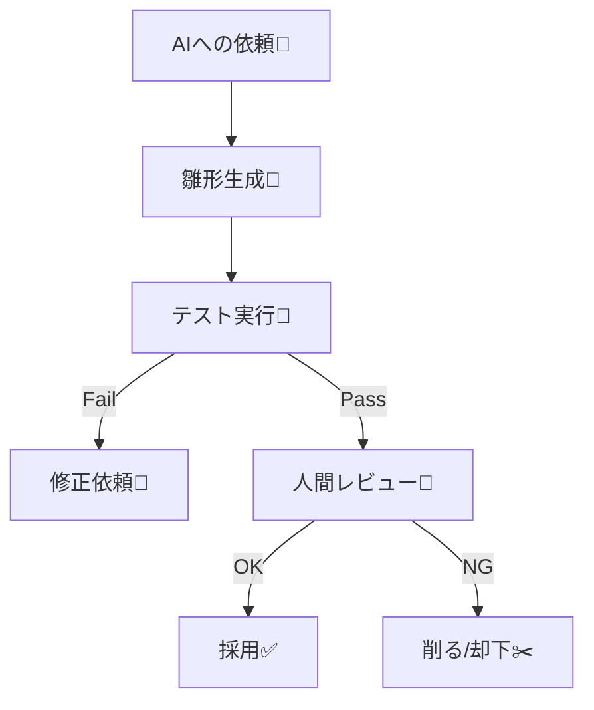

# 第17章：Factory Method ④：AIで雛形→人間が設計レビュー🤖👀


## ねらい 🎯✨

* AI（例：GitHub / Microsoft の開発支援、OpenAI 系の拡張など）に**雛形だけ**作ってもらい、人間が**設計レビューで“やりすぎ”を止める**流れを身につけるよ🤖➡️👀
* Factory Method を「入れるべき時だけ入れる」判断軸を作るよ⚖️🌸

---

## 到達目標 ✅🌟

この章が終わると、次ができるようになるよ！

* 「今回は Factory Method を入れない／戻す」が**言葉で説明**できる🙂🧠
* AIに投げるための**プロンプト（依頼文）テンプレ**を用意できる📝🤖
* 生成されたコードを、**責務・命名・テスト・拡張点**でレビューして、必要なら削れる✂️✨
* “差し替えたい理由”が**テストで証明**できる（＝差し替え点が1か所に集まってる）🧪💚

---

## 手順 🧭🛠️

### 1) まず「Factory Method を入れる理由」を1文にする ✍️

例）

* 「支払い方法の生成分岐が増えるから、`OrderService` から生成責務を押し出したい」💳➡️🏭
* 「テストで支払い処理だけ差し替えたい」🧪🔁
* 「初期化が複雑で、呼び出し側に置きたくない」😵‍💫🧱

この1文が弱い（“なんとなくキレイ”）なら、**入れない**候補だよ🙅‍♀️✨

---

### 2) AIに渡す「制約つきプロンプト」を作る 📝🤖

ポイントはこれ👇

* ✅ **“雛形だけ”**（中身は薄く、テスト優先）
* ✅ **過剰抽象化禁止**（基底クラス乱立、汎用フレームワーク化NG）
* ✅ **標準/定番に寄せる**（MSTest、DIは Microsoft.Extensions.* の範囲）
* ✅ **公開API最小**（public増やしすぎない）
* ✅ **差し替え点は1か所**（登録/Factory に集約）

雛形依頼テンプレ（そのままコピペでOK）👇

```text
目的：
- 「支払い方法の生成」を Factory Method で整理して、呼び出し側（OrderService）から分岐を消したい

制約：
- “パターンのための汎用基盤”は禁止（共通フレームワーク、汎用Factory抽象など）
- 追加する型は最小限（増やすのは本当に必要な分だけ）
- public API は最小（必要なもの以外 public にしない）
- テスト（MSTest）を先に通す形で作る
- 既存のドメイン語（PaymentMethod/Order など）を優先し、不自然な命名は禁止

入力：
- PaymentType enum（CreditCard / BankTransfer / CashOnDelivery など）
- OrderService に今 switch がある想定

出力：
- 変更後の最小コード（クラス/インターフェイス）
- MSTest のテスト2本（代表ケース + 例外/不正ケース）

禁止：
- “FactoryBase”“AbstractCreatorFramework” みたいな汎用基底の追加
- 使わない拡張用ポイントを先に作ること
```

---

### 3) AI出力を“そのまま採用しない”で、まずテストを動かす 🧪🏃‍♀️

* まずビルド＆テスト実行して、**期待通りの失敗/成功**になってるか確認🙂
* テストが無い/薄いなら、採用しないで **テストを書き足す**のが先だよ🧪✨

---




### 4) 人間の設計レビュー（チェックリスト）で削る✂️👀

AIは“盛る”のが得意だから、ここで止めるよ🚧💡

**A. 責務（SRP）チェック 🧠**

* Factory が「生成」以外（検証、ログ、DB、業務判断）をやってない？
* OrderService が「生成」を知らずに済んでる？（new/switch が消えてる？）

**B. 抽象の最小化チェック 🧩**

* interface/抽象クラスが増えすぎてない？（“将来のため”が多いと危険⚠️）
* 1種類しか実装がないのに interface が生えてない？（今は要らないかも）
* “拡張点”が多すぎない？（読むコスト増えるよ😵‍💫）

**C. 命名チェック 🏷️**

* ドメイン語になってる？（PaymentMethodFactory は自然、CreatorBase は不自然…みたいな）
* “役割が一目で分かる”名前？（CreateXxx の対象が明確？）

**D. テスト容易性チェック 🧪**

* 差し替えは **1か所**でできる？
* テストが「実装詳細」に寄ってない？（内部構造が変わるだけで壊れるのはNG🙅‍♀️）

**E. 依存の向きチェック 🧭**

* 呼び出し側（上位）が具体型に依存してない？
* 依存が増えて逆に読みにくくなってない？

---

### 5) “戻す勇気”を持つ（削除実験）🧨➡️🌸

ここがこの章のメインだよ💘
一度こうする👇

1. AIが追加した抽象（interface/基底/Factory）を**コメントアウト or 削除**✂️
2. 代わりに switch 式で戻してみる（最小）🔁
3. **テスト**と**差し替えのしやすさ**が同じなら、削った方が勝ち🏆✨
4. それでも辛い（分岐が増える・組合せが爆発する）なら、Factory 復活🙆‍♀️🏭

---

## よくある落とし穴 🕳️😵‍💫

* **AIの“汎用化欲”に負ける**

  * 「Creator基底」「Factory抽象階層」「登録フレームワーク」…増えたら黄色信号🚥
* **interfaceが“保険”になってる**

  * 実装1個だけなら、今は具体クラスで十分なこと多いよ🙂
* **Factoryが“便利クラス”化**

  * 生成以外を詰め込み始めたら、別クラスに分けよう📦✨
* **テストがないのに設計だけ立派**

  * テストが通らない設計は、たいてい未来で崩れるよ🧪💔

---

## ミニ演習（10〜30分）🧁⏱️

### 演習1：AIに雛形を作らせて、半分削る✂️😆

1. 上のプロンプトを使って、Factory Method の雛形を生成してもらう🤖
2. 生成された型のうち、**“将来用”っぽいものを2つ削除**してみる✂️✂️
3. その状態でテストが通るように直す🧪✨
4. 削っても困らなかった理由を1行でメモ📝

メモ例👇

```text
削除したIFは実装が1つで差し替え需要がなく、テストも具体クラスで十分だったため。
```

### 演習2：“導入しない”判断を練習する🙅‍♀️🌸

次の条件なら Factory Method は入れない／戻す、を言語化してみよう🙂

* 分岐が2つだけで増える予定がない
* テスト差し替えが不要（実装が固定）
* 初期化が単純（引数1〜2個程度）

---

## 自己チェック ✅🧡

* 「Factory Method を入れる理由」を**1文**で言えた？📝
* AI出力から **不要な抽象を削った**？✂️
* 差し替え点が **1か所**に集約されてる？🔁
* テストが「利用者目線」になってる？（内部構造に依存してない？）🧪
* 導入前より「読むファイル」が増えすぎてない？📚😵‍💫

---
