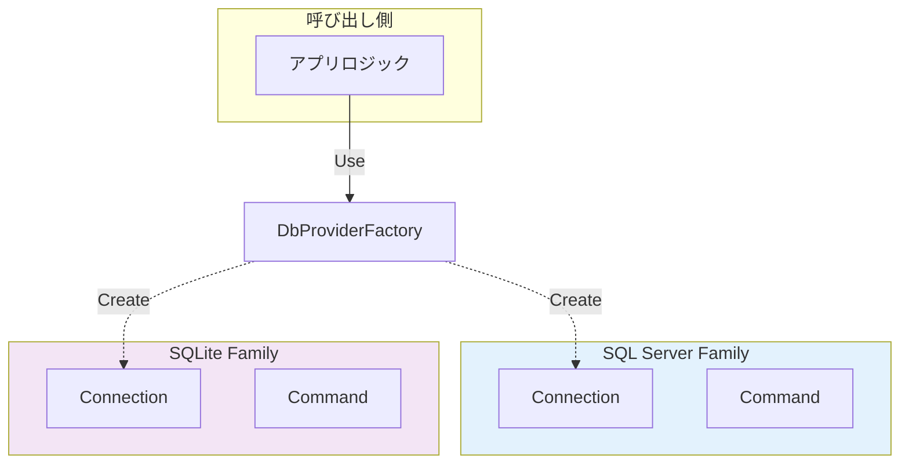

# 第18章：Abstract Factory ①：ファミリーをセットで差し替える🏭🏭


## ねらい 🎯

* 「関連する部品セット（=ファミリー）」を、**整合性を保ったまま丸ごと差し替える**考え方をつかむよ🧩✨
* Factory Method（1個つくる）より一段上の「**セットでつくる**」感覚を身につけるよ💡

---

## 到達目標 ✅

この章が終わったら、次ができるようになるよ😊

* Abstract Factory が解く困りごとを **1文で説明**できる
  例：「DBがSQL ServerでもSQLiteでも、呼び出し側のコードをほぼ変えずに“関連部品一式”を差し替えたい」
* 「製品ファミリー」の意味がわかる（**混ぜると壊れる“相性セット”**だよ⚠️）
* 「使う/使わない」の判断ができる

  * ✅ “セットで増える”なら使う
  * ❌ “1個だけ増える”ならFactory Methodで足りることが多い

---

## 手順 🧭（ねらい→理解→判断の順にいくよ）

### 1) まず「困りごと」を1つ決める 🧠💭

Abstract Factory が刺さるのは、だいたいこういう時👇

* AかBかで **入れ替える対象が1つじゃない**
* しかも **組み合わせを間違えると動かない**（相性がある）
* 呼び出し側に `if/switch` が増えてきてツラい😵

例（超わかりやすい代表）🗄️
**DBまわり**は「部品セット」だよ👇

* Connection（接続）
* Command（命令）
* Parameter（パラメータ）
* DataAdapter / DataReader など（必要なら）

これ、混ぜたらだめなのが直感的にわかるよね？🥺
「SQL Server用のConnection」と「SQLite用のCommand」を混ぜる、みたいなやつ。

---

### 2) “変わる点” と “変えたくない点” を分ける ✍️✨

ここ超重要〜！🌸

* 変わる点（差し替えたい）

  * どのDBを使うか（SQL Server / SQLite / PostgreSQL …）
  * それに応じた「部品セット一式」
* 変えたくない点（安定させたい）

  * 「注文一覧を取る」「注文を保存する」みたいなアプリ側の処理ロジック
  * 呼び出し側のコード量・分岐

---

### 3) 役者（登場人物）を覚える 🎭✨

Abstract Factory は “役割のセット” を覚えると一気に楽になるよ😊

* **Abstract Factory**：部品セットを作る工場（抽象）🏭
  例：`DbProviderFactory`
* **Abstract Products**：部品の抽象（共通の型）🧩
  例：`DbConnection`, `DbCommand`, `DbParameter` …
* **Concrete Factory**：具体工場（DBごとの工場）🏭🏭
  例：SQL Server用 / SQLite用 / …（中身はプロバイダが持ってる）
* **Concrete Products**：具体部品（DBごとの実装）🔧

ポイントはこれ👇
呼び出し側は **Abstract Products だけ見て仕事する**✨
具体型（SQL Serverのなんとか…）は **工場の中に隠す**🙈




---

### 4) “セットで作る” をコード感覚でつかむ 👀🧪

「雰囲気」が分かればOKなので、最小で見せるね（読むだけでOK）📖✨

```csharp
using System.Data.Common;

static DbConnection CreateConnection(DbProviderFactory factory, string connectionString)
{
    var conn = factory.CreateConnection()
        ?? throw new InvalidOperationException("Connection を作れなかったよ🥲");

    conn.ConnectionString = connectionString;
    return conn;
}

static DbCommand CreateCommand(DbProviderFactory factory, DbConnection conn, string sql)
{
    var cmd = factory.CreateCommand()
        ?? throw new InvalidOperationException("Command を作れなかったよ🥲");

    cmd.Connection = conn;
    cmd.CommandText = sql;
    return cmd;
}

static DbParameter CreateParameter(DbProviderFactory factory, string name, object value)
{
    var p = factory.CreateParameter()
        ?? throw new InvalidOperationException("Parameter を作れなかったよ🥲");

    p.ParameterName = name;
    p.Value = value;
    return p;
}
```

ここで大事なのは「この3つがセット」ってこと💡

* `DbConnection` と `DbCommand` と `DbParameter` は、同じ `factory` から作る
* だから “相性の合う部品セット” が保証される✅

---

### 5) Factory Method との違いをハッキリさせる ✨

混乱しやすいので一発で整理するよ🧡

* **Factory Method**：1種類の生成を押し出す（例：支払い方法1個を作る）🏭
* **Abstract Factory**：関連する生成を“まとめて”押し出す（例：DB部品一式を作る）🏭🏭

判断の合言葉👇
**「差し替えるのが“1個”ならFactory Method、 “セット”ならAbstract Factory」** 🥳

---

### 6) C#での“自然な寄せ方”も知っておく（やりすぎ防止）🧯🙂

C#だと、Abstract Factoryを**自作しなくても**似たことができる場面が多いよ✨

* DI（依存性注入）で、実装を差し替える
* `DbProviderFactory` みたいな **標準のFactory** を使う
* ログなら `ILoggerFactory` のように「生成役」を注入する（考え方として近いよ📝）

なのでこの章のゴールは👇
**「自作の巨大Factoryを作る」じゃなくて、標準/定番の“セット差し替えポイント”を見抜けるようになること**💕

---

## よくある落とし穴 🕳️⚠️

* **落とし穴1：Factoryが神（God）になる** 👑💥
  「何でも作る工場」にすると、読むのが地獄になるよ😇
  → “セット”が明確な範囲だけに絞る（DB部品一式、通知部品一式…）

* **落とし穴2：セットじゃないのにAbstract Factoryにする** 🐣
  1個しか差し替えないのに、Factory + Products が増えてコスト負け😭
  → まずFactory Methodで足りないか疑う

* **落とし穴3：製品ファミリーがズレる（混ぜる）** 🧨
  「違うfactory由来の部品」を混ぜると、実行時に壊れがち⚠️
  → “同じfactoryから一式作る” をルール化

* **落とし穴4：例外とDisposeの契約を忘れる** 🧼
  DB系は資源管理が絡むよ〜！
  → `using` / `await using` の意識を持つ（この章は概念優先でOK😊）

---

## ミニ演習（10〜30分）🧁✍️

### 演習A：あなたの「部品セット」を1つ見つけよう🔎✨

次のうち1つ選んで、「セット（ファミリー）」を書き出してね👇

* DBアクセス（Connection / Command / Parameter …）🗄️
* 通知（本文生成 / 送信 / テンプレ / 宛先…）🔔
* 外部API（Request生成 / 認証 / リトライ / レスポンス変換…）🌐

書き方（例）：

* ファミリー名：DBアクセス部品
* 部品：Connection / Command / Parameter
* 混ぜると困る理由：プロバイダが違うと型や動作が合わない

### 演習B：分岐地獄の“芽”を探す🌱🔥

今のコード（または想像でもOK）で、こういう匂いがないか探してみて👃

* `if (dbType == ...) new XxxConnection()`
* `switch(provider) { ... }` が増えそう
* DBごとに “セットで” 書き換える箇所が複数ある

---

## 自己チェック ✅🌸

* 「Abstract Factoryは**何を**差し替える？」→ **関連部品の“セット”**って言える🙂
* 「Factory Methodとの違いは？」→ **1個 vs セット**で説明できる🙂
* 「どんな時に使う？」→ **相性のある部品がセットで増える時**って言える🙂
* 「使わない時は？」→ **差し替えが1個だけ / コスト負けする時**って言える🙂

---

※補足📌：この章は “長く安定して使われる標準APIの考え方” を軸にしてるよ。実際に採用するプロバイダ名やパッケージは更新されることがあるので、実装に入る章（次章以降）では公式ドキュメントもチラ見して最終確認してね🧭✨（特にDBプロバイダ周り！）
