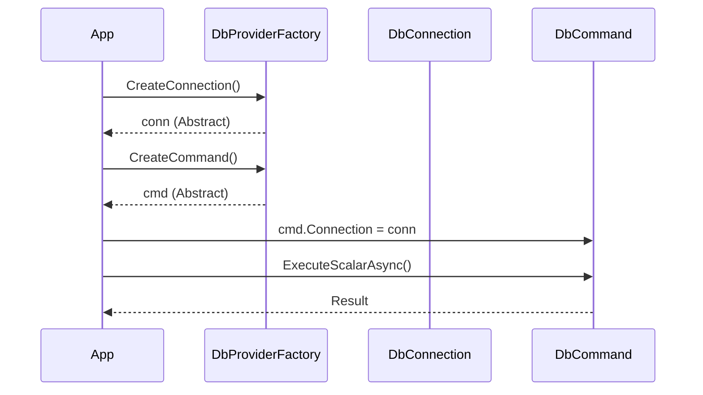

# 第19章：Abstract Factory ②：.NETの定番（DbProviderFactory）🗄️


## ねらい 🎯

* **「DBが変わっても同じ書き方で動く」**って感覚を、.NETの定番APIで体感するよ〜😊
* Abstract Factory のポイントである **“関連部品のセット（ファミリー）を丸ごと差し替える”** を、`DbProviderFactory`で見抜けるようにするよ🧠✨
* 「利用者（呼び出し側）が知らなくていいこと」を増やして、分岐地獄を減らすよ🔥➡️🌸

---

## 到達目標 ✅

この章が終わったら、次ができるようになるよ💪😊

* `DbProviderFactory`が **Abstract Factory** っぽい理由を、説明できる📣✨
* `DbConnection` / `DbCommand` / `DbParameter` の **“セット”** を、同じ手順で作れる🔧🧩
* 「呼び出し側が具体型（SqlConnectionとか）を知らない」形のコードが書ける🙈➡️😎
* ただし **隠せない差（SQL方言など）** もちゃんと理解できる⚠️

---

## 手順 🧭

### 1) まず「どこがAbstract Factory？」を一言で🍰

`DbProviderFactory`は、DBごとに違う “部品” を **同じ作り方** で作れるようにする仕組みだよ✨

* ✅ **Factory（工場）**：`DbProviderFactory`
* ✅ **製品ファミリー（セット）**：

  * `DbConnection`（接続）
  * `DbCommand`（SQL実行）
  * `DbParameter`（パラメータ）
  * （他にも `DbDataAdapter` など）

**ポイント**：
「接続だけ」じゃなくて、**接続・コマンド・パラメータ**みたいに **関連する道具一式** をまとめて差し替えられるから、Factory Methodより **Abstract Factory感** が強いんだよ〜🧩✨

---

### 2) IntelliSenseで“工場のカタログ”を見る👀📚

Visual Studioで `DbProviderFactory` を覗いてみてね✨（F12や「定義へ移動」でOK！）

見たいメソッドはこれ👇

* `CreateConnection()`
* `CreateCommand()`
* `CreateParameter()`

ここに「部品の作り方」が集まってるよ🏭✨
（※バージョンやプロバイダで細部が違うことがあるから、最終確認はIDEの表示がいちばん確実だよ😊）

---

### 3) “呼び出し側が知らなくていいこと”を3つ言えるようにする🎁

`DbProviderFactory`を使うと、呼び出し側はこういうのを知らなくてよくなるよ🙈✨

1. 具体型（`SqlConnection` とか `SqliteConnection` とか）
2. コマンド/パラメータの具体型（`SqlCommand`/`SqlParameter`…）
3. 生成の細かい差（「このDBはこのクラスをnewして…」みたいな知識）

もちろん、**SQLの書き方（方言）** までは完全には隠せないことが多いよ⚠️（これは後で説明するね！）

---

### 4) いちばん小さい“体感コード”を書いてみよう🧪✨

ここからは、**同じ処理を、Dbが変わっても同じ手順で実行**する例だよ〜😊




#### ✅ 例：注文合計を1つ取る（ExecuteScalar）🛒💰

```csharp
using System;
using System.Data;
using System.Data.Common;
using System.Threading;
using System.Threading.Tasks;

public static class OrderQueries
{
    public static async Task<decimal?> GetOrderTotalAsync(
        DbProviderFactory factory,
        string connectionString,
        int orderId,
        CancellationToken ct = default)
    {
        // 1) Connectionを作る（具体型は知らない）
        using var conn = factory.CreateConnection()
            ?? throw new InvalidOperationException("CreateConnection() returned null.");

        conn.ConnectionString = connectionString;
        await conn.OpenAsync(ct);

        // 2) Commandを作る（具体型は知らない）
        using var cmd = factory.CreateCommand()
            ?? throw new InvalidOperationException("CreateCommand() returned null.");

        cmd.Connection = conn;
        cmd.CommandText = """
            SELECT Total
            FROM Orders
            WHERE Id = @id
        """;

        // 3) Parameterを作る（具体型は知らない）
        var p = factory.CreateParameter()
            ?? throw new InvalidOperationException("CreateParameter() returned null.");

        p.ParameterName = "@id";
        p.DbType = DbType.Int32;
        p.Value = orderId;

        cmd.Parameters.Add(p);

        var result = await cmd.ExecuteScalarAsync(ct);

        return result is null || result is DBNull
            ? null
            : Convert.ToDecimal(result);
    }
}
```

**ここでのうれしさ**🎉

* 呼び出し側は「SQL Server用の型」も「SQLite用の型」も **出てこない**✨
* `DbProviderFactory`を差し替えれば、同じ形で動かせる可能性が高いよ〜🔁😊

---

### 5) Factoryの用意のしかた（2パターン）🧩

#### パターンA：プロバイダ固有のFactoryを直接使う（シンプル）👍

プロバイダによって `XxxFactory.Instance` が用意されてることが多いよ✨
（例：SQL Server / SQLite / PostgreSQL など）

```csharp
// 例：SQLite（Microsoft.Data.Sqlite を使うケースが多いよ）
using Microsoft.Data.Sqlite;
using System.Data.Common;

DbProviderFactory factory = SqliteFactory.Instance;
string cs = "Data Source=app.db"; // 例

var total = await OrderQueries.GetOrderTotalAsync(factory, cs, orderId: 1);
Console.WriteLine(total);
```

#### パターンB：名前でFactoryを引く（差し替えに強い）🔁

設定（環境変数やjson）から `"sqlite"` / `"sqlserver"` みたいに選びたい時のイメージだよ✨
`DbProviderFactories.RegisterFactory(...)` を使うやり方が分かりやすい👍

```csharp
using System.Data.Common;
using Microsoft.Data.Sqlite;

// 起動時に登録（アプリの入口で1回）
DbProviderFactories.RegisterFactory("sqlite", SqliteFactory.Instance);

// どこかで名前から取得
DbProviderFactory factory = DbProviderFactories.GetFactory("sqlite");
string cs = "Data Source=app.db";

var total = await OrderQueries.GetOrderTotalAsync(factory, cs, orderId: 1);
Console.WriteLine(total);
```

**Abstract Factoryっぽさ**が強くなるのはこっち（B）だよ😊
“ファミリーを丸ごと差し替えるスイッチ” を **名前1つ** に寄せられるからね🔁✨

---

## よくある落とし穴 ⚠️😵

### 落とし穴1：SQL方言は完全には隠れない🧨

`DbProviderFactory`で隠せるのは **ADO.NETの部品の違い** が中心だよ✨
でも、次は残りやすい…！

* `LIMIT` と `TOP` の違い
* 日付関数や文字列結合の違い
* パラメータ記法（`@p` / `?` / `:p` など）の差（プロバイダによる）

👉 対策：

* “DBを変えても同じSQL” を目標にしすぎない🙅‍♀️
* **「接続/実行の仕組みは共通化」＋「SQLは用途別に分ける」** が現実的だよ😊

---

### 落とし穴2：Dispose忘れ（接続・コマンド・リーダ）🧹

DB系は資源管理が大事！
`using var` を基本にすると安全だよ✨（例のコードみたいにね😊）

---

### 落とし穴3：パラメータを文字連結しちゃう😱

SQLインジェクション的に危ないし、型も壊れやすいよ⚠️
`CreateParameter()` → `DbType` → `Value` の流れが正解ルート✨

---

### 落とし穴4：「差し替えできる＝全部同じ」だと思う🤔

差し替えやすくするのは最高なんだけど、
DBごとの差（性能、ロック、トランザクションの癖）は残るよ〜🐣💦

---

## ミニ演習（10〜30分）💪✨

### 演習1：Factory差し替えの“気持ちよさ”を体験する🔁🎉

1. `GetOrderTotalAsync(factory, cs, id)` をそのまま使う
2. **factoryだけ** を差し替える（例：SQLiteのFactoryにする）
3. 「同じ呼び出しで動く」感覚を確認する😊

※最初はSQLiteでOKだよ（軽いから）🪶

---

### 演習2：比較メモを書く📝💡

次を2〜3行でメモしてね（超大事！）✨

* **呼び出し側が知らなくてよくなったこと**（3つ）
* **隠せなかった差**（SQL方言など）
* **採用判断**：「この規模ならアリ/ナシ」って1行で😊

---

## 自己チェック ✅🌸

* `DbProviderFactory`が **“関連部品セットを作る工場”** だと説明できる？🏭
* `DbConnection / DbCommand / DbParameter` の3点セットを、同じ手順で作れた？🧩
* 呼び出し側コードに、`SqlConnection` みたいな **具体型が出てこない**形にできた？🙈✨
* 「SQL方言までは隠れにくい」って注意点も言えた？⚠️😊
