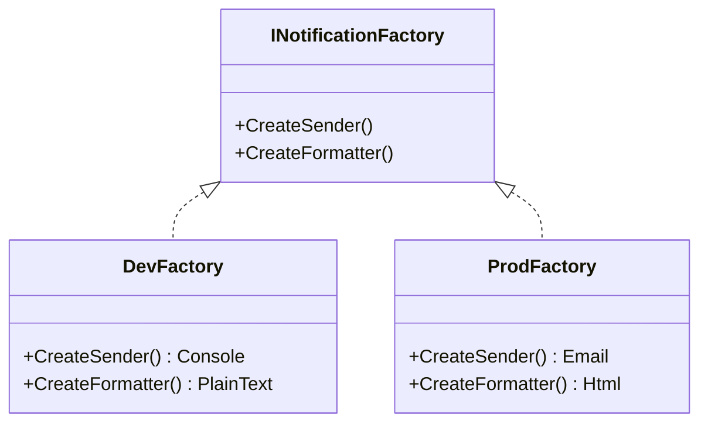

# 第20章：Abstract Factory ③：演習（通知セットを差し替え）🔔


## ねらい 🎯😊

* 「通知って、メールだけじゃないし、文章の形もいろいろ…」みたいな **“関連する部品セット”** を、まるごと入れ替えられるようにするよ📦💨
* 呼び出し側（注文処理）が **具体クラス（Email/SMS/HTML…）を知らなくていい** 状態を作るよ🙆‍♀️✨
* ついでに、if/switch が増えがちな場所を **入口（構成）に押し出す** 練習もするよ🚪🙂

---

## 到達目標 ✅🌸

* Abstract Factory が「関連部品のセット差し替え」に効く理由を、自分の言葉で言える🗣️✨
* 注文処理（OrderService）が **通知の具体型を一切知らず** に動くようにできる🧠💡
* テストで「セットがちゃんと入れ替わってる」ことを確認できる🧪💖

---

## 手順 🧭🐾

### 1) まずは “導入前” を作る（分岐が散らばる状態）😵‍💫🔥

最初はわざと、こういう形にして「つらさ」を固定するよ👇

* 通知の種類：

  * 開発用：コンソールに出す（テストしやすい）🖥️
  * 本番用：メールっぽくログ出す（ここでは送信は疑似でOK）📧

* そして典型のつらい例：

  * 「送信方法」も「文面（HTML/テキスト）」も、同じ switch の中で分岐しちゃう
  * セットの整合性（HTMLなのにSMSに送る…等）が壊れやすい💥

例（雰囲気だけ、こんな感じ）👇

```csharp
// こういう if/switch が OrderService の中にあるのがつらい😵
switch (profile)
{
    case NotificationProfile.Dev:
        sender = new ConsoleSender(...);
        formatter = new PlainTextFormatter();
        break;

    case NotificationProfile.Prod:
        sender = new EmailSender(...);
        formatter = new HtmlFormatter();
        break;
}
```

ここから「分岐を “セット化して外に出す”」が今回のゴールだよ🏃‍♀️💨✨

---

### 2) “部品（Products）” を決める 🧩🙂

Abstract Factory は「関連する部品をまとめて作る」から、まず部品を2つに絞るよ✌️💕

* 文面を作る：Formatter 📝
* 送る：Sender 📮

そして「フォーマットの結果」を1つの型にまとめると超ラク✨

```csharp
namespace Ch20.AbstractFactory;

public sealed record NotificationMessage(string Subject, string Body, bool IsHtml);
```

インターフェースはこれだけでOK🙆‍♀️

```csharp
namespace Ch20.AbstractFactory;

public interface INotificationFormatter
{
    NotificationMessage FormatOrderPaid(Order order);
}

public interface INotificationSender : IAsyncDisposable
{
    ValueTask SendAsync(string to, NotificationMessage message, CancellationToken ct = default);
}
```

---

### 3) “ファミリー（セット）” を作る Abstract Factory を定義 🏭✨

ここが主役💖
Factory は「Sender と Formatter をセットで出す」だけ！

```csharp
namespace Ch20.AbstractFactory;

public interface INotificationFactory
{
    INotificationSender CreateSender();
    INotificationFormatter CreateFormatter();
}
```

ポイントはここ👇

* 「Devセット」「Prodセット」を **Factoryの実装として分ける**
* OrderService は “どのセットか” を知らない🙂✨




---

### 4) 演習ドメインを最小で用意 🛒🍰

（すでに共通ドメインがあるなら、それを使ってOKだよ！）

```csharp
namespace Ch20.AbstractFactory;

public enum OrderStatus { New, Paid, Cancelled }

public sealed record Order(Guid Id, string CustomerEmail, decimal Total, OrderStatus Status);
```

---

### 5) Formatter と Sender の実装を作る 🧱✨

#### PlainText（開発向け）📝🖥️

```csharp
namespace Ch20.AbstractFactory;

public sealed class PlainTextOrderFormatter : INotificationFormatter
{
    public NotificationMessage FormatOrderPaid(Order order)
    {
        var subject = $"[DEV] Order Paid: {order.Id}";
        var body = $"注文 {order.Id} の支払いが完了しました！ 合計: {order.Total} 円";
        return new NotificationMessage(subject, body, IsHtml: false);
    }
}
```

#### HTML（本番っぽい）📧✨

```csharp
namespace Ch20.AbstractFactory;

public sealed class HtmlOrderFormatter : INotificationFormatter
{
    public NotificationMessage FormatOrderPaid(Order order)
    {
        var subject = $"Order Paid: {order.Id}";
        var body =
            "<html><body>" +
            $"<h1>お支払い完了 🎉</h1>" +
            $"<p>注文ID: <b>{order.Id}</b></p>" +
            $"<p>合計: <b>{order.Total}</b> 円</p>" +
            "</body></html>";

        return new NotificationMessage(subject, body, IsHtml: true);
    }
}
```

#### Sender（送るのはログで疑似）🪄📝

送信は “本当に送る” 必要なし！
今回は「差し替えできる感覚」を掴むのが目的だからね🙂💕

```csharp
using Microsoft.Extensions.Logging;

namespace Ch20.AbstractFactory;

public sealed class ConsoleNotificationSender : INotificationSender
{
    private readonly ILogger _logger;

    public ConsoleNotificationSender(ILoggerFactory loggerFactory)
        => _logger = loggerFactory.CreateLogger<ConsoleNotificationSender>();

    public ValueTask SendAsync(string to, NotificationMessage message, CancellationToken ct = default)
    {
        _logger.LogInformation("Console通知 ▶ To={To} Subject={Subject} Body={Body}",
            to, message.Subject, message.Body);

        return ValueTask.CompletedTask;
    }

    public ValueTask DisposeAsync() => ValueTask.CompletedTask;
}

public sealed class EmailNotificationSender : INotificationSender
{
    private readonly ILogger _logger;

    public EmailNotificationSender(ILoggerFactory loggerFactory)
        => _logger = loggerFactory.CreateLogger<EmailNotificationSender>();

    public ValueTask SendAsync(string to, NotificationMessage message, CancellationToken ct = default)
    {
        // 実運用ではメール配信サービス等に置き換える想定📮✨
        _logger.LogInformation("Email通知（疑似） ▶ To={To} Subject={Subject} IsHtml={IsHtml}",
            to, message.Subject, message.IsHtml);

        return ValueTask.CompletedTask;
    }

    public ValueTask DisposeAsync() => ValueTask.CompletedTask;
}
```

ここで Microsoft の標準ロギング基盤（Microsoft.Extensions.Logging）を使ってるので、「パターンのための謎クラス」は増えないよ🧡✨

---

### 6) Factory を実装して “セット” を完成させる 🏭🎁

```csharp
using Microsoft.Extensions.Logging;

namespace Ch20.AbstractFactory;

public sealed class DevNotificationFactory : INotificationFactory
{
    private readonly ILoggerFactory _loggerFactory;

    public DevNotificationFactory(ILoggerFactory loggerFactory)
        => _loggerFactory = loggerFactory;

    public INotificationSender CreateSender()
        => new ConsoleNotificationSender(_loggerFactory);

    public INotificationFormatter CreateFormatter()
        => new PlainTextOrderFormatter();
}

public sealed class ProdNotificationFactory : INotificationFactory
{
    private readonly ILoggerFactory _loggerFactory;

    public ProdNotificationFactory(ILoggerFactory loggerFactory)
        => _loggerFactory = loggerFactory;

    public INotificationSender CreateSender()
        => new EmailNotificationSender(_loggerFactory);

    public INotificationFormatter CreateFormatter()
        => new HtmlOrderFormatter();
}
```

これで「通知のセット」を 1クラス差し替えるだけで切り替えられる🎉🎉🎉

---

### 7) OrderService から if/switch を消す ✂️😆

OrderService は Factory だけ知ってればOK！

```csharp
namespace Ch20.AbstractFactory;

public sealed class OrderService
{
    private readonly INotificationFactory _notificationFactory;

    public OrderService(INotificationFactory notificationFactory)
        => _notificationFactory = notificationFactory;

    public async Task MarkPaidAsync(Order order, CancellationToken ct = default)
    {
        var formatter = _notificationFactory.CreateFormatter();
        var message = formatter.FormatOrderPaid(order);

        await using var sender = _notificationFactory.CreateSender();
        await sender.SendAsync(order.CustomerEmail, message, ct);
    }
}
```

✅ ここがうれしいポイント

* OrderService から「Dev/Prod」みたいな分岐が消える😍
* “セットの整合性” が Factory 実装に閉じる（壊れにくい）🛡️✨

---

### 8) テストで “差し替え” を確認 🧪🌸

MSTest で「Devはテキスト」「ProdはHTML」を保証するよ！

```csharp
using Microsoft.Extensions.Logging.Abstractions;
using Microsoft.VisualStudio.TestTools.UnitTesting;

namespace Ch20.AbstractFactory.Tests;

[TestClass]
public sealed class NotificationFactoryTests
{
    [TestMethod]
    public void DevFactory_CreatesPlainTextSet()
    {
        var factory = new DevNotificationFactory(NullLoggerFactory.Instance);

        var formatter = factory.CreateFormatter();
        var msg = formatter.FormatOrderPaid(new Order(Guid.NewGuid(), "a@example.com", 1200m, OrderStatus.Paid));

        Assert.IsFalse(msg.IsHtml);
        Assert.IsTrue(msg.Subject.Contains("[DEV]"));
        Assert.IsTrue(msg.Body.Contains("支払い"));
        Assert.IsInstanceOfType(factory.CreateSender(), typeof(ConsoleNotificationSender));
    }

    [TestMethod]
    public void ProdFactory_CreatesHtmlSet()
    {
        var factory = new ProdNotificationFactory(NullLoggerFactory.Instance);

        var formatter = factory.CreateFormatter();
        var msg = formatter.FormatOrderPaid(new Order(Guid.NewGuid(), "a@example.com", 1200m, OrderStatus.Paid));

        Assert.IsTrue(msg.IsHtml);
        Assert.IsFalse(msg.Subject.Contains("[DEV]"));
        Assert.IsTrue(msg.Body.Contains("<html>"));
        Assert.IsInstanceOfType(factory.CreateSender(), typeof(EmailNotificationSender));
    }
}
```

これで「セット入れ替え」がテストで守れるよ🧁✨
（“HTMLなのにConsoleSender” みたいな事故も、意図せず混ぜたらテストで気づける🧯）

---

## よくある落とし穴 ⚠️😵‍💫

1. **Factory が巨大化する** 🐘💦

* CreateA / CreateB / CreateC … って増やしすぎると、Factoryが神様化するよ😇➡️😱
* まずは「強く結びついてる2〜3部品」だけに絞ろう✨

2. **セットの整合性が壊れる** 💥

* HTMLを作るのに、SMS sender を組み合わせる…みたいな事故が起きる
* だからこそ「Factory実装ごとにセットを固定」するのが大事🙂🛡️

3. **分岐を OrderService に戻しちゃう** 🥺

* “Factoryを使ってるのに、結局 switch してる” だと意味が薄いよ〜
* 分岐は「入口（構成）」に寄せるのがコツ🚪✨

4. **Dispose を忘れる** 🧹

* 実運用だと Sender がネットワーク資源を持つことがある
* 今回は IAsyncDisposable で練習してるので、await using を習慣にしよ🥰

---

## 演習 ✍️🎀

**演習1：通知セットをもう1種類増やす** 🧪✨

* “ステージング” を追加してみてね🙂

  * Sender：Console
  * Formatter：HTML（本番に近い文面で確認したい、みたいなイメージ）

やること：

* StagingNotificationFactory を作る
* テストを1本追加（IsHtml=true かつ Sender が Console）✅

---

**演習2：通知の種類を増やす** 🔔➕

* OrderCancelled（キャンセル）を追加して

  * Subject/Body が変わるのをテストで固定してみよう💖

ヒント：

* INotificationFormatter に FormatOrderCancelled を足す
* Factory の差し替えはそのまま効く（セットの強さ）🏭✨

---

**演習3：OrderService のテストを1本書く** 🧪🧡
「通知を送った」ことを確かめたい場合は、テスト専用に RecordingSender を作ってOKだよ🙂
（本番用の仕組みに混ぜない、テストプロジェクト側に置くのがきれい✨）

---

## チェック ✅🌈

* OrderService の中に「Dev/Prod の if/switch」が **存在しない** 🙅‍♀️
* Factory を差し替えるだけで、Sender と Formatter が **セットで切り替わる** 🏭🎁
* Dev はテキスト、Prod はHTML…などのルールが **テストで守られている** 🧪💖
* “部品セットの整合性” が壊れにくい構造になっている 🛡️✨
