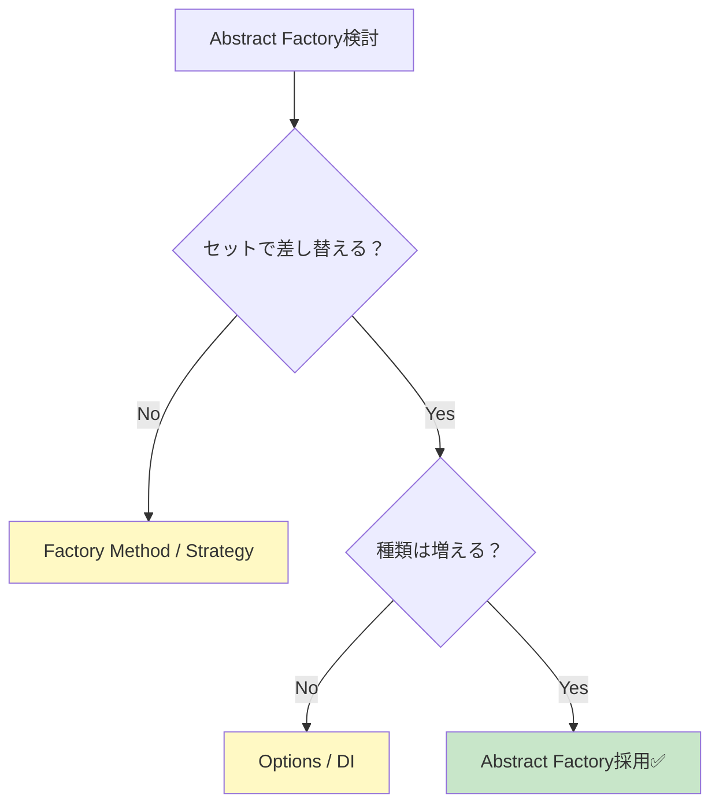

# 第21章：Abstract Factory ④：やりすぎ注意（Factory増殖）🐣💦


## ねらい 🎯✨

* Abstract Factory（抽象工場）って便利だけど、**気づくとFactoryが増えすぎて**「読むのがつらい…😵」「直すの怖い…😱」になりがち。
* この章では、**“入れるべき時だけ入れる”判断軸**を作って、必要なら**スパッと戻す勇気**も身につけます✂️🌸
* さらに、AI（Copilot/Codex系）に雛形を出してもらうときの**事故防止プロンプト**も用意します🤖🛡️

---

## 到達目標 ✅🌈

* 「これはAbstract Factoryが必要！」「これはやりすぎ！」を**理由つきで言える**🙂🗣️
* Factoryが増殖したコードを見て、**どこを削る/統合する**か判断できる✂️✨
* AIの出力をそのまま採用せず、**設計レビュー観点**で手直しできる👀🔧
* テストで「差し替えが楽になったか」を**数字（変更箇所）で確認**できる🧪📉

---

## 手順 🧭🧩




### 1) まず確認：「ファミリー（セット差し替え）」が本当にある？👨‍👩‍👧‍👦📦

Abstract Factoryは「部品を**セット**で差し替えたい」時に強いです💪✨
逆に、これが無いなら **ほぼやりすぎ候補**😅

* ✅ 使いどき例（セット差し替えが本物）

  * 通知：`メール送信`＋`テンプレ`＋`フォーマッタ` が **必ず一緒に動く**📧🧾
  * DB：`Connection`＋`Command`＋`Parameter` を **同じプロバイダで揃える**🗄️🔗（ここは .NET の `DbProviderFactory` がまさに定番！）

* ❌ やりすぎ例（実はセットじゃない）

  * 「送信だけ変えたい」→ それ、**Strategy**や**Factory Method**で足ります📌
  * 「設定値だけ違う」→ それ、**Options（設定）**で足ります⚙️🙂

> 目安：**“必ず一緒に差し替わる部品が2つ以上”**ないなら、まず疑う🐣💦

---

### 2) 増殖のサインを見抜く（Factoryあるある地獄）🔥😵

次のどれかが出たら、赤信号です🚥⚠️

* Factoryのインターフェイスが **CreateXxx()だらけ**（5個以上とか）🏭🏭🏭
* 「Factoryを作るFactory」みたいな **Factory of Factory** が出現😇💥
* 追加要件1つで、**Factory + 製品クラス + 登録 + テスト**が芋づる式🍠😱
* 呼び出し側はスッキリしたけど、裏側のファイルが増えすぎて **探索コスト爆増**📂💦
* “差し替えたい理由”を聞かれて、**「なんとなく…」**しか言えない🙂‍↔️

---

### 3) 代替案を先に検討（Abstract Factoryじゃなくていい道）🛣️🌷

「やりたいこと」がこれなら、別ルートの方が軽くて安全です🧸✨

**A. 1つだけ差し替えたい** → Strategy（interface） or delegate（Func）🎯

* if/switchの根っこが「振る舞い選択」ならこれが最短🏃‍♀️💨

**B. 生成はするけどセットじゃない** → Factory Method 🏭🙂

* “どの具象を作るか”を押し出すだけならFactory Methodで十分なこと多いです✅

**C. 設定違いだけ** → Options（設定）⚙️

* コード増やすより設定で解決できるなら、そっちが勝ち🏆

**D. “キー”で選びたい**（例：通知チャネルで切替） → DIの工夫（キー/名前）🧩🔑

* Abstract Factoryを自作する前に、登録/解決で綺麗に済むかチェック👀

  * ここは `Microsoft.Extensions.DependencyInjection` の流儀で寄せると、学習コストも低いです📦✨
  * そして、テスト差し替えもしやすい🧪🌸

---

### 4) それでもAbstract Factoryを使うなら「最小の抽象」にする✂️🧠

増殖を防ぐコツはこれだけ👇✨

* **Factoryの責務は“セットを返す”に寄せる**📦

  * `CreateEmailSender()` `CreateSmsSender()`…みたいに “部品単体” を増やしやすい形は危険⚠️
  * 代わりに、**セットを1個返す**のが増殖しにくい🙆‍♀️

例：通知セット（概念例）🔔

```csharp
public sealed record NotificationSet(
    INotificationSender Sender,
    INotificationTemplate Template,
    INotificationFormatter Formatter);

public interface INotificationSetFactory
{
    NotificationSet CreateFor(NotificationChannel channel);
}
```

* ポイント🎀

  * Factoryが増えにくい（メソッドが増殖しづらい）✅
  * “セットの整合性”が保ちやすい✅
  * テストで `CreateFor()` だけ差し替えれば済む✅

---

### 5) 「削除してみる実験」をやる（戻せる前提で勇気MAX）🧪🪄

増殖してるか不安なときは、これが一番効きます💥

1. ✅ いまの状態でテストが全部緑なのを確認🟢
2. ✅ Gitでコミット（保険）🧷
3. ✂️ Factoryを1段減らす（例：FactoryをやめてDI登録に寄せる、Factoryメソッドを統合する）
4. 🧪 テスト実行
5. 👀 “変更箇所の数”と“読むファイル数”が減った？

   * 減ったなら、その変更は成功🎉
   * 減らないなら、Factoryを残す理由があるかも🙂

> 目標：**「差し替えたい点が1か所に集約されてる」**状態を作る💎✨

---

### 6) AIで雛形を出すときの「事故防止プロンプト」🧯🤖

AIは油断すると、抽象化を盛ってきます😇💦
だから先に “縛り” を書きます🧵✨

**コピペ用プロンプト例（短くて強い）💌**

* 目的：通知セット（Sender+Template+Formatter）をチャネルで差し替えたい
* 制約：

  * 汎用フレームワーク化しない
  * newクラス乱立しない（必要最小限）
  * Factoryメソッド増殖禁止（1メソッドに寄せる）
  * `Microsoft.Extensions.DependencyInjection` で差し替えやすく
  * MSTestで最低2本テストを作る
* 出力：ファイル数を最小に、命名はドメイン語で

AIが出したコードをレビューするときは、ここだけ見ればOK👀✅

* 「Factoryのメソッド数」が増えてない？🏭📈
* 「Factory of Factory」出てない？😇
* “差し替えたい理由”がコードから読める？🧐
* テストが “設計の目的” を守ってる？🧪💎

---

## よくある落とし穴 🕳️⚠️

* **“抽象＝えらい”**と思って増やす → だいたい逆です😵‍💫
* Factoryが「便利ツール箱」になって **God Factory化**🧰💥
* “セット差し替え”のはずが、実は **部品がバラバラに増えて整合性が崩れる**🧩💔
* 追加要件のたびに「ファイルが10個増える」→ それ、保守がつらい未来🌧️📂
* テストが “Factoryの内部” に寄りすぎて、**変更に弱い**🧪🥀

---

## 演習（10〜30分）🧁⏱️

### 演習1：増殖チェック🔍🐣

あなたのAbstract Factory演習（第20章の続き）を見て👇

* Factory関連のクラス（Factory/製品interface/製品実装）が **何個あるか数える**📌
* 新しい通知チャネルを1個追加する想定で、**変更ファイル数をメモ**📝

✅ 目安

* 変更ファイルが **3〜4個以内**：健康🌿
* **7個以上**：増殖のにおい強め🐣💦

### 演習2：Factoryメソッドを1つに寄せる✂️✨

* `CreateEmailSender()` みたいな“部品メソッド”があるなら、
  **セットを返す `CreateFor(channel)` に統合**してみる📦🙂
* テストが守れたら勝ち🎉🧪

### 演習3：削除実験（戻せる前提）🧪🧷

* Gitコミット → Factoryを1段削る → テスト
* “読むファイル数”が減るか確認📂👀

---

## チェック ✅🌸

* Abstract Factoryを使う理由を **「セット差し替え」**で説明できる🙂📦
* “代替案（Strategy/Factory Method/Options/DI）”を1つ以上言える🗣️🛣️
* Factoryのメソッドが増殖していない（1〜2個に収まってる）🏭✂️
* 新しいバリエーション追加で、変更箇所が **局所的**（少ない）🧩📉
* テストが「差し替えやすさ」を守っている🧪🛡️

---

※補足：本章は .NET の標準的で安定した設計感覚（`DbProviderFactory` のような定番の考え方、DIのデファクト運用）に基づいて構成しています。細かなAPIや推奨が更新される可能性はあるので、実案件に当てる直前だけは公式ドキュメントで最終確認してね📚👀
