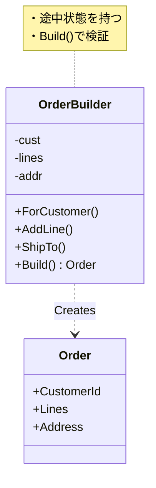

# 第22章：Builder ①：引数が多い問題を解く🧱🙂


## ねらい 🎯✨

* 引数が増えすぎて「どれが何だっけ…😵」となる問題を、**読みやすく・間違いにくく**する方法を知る🧡
* Builder が得意な場面（段階的に作る／検証タイミングをコントロールする）を、**言葉で説明できる**ようになる🗣️✨
* .NET の **定番 Builder（StringBuilder / UriBuilder）** を見て「こういうことか！」を体感する👀💡

---

## 到達目標 🏁🌸

この章を読み終えたら、次ができるようになります✅

* 「引数が多くてツラい」症状を **3タイプ** に分類できる（見た目／順番ミス／必須チェック）🧠
* Builder を **使う／使わない** を判断できる（まずは別の手段で済むか考える）⚖️
* Builder の最小構成（**途中状態を持つ→Buildで確定**）を説明できる🧱✨
* .NET の `StringBuilder` と `UriBuilder` の「Builderっぽさ」を言える🧵🌐

---

## 手順 🧭✨

### 1) まず「引数が多い」の何がツラいの？を言語化しよう😵➡️📝

引数が多いと、だいたいこの3つが起きます👇

1. **読みづらい**：呼び出し側が長くて意味が追えない📜💦
2. **順番ミス**：同じ型（stringなど）が並ぶと事故る🚑💥
3. **必須チェックのタイミングが曖昧**：途中で不正状態が紛れやすい⚠️

例：引数が多い呼び出し（ありがち）👇

```csharp
var order = new Order(
    orderId: Guid.NewGuid(),
    customerId: customerId,
    createdAt: DateTimeOffset.UtcNow,
    lines: lines,
    shippingFee: shippingFee,
    shippingPostalCode: "100-0001",
    shippingAddress1: "Tokyo",
    shippingAddress2: "Chiyoda",
    paymentMethod: paymentMethod,
    couponCode: null,
    notes: "leave at door"
);
```

> これ、作った本人は分かるけど、数日後に見ると「えっ…どれがどれ…😵」ってなりがちです💦

---

### 2) Builderの前に「もっと軽い解決」がないかチェックしよう🪶✅

Builder は便利だけど、**毎回出すと重くなる**こともあるよ〜🐣💦
まずは “軽い順” に検討するのがおすすめです👇

* ✅ **名前付き引数**（すでに使ってるならOK！）
* ✅ **Parameter Object（引数を1つのオブジェクトにまとめる）** 📦
* ✅ **object initializer + required**（必須を言語で強制）🔒
* ✅ **Optionsパターン**（設定値の束）⚙️

たとえば Parameter Object で「順番ミス」を消す👇

```csharp
public sealed record CreateOrderRequest
{
    public required Guid CustomerId { get; init; }
    public required IReadOnlyList<OrderLine> Lines { get; init; }
    public required Address ShippingAddress { get; init; }
    public required PaymentMethod PaymentMethod { get; init; }

    public Money ShippingFee { get; init; } = Money.Zero("JPY");
    public string? CouponCode { get; init; }
    public string? Notes { get; init; }
}
```

呼び出し側（読みやすい！）👇

```csharp
var req = new CreateOrderRequest
{
    CustomerId = customerId,
    Lines = lines,
    ShippingAddress = address,
    PaymentMethod = paymentMethod,
    Notes = "leave at door"
};

var order = OrderService.Create(req);
```

> 「引数が多い」だけなら、この時点で勝てることが多いです🏆✨
> でも次に出る条件があるなら、Builder が輝きます💎




---

### 3) ここからが本題：Builderが“強い”条件を覚えよう💪🧱

Builder を選ぶのは、だいたいこういう時👇

* ✅ **段階的に組み立てたい**（途中で追加・編集したい）🧩

  * 例：`AddLine` を何回も呼ぶ、オプションを後から決める
* ✅ **作る手順がある**（順序やステップが意味を持つ）🪜

  * 例：配送先が決まってから送料計算したい
* ✅ **確定（Build）のタイミングで検証したい**🔍

  * 例：必須が揃うまで “未完成” として扱いたい
* ✅ **呼び出し側を読み物にしたい**（意図が伝わる）📖✨

  * 例：「誰に」「何を」「どう支払う」が1行で読める

---

### 4) Builderの最小構成（これだけ覚えればOK）🧱✨

Builder は基本こうです👇

* Builder は **途中状態（mutable）** を持つ🧩
* メソッドで値をセットし、最後に **Build() で完成品を返す**🎁
* **Build() の中で必須チェック**して “不正な完成” を防ぐ🛡️

ミニ構成（学習用の小さな業務モデルとしてOK）👇

```csharp
public sealed class OrderBuilder
{
    private Guid? _customerId;
    private readonly List<OrderLine> _lines = new();
    private Address? _shippingAddress;
    private PaymentMethod? _paymentMethod;
    private Money _shippingFee = Money.Zero("JPY");
    private string? _notes;

    public OrderBuilder ForCustomer(Guid customerId)
    {
        _customerId = customerId;
        return this;
    }

    public OrderBuilder AddLine(OrderLine line)
    {
        _lines.Add(line);
        return this;
    }

    public OrderBuilder ShipTo(Address address)
    {
        _shippingAddress = address;
        return this;
    }

    public OrderBuilder PayBy(PaymentMethod paymentMethod)
    {
        _paymentMethod = paymentMethod;
        return this;
    }

    public OrderBuilder WithShippingFee(Money fee)
    {
        _shippingFee = fee;
        return this;
    }

    public OrderBuilder WithNotes(string? notes)
    {
        _notes = notes;
        return this;
    }

    public Order Build()
    {
        if (_customerId is null) throw new InvalidOperationException("CustomerId is required.");
        if (_lines.Count == 0) throw new InvalidOperationException("At least one line is required.");
        if (_shippingAddress is null) throw new InvalidOperationException("ShippingAddress is required.");
        if (_paymentMethod is null) throw new InvalidOperationException("PaymentMethod is required.");

        return new Order(
            orderId: Guid.NewGuid(),
            customerId: _customerId.Value,
            createdAt: DateTimeOffset.UtcNow,
            lines: _lines.ToArray(),
            shippingFee: _shippingFee,
            shippingAddress: _shippingAddress,
            paymentMethod: _paymentMethod,
            notes: _notes
        );
    }
}
```

呼び出し側が “読み物” になるのがポイント💡📖

```csharp
var order = new OrderBuilder()
    .ForCustomer(customerId)
    .AddLine(new OrderLine("Apple", 2, Money.Yen(300)))
    .AddLine(new OrderLine("Bread", 1, Money.Yen(250)))
    .ShipTo(address)
    .PayBy(paymentMethod)
    .WithNotes("leave at door")
    .Build();
```

---

### 5) .NETのBuilderで「これがBuilderか！」を体感しよう🧵✨

#### ✅ StringBuilder（超定番）🧵

* 小さい `string` 連結を何回もやると、読みづらい＆ムダが出やすい💦
* `StringBuilder` は **少しずつ組み立てて、最後に ToString()** で確定🎁

```csharp
var sb = new System.Text.StringBuilder();
sb.AppendLine("Order Summary");
sb.AppendLine($"Customer: {customerId}");
sb.AppendLine($"Lines: {lines.Count}");
var text = sb.ToString();
```

#### ✅ UriBuilder（URLを安全に組み立てる）🌐

* URL は部品が多い（scheme/host/path/query…）ので、文字列直書きが事故りやすい💥
* `UriBuilder` は **部品を積んで最後に Uri** で確定🎁

```csharp
var ub = new UriBuilder("https", "api.example.com")
{
    Path = "/orders",
    Query = $"id={Uri.EscapeDataString(orderId.ToString())}&detail=1"
};

Uri uri = ub.Uri;
```

#### ✅ ConnectionStringBuilder（さらに実務っぽいBuilder）🗄️✨

DBの接続文字列は「文字列で手打ち」すると地獄になりやすいです😇
`DbConnectionStringBuilder` や各DBの *ConnectionStringBuilder* が安全に組み立てを助けてくれます🧱

---

### 6) AIで雛形を作るときのコツ🤖📝（やりすぎ防止）

AIに頼むと Builder を“立派にしすぎる”ことがあるので、最初に縛ると安全です🔒✨

* ✅ 「**OrderBuilderだけ**。Directorとか汎用基盤は不要」🙅‍♀️
* ✅ 「**Buildで必須チェック**。例外メッセージは短く」🛡️
* ✅ 「公開APIは最小（メソッド数を増やさない）」✂️

---

## よくある落とし穴 🕳️😵‍💫

* **Fluent連鎖が長すぎて読めない**📿💦

  * 対策：メソッド数を絞る／意味の薄い `WithX` を増やしすぎない✂️
* **途中状態が外へ漏れて不正状態が増える**🚰⚠️

  * 対策：途中のフィールドを外に公開しない（privateのまま）🔒
* **Buildし忘れ／同じBuilderを使い回して混ざる**🌀

  * 対策：Builderは基本「1回作って1回Build」🧼
* **Builderが“何でも知ってる子”になって太る**🐘

  * 対策：Builderは“組み立て役”。業務ルールの中心にしない🍰（中心はドメイン側へ）

---

## ミニ演習（10〜30分）🧪🌸

### 演習A：Builderが必要か判定してみよう🔍

次のどれが一番合うか選んで、理由を1行で書こう📝✨

* ① 名前付き引数だけでOK
* ② Parameter Object が良い
* ③ Builder が良い

題材：自分のコード（または例題EC）で「引数が6個以上」のメソッド／コンストラクタを1つ探す🔎

---

### 演習B：Builderの“手順”を紙に書いてみよう🧱✍️

例題ECの `Order` を作るとして、こんな手順を考える👇

* `ForCustomer`（必須）
* `AddLine`（必須・複数回）
* `ShipTo`（必須）
* `PayBy`（必須）
* `WithNotes`（任意）
* `Build`（必須チェック）

---

### 演習C：Buildの必須チェックをテストで守ろう🛡️🧪

「Lineが0件なら例外」みたいな最小テストを1本だけ書く✨

```csharp
[TestMethod]
public void Build_WhenNoLines_Throws()
{
    var builder = new OrderBuilder()
        .ForCustomer(Guid.NewGuid())
        .ShipTo(new Address("100-0001", "Tokyo", "Chiyoda"))
        .PayBy(new PaymentMethod("Card"));

    Assert.ThrowsException<InvalidOperationException>(() => builder.Build());
}
```

---

## 自己チェック ✅✨

* Builder が必要な条件を **3つ** 言える🙂
* Builderの役割を「途中状態を持つ→Buildで確定」と説明できる🧱
* `.NET の StringBuilder / UriBuilder` が Builder 的なのを説明できる🧵🌐
* 「まずはParameter Objectで済ませる」という判断もできる⚖️🌸
