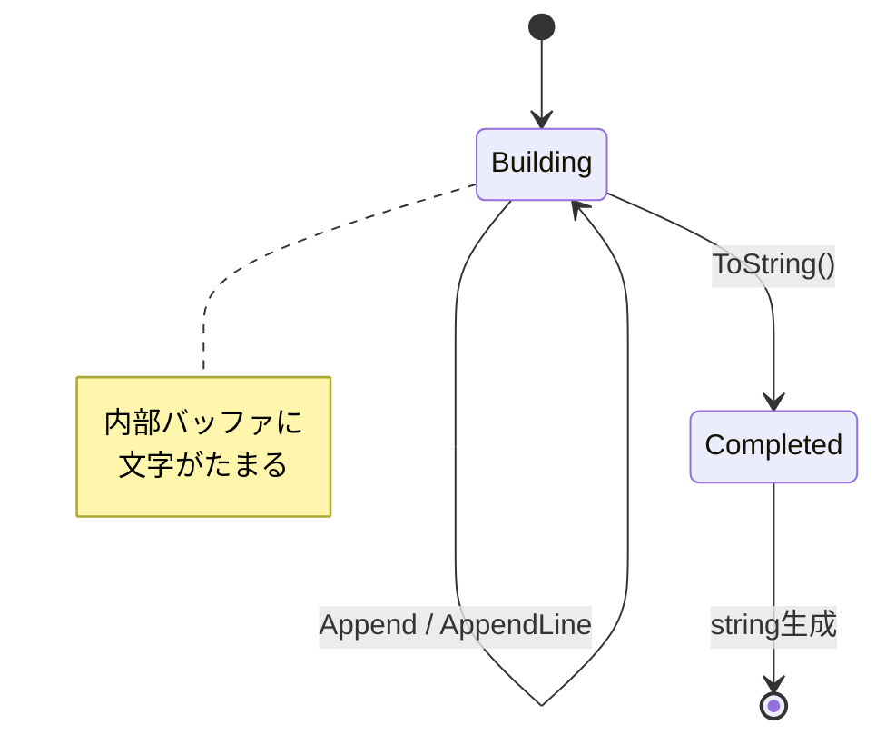

# 第23章：Builder ②：標準クラスで体感（StringBuilder / UriBuilder）🧵


## ねらい 🎯

* 「Builderって何がうれしいの？」を、.NET標準クラスで“体で理解”するよ〜😊✨
* 「最後に完成品（string / Uri）を取り出す」までの流れを見て、Builderの本質（段階的に組み立てる）をつかむよ🧱➡️🎁
* 「呼び出し側が、細かい部品の結合を毎回がんばらなくていい」感覚を作るよ🫶

---

## 到達目標 ✅

* **StringBuilder**で「文字列を段階的に組み立てて、最後に `ToString()` で完成させる」流れを説明できる📄✨
* **UriBuilder**で「URLの部品（scheme/host/path/query）を段階的に組み立てて、最後に `Uri` で完成させる」流れを説明できる🔗✨
* 「このAPIのどこがBuilderっぽいの？」を **3つ** 言える（例：途中状態を持てる／部品を追加できる／最後に完成品へ変換）🧠💡

---

## 手順 🧪🪜

### 1) Builderっぽさチェックリストを先に持とう🧡

BuilderっぽいAPIには、だいたいこの特徴があるよ👇

* **途中の状態を保持できる**（mutableに編集できる）🧩
* **小さな操作で部品を追加・変更できる**（Append / プロパティセット）🧷
* **最後に完成品を取り出す**（`ToString()` / `Uri`）🎁
* （ありがち）完成品は **イミュータブル**（変更できない）になってることが多い✨




---

### 2) StringBuilderで体感しよう🧵🧵

**ポイント：stringはイミュータブル**なので、`+` を大量にやると（状況によって）コストが増えがち💦
そこで「ためて、最後に作る」ができるのが **StringBuilder** だよ😊

#### まずは“Builderの流れ”だけ掴むミニ例 📄✨

```csharp
using System.Text;

var sb = new StringBuilder();

sb.AppendLine("Order Receipt 🧾");
sb.AppendLine("--------------");
sb.Append("OrderId: ").AppendLine("A123");
sb.Append("Total: ").AppendLine("¥4,980");

string receiptText = sb.ToString(); // 🎁 完成品！
Console.WriteLine(receiptText);
```

ここがBuilderっぽい！👀✨

* `sb` が **途中状態** を持ってる（文字が溜まっていく）🧺
* `Append / AppendLine` で **段階的に追加** できる🧷
* 最後に `ToString()` で **完成品（string）** を取り出す🎁

#### ちょい便利テク（読みやすさUP）🌸

* `AppendLine()`：行を作りやすい📝
* `AppendJoin()`：区切り付きでつなげる時に便利🔗
* `Clear()`：同じインスタンスを再利用したい時に（ただし使い回しは慎重に）🧼

```csharp
var items = new[] { "Apple", "Banana", "Orange" };
var sb = new StringBuilder();
sb.Append("Items: ").AppendJoin(", ", items);

Console.WriteLine(sb.ToString()); // Items: Apple, Banana, Orange
```

---

### 3) UriBuilderで体感しよう🌐🔧

URLって、手で文字列連結すると地味に事故るよね…😵‍💫

* `/` が二重になる
* `?` や `&` が壊れる
* エンコード忘れで変なURLになる

**UriBuilder**は、URLの部品を分けて持って、最後に完成品 `Uri` にできるBuilderだよ🔗✨

#### “部品を組み立てて完成”の最小例 🧱➡️🔗

```csharp
var ub = new UriBuilder
{
    Scheme = "https",
    Host = "example.com",
    Path = "orders/confirm"
};

// クエリはエンコード大事！🍀（最低限ここだけ意識でOK）
var orderId = Uri.EscapeDataString("A123");
var user = Uri.EscapeDataString("komiyanma");

ub.Query = $"orderId={orderId}&user={user}";

Uri url = ub.Uri; // 🎁 完成品！
Console.WriteLine(url.ToString());
```

ここがBuilderっぽい！👀✨

* `Scheme/Host/Path/Query` を **部品として別々にセット**できる🧩
* 途中で `Path` だけ変更…みたいに **段階的に調整**できる🔧
* 最後に `ub.Uri` で **完成品（Uri）** を取り出す🎁

#### UriBuilderあるある注意（やさしめ）⚠️

* `Path` の先頭 `/` は状況で見え方が変わることがあるよ（最終的な `Uri.ToString()` で確認しよう）👀
* `Query` は `?` の扱いで混乱しがち。**最終的に出たURLを必ず確認**すればOK👌✨
* クエリ値は基本 `Uri.EscapeDataString` でエンコードしておくと安全🍀

---

### 4) 「呼び出し側が何を知らなくていいか？」を言語化しよう🧠✨

Builderを使うと、呼び出し側はだいたいこの“面倒”を背負わなくてよくなるよ😊

* StringBuilder：

  * どの順で結合すると読みやすいか
  * `+` を大量に書く手間
  * 途中の改行や区切りの管理 🧵

* UriBuilder：

  * `https://` や `/` や `?` や `&` の細かい整形
  * パス結合の事故
  * クエリのエンコード漏れ 🌐

---

## よくある落とし穴 🕳️😵‍💫

### StringBuilder

* **小さい文字列**なのに毎回StringBuilderを使って、逆に読みにくくなる😅

  * 目安：数回の結合なら補間文字列でも全然OKなこと多いよ✨
* `ToString()` を呼び忘れて「え、出力されない…？」ってなる🫠
* 使い回し（`Clear()`）で、別処理の文字が混ざる事故😇（最初は使い捨て推奨🧼）

### UriBuilder

* `Path` 連結を自力でやって `//` や `/` 抜けが起きる💥
* クエリ値のエンコードを忘れて、スペースや日本語で壊れる🌀
* 相対URLを作りたいのに、つい `Scheme/Host` を入れた絶対URL前提にしてしまう（用途を決めよう）🔍

---

## 演習（10〜30分）🛠️🍰

### 演習1：レシート文字列を組み立てよう🧾✨

**お題**：注文レシートを `StringBuilder` で作って、期待する文字列になってるかテストするよ😊

**仕様（シンプル）**

* 1行目：`Order Receipt 🧾`
* 2行目：`OrderId: {id}`
* 3行目：`Total: {yen}`

```csharp
using System.Text;

static string BuildReceiptText(string orderId, int totalYen)
{
    var sb = new StringBuilder();
    sb.AppendLine("Order Receipt 🧾");
    sb.Append("OrderId: ").AppendLine(orderId);
    sb.Append("Total: ").Append(totalYen).AppendLine(" yen");
    return sb.ToString();
}
```

**MSTest例**（“完成品が正しいか”だけ見るよ🧪）

```csharp
using Microsoft.VisualStudio.TestTools.UnitTesting;

[TestClass]
public class ReceiptTextTests
{
    [TestMethod]
    public void BuildReceiptText_ReturnsExpectedFormat()
    {
        var text = BuildReceiptText("A123", 4980);

        var expected =
            "Order Receipt 🧾\r\n" +
            "OrderId: A123\r\n" +
            "Total: 4980 yen\r\n";

        Assert.AreEqual(expected, text);
    }
}
```

※ 改行コード（`\r\n`）は環境で差が出ることがあるので、気になる時は `ReplaceLineEndings()` を使って揃えるのもアリだよ🧊✨

---

### 演習2：確認URLを UriBuilder で作ろう🔗✨

**お題**：`orderId` と `user` をクエリに入れた確認URLを作って、ちゃんと期待するURLになるかテストしよう😊

```csharp
static Uri BuildConfirmUrl(string orderId, string user)
{
    var ub = new UriBuilder
    {
        Scheme = "https",
        Host = "example.com",
        Path = "orders/confirm"
    };

    ub.Query = $"orderId={Uri.EscapeDataString(orderId)}&user={Uri.EscapeDataString(user)}";
    return ub.Uri;
}
```

```csharp
[TestMethod]
public void BuildConfirmUrl_CreatesExpectedUrl()
{
    var uri = BuildConfirmUrl("A123", "こみやんま");

    // 完全一致は環境差が出る可能性があるので、まずは含むチェックでもOK😊
    var s = uri.ToString();

    Assert.IsTrue(s.StartsWith("https://example.com/orders/confirm", StringComparison.OrdinalIgnoreCase));
    Assert.IsTrue(s.Contains("orderId=A123"));
    Assert.IsTrue(s.Contains("user=")); // 日本語はエンコードされるよ🍀
}
```

---

### 演習3：AI補助（任意）🤖✨

* 「StringBuilderと補間文字列の使い分けの目安」を箇条書きで出してもらう🧠
* 「UriBuilderでクエリを安全に組む方法（エンコード込み）」のサンプルを作ってもらう🔗
* 出てきたコードは **“責務が増えてないか”** と **“余計な抽象がないか”** をチェックして採用するよ👀✅

---

## 自己チェック ✅✅

* Builderの特徴を **3つ** 言えた？（途中状態／段階的操作／最後に完成品）🧱🎁
* StringBuilderで「最後に `ToString()`」って自然に言えた？🧵
* UriBuilderで「部品をセットして最後に `Uri`」って言えた？🌐
* 「手で結合すると事故るところ」を **2つ** 言えた？（`/` と `?&` とエンコード！）💥🍀
