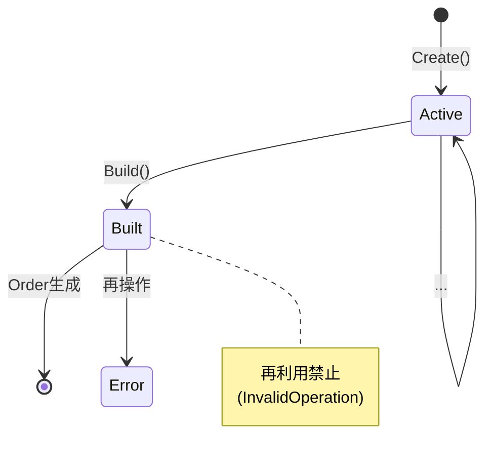

# 第24章：Builder ③：演習（Orderを段階的に組み立て）🛒


## ねらい 🎯

* `Order`みたいに「必要な情報が多い」「手順がある」「途中で不正状態になりやすい」オブジェクトを、**読みやすく・安全に**作れるようになる💪🙂
* **“Build()の瞬間にまとめて検証”**する流れを体に入れる（途中の不正状態を外に漏らさない）🔒✨
* **.NETの定番クラス**（`StringBuilder` / `UriBuilder`）も一緒に使って、“Builderっぽさ”を体感する🧵🌐

---

## 到達目標 ✅

* `OrderBuilder` を作って、こんな感じで注文を組み立てられる👇

  * `ForCustomer(...)` → `AddItem(...)` → `ShipTo(...)` → `PayBy(...)` → `Build()`
* `Build()` で最低限の不変条件（例：明細1件以上、住所必須、支払い必須）をチェックできる🛡️
* テスト（AAA）で「壊れない」ことを確認できる🧪🌸
* `StringBuilder` で注文サマリ文字列を作れる🧵
* `UriBuilder` で追跡URL（Tracking URL）を組み立てられる🌐✨

---

## 手順 🧭

### 1) まず「導入前」のつらさを1回だけ見る😵‍💫

「引数が多いコンストラクタ」や「途中状態を外でいじる」形は、読みづらいし壊れやすい…💦

```csharp
// 😵 例：引数が多くて意味が追えない（やりがち）
var order = new Order(
    id: Guid.NewGuid(),
    customerId: "C001",
    lines: lines,
    shippingAddress: address,
    paymentMethod: PaymentMethod.CreditCard,
    notificationEmail: "a@example.com",
    trackingUrl: new Uri("https://example.com/track?id=...") // 組み立て忘れがち
);
```

ここから「段階的に集めて、最後に完成＆検証」へ行こう！🧱✨

---

### 2) 最小ドメインを用意する（小さくてOK）🧁

**“学習用の最小”**が大事だよ🙂（作り込みすぎない！）

```csharp
public readonly record struct Money(decimal Amount, string Currency)
{
    public Money(decimal amount, string currency) : this()
    {
        if (amount < 0) throw new ArgumentOutOfRangeException(nameof(amount), "金額は0以上だよ💦");
        if (string.IsNullOrWhiteSpace(currency)) throw new ArgumentException("通貨コードは必須だよ💦", nameof(currency));
        Amount = amount;
        Currency = currency;
    }

    public static Money operator +(Money a, Money b)
    {
        if (a.Currency != b.Currency) throw new InvalidOperationException("通貨が違うMoneyは足せないよ💦");
        return new Money(a.Amount + b.Amount, a.Currency);
    }

    public Money Multiply(int quantity)
    {
        if (quantity <= 0) throw new ArgumentOutOfRangeException(nameof(quantity), "数量は1以上だよ💦");
        return new Money(Amount * quantity, Currency);
    }
}

public sealed record Address(string PostalCode, string Line1, string Line2);

public sealed record OrderLine(string Sku, int Quantity, Money UnitPrice)
{
    public Money LineTotal => UnitPrice.Multiply(Quantity);
}

public enum PaymentMethod
{
    CreditCard,
    BankTransfer,
    CashOnDelivery
}

public sealed record Order(
    Guid Id,
    string CustomerId,
    IReadOnlyList<OrderLine> Lines,
    Money Total,
    Address ShippingAddress,
    PaymentMethod PaymentMethod,
    Uri? TrackingUrl,
    string? NotificationEmail
)
{
    public string ToSummaryText()
    {
        var sb = new System.Text.StringBuilder();
        sb.AppendLine($"Order: {Id}");
        sb.AppendLine($"Customer: {CustomerId}");
        sb.AppendLine($"Items: {Lines.Count}");
        foreach (var line in Lines)
        {
            sb.AppendLine($"- {line.Sku} x{line.Quantity} = {line.LineTotal.Amount} {line.LineTotal.Currency}");
        }
        sb.AppendLine($"Total: {Total.Amount} {Total.Currency}");
        sb.AppendLine($"ShipTo: {ShippingAddress.PostalCode} {ShippingAddress.Line1} {ShippingAddress.Line2}");
        if (TrackingUrl is not null) sb.AppendLine($"Track: {TrackingUrl}");
        return sb.ToString();
    }
}
```

ポイント💡

* `Order` は **完成品**（外から途中状態を触らせない）🎁
* サマリは `StringBuilder` で作る（定番のBuilder例🧵）

---




### 3) `OrderBuilder` を作る（段階的に集める🧱）

「途中はBuilderが持つ」「完成はOrder」—これが基本だよ🙂✨

```csharp
public sealed class OrderBuilder
{
    private Guid _id = Guid.NewGuid();
    private string? _customerId;
    private readonly List<OrderLine> _lines = new();
    private Address? _shippingAddress;
    private PaymentMethod? _paymentMethod;
    private string? _notificationEmail;
    private string? _trackingBaseUrl;
    private bool _built;

    public static OrderBuilder Create() => new OrderBuilder();

    public OrderBuilder WithId(Guid id)
    {
        EnsureNotBuilt();
        _id = id;
        return this;
    }

    public OrderBuilder ForCustomer(string customerId)
    {
        EnsureNotBuilt();
        _customerId = string.IsNullOrWhiteSpace(customerId)
            ? throw new ArgumentException("customerIdは必須だよ💦", nameof(customerId))
            : customerId;
        return this;
    }

    public OrderBuilder AddItem(string sku, int quantity, Money unitPrice)
    {
        EnsureNotBuilt();
        if (string.IsNullOrWhiteSpace(sku)) throw new ArgumentException("skuは必須だよ💦", nameof(sku));
        _lines.Add(new OrderLine(sku, quantity, unitPrice));
        return this;
    }

    public OrderBuilder ShipTo(Address address)
    {
        EnsureNotBuilt();
        _shippingAddress = address ?? throw new ArgumentNullException(nameof(address));
        return this;
    }

    public OrderBuilder PayBy(PaymentMethod method)
    {
        EnsureNotBuilt();
        _paymentMethod = method;
        return this;
    }

    public OrderBuilder WithNotificationEmail(string? email)
    {
        EnsureNotBuilt();
        _notificationEmail = string.IsNullOrWhiteSpace(email) ? null : email;
        return this;
    }

    public OrderBuilder WithTrackingBaseUrl(string baseUrl)
    {
        EnsureNotBuilt();
        _trackingBaseUrl = string.IsNullOrWhiteSpace(baseUrl)
            ? throw new ArgumentException("baseUrlは必須だよ💦", nameof(baseUrl))
            : baseUrl;
        return this;
    }

    public Order Build(string currency = "JPY")
    {
        EnsureNotBuilt();
        _built = true;

        // ✅ Build()でまとめて検証する（ここが超重要）
        if (string.IsNullOrWhiteSpace(_customerId))
            throw new InvalidOperationException("CustomerIdが未設定だよ💦 ForCustomer()してね！");
        if (_lines.Count == 0)
            throw new InvalidOperationException("明細が0件だよ💦 AddItem()してね！");
        if (_shippingAddress is null)
            throw new InvalidOperationException("配送先が未設定だよ💦 ShipTo()してね！");
        if (_paymentMethod is null)
            throw new InvalidOperationException("支払い方法が未設定だよ💦 PayBy()してね！");

        // 合計計算（通貨は学習用に固定でもOK）
        var total = new Money(0, currency);
        foreach (var line in _lines)
        {
            if (line.UnitPrice.Currency != currency)
                throw new InvalidOperationException("通貨が混ざってるよ💦 学習用は通貨を揃えよう！");
            total += line.LineTotal;
        }

        var trackingUrl = BuildTrackingUrl(_trackingBaseUrl, _id);

        // 🚫 内部Listはコピーして外に出す（外から改変されないように）
        var linesSnapshot = _lines.ToArray();

        return new Order(
            Id: _id,
            CustomerId: _customerId,
            Lines: linesSnapshot,
            Total: total,
            ShippingAddress: _shippingAddress,
            PaymentMethod: _paymentMethod.Value,
            TrackingUrl: trackingUrl,
            NotificationEmail: _notificationEmail
        );
    }

    private static Uri? BuildTrackingUrl(string? trackingBaseUrl, Guid orderId)
    {
        if (string.IsNullOrWhiteSpace(trackingBaseUrl)) return null;

        // 🌐 UriBuilderで「クエリ付ける」定番を体感しよう
        var ub = new UriBuilder(trackingBaseUrl);

        // すでにQueryがある場合も想定して、雑に連結しない🙂
        var q = ub.Query;
        q = string.IsNullOrWhiteSpace(q) ? "" : q.TrimStart('?') + "&";
        ub.Query = q + "orderId=" + Uri.EscapeDataString(orderId.ToString());

        return ub.Uri;
    }

    private void EnsureNotBuilt()
    {
        if (_built) throw new InvalidOperationException("このBuilderはBuild後に再利用できないよ💦 新しくCreate()してね！");
    }
}
```

ポイント💡

* `Build()` に **検証と計算を集約**する（呼び出し側がラクになる）🙂✨
* `UriBuilder` は「URLを安全に組み立てる」定番のBuilder例🌐
* `Lines` は **コピーして渡す**（外から変更されないように）🔒

---

### 4) 使い方（読みやすさが勝ち！）😍

```csharp
var order = OrderBuilder.Create()
    .ForCustomer("C001")
    .AddItem("SKU-APPLE", 2, new Money(120m, "JPY"))
    .AddItem("SKU-CAKE", 1, new Money(500m, "JPY"))
    .ShipTo(new Address("100-0001", "東京都千代田区1-1", "コーポ101"))
    .PayBy(PaymentMethod.CreditCard)
    .WithNotificationEmail("a@example.com")
    .WithTrackingBaseUrl("https://shop.example.com/track")
    .Build();

var summary = order.ToSummaryText(); // StringBuilderで作られる🧵
```

---

### 5) テスト（MSTest例）で「守れてる」確認🧪🌸

```csharp
using Microsoft.VisualStudio.TestTools.UnitTesting;

[TestClass]
public sealed class OrderBuilderTests
{
    [TestMethod]
    public void Build_WithoutLines_Throws()
    {
        var builder = OrderBuilder.Create()
            .ForCustomer("C001")
            .ShipTo(new Address("100-0001", "A", "B"))
            .PayBy(PaymentMethod.CreditCard);

        Assert.ThrowsException<InvalidOperationException>(() => builder.Build());
    }

    [TestMethod]
    public void Build_CreatesTrackingUrl_WithOrderId()
    {
        var id = Guid.NewGuid();

        var order = OrderBuilder.Create()
            .WithId(id)
            .ForCustomer("C001")
            .AddItem("SKU", 1, new Money(100m, "JPY"))
            .ShipTo(new Address("100-0001", "A", "B"))
            .PayBy(PaymentMethod.BankTransfer)
            .WithTrackingBaseUrl("https://shop.example.com/track")
            .Build();

        Assert.IsNotNull(order.TrackingUrl);
        StringAssert.Contains(order.TrackingUrl!.ToString(), "orderId=" + id.ToString());
    }

    [TestMethod]
    public void Build_DoesNotExposeMutableLines()
    {
        var builder = OrderBuilder.Create()
            .ForCustomer("C001")
            .AddItem("SKU-1", 1, new Money(100m, "JPY"))
            .ShipTo(new Address("100-0001", "A", "B"))
            .PayBy(PaymentMethod.CreditCard);

        var order = builder.Build();
        var countBefore = order.Lines.Count;

        // Build後にAddItemできない（再利用禁止）= 安全🛡️
        Assert.ThrowsException<InvalidOperationException>(() =>
            builder.AddItem("SKU-2", 1, new Money(100m, "JPY"))
        );

        Assert.AreEqual(countBefore, order.Lines.Count);
    }
}
```

---

## よくある落とし穴 ⚠️😵

* **途中状態を外へ漏らす**（例：`builder.Lines` を公開してしまう）
  → 外部が勝手に追加/削除できて地獄💀
* **Fluent連鎖が長すぎて読めない**
  → 5〜7手くらいで「意味の塊」になるよう命名を工夫🙂
* **Build()を何回も呼べる設計**で、同じ注文が二重生成される
  → 今回みたいに「再利用禁止」にすると事故りにくい🛡️
* **“何でも入れられる万能Builder”にする**
  → 学習用は「Order作成専用」でOK！🧁✨

---

## 演習 🧩✨（10〜30分×3本）

1. **Giftオプション追加🎁**

* `WithGiftMessage(string?)` を追加して、`Order`に保持してみよう🙂
* ルール：200文字まで、空白ならnull

2. **クーポン（割引）をBuilderに入れる🏷️**

* `WithDiscount(Money discount)` を追加
* `Build()`で `Total` がマイナスにならないようチェック（`Total - Discount >= 0`）🛡️

3. **“読みやすい”ところで連鎖を切る✂️**

* 連鎖が長くなったら、途中で変数に置いてから続けてみよう🙂
  例：配送が複雑なら `var builder = OrderBuilder.Create().ForCustomer(...).AddItem(...);` まで作って、次に `builder.ShipTo(...)...` と続ける✨

---

## 自己チェック ✅🔍

* `Build()` しないと `Order` が作れない（途中状態を出してない）🙂
* `Build()` が **未設定をちゃんと弾ける**（Customer/Lines/Address/Payment）🛡️
* `Order` の中身が外から勝手に書き換えられない（コレクションをコピーしてる）🔒
* `StringBuilder` / `UriBuilder` を「用途に合う場所」で使えた🧵🌐
* 呼び出し側の `new Order(...)` がスッキリして読めるようになった😍
