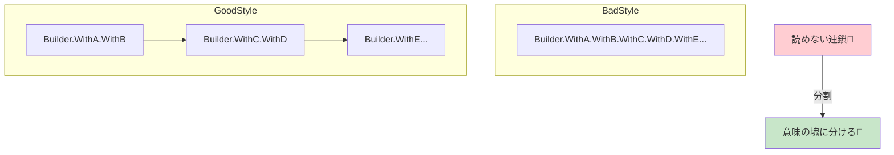

# 第25章：Builder ④：Fluent APIの落とし穴（読めない連鎖）😵


## ねらい 🎯

BuilderのFluent API（`xxx().WithA().WithB().Build()`みたいな“つなげ書き”）って、最初はスッキリして気持ちいいよね☺️✨
でも、調子に乗ると **「読めない」「間違える」「直せない」** の三重苦になりやすい…！🥺💦

この章では、**Fluentを“気持ちよく使いつつ、地獄に落ちないコツ”** を身につけるよ🧡

扱う定番（標準）例として、まずはここを軸に考えるよ👇

* `StringBuilder`（つなげられるけど“読める設計”が前提）🧵
* `UriBuilder`（Fluentより **プロパティ設定型** が読みやすい代表）🌐
* `DbConnectionStringBuilder`（接続文字列を“段階的に安全に”組み立てる）🗄️




---

## 到達目標 ✅

* Fluent APIの“危険な匂い”を **3秒で嗅ぎ分け** できる👃⚠️
* 「Fluentをやめる／分割する／別スタイルに変える」を **判断できる** 🧠✨
* Builder側の設計として、**読みやすいAPIの条件**（命名・検証・順序依存）を説明できる📣
* テストを壊さずに、**“読めるBuilder”へリファクタ** できる🧪🌸

---

## 手順 🧭🛠️

### 1) “読めない連鎖”のサインを覚える 🚨😵

次のどれかが当てはまったら黄色信号だよ⚠️

* 1行にメソッドが **6個以上** 連なる（スクロール地獄）📜💦
* 途中で **意味が切り替わる**（例：必須→オプション→別ドメイン）🔀
* `.WithX()` が多すぎて、**何が必須か不明** 😇
* **順序**が変わると壊れる（`.AddItem()`より先に`.WithCustomer()`必須…みたいな）🧨
* エラーが出ても原因が追えない（例外メッセージが弱い）😢

---

### 2) “Fluentは悪じゃない”ので、まず整形する ✨🧹

いきなり設計を変える前に、**書き方だけ**で救えることが多いよ🙌

**ダメになりやすい例（1行チェーン地獄）** 😵‍💫

```csharp
var order = OrderBuilder.New()
    .WithCustomer(customerId)
    .WithShippingAddress(address)
    .WithPaymentMethod(PaymentMethod.Card)
    .AddItem("Apple", 2, 120)
    .AddItem("Banana", 1, 80)
    .WithCoupon("WELCOME10")
    .WithGiftWrapping(true)
    .WithRequestedDeliveryDate(DateOnly.FromDateTime(DateTime.Today.AddDays(3)))
    .WithNote("置き配でお願いします")
    .Build();
```

**まずは“読みの単位”で分ける（中間変数で意味を付ける）** 🧠✨

```csharp
var builder = OrderBuilder.New()
    .WithCustomer(customerId)
    .WithShippingAddress(address)
    .WithPaymentMethod(PaymentMethod.Card);

builder = builder
    .AddItem("Apple", 2, 120)
    .AddItem("Banana", 1, 80);

builder = builder
    .WithCoupon("WELCOME10")
    .WithGiftWrapping(true)
    .WithRequestedDeliveryDate(DateOnly.FromDateTime(DateTime.Today.AddDays(3)))
    .WithNote("置き配でお願いします");

var order = builder.Build();
```

ポイント👇

* **まとまり（意味の章）** ごとに分ける📚
* 途中で「今なにをしてる？」が読めるようにする👀✨
* これだけで “脳の負担” が激減するよ🧠💕

---

### 3) それでも読みにくいなら「Fluentをやめる」選択肢も正解 🙆‍♀️✅

標準クラスの世界でも、**Fluentじゃないほうが読みやすい** 例は普通にあるよ🌸
代表が `UriBuilder` 🙌

```csharp
var ub = new UriBuilder("https://example.com")
{
    Path = "/orders",
    Query = "page=1&size=20"
};

Uri uri = ub.Uri;
```

これ、Fluentよりも

* どこが何か一目でわかる👀✨
* 順序に依存しにくい🛡️
* 途中状態も読みやすい📌

っていう強みがあるよ😊

同じ発想で、Builderが「オプション山盛り」になってきたら、**オプションをまとめて渡す**のもアリ👇

```csharp
public sealed record OrderOptions(
    bool GiftWrapping,
    string? CouponCode,
    DateOnly? RequestedDeliveryDate,
    string? Note
);

// 呼び出し側
var options = new OrderOptions(
    GiftWrapping: true,
    CouponCode: "WELCOME10",
    RequestedDeliveryDate: DateOnly.FromDateTime(DateTime.Today.AddDays(3)),
    Note: "置き配でお願いします"
);

var order = OrderBuilder.New()
    .WithCustomer(customerId)
    .WithShippingAddress(address)
    .WithPaymentMethod(PaymentMethod.Card)
    .AddItem("Apple", 2, 120)
    .Build(options);
```

---

### 4) Builder側（作る側）の“読めるAPI”ルール 🧱📏

Fluentを採用するなら、Builder側はここを守ると事故が減るよ🚑✨

**✅ ルールA：Buildで検証する（必須）**

* 不足があれば `InvalidOperationException` などで明確に落とす⚠️
* 何が足りないかメッセージに出す📝

**✅ ルールB：順序依存を減らす**

* 「先にこれを呼ばないとダメ」を極力作らない🥺
* どうしても必要なら、名前に出す（例：`WithCustomerRequired(...)`みたいな“露骨さ”は最終手段）😅

**✅ ルールC：1メソッド=1概念**

* `WithShippingAndPaymentAnd...` みたいな“詰め込み”は禁止🚫
* 逆に細かすぎて50個になるのも地獄なので、**“読む人の単位”**で切る📐

**✅ ルールD：戻り値の約束を守る**

* Fluentメソッドは基本 `this`（Builder）を返す
* `Build()` だけが成果物を返す（混ぜない）🎁

---

### 5) AI補助で雛形を作るときの“事故防止プロンプト” 🤖🧯

GitHub CopilotやOpenAI系ツールに投げるなら、**禁止事項を最初に固定**すると安全だよ🙆‍♀️✨

プロンプト例👇（そのまま貼ってOK）

```text
C#のBuilderのFluent APIを「読みやすく」改善したいです。
目的：メソッドチェーンが長くなり読めないので、読みの単位で分割したい。
制約：
- Builder用の汎用フレームワークは作らない
- 既存のpublic APIは極力維持
- Build()で必須項目の検証をする（例外メッセージは具体的に）
- 連鎖は短く、必要なら中間変数やOptionsレコードを導入
出力：改善案（呼び出し側の例とBuilder側の修正点）＋レビュー観点チェックリスト
```

---

## 落とし穴 🕳️😱

* **“気持ちよさ優先”で連鎖を伸ばす** → 読めない・直せない📈💥
* Fluentの途中で **別責務が混ざる**（例：検証、永続化、ログ）→ 神クラス化👑😇
* Builderを **再利用**して状態が残り、バグる（前回の値が混ざる）🧟‍♀️
* `Build()` が弱い（検証しない / 例外が曖昧）→ バグの発見が遅れる🐢💦
* “便利メソッド”を増やしすぎて、結局どれを使うべきか迷子🗺️😵‍💫

---

## 演習 ✍️🧪（30〜60分）

### 演習1：自分のOrderBuilderを“読みの単位”で分割してみよう 🛒🧱

1. Chapter24で作ったBuilder呼び出しを、まず **中間変数で3ブロック** に分ける（例：必須・明細・オプション）🧩
2. テストが通ることを確認🧪✅
3. Gitコミットを分ける（整形だけ / 設計変更）📌

### 演習2：Fluentをやめる判断をする 🌐🙆‍♀️

* `UriBuilder` を使って「通知URL（Webhook）を組み立てる」コードを書いてみる📣

  * 例：PathとQueryが読みやすいか？
  * Fluentで書いた版と比較して、どっちが読みやすい？👀

### 演習3：Buildの検証を強化する 🛡️🔥

* `Build()` に必須項目チェックを追加
* 例外メッセージに「足りない項目名」を入れる
* それをテストで固定（例外のメッセージもAssert）🧪📝

---

## チェック ✅📋

* [ ] チェーンが長い場所を **“意味の塊”** に分けた？🧩
* [ ] Fluentを続ける理由が言える？（短い・読みやすい・手順が自然）🙂
* [ ] 読みにくいなら、`UriBuilder`みたいな **プロパティ設定型** に寄せる判断をした？🌸
* [ ] `Build()` は必須項目を検証し、**原因が分かる例外**を出す？⚠️
* [ ] Builderのメソッドは **1メソッド=1概念** になってる？🧠
* [ ] テストが“仕様”として残っていて、リファクタしても守られてる？🧪✅
