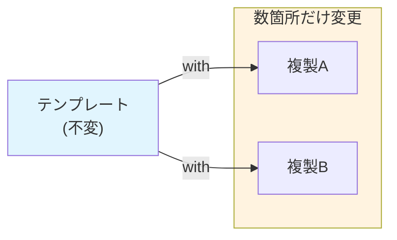

# 第26章：Prototype ①：コピーで量産する🧬✨


## ねらい🎯💡

* 「毎回ゼロから作るの、初期化がしんどい…😵‍💫」を **コピー（複製）で解決**できるようになる✨
* **テンプレ（原型）から複製して量産**する発想＝Prototypeをつかむ🧬
* C#ではとくに **`record` + `with`** を使うと、Prototypeがめちゃ軽くなるよ💛

---

## 到達目標🏁😊

* Prototypeが効く状況を、**言葉で説明**できる（「初期状態が複雑」「似たものを大量に作る」など）🗣️✨
* `record` と `with` で、テンプレから **安全に複製→一部だけ変更**できる🔁
* 「浅いコピーで参照共有が起きる⚠️」を理解し、**事故らない型（不変・Immutable）**を選べる🛡️

---

## 手順🧭✨

### 1) まず「何がつらいの？」を1つ決める😵‍💫➡️🙂

例：注文作成で、初期値が多くて毎回同じようなセットアップになる…💦

* 送料、クーポン、ギフト設定、明細、通知設定…など
* しかも **「ほぼ同じ注文」** を何十件も作ることがある🛒🛒🛒

---

### 2) Prototypeの作戦を一言で言う🧠✨

* **「原型（テンプレ）を用意しておいて、複製してから差分だけ変える」** 🧬🔁
* Builderが「組み立て手順」なら、Prototypeは「**完成品のコピー**」って感じだよ🎁

---




### 3) C#らしく `record` + `with` でテンプレを作る🧾✨

Prototypeは本来「Cloneメソッドを持つ」形が多いけど、C#は `with` が強い💪
ここでは **“テンプレ用の注文”** を `record` で作ってみるよ🛒

ポイントはこれ👇

* `with` は **「同じ形の新しいインスタンス」** を作ってくれる✨
* ただし **中身が参照型で可変**だと、参照共有で事故る可能性がある⚠️
* なので、テンプレの中身は **不変（immutable）寄り**にすると安定💞

```csharp
using System.Collections.Immutable;

public readonly record struct Money(decimal Amount, string Currency);

public sealed record OrderLine(string Sku, int Quantity, Money UnitPrice);

public sealed record OrderTemplate(
    ImmutableArray<OrderLine> Lines,
    bool IsGift,
    string? GiftMessage,
    Money ShippingFee,
    string? CouponCode
);
```

---

### 4) 「テンプレ置き場」を作って量産する📦🔁

テンプレはDictionaryで十分✨（オレオレ汎用フレームワーク化しない🙅‍♀️）

```csharp
using System.Collections.Immutable;

public static class OrderTemplates
{
    public static readonly IReadOnlyDictionary<string, OrderTemplate> Store
        = new Dictionary<string, OrderTemplate>
        {
            ["standard"] = new OrderTemplate(
                Lines: ImmutableArray.Create(
                    new OrderLine("SKU-APPLE", 1, new Money(1200m, "JPY"))
                ),
                IsGift: false,
                GiftMessage: null,
                ShippingFee: new Money(500m, "JPY"),
                CouponCode: null
            ),

            ["gift"] = new OrderTemplate(
                Lines: ImmutableArray.Create(
                    new OrderLine("SKU-CHOC", 2, new Money(800m, "JPY")),
                    new OrderLine("SKU-TEA",  1, new Money(600m, "JPY"))
                ),
                IsGift: true,
                GiftMessage: "いつもありがとう🎁",
                ShippingFee: new Money(0m, "JPY"),   // ギフトは送料無料✨
                CouponCode: "GIFT2026"
            )
        };
}
```

「複製→差分だけ変更」はこう👇

```csharp
var baseGift = OrderTemplates.Store["gift"];

// テンプレを複製して、差分だけ変更✨
var giftForMom = baseGift with
{
    GiftMessage = "お誕生日おめでとう🎂💐",
    CouponCode = "BIRTHDAY"
};

// さらに別の人向けも量産できる🔁
var giftForFriend = baseGift with
{
    GiftMessage = "いつも助けてくれてありがとう😊✨"
};
```

---

### 5) テストで「テンプレが壊れてない」ことを守る🧪🛡️

Prototypeで大事なのはここ！

* 複製先をいじっても、**元テンプレが変わってない**こと✅

（MSTest例）

```csharp
using Microsoft.VisualStudio.TestTools.UnitTesting;

[TestClass]
public class PrototypeTests
{
    [TestMethod]
    public void With_ShouldNotMutate_OriginalTemplate()
    {
        var original = OrderTemplates.Store["gift"];

        var clone = original with { GiftMessage = "変更したよ😊" };

        Assert.AreNotSame(original, clone);
        Assert.AreEqual("いつもありがとう🎁", original.GiftMessage);
        Assert.AreEqual("変更したよ😊", clone.GiftMessage);
    }
}
```

---

## 落とし穴⚠️😵‍💫

### 落とし穴1：`with` は「浅いコピー」になり得る⚠️

`record` の `with` は便利だけど、**参照型フィールドが可変**だと参照共有で事故ることがあるよ💥

ダメ例（共有しちゃう）👇

```csharp
public sealed record BadTemplate(List<string> Tags);

var a = new BadTemplate(new List<string> { "gift" });
var b = a with { };          // 見た目はコピーっぽい
b.Tags.Add("new");           // 追加！

// a.Tags にも "new" が入ってしまう可能性が高い😱
```

対策はシンプル✨

* **テンプレの中身は不変に寄せる**（`ImmutableArray` / `ImmutableList` など）🛡️
* もしくは、複製時に **コレクションだけ明示的にコピー**する（必要なときだけ）✂️

---

### 落とし穴2：コピー範囲が増えすぎて「何がテンプレ？」になる😵

テンプレに詰め込みすぎると、逆に読みにくい💦

* 「毎回変えるもの」までテンプレ化しない
* “よく使うセット”だけをテンプレにするのがコツ🎯

---

### 落とし穴3：`MemberwiseClone` に頼りすぎる🧊⚠️

`MemberwiseClone` は **浅いコピー**で、しかも `protected`（クラス内部向け）だよ⚠️

* 使うなら「参照共有の理解」が必須
* 初学者はまず `record + with` と不変データで安全にいこう😊🛡️

---

## 演習（10〜30分）🧪💪

### お題：テンプレを3つ作って、量産してみよう🛒🔁

1. `OrderTemplate` を使ってテンプレを3種類作る

   * `standard`（普通）
   * `gift`（ギフト）
   * `bulk`（まとめ買い：明細多め）📦
2. 各テンプレから **2件ずつ複製**して、`GiftMessage` や `CouponCode` を変える✨
3. テストを書く

   * 複製後に変更しても、**元テンプレが変わらない**こと✅
   * `Lines` が `ImmutableArray` なので、テンプレが安全なことも確認🛡️

---

## チェック✅🎀

* Prototypeを使う理由を1文で言える？

  * 例：「初期状態が複雑なオブジェクトを、テンプレから複製して量産したいから」🧬✨
* `with` を使った複製で、**元テンプレが不変のまま**になってる？🛡️
* テンプレの中に **可変コレクション（Listなど）** を入れてない？（入れるなら理由が言える？）⚠️
* 「テンプレに詰め込みすぎ」になってない？（“よく使うセット”だけになってる？）🎯
