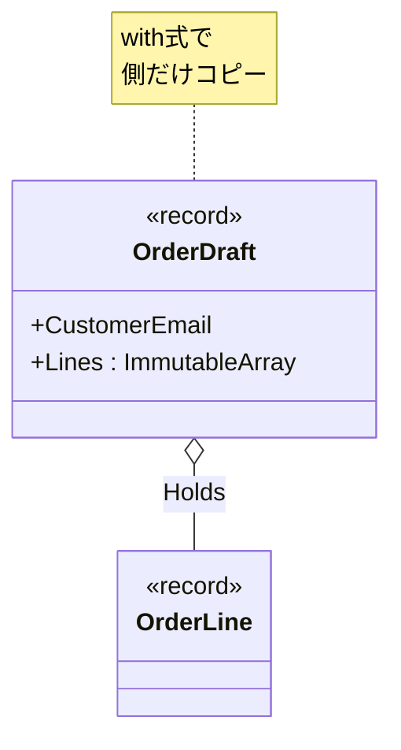

# 第27章：Prototype ②：C#らしく（record + with）🧾


## ねらい 🎯

* 「テンプレ（原型）からコピーして、ちょっとだけ変更✨」を **C#の`record + with`** で気持ちよく書けるようにするよ〜😺
* Prototypeのキモである **“コピーの境界（浅い/深い）”** を、まずは安全側で体験するよ⚠️
* Visual Studioで「`record`が裏で何を生成してるか」も、チラ見して納得するよ👀🔍

> ※ここは **言語機能（`record`/`with`）の安定した仕様**が中心だよ。細部の最新差分は、Visual StudioのF1（ドキュメント）で最終確認してね📚✨

---

## 到達目標 ✅

* `record`が「値っぽい比較（Equals）」をしてくれる理由を説明できる🙂
* `with`で「コピー＋変更」を作れて、元が変わらないことをテストで確認できる🧪
* 「`record`に`List`を入れると危ない😵」が体験できて、**安全な選択肢（Immutable系/コピー）**を選べる🛡️

---

## 手順 🧭

### 1) Prototypeを`record`でやると気持ちいい場面を選ぶ 🧩✨

Prototypeは「同じ初期形を量産する」パターンだよ🧬
C#で相性がいいのは、こういう“テンプレ/下書き”👇

* 注文の下書き `OrderDraft`（まだID確定してない）🛒
* 画面入力の入力途中 `FormDraft` 📝
* 設定テンプレ `EmailTemplate` ✉️

逆に、**IDで同一性が決まる“エンティティ”**は `record` だと事故りやすい（後で説明するね）⚠️

---

### 2) `record`の超ざっくり感覚をつかむ 🧠🌸

`record`は「データの中身が同じなら同じ扱い」に寄せた型だよ🙂
ふつうの`class`は「同じ参照なら同じ扱い」になりがちだけど、`record`は **中身でEquals** してくれるのが大きい✨

* `record class`：参照型（でもEqualsは中身寄り）
* `record struct`：値型（小さめの値オブジェクトに便利）




---

### 3) `with`は「コピーして、指定したところだけ差し替え」🔁✨

`with`はこういうイメージだよ👇

* 元をコピーする（複製）
* `{ ... }`で書いたプロパティだけ上書きする

だから「テンプレから派生版を作る」がめっちゃ得意😺

---

### 4) まずは“安全寄り”の例：Immutableでコピー事故を減らす 🛡️🍀

`List<T>`みたいな可変コレクションは、`with`しても参照が共有されやすくて危ない😵
なのでここでは **Immutable（不変）** を使って安全にいくよ✨（定番の選択肢！）

```csharp
using System;
using System.Collections.Immutable;

public enum NotificationPreference
{
    None,
    Email
}

public readonly record struct Money(decimal Amount)
{
    public static Money Jpy(decimal amount) => new(amount);
}

public sealed record OrderLine(string Sku, int Quantity, Money UnitPrice);

public sealed record OrderDraft(
    string CustomerEmail,
    ImmutableArray<OrderLine> Lines,
    Money ShippingFee,
    NotificationPreference Notification
)
{
    // 位置引数recordでも、こういう“コンパクトコンストラクタ”で不変条件チェックできるよ🛡️
    public OrderDraft
    {
        if (string.IsNullOrWhiteSpace(CustomerEmail))
            throw new ArgumentException("CustomerEmail is required.", nameof(CustomerEmail));

        if (ShippingFee.Amount < 0)
            throw new ArgumentOutOfRangeException(nameof(ShippingFee), "ShippingFee must be >= 0.");
    }
}
```

✅ 使ってみよう（テンプレ→派生）✨

```csharp
using System.Collections.Immutable;

var baseDraft = new OrderDraft(
    CustomerEmail: "a@example.com",
    Lines: ImmutableArray.Create(
        new OrderLine("SKU-APPLE", 1, Money.Jpy(1200m))
    ),
    ShippingFee: Money.Jpy(500m),
    Notification: NotificationPreference.Email
);

// 送料だけ無料にした“派生版”を作る🎁
var freeShippingDraft = baseDraft with
{
    ShippingFee = Money.Jpy(0m)
};

// 行を追加した“派生版”を作る🍎➕🍌
var addOneMoreDraft = baseDraft with
{
    Lines = baseDraft.Lines.Add(new OrderLine("SKU-BANANA", 2, Money.Jpy(300m)))
};
```

ポイント💡

* `baseDraft`はそのまま残る（元は変わらない）🙂
* `with`は「派生版を作る」感覚で使える✨

---

### 5) Visual Studioで「`record`が生成したもの」をチラ見する👀🔍

“読む”と理解が一段深くなるよ〜📚✨

* `record`の型名にカーソル置いて **F12（定義へ移動）**
* **Object Browser** や **IntelliSense** で生成メンバーを眺める
* 「`Equals`」「`GetHashCode`」「（型によっては）`Deconstruct`」あたりが見えるはず🙂

ここで狙うのは「えっ、`record`って勝手に色々用意してくれるんだ！」の納得感だよ😺✨

---

### 6) “浅いコピー事故”をわざと起こしてみる（超大事）⚠️🧪

`with`は万能な“深いコピー機”ではないよ😵
可変な参照型メンバー（`List<T>`など）は共有されやすい！

まずは危ない例👇

```csharp
using System.Collections.Generic;

public sealed record BadDraft(List<string> Tags);
```

```csharp
using Microsoft.VisualStudio.TestTools.UnitTesting;
using System.Collections.Generic;

[TestClass]
public class PrototypeWithRecordTests
{
    [TestMethod]
    public void With_shares_reference_members_when_they_are_mutable()
    {
        var original = new BadDraft(new List<string> { "A" });
        var copy = original with { }; // 見た目はコピーだけど…👀

        copy.Tags.Add("B"); // copyをいじったつもり😇

        // originalも増えてしまう😵（参照が共有されてるから）
        CollectionAssert.AreEqual(new[] { "A", "B" }, original.Tags);
    }
}
```

✅ 対策は2つ（定番）🛡️✨

* **(A) Immutable系にする**（おすすめ！）
* **(B) コピーして渡す**（`ToList()`など）

さっきの`ImmutableArray`の例は(A)だよ🙂

---

## よくある落とし穴 🕳️⚠️

* `record`を「IDで同一性が決まるエンティティ」に使って、Equalsが期待とズレる😵

  * 例：`Order`（注文）そのものを`record`にすると「中身が同じなら同一扱い」になりがちで危険
  * 代わりに、**テンプレ/下書き/値オブジェクト**に寄せるのが安全🙂
* `with`＝深いコピーだと思い込む（特に`List`で爆発）💥
* `record struct`に“でかいデータ”を入れて、コピーコストが増える📦💦

  * 値型はコピーが起きやすいから、小さめの値（`Money`とか）向きだよ🙂
* `MemberwiseClone`に手を出して「コピーできた気」になる（でも浅い）😇

  * ここは注意喚起だけ！本格的には次章で⚠️

---

## ミニ演習（10〜30分）✍️🌼

### 演習1：`with`で派生版を3つ作る🎨✨

* `baseDraft`から

  1. 送料0円
  2. 通知OFF
  3. 行を1つ追加
     の3パターンを作ってみてね🙂

チェック用に「元が変わってない」テストも書こう🧪✨

```csharp
[TestMethod]
public void With_creates_variants_without_mutating_original()
{
    var baseDraft = new OrderDraft(
        CustomerEmail: "a@example.com",
        Lines: ImmutableArray.Create(new OrderLine("SKU-APPLE", 1, Money.Jpy(1200m))),
        ShippingFee: Money.Jpy(500m),
        Notification: NotificationPreference.Email
    );

    var variant = baseDraft with { ShippingFee = Money.Jpy(0m) };

    Assert.AreEqual(Money.Jpy(500m), baseDraft.ShippingFee);
    Assert.AreEqual(Money.Jpy(0m), variant.ShippingFee);
}
```

### 演習2：わざと`List`で事故らせて、Immutableで直す⚠️➡️🛡️

* `BadDraft`のテストを通して「なるほど…😵」を体験
* `Tags`を `ImmutableArray<string>`（または`ImmutableList<string>`）に置き換えて、同じ事故が起きない形に修正✨

### 演習3：便利メソッドを“汎用化しすぎず”に1個だけ作る🔧🙂

`OrderDraft`に「行を追加した派生を返す」だけのメソッドを追加してみてね👇

```csharp
public sealed record OrderDraft(/* 省略 */)
{
    public OrderDraft AddLine(OrderLine line) =>
        this with { Lines = Lines.Add(line) };
}
```

---

## 自己チェック ✅🧠

* `record`が`class`と違うのは「何でEqualsするか」を説明できる？🙂
* `with`が作るのは **新しいインスタンス**で、元は基本変わらない…って言える？🔁✨
* `List<T>`を`record`に入れると危ない理由を、テストで見せられる？⚠️🧪
