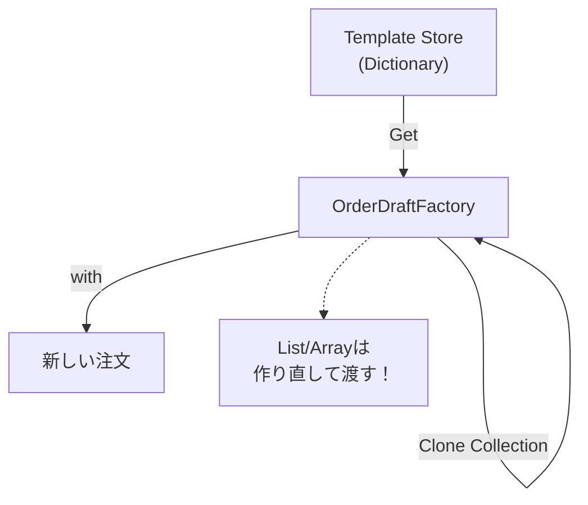

# 第28章：Prototype ③：演習（注文テンプレを複製）🛒🔁


## ねらい 🎯✨

* 「いつも似たような注文を作る」場面で、**テンプレ（原型）から複製してちょい編集**するやり方を体験します🧬
* `new` と初期化コードが長くなる問題を、**record + with** でスッキリさせます🧾✨
* **コピーの落とし穴（浅いコピー）**を、テストでちゃんと踏みます⚠️🧪

---

## 到達目標 🏁🌸

この章が終わったら、次ができるようになります👇

* ✅ 「ギフト注文テンプレ」みたいな **注文テンプレ（Prototype）** を用意できる
* ✅ テンプレから複製して、`CustomerId` や配送先だけ差し替えられる
* ✅ **テンプレと複製後が“同じ参照を共有してない”**ことをテストで確認できる🧪
* ✅ 「どこまでコピーすべき？」の判断ができる（特にコレクション）🧠✨

---

## 手順 🧭🛠️

### 1) プロジェクト準備 📁✨

* コンソールアプリ（例：`Ch28.Prototype`）
* テストプロジェクト（例：`Ch28.Prototype.Tests` / MSTest）
* テスト側から、コンソール側を参照追加🔗

> ここから先は、**小さなEC**の「注文の下書き（OrderDraft）」をテンプレ化します🛒💕

---

### 2) ドメインを “最小” で作る（record中心）🧾✨

ポイント：Prototypeは「原型がすでに“それっぽく完成してる”」のが大事です🙂
なので、まず **テンプレになれる形** を作ります！

```csharp
// Ch28.Prototype / Domain/Money.cs
public readonly record struct Money(decimal Amount, string Currency)
{
    public static Money Jpy(decimal amount) => new(amount, "JPY");
    public override string ToString() => $"{Amount:N0} {Currency}";
}
```

```csharp
// Ch28.Prototype / Domain/OrderItem.cs
public sealed record OrderItem(string Sku, string Name, Money UnitPrice, int Quantity);
```

```csharp
// Ch28.Prototype / Domain/OrderDraft.cs
using System.Linq;

public sealed record OrderDraft(
    string TemplateKey,          // どのテンプレか（gift / subscription など）
    string CustomerId,           // 実際の注文では必須（テンプレでは空でOK）
    string ShippingName,
    string ShippingAddress,
    OrderItem[] Items,           // ← この“配列/コレクション”が浅いコピー注意ポイント⚠️
    string? Note = null
)
{
    public Money Total =>
        Money.Jpy(Items.Sum(i => i.UnitPrice.Amount * i.Quantity));
}
```

---

### 3) テンプレ（Prototype）を用意する 🧬🛒

テンプレは「静的に置く」のが一番わかりやすいです🙂✨

```csharp
// Ch28.Prototype / Templates/OrderTemplates.cs
public static class OrderTemplates
{
    public static readonly OrderDraft Gift = new(
        TemplateKey: "gift",
        CustomerId: "",
        ShippingName: "（テンプレ）",
        ShippingAddress: "（テンプレ）",
        Items: new[]
        {
            new OrderItem("SKU-CHOC", "チョコ", Money.Jpy(600), 2),
            new OrderItem("SKU-CARD", "メッセージカード", Money.Jpy(0), 1),
        },
        Note: "ギフト包装🎁"
    );

    public static readonly OrderDraft Subscription = new(
        TemplateKey: "subscription",
        CustomerId: "",
        ShippingName: "（テンプレ）",
        ShippingAddress: "（テンプレ）",
        Items: new[]
        {
            new OrderItem("SKU-COFFEE", "コーヒー豆", Money.Jpy(1200), 1),
        },
        Note: "毎月お届け☕"
    );

    public static OrderDraft GetByKey(string key) => key switch
    {
        "gift" => Gift,
        "subscription" => Subscription,
        _ => throw new ArgumentOutOfRangeException(nameof(key), key, "未知のテンプレだよ🥺")
    };
}
```

---




### 4) テンプレから複製して “ちょい編集” する（with）🔁✨

Prototypeの本体です！
ここで大事なのは **コレクションをコピーして参照共有を避ける** こと⚠️

```csharp
// Ch28.Prototype / Factories/OrderDraftFactory.cs
using System.Linq;

public static class OrderDraftFactory
{
    public static OrderDraft CreateFromTemplate(
        string templateKey,
        string customerId,
        string shippingName,
        string shippingAddress,
        string? note = null)
    {
        var template = OrderTemplates.GetByKey(templateKey);

        // ✅ 超重要：Items の参照を共有しない（浅いコピー事故の予防）⚠️
        var itemsCopy = template.Items.ToArray();

        return template with
        {
            CustomerId = customerId,
            ShippingName = shippingName,
            ShippingAddress = shippingAddress,
            Items = itemsCopy,
            Note = note ?? template.Note
        };
    }
}
```

---

### 5) テストで「共有してない」を確認する 🧪✅

ここが“設計の安心ポイント”です💖
「テンプレを壊してない？」をテストで守ります！

```csharp
// Ch28.Prototype.Tests / OrderPrototypeTests.cs
using Microsoft.VisualStudio.TestTools.UnitTesting;

[TestClass]
public class OrderPrototypeTests
{
    [TestMethod]
    public void CreateFromTemplate_CopiesItemsArray_AndKeepsTemplateSafe()
    {
        var order = OrderDraftFactory.CreateFromTemplate(
            templateKey: "gift",
            customerId: "C001",
            shippingName: "山田はなこ",
            shippingAddress: "東京都〇〇区△△ 1-2-3"
        );

        // 値が入ってる？
        Assert.AreEqual("C001", order.CustomerId);
        Assert.AreEqual("gift", order.TemplateKey);

        // 中身は同じ？
        CollectionAssert.AreEqual(OrderTemplates.Gift.Items, order.Items);

        // ✅ でも配列参照は同じじゃない（共有してない）！
        Assert.AreNotSame(OrderTemplates.Gift.Items, order.Items);
    }

    [TestMethod]
    public void MutatingCloneItems_DoesNotAffectTemplate()
    {
        var order = OrderDraftFactory.CreateFromTemplate(
            "gift", "C002", "佐藤りん", "神奈川県〇〇市△△ 9-9-9"
        );

        // 配列の中身を書き換え（※わざとやる！）
        order.Items[0] = order.Items[0] with { Quantity = 999 };

        // テンプレは無傷？
        Assert.AreEqual(2, OrderTemplates.Gift.Items[0].Quantity);
    }
}
```

---

## よくある落とし穴 🕳️⚠️

### 1) with は “深いコピー” じゃないよ！ 😵

* `record` の `with` は基本 **浅いコピー** です
* つまり、`List<T>` や `T[]` みたいな参照型を持ってると、**中身を共有**しがち💥

✅ 対策

* コレクションは `ToArray()` / `new List<T>(old)` みたいに **コピーして差し替える**
* もしくは、そもそも **不変（immutable）寄りの設計**にする🧊✨（第29章で深掘りするよ！）

---

### 2) `ICloneable` は “深い？浅い？” が曖昧 🌀

* `ICloneable.Clone()` は「深い/浅い」が契約で決まってなくて事故りやすいです⚠️
* この教材では、**record + with + 必要箇所だけコピー** を基本にします🧾✨

---

### 3) `MemberwiseClone` は強いけど、扱いは慎重に 🧨

* `MemberwiseClone` も浅いコピー
* protected だし、参照共有の事故りポイントが増えやすいので、まずは今回の形でOK🙆‍♀️

---

## 演習 🎮🛒✨

### 演習A：テンプレを1つ追加しよう ➕🎁

* `OrderTemplates` に「誕生日テンプレ🎂」を追加

  * 例：ケーキ + キャンドル
  * `Note` に「お誕生日おめでとう🎉」を入れる
* テスト：`GetByKey("birthday")` が取れること✅

---

### 演習B：テンプレから “追記” してもテンプレを壊さない 🧪⚠️

「複製した注文」にだけ、**追加の明細**を入れてみよう！

ヒント：配列を増やすなら `Concat` → `ToArray()` が楽だよ🙂✨

```csharp
// 例：複製後に “紙袋” を追加するイメージ（テンプレはそのまま）
var order = OrderDraftFactory.CreateFromTemplate(...);

order = order with
{
    Items = order.Items
        .Concat(new[] { new OrderItem("SKU-BAG", "紙袋", Money.Jpy(30), 1) })
        .ToArray()
};
```

✅ テストで確認すること

* `order.Items.Length` は増えてる
* `OrderTemplates.Gift.Items.Length` は増えてない（テンプレ無傷）🛡️

---

### 演習C：テンプレ選択のUIっぽい入口を作る（最小でOK）🧩🙂

* `templateKey` を受け取って `CreateFromTemplate` を呼ぶだけのメソッドを作る
* switch/if が増えそうなら「テンプレ追加だけで済む状態」になってるか確認👀✨

---

## 自己チェック ✅🧠✨

* [ ] 「Prototypeは *原型から複製して微調整*」って一言で言える？🧬
* [ ] `with` が **浅いコピー** だと説明できる？⚠️
* [ ] **コレクションをコピーして差し替える**理由が言える？🛡️
* [ ] テストで「テンプレが壊れてない」ことを守れてる？🧪💖
* [ ] `new` だらけの初期化より、読みやすくなった？✨📘
