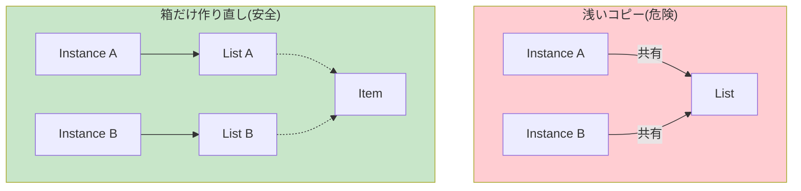

# 第29章：Prototype ④：浅い/深いコピー注意⚠️


## ねらい 🎯✨

Prototype（コピーで量産）は便利だけど、**「コピーしたのに中身がつながってた😱」**が起きやすい！
この章では **浅いコピー（shallow）/ 深いコピー（deep）** を体で理解して、事故らない使い方を身につけるよ🫶💕

---

## 到達目標 🏁🌸

* ✅ 「浅いコピー」と「深いコピー」を、例を出して説明できる
* ✅ `record + with` が **参照型プロパティは共有**しやすい理由がわかる
* ✅ 「安全なコピー戦略」を3パターン言える

  1. 不変（immutable）で浅いコピーでも安全にする
  2. “箱（List/Dictionary）だけ”作り直して共有を断つ
  3. 必要な範囲だけ深いコピーする（やりすぎない）
* ✅ テストで「つながってる事故」を再現し、直せる🧪✨

---

## 手順 🧭🧪✨

### 1) まず「浅いコピー事故」をわざと起こす 😈💥

`record + with` は超便利だけど、**List/Dictionary みたいな参照型は“同じインスタンスを指しがち”**だよ⚠️

```csharp
using System;
using System.Collections.Generic;
using Microsoft.VisualStudio.TestTools.UnitTesting;

public readonly record struct Money(decimal Amount, string Currency);

public sealed record OrderLine(string Sku, int Quantity, Money UnitPrice);

// ⚠️ List と Dictionary は “参照型で可変” だから要注意！
public sealed record OrderTemplate(
    Guid TemplateId,
    string Name,
    List<OrderLine> Lines,
    Dictionary<string, string> Meta
);

[TestClass]
public class PrototypeCopyPitfallsTests
{
    [TestMethod]
    public void With_copy_is_shallow_for_reference_properties()
    {
        var t1 = new OrderTemplate(
            Guid.NewGuid(),
            "Starter",
            new List<OrderLine>
            {
                new("SKU-001", 1, new Money(1200, "JPY")),
            },
            new Dictionary<string, string>
            {
                ["note"] = "gift"
            }
        );

        var t2 = t1 with { Name = "Starter Copy" };

        // ここがポイント：参照が同じ＝つながってる😱
        Assert.IsTrue(ReferenceEquals(t1.Lines, t2.Lines));
        Assert.IsTrue(ReferenceEquals(t1.Meta, t2.Meta));

        // t2だけに追加したつもりが…
        t2.Lines.Add(new OrderLine("SKU-999", 1, new Money(500, "JPY")));
        t2.Meta["note"] = "changed";

        // t1まで変わってる！💀
        Assert.AreEqual(2, t1.Lines.Count);
        Assert.AreEqual("changed", t1.Meta["note"]);
    }
}
```

✅ ここまでで「コピーしたのに元が変わる」感覚が掴めたらOK🙆‍♀️✨

---

### 2) 事故の原因を言葉にする 🧠📝

* `with` は「オブジェクトを複製」するけど
  **参照型プロパティ（List/Dictionary/配列/自作classなど）は参照をコピー**しやすい
* つまり

  * **箱（List）が同じ** → 片方で `Add` すると両方に見える
  * **中身（要素）が可変** → 片方で要素を書き換えると両方に影響




---

### 3) 対策①：不変（immutable）に寄せて「浅いコピーでも安全」にする 🛡️🌟

いちばん強い方針はこれ💪
**中身が変わらないなら、共有してても問題になりにくい**よ✨

* `record`（特に `init`）で「作ったら基本変更しない」設計にする
* コレクションも「変更できない形」に寄せる（後述）

💡学習のコツ：
Prototypeは「コピーの便利さ」よりも、**“コピー後に安全に使える形”**を作るのが本体だよ🧡

---

### 4) 対策②：箱（List/Dictionary）だけ作り直して参照共有を切る ✂️📦

「要素は不変（record）だから共有でもOK、でも箱は別にしたい」ってときはこれが最小で効くよ🙂✨

```csharp
public static class OrderTemplateCopies
{
    public static OrderTemplate CopyForEditing(OrderTemplate source)
        => source with
        {
            Lines = new List<OrderLine>(source.Lines),
            Meta  = new Dictionary<string, string>(source.Meta)
        };
}

[TestClass]
public class PrototypeCopyFixesTests
{
    [TestMethod]
    public void CopyForEditing_breaks_reference_sharing_of_containers()
    {
        var t1 = new OrderTemplate(
            Guid.NewGuid(),
            "Starter",
            new List<OrderLine> { new("SKU-001", 1, new Money(1200, "JPY")) },
            new Dictionary<string, string> { ["note"] = "gift" }
        );

        var t2 = OrderTemplateCopies.CopyForEditing(t1);

        Assert.IsFalse(ReferenceEquals(t1.Lines, t2.Lines));
        Assert.IsFalse(ReferenceEquals(t1.Meta,  t2.Meta));

        t2.Lines.Add(new OrderLine("SKU-999", 1, new Money(500, "JPY")));
        t2.Meta["note"] = "changed";

        Assert.AreEqual(1, t1.Lines.Count);
        Assert.AreEqual("gift", t1.Meta["note"]);
    }
}
```

✅ これで「箱の共有」が切れて、事故がかなり減るよ🎉
ただし注意⚠️：要素が `class` で可変なら、**要素の共有**でまだ事故る可能性あり！

---

### 5) 対策③：必要な範囲だけ “深いコピー” する 🐳🔁

深いコピーは万能に見えるけど、やりすぎると **重い・複雑・壊れやすい**😵‍💫
だから **“業務的に必要な範囲だけ”** 深くするのがコツだよ✨

例：`OrderLine` が可変（class）なら、Linesの中身も複製する…みたいにね👇

```csharp
public sealed class MutableOrderLine
{
    public string Sku { get; set; } = "";
    public int Quantity { get; set; }
}

public sealed record MutableTemplate(List<MutableOrderLine> Lines)
{
    public MutableTemplate DeepCopy()
        => new(new List<MutableOrderLine>(
            Lines.ConvertAll(x => new MutableOrderLine { Sku = x.Sku, Quantity = x.Quantity })
        ));
}
```

ポイント💡

* 「何を共有してよくて」「何を共有しちゃダメか」を決めるのが設計✨
* 深いコピーは **設計判断そのもの**（自動化しにくい）だよ🧠

---

### 6) `MemberwiseClone` の扱い（名前は有名、でも慎重に）⚠️🧯

`MemberwiseClone` は **浅いコピー**だよ（参照は共有）
しかも `protected` だから「クラス内部でしか呼べない」系のやつ🙂

* ✅ 仕組み理解として知るのはOK
* ⚠️ “とりあえず MemberwiseClone” は事故の香りがするので避けがち💦

---

### 7) デバッガで「つながり」を目で見る 👀🔗

Visual Studio のデバッグで、ここを見ると一発で理解できるよ✨

* `ReferenceEquals(t1.Lines, t2.Lines)` を Watch
* `t1.Lines` と `t2.Lines` の中身が同時に変わるか観察
* Dictionaryも同様にチェック🔍

---

### 8) AI補助を使うなら（雛形はOK、判断は人間）🤖🧡

AIに頼むときは、**「どこまで深くコピーするか」**を必ず指定してね⚠️

📝プロンプト例（そのまま使えるよ✨）

* 「`record + with` を使い、List/Dictionaryは新しいインスタンスにしてください」
* 「要素は `record` で不変なので、要素の複製は不要です」
* 「汎用のDeepCloneユーティリティは作らず、この型だけで完結してください」

👀レビュー観点

* 参照型プロパティを `new List<>(...)` / `new Dictionary<>(...)` で切ってる？
* “なんでもDeepCopyする汎用ツール”を生やしてない？（禁止ゾーン🚫）
* テストで「共有してない」を確認してる？

---

## よくある落とし穴 🕳️🐾

* ❌ `with` したから安全だと思い込む（List/Dictionaryで即死😇）
* ❌ 「深いコピー=正義」になって重くなる（性能・複雑度が爆増）
* ❌ `ICloneable` で逃げる（浅いの？深いの？契約が曖昧になりがち）
* ❌ 共有していい範囲を決めずにコピーする（後から地雷💣）
* ⚠️ 注意：このページはWeb検索での追加確認ができない状態のため、仕様が安定している範囲（`record/with`、参照共有の基本原理）に絞って解説しています。最新の推奨や細部は公式ドキュメントも合わせて確認してね🙏📚

---

## 演習（10〜30分）🏃‍♀️💨🧪

### 演習A：事故再現 → 修正

1. 上の「浅いコピー事故」テストを通す（事故を確認）
2. `CopyForEditing` を作って **箱の共有を切る**
3. テストを追加：`ReferenceEquals` が false になることを確認✨

### 演習B：共有していい/ダメを言語化

* 「共有していいもの」3つ書く（例：Money、SKU文字列、固定の設定値）
* 「共有しちゃダメなもの」3つ書く（例：List、Dictionary、状態を持つオブジェクト）

### 演習C：コピー戦略メモ（1行）

* 例：「このTemplateはLines/Metaの箱はコピー、要素は不変だから共有」

---

## 自己チェック ✅💖

* ✅ `with` が参照型プロパティを共有しうる理由を説明できた？
* ✅ 「箱だけコピー」「必要な範囲だけ深いコピー」「不変化」のどれを選んだか言えた？
* ✅ テストで `ReferenceEquals` を使って“つながり”を検証できた？
* ✅ 余計な汎用DeepCloneを作らず、型の責務としてコピーを置けた？

---
