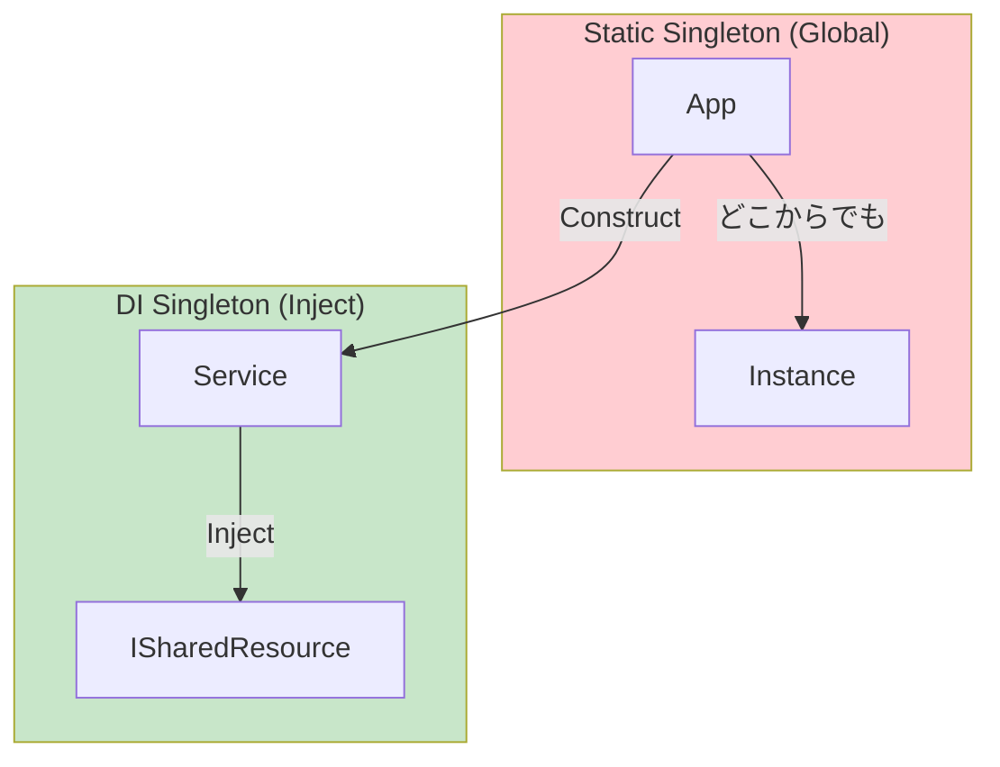

# 第30章：Singleton ①：有名だけど慎重に👑⚠️


## ねらい 🎯

* Singleton が解く“たった1つでいい共有資源”の考え方をつかむ🙂
* **「便利そう！」だけで入れると危ない理由**（テスト・変更・隠れ依存）を言葉にできるようにする🧠⚠️
* **Singleton以外の“もっと安全な選択肢”**（DIのSingletonライフタイム / `IOptions<T>` / 既存の共有インスタンス）を知る✨

---

## 到達目標 ✅

* 「このケースはSingletonにしていい / やめた方がいい」を、**理由つき**で言える🗣️💡
* Singletonの典型的な事故パターン（グローバル状態、隠れ依存、テスト困難）を説明できる🧯
* 「Singletonっぽいもの」を見つけたとき、**まず代替案を検討する順番**が身につく🔁✨

---

## 手順 🧭

### 1) まず、Singletonが“解こうとしている困りごと”を1つだけ決める🧩

Singletonが出てくるのは、だいたいこのどれかです👇

* **重いものを何度も作りたくない**（初期化が高コスト）🐘💦
* **アプリ全体で1つの共有資源にしたい**（キャッシュ、プール、設定、カウンタなど）🧺
* **どこからでもアクセスしたい**（←ここが危険の入り口😵）

ここで大事なのは、最後の「どこからでもアクセスしたい」だけを理由にしないこと！🚫
それは“便利”だけど、あとで泣きやすいです😭




---

### 2) 「本当に“1つ”である必要ある？」をチェックする✅🔍

Singletonにしがちなもの、実はこう分けられます👇

* ✅ **1つでいい（かもしれない）**

  * 変更されない設定（読み取り専用）📌
  * スレッドセーフな共有プール（配列プールとか）📦
  * “共有しても状態が壊れない”サービス（できればステートレス）🧼

* ⚠️ **1つにしない方がいい（事故りやすい）**

  * ユーザーごとの状態、注文処理中の状態🛒😵
  * テストごとに初期化したいもの（乱数、時計、環境）⏰🎲
  * “途中で値が変わる設定”をグローバルに持つもの🧨

---

### 3) まず「既に用意されてる共有インスタンス」を疑う🧠✨

.NET には、最初から“共有でOKなやつ”がいます🙌
自分でSingletonを作る前に、まずこれを探すのが安全です🔎💕

* `Random.Shared` 🎲
* `ArrayPool<T>.Shared` 📦
* `MemoryCache`（用途次第でDI管理が自然）🧠

「標準があるなら標準を使う」が強いです💪✨

---

### 4) 次に「DIのSingletonライフタイム」で済まないか考える🔌🧩

Singletonの“1個だけ”って、**実はDIコンテナの得意分野**です🙂
しかも、DIにすると嬉しいことが多い！🎉

* 依存が見える（隠れ依存が減る）👀
* テストで差し替えやすい🧪✨
* “どこからでもアクセス”をやめて、呼び出し関係が健康になる🌿

---

### 5) 設定は `IOptions<T>` を優先して考える📌✨

「設定をどこでも参照したい」→ Singleton にしがちだけど…
設定は `IOptions<T>`（Optionsパターン）で扱うのが定番です🙂💕

* 依存が明示される（欲しいクラスだけが持つ）✅
* テストで簡単に差し替えできる✅
* 変な“設定グローバル書き換え”が起きにくい✅

---

## よくある落とし穴 🕳️😵

### 落とし穴1：Singletonが“グローバル変数”になる🧨

`Singleton.Instance.X = ...` みたいに状態を持ち始めると、
どこが原因で壊れたか追跡がつらいです😭🔍

### 落とし穴2：隠れ依存が増えて、読み手が迷子になる🗺️💦

引数に出てこないのに内部で `Singleton.Instance` を読んでると、
「このクラス、何に依存してるの…？」ってなります😵

### 落とし穴3：テストがしんどい🧪⚠️

テストの順番で結果が変わる、初期化が残る、状態が漏れる…
“たまたま通る”が増えます😇💥

### 落とし穴4：マルチスレッドで事故る🧵💣

「1回だけ作る」が雑だと、同時に2回作られたり、状態が壊れたりします😱
（だから次章で `Lazy<T>` をちゃんとやるよ🛡️🐢）

---

## 演習 🧪🌸（30〜60分）

今回の演習は「Singletonにしたくなる気持ち」を**安全な形に直す**練習だよ🙂✨
題材は“注文番号の発行”にしよう🛒🔢（ありがちなやつ！）

### 演習A：危ないSingleton案を作って、問題点を言語化する😈➡️📝

1. まず “ありがちな” Singleton を書いてみる（あえて！）👇

```csharp
using System.Threading;

public sealed class OrderNumberGenerator
{
    public static OrderNumberGenerator Instance { get; } = new OrderNumberGenerator();

    private long _current = 1000;

    private OrderNumberGenerator() { }

    public long Next() => Interlocked.Increment(ref _current);
}
```

2. そして、次の質問に答えてメモする📝

* これ、**どのクラスからでも呼べちゃう**けど、依存が見える？👀
* テストで「初期値1000に戻す」にはどうする？😵
* 将来「注文番号の採番ルールが変わった」ら、差し替えは楽？🔁

---

### 演習B：DIで“1個だけ”にして、依存を見える化する🔌✨

1. `IOrderNumberGenerator` を作る（学習用の小さいI/FはOK🙆‍♀️）

```csharp
public interface IOrderNumberGenerator
{
    long Next();
}
```

2. 実装はふつうのクラスにする（Singletonは作らない！）🙂

```csharp
using System.Threading;

public sealed class SequentialOrderNumberGenerator : IOrderNumberGenerator
{
    private long _current = 1000;

    public long Next() => Interlocked.Increment(ref _current);
}
```

3. DI登録で「アプリ内で1個だけ」を実現する✅

```csharp
using Microsoft.Extensions.DependencyInjection;

var services = new ServiceCollection();

services.AddSingleton<IOrderNumberGenerator, SequentialOrderNumberGenerator>();

var provider = services.BuildServiceProvider();
var generator = provider.GetRequiredService<IOrderNumberGenerator>();

Console.WriteLine(generator.Next());
```

4. 注文サービスは **引数でもらう**（依存が見える✨）

```csharp
public sealed class OrderService
{
    private readonly IOrderNumberGenerator _generator;

    public OrderService(IOrderNumberGenerator generator)
    {
        _generator = generator;
    }

    public long CreateOrderNumber() => _generator.Next();
}
```

---

### 演習C：テストで差し替えできるのを体験する🧪💕

テストでは“本物の採番”じゃなくて、固定値でOKなことが多いよ🙂
（これがSingleton直書きだとやりにくいの！）

```csharp
public sealed class FakeOrderNumberGenerator : IOrderNumberGenerator
{
    public long Next() => 12345;
}
```

* `OrderService` に `FakeOrderNumberGenerator` を渡して、期待値が固定で検証できるか✅
* 「差し替えが楽＝テストが楽」を体感してね🎉

---

## 自己チェック ✅🧡

* 「どこからでもアクセスしたい」だけを理由にSingletonを選んでない？🚫🙂
* “1つでいい”は **DIのSingleton** で済むケースじゃない？🔌✨
* 設定は Singleton じゃなく **`IOptions<T>` 的な持たせ方**を考えた？📌
* Singletonにしたら、テストで困る未来が見える？🧪⚠️
* 「状態を持つSingleton」が危ない理由を、1分で説明できる？⏱️🗣️

---
