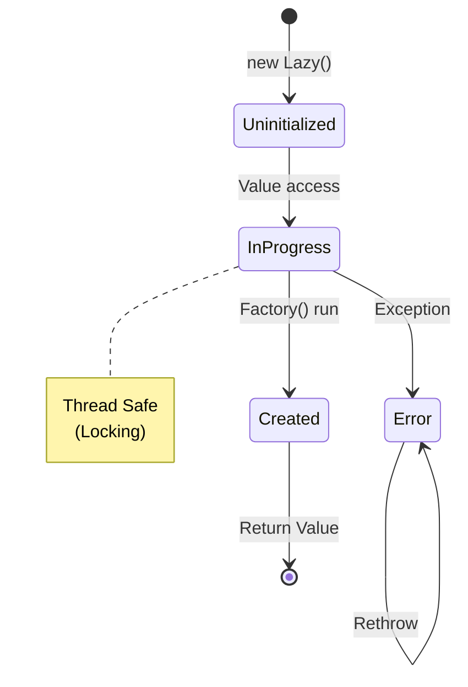

# 第31章：Singleton ②：.NET流（Lazy<T>）で安全に🛡️🐢


## ねらい 🎯

* **Singletonを“安全に・最小で”作る**ために、.NET標準の **Lazy<T>** を使えるようになる🙂
* 「とりあえずSingleton！」を卒業して、**使うべき場面/やめるべき場面**を見分ける目をつくる👀✨
* **スレッド安全**・**初期化の重さ**・**例外やDispose**まで、落とし穴を先に踏まないようにする⚠️🧯
* ※最新の推奨は変わることがあるので、**公式ドキュメント/リリースノートも確認する習慣**をつけよう📚🔍

---

## 到達目標 ✅

* **Lazy<T>で“遅延初期化のSingleton”**を1つ作れる🛠️
* **LazyThreadSafetyMode**の意味をざっくり説明できる（「基本はデフォルトでOK」まで言える）🧠
* 「これはSingletonじゃなくて **DIのAddSingleton** や **IOptions** の方が自然だな」を判断できる🙂👍
* **並列アクセスでも1回だけ生成**されることを、テストで確認できる🧪✨

---

## 手順 🧭✨

### 1) まず“4つの動詞”で覚える🧩📝

Singletonにしていいか”3問チェック🧩

次の3つが **ぜんぶYES** なら候補だよ🙂

* **共有してOK？**（状態を持たず、持っても不変/スレッド安全）🧊
* **生成が重い？**（初期化が高コスト、遅延したい）🐘
* **アプリ全体で1つで十分？**（複数あると困る、またはムダ）1️⃣

1つでも怪しいなら、まずはこれを疑おう👇

* **DIのAddSingleton**で“アプリ内1つ”にする（テストもしやすい）🧩
* 設定は **IOptions** 系に寄せる（“グローバル設定”をstaticで抱えない）⚙️

---

### 2) Lazy<T>の基本をつかむ（最小でOK）🐢

**Lazy<T>** は「必要になった瞬間に作る」＋「（基本）スレッド安全」をセットで提供してくれる標準クラスだよ🛡️✨

* いちばん大事：**“初回アクセス時に一回だけ作る”**が簡単にできる🎉
* デフォルトで **スレッド安全**（並列でも安全に“1回だけ”初期化しやすい）👭👫🧑‍🤝‍🧑
* 初期化関数が失敗すると、**同じ例外が再スロー**される（落とし穴で後述）💥




---

### 3) “教科書どおり”のLazy Singleton（sealed + private ctor）📦

「プロセス内で1つだけのインスタンス」を **.NET流に安全**に作る定番形👇

```csharp
using System;
using System.Threading;

public sealed class AppClock
{
    private AppClock() { } // 外から new できない🙂

    // Lazy<T> に「作り方」を渡す
    private static readonly Lazy<AppClock> _instance =
        new(() => new AppClock(), LazyThreadSafetyMode.ExecutionAndPublication);

    public static AppClock Instance => _instance.Value;

    public DateTimeOffset UtcNow => DateTimeOffset.UtcNow;
}
```

ポイント📝✨

* **sealed**：継承されると“増殖”しやすいので、基本は止める🧱
* **private ctor**：外から作れないようにする🔒
* **Instance => _instance.Value**：初回アクセス時にだけ生成される🐢
* **LazyThreadSafetyMode.ExecutionAndPublication**：基本はこれ（デフォルト相当）でOK🙂👍

---

### 4) “クラスを作らず”にLazyを活かす（標準型で体感）🧵✨

Singletonを作りたいというより、**「重い初期化を遅らせたい」**だけのことが多いよ🙂
その場合は、**標準型をLazyで包む**のがいちばん素直✨

例：正規表現（RegexOptions.Compiled）を必要になるまで作らない🧸🔍

```csharp
using System;
using System.Text.RegularExpressions;

public static class CouponRules
{
    private static readonly Lazy<Regex> _couponRegex =
        new(() => new Regex(@"^[A-Z]{3}-\d{4}$", RegexOptions.Compiled));

    public static bool IsValidCoupon(string input)
        => _couponRegex.Value.IsMatch(input ?? "");
}
```

「Singleton用の自作クラス」を増やさずに、**“遅延＆共有”**を実現できるのが気持ちいいところ🎁✨

---

### 0) ゴールの完成イメージを先に見る 👀🎉


並列でValueを叩いても、**コンストラクタが1回だけ**呼ばれることを確認しよう🙂

```csharp
using System.Linq;
using System.Threading;
using System.Threading.Tasks;
using Microsoft.VisualStudio.TestTools.UnitTesting;

[TestClass]
public class LazyTests
{
    private sealed class Expensive
    {
        private static int _ctorCount;
        public Expensive() => Interlocked.Increment(ref _ctorCount);

        public static int CtorCount => _ctorCount;
        public static void Reset() => _ctorCount = 0;
    }

    [TestMethod]
    public async Task Lazy_initializes_only_once_under_parallel_access()
    {
        Expensive.Reset();

        var lazy = new Lazy<Expensive>(() => new Expensive());

        var tasks = Enumerable.Range(0, 50)
            .Select(_ => Task.Run(() => lazy.Value))
            .ToArray();

        await Task.WhenAll(tasks);

        Assert.AreEqual(1, Expensive.CtorCount);
    }
}
```

これが通ると「安全に“1つ”が作れてる！」って自信がつくよ🎉🐢

---

### 6) 例外の挙動を知っておく（地味に重要）💥🧠

Lazyの初期化関数が例外を投げると、**以後も同じ例外を再スロー**するのが基本だよ⚠️
「次に呼べば直るかも」が起きにくいので、設計として知っておこう🙂

```csharp
using System;
using Microsoft.VisualStudio.TestTools.UnitTesting;

[TestClass]
public class LazyExceptionTests
{
    [TestMethod]
    public void Lazy_caches_exception_by_default()
    {
        int called = 0;

        var lazy = new Lazy<int>(() =>
        {
            called++;
            throw new InvalidOperationException("boom");
        });

        Assert.ThrowsException<InvalidOperationException>(() => _ = lazy.Value);
        Assert.ThrowsException<InvalidOperationException>(() => _ = lazy.Value);

        Assert.AreEqual(1, called); // 初期化は再実行されない🙂
    }
}
```

---

### 7) “Singletonっぽい要件”でもDIのAddSingletonが自然な場面🧩✨


実務だと、static Singletonより **DI登録でSingleton** の方がラクなことが多いよ🙂
（依存が見える・テストしやすい・Disposeも管理しやすい）

```csharp
using System;
using Microsoft.Extensions.DependencyInjection;

public sealed class PriceCalculator
{
    public decimal Calc(decimal price) => price * 1.10m; // 例：税込み🙂
}

public static class Program
{
    public static void Main()
    {
        var services = new ServiceCollection();

        services.AddSingleton<PriceCalculator>(); // “アプリで1つ”を宣言🧩
        using var provider = services.BuildServiceProvider();

        var a = provider.GetRequiredService<PriceCalculator>();
        var b = provider.GetRequiredService<PriceCalculator>();

        Console.WriteLine(object.ReferenceEquals(a, b)); // True ✅
    }
}
```

---

## 落とし穴 ⚠️😵

* **“共有してはいけない状態”を持たせる**
  例：ユーザーごとの値、リクエストごとの値、可変のコレクションなどを抱えると事故りやすい💥
* **隠れ依存が増える（Instanceをどこでも呼べる）**
  「いつの間にかどこでも触ってる」→テストがつらくなる🥲
* **IDisposableをSingletonにすると後始末が難しい**
  できればDIに寄せて、コンテナにDisposeを任せる方が安全🧹✨
* **初期化時に別のLazyを呼んでデッドロック/循環**
  “初期化中に別の初期化”を呼び合う設計は危険⚠️🌀
* **例外がキャッシュされる**
  「一回失敗したらずっと失敗」になり得るので、初期化は堅牢に💪
* **“非同期初期化”を雑に混ぜる**
  どうしても必要なら **Lazy<Task<T>>** などにするけど、責務と例外扱いが難しくなる😵‍💫
  まずは「同期で用意できるものだけSingleton候補」にするのが安全🙂

---

## 演習 🧪🎀

### 演習A：RegexをLazy化して“必要になるまで作らない”🔍🐢

1. クーポン形式を1つ決める（例：AAA-1234）🎫
2. **RegexOptions.Compiled** のRegexを **Lazy<Regex>** で包む
3. テストで、正しい/間違い入力を確認する✅❌

おまけ🌟

* AI補助を使うなら「テストケース案を10個出して」って頼むと便利だよ🤖✨
  （でも採用するかは自分でチェックね🙂）

---

### 演習B：並列アクセスで“生成1回”をテストする🏃‍♀️🏃‍♂️💨

1. コンストラクタで **Interlocked.Increment** して回数を数える
2. Taskをいっぱい投げて **lazy.Value** を同時に呼ぶ
3. 生成回数が **1** になっていることをAssert✅

---

### 演習C：“Singletonにしない判断”を書いてみる📝✨

次のどっちが自然か、理由を1行で書こう🙂

* 税率の計算ロジック → （Lazy Singleton？ / DI AddSingleton？）
* appsettingsの設定値 → （static Singleton？ / IOptions？）
* Http通信 → （static HttpClient？ / IHttpClientFactory？）

---

## チェック ✅🔎

* Lazy<T>で **遅延初期化＋共有** ができた🙂🐢
* 並列アクセスでも **1回だけ生成** をテストで確認できた🧪✨
* 「状態を持つものはSingletonにしない」を言葉で言える🧊🚫
* static Singletonより **DIのAddSingletonが向く場面**を説明できる🧩
* 例外キャッシュ・Dispose・循環初期化の危険を知っている⚠️🧯
