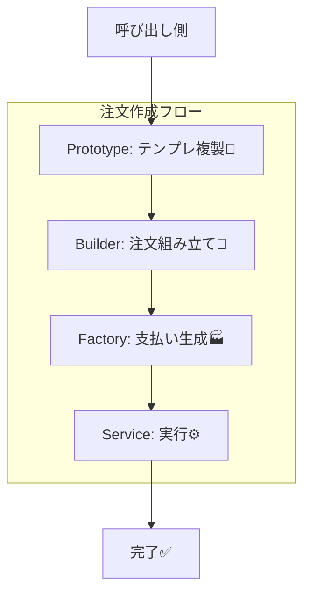

# 第32章：生成まとめミニ演習：Factory＋Builder＋Prototypeで「注文作成」完成🎉

## ねらい 🎯✨

* 「注文作成」を題材にして、生成パターン3兄弟（Factory / Builder / Prototype）を**ひとつの流れ**として体験するよ〜😊🌸
* 「new が散らばる」「分岐が増える」「初期化が複雑」「テストで差し替えにくい」…この辺をまとめて片付ける感覚をつかむよ🧹🫧
* .NETの定番発想（Builder＝StringBuilder/UriBuilder、Prototype＝record+with、Factory＝生成の押し出し）に寄せて学ぶよ💡✨

---

## 到達目標 ✅🌟

この章が終わったら、次ができるようになるよ😊🫶

* 「注文テンプレ」を**Prototype（record + with）**で複製して、用途別にサクッと派生できる🧬✨
* 「注文の組み立て」を**Builder**で段階的に安全に作れる🧱🙂
* 「支払い方法の生成」を**Factory**に押し出して、呼び出し側の分岐を減らせる🏭✨
* 3つを合体して「注文作成フロー」を完成させ、**テストで壊れない**のを確認できる🧪🌸

---

## 手順 🧭🛠️

### 0) ゴールの完成イメージを先に見る 👀🎉


この章の最終形は、だいたいこんな流れだよ👇✨

1. Prototypeで「基本テンプレ」を複製（用途に応じて少しだけ変更）🧬
2. Builderで「注文」を段階的に組み立てる🧱
3. Factoryで「支払い手段」を作る🏭
4. それらを「注文作成サービス」でつなげる🔗




---

### 1) Prototype：注文テンプレを record + with で複製する 🧬✨

Prototypeは「**同じ初期状態をコピーして量産**」したい時に便利だよ😊
C#では record と with がめちゃ相性いい👍✨

ポイントはこれ👇

* テンプレ側は **できるだけ不変（immutable）** に寄せる
* with は「シャローコピー」なので、可変コレクションを持たせると事故りやすい⚠️（後で落とし穴で説明するね）

例：テンプレを作るよ🧾✨

```csharp
public readonly record struct Money(decimal Amount, string Currency);

public enum ShippingSpeed
{
    Normal,
    Express
}

public sealed record OrderTemplate(
    string Currency,
    Money DefaultShippingFee,
    ShippingSpeed DefaultShippingSpeed,
    string DefaultCountry
);
```

テンプレの複製（Prototype）はこちら👇🧬✨

```csharp
var baseTemplate = new OrderTemplate(
    Currency: "JPY",
    DefaultShippingFee: new Money(500m, "JPY"),
    DefaultShippingSpeed: ShippingSpeed.Normal,
    DefaultCountry: "JP"
);

// 速達テンプレを “複製して差分だけ変更”
var expressTemplate = baseTemplate with
{
    DefaultShippingFee = new Money(1200m, "JPY"),
    DefaultShippingSpeed = ShippingSpeed.Express
};
```

「テンプレから派生テンプレを作る」って、地味に便利だよ〜😊🌸
キャンペーン、地域別、VIP向け…みたいに増えても怖くなりにくい🎁✨

---

### 2) Builder：注文を段階的に組み立てる 🧱🙂

Builderは「引数が多い」「途中までしか決まってない」「最後にまとめて検証したい」時に強いよ💪✨

ここでは “注文を組み立てる” ために、**OrderBuilder** を作るよ🛒🧱
（汎用フレームワークじゃなくて、ドメインに寄せた最小BuilderだからOK🙆‍♀️）

まずは最小のドメインを置くよ👇🍰

```csharp
public enum PaymentKind
{
    CreditCard,
    BankTransfer
}

public enum PaymentStatus
{
    NotPaid,
    Paid,
    Failed
}

public sealed record OrderLine(
    string Sku,
    int Quantity,
    Money UnitPrice
);

public sealed record Order(
    Guid OrderId,
    string Country,
    ShippingSpeed ShippingSpeed,
    Money ShippingFee,
    IReadOnlyList<OrderLine> Lines,
    PaymentKind PaymentKind,
    PaymentStatus PaymentStatus
)
{
    public Money Total =>
        new Money(Lines.Sum(x => x.UnitPrice.Amount * x.Quantity) + ShippingFee.Amount, ShippingFee.Currency);
}
```

次に Builder 本体だよ🧱✨
「テンプレから開始」「AddLineで追加」「最後にBuildで検証＆完成」って流れにするよ😊

```csharp
public sealed class OrderBuilder
{
    private Guid _orderId = Guid.NewGuid();
    private string? _country;
    private ShippingSpeed? _shippingSpeed;
    private Money? _shippingFee;
    private readonly List<OrderLine> _lines = new();
    private PaymentKind? _paymentKind;

    private OrderBuilder() { }

    public static OrderBuilder FromTemplate(OrderTemplate template)
    {
        return new OrderBuilder()
            .SetCountry(template.DefaultCountry)
            .SetShipping(template.DefaultShippingSpeed, template.DefaultShippingFee);
    }

    public OrderBuilder SetOrderId(Guid orderId)
    {
        _orderId = orderId;
        return this;
    }

    public OrderBuilder SetCountry(string country)
    {
        _country = country;
        return this;
    }

    public OrderBuilder SetShipping(ShippingSpeed speed, Money fee)
    {
        _shippingSpeed = speed;
        _shippingFee = fee;
        return this;
    }

    public OrderBuilder AddLine(string sku, int quantity, Money unitPrice)
    {
        _lines.Add(new OrderLine(sku, quantity, unitPrice));
        return this;
    }

    public OrderBuilder SetPayment(PaymentKind kind)
    {
        _paymentKind = kind;
        return this;
    }

    public Order Build()
    {
        // ✅ 最後にまとめて検証（ここがBuilderの気持ちよさ）
        if (string.IsNullOrWhiteSpace(_country))
            throw new InvalidOperationException("Country is required.");

        if (_shippingSpeed is null || _shippingFee is null)
            throw new InvalidOperationException("Shipping is required.");

        if (_paymentKind is null)
            throw new InvalidOperationException("PaymentKind is required.");

        if (_lines.Count == 0)
            throw new InvalidOperationException("At least one order line is required.");

        // 例：金額の通貨が混ざってないか軽くチェック
        if (_lines.Any(x => x.UnitPrice.Currency != _shippingFee.Value.Currency))
            throw new InvalidOperationException("Currency mismatch.");

        return new Order(
            OrderId: _orderId,
            Country: _country!,
            ShippingSpeed: _shippingSpeed.Value,
            ShippingFee: _shippingFee.Value,
            Lines: _lines.ToArray(),
            PaymentKind: _paymentKind.Value,
            PaymentStatus: PaymentStatus.NotPaid
        );
    }
}
```

🌸ここで大事な感覚🌸

* 呼び出し側は「順番に積み上げるだけ」
* 検証は「最後に一回」
* コンストラクタ地獄（引数10個…😵‍💫）になりにくい

---

### 3) Factory：支払い手段の生成を押し出す 🏭💳

次は Factory だよ😊✨
「支払い方法を増やすたびに、呼び出し側のswitchが増える…😇」を止めるやつ！

まずは支払いの契約（インターフェース）👇

```csharp
public sealed record PaymentResult(bool Success, string? Message = null);

public interface IPaymentMethod
{
    PaymentKind Kind { get; }
    Task<PaymentResult> PayAsync(Order order, CancellationToken ct = default);
}
```

実装（例：カード/振込）👇💳🏦
※ここは学習用に “処理は薄く” でOKだよ🙂

```csharp
public sealed class CreditCardPayment : IPaymentMethod
{
    public PaymentKind Kind => PaymentKind.CreditCard;

    public Task<PaymentResult> PayAsync(Order order, CancellationToken ct = default)
        => Task.FromResult(new PaymentResult(true, "Paid by credit card"));
}

public sealed class BankTransferPayment : IPaymentMethod
{
    public PaymentKind Kind => PaymentKind.BankTransfer;

    public Task<PaymentResult> PayAsync(Order order, CancellationToken ct = default)
        => Task.FromResult(new PaymentResult(true, "Paid by bank transfer"));
}
```

Factory本体は「分岐をここに閉じ込める」🏭✨
呼び出し側は “kindを渡すだけ” にするよ😊

```csharp
public sealed class PaymentMethodFactory
{
    private readonly IReadOnlyDictionary<PaymentKind, IPaymentMethod> _map;

    public PaymentMethodFactory(IEnumerable<IPaymentMethod> methods)
    {
        // 追加されてもここで自動的に拾える形にするのが気持ちいい😆✨
        _map = methods.ToDictionary(x => x.Kind, x => x);
    }

    public IPaymentMethod Create(PaymentKind kind)
    {
        if (_map.TryGetValue(kind, out var method))
            return method;

        throw new NotSupportedException($"Unsupported payment kind: {kind}");
    }
}
```

これ、地味に “増やしやすさ” が強いよ〜😊🌸
支払い追加の時、呼び出し側を触らずに済む確率が上がる✨

---

### 4) 3つを合体：注文作成サービスを作る 🔗🎉

ここがこの章のメインイベント〜！🎆😆

* Prototype：テンプレを複製して使う
* Builder：注文を作る
* Factory：支払い手段を作る

を一箇所でつなぐよ🛒🏭🧱🧬

```csharp
public sealed class OrderCreationService
{
    private readonly PaymentMethodFactory _paymentFactory;

    public OrderCreationService(PaymentMethodFactory paymentFactory)
    {
        _paymentFactory = paymentFactory;
    }

    public async Task<Order> CreateAsync(
        OrderTemplate template,
        Action<OrderBuilder> build,
        PaymentKind paymentKind,
        CancellationToken ct = default)
    {
        // 🧬 Prototype：テンプレは呼び出し側が “with” で派生させて渡してくる想定
        // 🧱 Builder：テンプレからBuilder開始
        var builder = OrderBuilder.FromTemplate(template)
            .SetPayment(paymentKind);

        build(builder); // 呼び出し側の組み立て手順だけを注入

        var order = builder.Build();

        // 🏭 Factory：支払い手段の生成
        var payment = _paymentFactory.Create(paymentKind);

        // 支払い実行（学習用なので軽く）
        var result = await payment.PayAsync(order, ct);

        return order with
        {
            PaymentStatus = result.Success ? PaymentStatus.Paid : PaymentStatus.Failed
        };
    }
}
```

ここでの “気持ちよさ” ポイント😍✨

* 呼び出し側は「テンプレ選ぶ」「Builderで積む」「支払い種類渡す」だけ
* 生成のごちゃごちゃ（複雑初期化・分岐・差し替え）は中に吸い込めた👏✨

---

### 5) DIで組み立てる（標準の形で）🧩🔌

Microsoft.Extensions.DependencyInjection の “いつもの形” でやるよ😊✨
Factoryが IEnumerable を受け取る構造と相性いい👍

```csharp
using Microsoft.Extensions.DependencyInjection;

var services = new ServiceCollection();

// 支払い実装を登録（増えてもOK）
services.AddSingleton<IPaymentMethod, CreditCardPayment>();
services.AddSingleton<IPaymentMethod, BankTransferPayment>();

services.AddSingleton<PaymentMethodFactory>();
services.AddSingleton<OrderCreationService>();

var provider = services.BuildServiceProvider();

var app = provider.GetRequiredService<OrderCreationService>();
```

---

### 6) MSTestで「壊れてない」を確認する 🧪🌸

ここは “成功体験” 大事だよ〜😊✨
最低限これだけ通そう👇

```csharp
using Microsoft.VisualStudio.TestTools.UnitTesting;

[TestClass]
public class Chapter32Tests
{
    [TestMethod]
    public async Task CreateAsync_pays_and_marks_paid()
    {
        // 🧬 Prototype
        var baseTemplate = new OrderTemplate(
            Currency: "JPY",
            DefaultShippingFee: new Money(500m, "JPY"),
            DefaultShippingSpeed: ShippingSpeed.Normal,
            DefaultCountry: "JP"
        );

        var expressTemplate = baseTemplate with
        {
            DefaultShippingFee = new Money(1200m, "JPY"),
            DefaultShippingSpeed = ShippingSpeed.Express
        };

        // 🏭 Factory準備（DIなしの最小で）
        var factory = new PaymentMethodFactory(new IPaymentMethod[]
        {
            new CreditCardPayment(),
            new BankTransferPayment()
        });

        var service = new OrderCreationService(factory);

        // 🧱 Builder操作は Action で注入
        var order = await service.CreateAsync(
            template: expressTemplate,
            build: b =>
            {
                b.AddLine("SKU-001", 2, new Money(300m, "JPY"));
                b.AddLine("SKU-XYZ", 1, new Money(1000m, "JPY"));
            },
            paymentKind: PaymentKind.CreditCard
        );

        Assert.AreEqual(PaymentStatus.Paid, order.PaymentStatus);
        Assert.AreEqual(ShippingSpeed.Express, order.ShippingSpeed);
        Assert.AreEqual(1200m, order.ShippingFee.Amount);
        Assert.AreEqual(2, order.Lines.Count);
    }

    [TestMethod]
    public void Builder_requires_lines()
    {
        var template = new OrderTemplate("JPY", new Money(500m, "JPY"), ShippingSpeed.Normal, "JP");

        var builder = OrderBuilder.FromTemplate(template)
            .SetPayment(PaymentKind.BankTransfer);

        Assert.ThrowsException<InvalidOperationException>(() => builder.Build());
    }
}
```

---

## よくある落とし穴 ⚠️😵‍💫

* **Prototypeに可変Listを持たせて地獄** 😇

  * with はシャローコピーだよ〜
  * テンプレは「不変寄せ」が安全🧊✨（record + IReadOnly〜 が相性いい）

* **Builderが何でも屋（God Builder）になる** 🧱💥

  * Builderは「組み立て」だけ！
  * 割引計算・在庫引当みたいな業務ルールを混ぜないでね🙅‍♀️💦

* **Factoryが巨大switch博物館になる** 🏭🗿

  * 今回みたいに「登録した実装から辞書化」だと膨らみにくいよ😊✨
  * 追加は “実装を増やすだけ” に寄せよう🎈

* **“パターンっぽい名前” が目的化** 😵

  * 目的は「変更が怖くない」「テストしやすい」だよ〜🧪🌸

---

## 演習 🎓💪✨

次のうち、好きなのを1つでOKだよ😊🌷

1. **支払い方法を1つ追加** ➕💳

* PaymentKind に “PayPay” みたいなのを1個足す（名前は自由🎀）
* IPaymentMethod 実装を足して、Factoryが自動で拾えるのを確認✨

2. **テンプレを3種類作る** 🧬🧬🧬

* 通常・速達・海外向け、みたいに with で派生してみてね🌏✈️
* テストで「テンプレが汚れてない」も確認すると最高👍🧪

3. **Builderに“クーポン”を追加** 🎫✨

* ただし、割引計算は “Order” や “サービス側” に寄せてもOK
* Builderは「入力を集める」中心にして、肥大化させない🙂🧱

---

## 自己チェック ✅🔍✨

* Prototype：with で派生テンプレを作れて、元テンプレが汚れてない🧬✅
* Builder：Buildでまとめて検証できて、コンストラクタ地獄を避けられてる🧱✅
* Factory：呼び出し側に分岐が散ってなくて、追加がラク🏭✅
* 合体：注文作成フローが1本の流れで読めて、テストで守れてる🛒🧪✅
