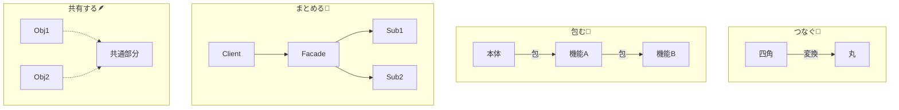

# 第33章：構造の基本：つなぐ/包む/まとめる/共有する🧩

## ねらい🎯

* 既存コードをなるべく壊さずに、機能追加や差し替えをできるようになる🙂🔧
* 構造パターンを「4つの動詞」で分類して、迷子にならない軸を作る🧭✨
* これから出てくる Adapter / Decorator / Facade / Flyweight を“ひとことで見分ける”土台を作る👀💡

---

## 到達目標✅

* Adapter / Decorator / Facade / Flyweight をそれぞれ **一言で説明**できる🗣️✨
* ある設計変更を見たときに「これは *つなぐ*？ *包む*？ *まとめる*？ *共有する*？」で判断できる🧠🧩
* .NETの身近な例（特に Stream まわり）で「どれがどれっぽいか」線を引ける✍️📚

---

## 手順👣✨

### 1) まず“4つの動詞”で覚える🧩📝


構造パターンは、だいたいこの4つに整理すると超ラクです☺️🌸

* **つなぐ（Adapter）🔌**
  型やインターフェースのズレを“変換”して、使う側を変えずに接続する
* **包む（Decorator）🎁**
  元の振る舞いはそのままに、機能を“後付け”する（組み合わせやすい）
* **まとめる（Facade）🚪**
  いろいろ複雑なものを、使う側には“入口ひとつ”にして簡単に見せる
* **共有する（Flyweight）🪶**
  大量に作られる似たデータを“使い回し”して、メモリやGC負荷を減らす

ここがこの章のコアです💖
以降は、全部この4語に戻ってOK🙆‍♀️✨




---

### 2) 「壊さない」って具体的に何？🧨→🛡️

“壊さない”は、ふんわり言うと優しそうだけど、実務では超具体です🙂🧾

最低限これを守るイメージ👇

* **公開APIを変えない**（呼び出し側のコードを変えずに済む）📌
* **テストが落ちない**（ふるまい互換を保つ）🧪
* **契約を守る**（例外・戻り値・null・`IDisposable` の扱い）🤝♻️

構造パターンは、この「壊さない」をやりやすくする道具箱です🧰✨

---

### 3) ひとことで見分ける“判定ワード”を持つ🧠💡

迷ったらこの質問で判定します👇（超よく効くやつ！）

* **「型が合わない…でも呼び出し側は変えたくない」** → Adapter 🔌
* **「前後にログ/計測/リトライ/圧縮とか足したい」** → Decorator 🎁
* **「利用者に“簡単な入口”だけ渡したい」** → Facade 🚪
* **「同じようなデータが大量で重い…」** → Flyweight 🪶

この“困りごと→一発変換”を体に入れると強いです💪✨

---

### 4) .NETで一気に体感：Streamまわりは宝庫💎💧

Stream周辺って、構造パターンの展示場みたいになってます😳✨
「つなぐ」「包む」が特に分かりやすい！

例：ファイルを開いて → バッファして → 圧縮を解いて → 文字として読む

```
using System.IO;
using System.IO.Compression;
using System.Text;

using var file = File.OpenRead("orders.txt.gz");      // 入口は File（これ自体も“まとめる”感あり🚪）
using var buffered = new BufferedStream(file);         // Decorator 🎁（Streamを包んで効率UP）
using var gzip = new GZipStream(buffered, CompressionMode.Decompress); // Decorator 🎁
using var reader = new StreamReader(gzip, Encoding.UTF8); // Adapter 🔌（Stream → TextReaderへ“つなぐ”）

var text = reader.ReadToEnd();
```

見分けポイント👀✨

* `BufferedStream` / `GZipStream` は **Stream を包んで機能を足す** → Decorator 🎁
* `StreamReader` は **Stream を文字読み取りに“つなぐ”** → Adapter 🔌

---

### 5) Facadeは「入口をシンプルにする」🚪🙂

“まとめる”は「利用者の手数を減らす」って感じです🌸
例えば、ファイルを読むだけならこれで終わります👇

```
var text = File.ReadAllText("orders.txt");
```

内部では、ストリームを開いて、エンコードを扱って、例外も考えて…と色々やってますが、利用者は気にしなくてOK🙆‍♀️✨
この「入口だけ渡す」発想が Facade 🚪

---

### 6) Flyweightは「共有して軽くする」🪶📦

Flyweightは“見た目が地味”だけど、効くときはめっちゃ効きます😆🔥
C#/.NETだと「使い回し」系の発想が近いです。

代表イメージ👇

* **文字列の共有（同じ文字が大量に出る）** 🧵
* **配列の貸し借り（大量の一時バッファでGCが重い）** 📦♻️（例：`ArrayPool<T>`）

超ミニ例（“配列を使い回す”感だけ掴む）👇

```
using System.Buffers;

var pool = ArrayPool<byte>.Shared;
byte[] buffer = pool.Rent(4096);

try
{
    // buffer を一時作業に使う（読み取り/変換など）
}
finally
{
    pool.Return(buffer);
}
```

ポイント💡

* “毎回 new で作る”を減らして、**共有して軽くする** → Flyweight 🪶

---

### 7) ここでAI補助を使うなら（やりすぎ防止付き）🤖🧠

Copilot等に頼むときは、**「分類して説明」**が相性いいです🙂✨
例：こんな依頼が安全でおすすめ👇

* 「このコードの依存関係を壊さず拡張したい。Adapter/Decorator/Facade/Flyweightのどれが近いか、理由を“困りごと”から説明して」
* 「Streamの組み合わせ例を見せて。どれがDecoratorでどれがAdapterかコメントで明示して」
* 「クラスを増やしすぎない制約で、最小の形だけ提案して」✅

“フレームワークっぽい共通基盤を作り始めたら”だいたい危険信号です🚨😵

---

## 落とし穴⚠️😵

* **全部Decoratorで解こうとする** 🎁🎁🎁
  → 便利だけど、積み重なると「何が本体？」ってなる😇
* **Adapterが変換しすぎて“別ドメイン”になる** 🔌🌪️
  → 変換層に業務ルールを混ぜると事故りやすい💥
* **FacadeがGod Object化する** 🚪👹
  → “便利窓口”のつもりが、何でも屋になって肥大化…
* **Flyweightを早く入れすぎる** 🪶💦
  → 最適化はタイミング命！まずは計測・ボトルネック確認が先🧪📈

---

## 演習🧪✍️（10〜30分）

### 演習1：Streamで「どれがどれ？」線を引く💧🧵

次のチェーンを紙かメモに書いて、各要素にラベルを付けてね🙂📝

* `File.OpenRead`
* `BufferedStream`
* `GZipStream`（あれば）
* `StreamReader`

やること👇

* 「つなぐ/包む/まとめる/共有する」のどれかを付ける
* “なぜそう思ったか”を一言で添える（これ大事！）✨

### 演習2：FacadeっぽいAPIを探す🔎🚪

`.NET`で「これ入口だけ提供してるな〜」と思うものを3つ探してメモ📝
ヒント：`File` / `Directory` みたいな静的API系、だいたい入口っぽいです🙂✨

### 演習3：Flyweightの“気配”を探す🪶👀

プロジェクトのログやテキスト処理で、同じ文字列が大量に出る箇所を1つ探して
「共有できたら何が嬉しい？」を1行で書く🧠✨
（まだ実装しなくてOK！“目をつける”練習💡）

---

## チェック✅🌸

* Adapter/Decorator/Facade/Flyweight を **それぞれ一言**で言えた？🗣️✨
* Streamの例で **DecoratorとAdapterの位置**を説明できた？💧🔌🎁
* 「困りごと→4分類」のどれに当てはまるか、迷ったときに戻れる？🧭💖
* “壊さない”の意味を **API/テスト/契約**で言い直せた？🛡️🧪🤝
