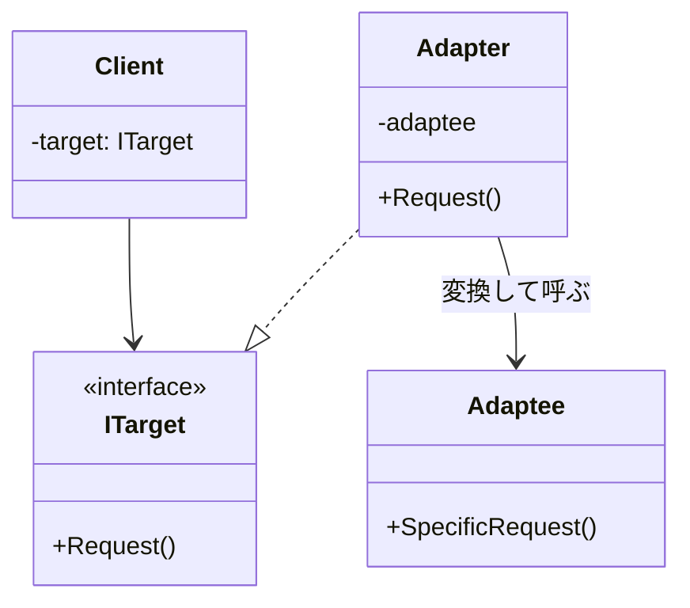

# 第34章：Adapter ①：型のズレを吸収する🔌

## ねらい 🎯😊

* 「使いたい側（呼び出し側）」と「使わせてくれる側（既存/外部）」の **型・形・呼び方のズレ** を、きれいに吸収できるようになるよ🧩✨
* 既存コードを壊さずに、**“合わないもの同士をつなぐ”** 発想を身につけるよ🤝💡
* Adapterでやりがちな事故（変換層が肥大化、業務ルール混入）を先に回避するよ🛟⚠️

---

## 到達目標 🏁🌸

* 「ここはAdapterで解くべきズレ！」を3種類以上言い分けできる（例：型/データ形/同期非同期）🔍
* **Target（欲しい形）** と **Adaptee（既存/外部）** を言葉で説明できる🗣️
* Adapterを1個作って、呼び出し側のコードを **変えずに** 差し替えできる🔁✨
* Adapterに入れていい責務 / ダメな責務を判断できる🙅‍♀️✅

---

## 手順 🧭🛠️

### 1) まず「ズレ」を見つけよう🔎💭

Adapterが活躍するズレはだいたいこのへん👇

* **型のズレ**：欲しいのは `TextReader` なのに手元にあるのは `Stream` みたいなやつ📎
* **メソッドのズレ**：欲しいのは `SendAsync(Notification)`、相手は `Post(string url, byte[] payload)` みたいなやつ📦
* **データ形のズレ**：外部APIはDTO（`snake_case`）で返すけど、こっちはドメイン型（`PascalCase`）で扱いたい📄✨
* **I/Oやライフサイクルのズレ**：相手が `IDisposable` 必須だったり、例外の投げ方が違う💥🧯
* **同期/非同期のズレ**：相手は同期しかないけど、こっちは `async` で統一したい⏳⚡

「ズレがあるのに、呼び出し側を直しまくってる」なら、Adapter候補だよ😊🔌

---

### 2) “呼び出し側が欲しい形（Target）” を先に決める🧠✨


ここが超大事！
**Adapterは「相手に合わせる」のではなく、「呼び出し側を守る」** のが基本だよ🏠🛡️

例：注文処理は「通知を送る」だけ知っていればいい、みたいにしたい👇

* Target：`INotificationSender`（呼び出し側が欲しい形）
* Adaptee：外部の `EmailClient` / `SmsClient`（もう存在してる、形が違う）




---

### 3) Adapterは“翻訳だけ”に徹する📘➡️📗

Adapterの中でやることは基本これだけ👇

* 引数を変換する（`Notification` → `to/subject/body`）✉️
* 必要ならエラーを整える（例外の種類を揃える）🧯
* 依存の向きを整える（呼び出し側はTargetだけを見る）🧲
* 必要なら `Dispose` の扱いを合わせる♻️

逆に、**業務ルール（割引計算とか在庫判定とか）を入れたら負け** だよ😇💦
「変換層が第二のドメイン」になりがちだからね…！

---

### 4) まずは “オブジェクトAdapter（合成）” で作るのがC#定番🧱✨

C#は多重継承がないから、だいたい **合成（持つ）** が自然だよ😊

* ✅ AdapterがAdapteeをフィールドで持つ（コンストラクタ注入）
* ✅ AdapterがTargetインターフェイスを実装する
* ✅ 呼び出し側はTargetだけ知ってる

---

### 5) .NET標準の “Adapterっぽい例” を体で覚える🧠💡

ここで感覚を掴むと、実務で見つけやすいよ✨

* `Stream` → `StreamReader`（バイト列の世界を、文字列の世界へ）📚
* `TextReader` / `TextWriter`（「テキスト読み書き」という抽象で統一）📝
* `System.Text.Json` でDTOへ/DTOから変換（“形”の変換）🔁📄

---

### 6) テストは「変換が正しいか」だけを小さく固定する🧪🌼

Adapterは仕様がシンプルになりやすいから、テストもシンプルでOK！

* 入力 → 期待する呼び出しに変換されるか✅
* DTO → ドメインへのマッピングが正しいか✅
* 例外が必要なら「握りつぶさず、契約どおり」か✅

---

## サンプル：通知クライアントのズレをAdapterで吸収🔔🔌

### 登場人物（頭の中の図）🧠📌

* 呼び出し側：`OrderService`（通知したいだけ）
* Target：`INotificationSender`（こう呼びたい！）
* Adaptee：`ExternalEmailClient`（外部。呼び方が違う）
* Adapter：`EmailNotificationSender`（翻訳係）

```
OrderService  -->  INotificationSender  <--(implements)--  EmailNotificationSender  --> ExternalEmailClient
     （守りたい側）       （欲しい形）          （翻訳）                     （既存/外部）
```

### コード例（最小）🧁✨

```csharp
public sealed record Notification(string To, string Subject, string Body);

// 呼び出し側が欲しい形（Target）
public interface INotificationSender
{
    Task SendAsync(Notification notification, CancellationToken ct = default);
}

// 既存/外部（Adaptee）※形が合わない想定
public sealed class ExternalEmailClient
{
    public Task SendEmailAsync(string to, string subject, string body, CancellationToken ct)
        => Task.CompletedTask;
}

// 翻訳係（Adapter）
public sealed class EmailNotificationSender : INotificationSender
{
    private readonly ExternalEmailClient _client;

    public EmailNotificationSender(ExternalEmailClient client)
        => _client = client;

    public Task SendAsync(Notification notification, CancellationToken ct = default)
        => _client.SendEmailAsync(notification.To, notification.Subject, notification.Body, ct);
}
```

呼び出し側は **ExternalEmailClientを一切知らない** のがポイントだよ😊🛡️

```csharp
public sealed class OrderService
{
    private readonly INotificationSender _sender;

    public OrderService(INotificationSender sender) => _sender = sender;

    public async Task PlaceOrderAsync(string customerEmail, CancellationToken ct = default)
    {
        // ...注文処理...
        await _sender.SendAsync(
            new Notification(customerEmail, "ご注文ありがとうございます", "注文を受け付けました！"),
            ct
        );
    }
}
```

これで、SMSにしたい・Pushにしたい、みたいなときも
**呼び出し側はそのまま** で差し替えできるよ🔁🎉

---

## サンプル：`Stream` を “文字列として読みたい” をAdapter感覚で理解📚💧

.NETはもう答えを持ってることが多い！それがこの例😊

「手元に `Stream` があるけど、やりたいのは **文字として読む**」
→ `StreamReader` がまさに “ズレ吸収” だよ🔌✨

```csharp
using System.Text;

var bytes = Encoding.UTF8.GetBytes("hello\nworld");
using var stream = new MemoryStream(bytes);

// Stream(バイト) -> StreamReader(文字) に変換する = Adapterっぽい
using var reader = new StreamReader(stream, Encoding.UTF8);

string all = reader.ReadToEnd();
Console.WriteLine(all);
```

ポイント👇

* `Stream` はバイトの世界🌊
* `TextReader`/`StreamReader` は文字の世界📖
* 「ズレ」を吸収して、使う側の気持ちをラクにしてる😊

---

## サンプル：外部APIのDTOをドメイン型へ変換（JSONの“形ズレ”）🌐📄🔁

外部APIってだいたい DTO だよね。
でもアプリの中心（ドメイン）は、**わかりやすい型**で扱いたい✨

ここでもAdapterが活躍するよ🔌

```csharp
using System.Text.Json;

public enum PaymentStatus { Pending, Paid, Failed }

// 外部の形（DTO）
public sealed class PaymentResponseDto
{
    public string? status { get; set; } // 外部は小文字だったりする例
}

// 呼び出し側が欲しい形
public interface IPaymentStatusReader
{
    PaymentStatus ReadStatus(string json);
}

// Adapter：DTO(JSON) -> Domain
public sealed class PaymentStatusReader : IPaymentStatusReader
{
    public PaymentStatus ReadStatus(string json)
    {
        var dto = JsonSerializer.Deserialize<PaymentResponseDto>(json)
                  ?? throw new InvalidOperationException("Invalid JSON");

        return dto.status switch
        {
            "pending" => PaymentStatus.Pending,
            "paid" => PaymentStatus.Paid,
            "failed" => PaymentStatus.Failed,
            _ => throw new InvalidOperationException("Unknown status")
        };
    }
}
```

ここで守ること👇😊

* Adapterは **変換だけ**（支払いの業務ルールは入れない）
* “未知の値” は握りつぶさず、契約として扱う（例外にする等）⚠️
* `switch` の分岐は **ここに集める**（呼び出し側に漏らさない）🧹✨

---

## よくある落とし穴 😵‍💫⚠️

1. **Adapterが太って“第二のドメイン”になる** 🐘💥

* 変換のついでに「割引」や「状態遷移」まで入れちゃう…
  → それはAdapterじゃなくて、別の層（ユースケース/ドメインサービス）の仕事かも😇

2. **ズレを全部1個のAdapterに押し込む** 📦📦📦

* 1クラスに変換が集まりすぎると読みづらい
  → “1つの外部/1つのI/F” くらいで分けるのが安全だよ🧯

3. **呼び出し側がAdapteeを知ってしまう** 🙈

* `OrderService` の中で `ExternalEmailClient` を触り始めたら効果が薄れる…
  → 呼び出し側はTargetだけを見る！これが守りの基本🛡️✨

4. **Adapterで例外を握りつぶす** 🤐💦

* 失敗したのに成功したように見えるのが一番こわい
  → “どう失敗するか” も契約だよ📜

5. **Decorator/Facadeと混ざって混乱** 🌀

* Adapter：型/呼び方のズレを合わせる🔌
* Decorator：同じI/Fのまま機能を後付けする🎁
* Facade：複雑な内部に簡単な入口を作る🚪

---

## 演習（10〜30分）🧪🍰

### 演習A：通知のAdapterをもう1つ作る📩➡️📱

* `ExternalSmsClient`（仮）を想定して、`INotificationSender` に合わせるAdapterを作ってみよう🔌
* ルール：Adapterは “変換だけ” ね！😊

ヒント（外部の形例）👇

```csharp
public sealed class ExternalSmsClient
{
    public Task SendAsync(string phoneNumber, string message, CancellationToken ct)
        => Task.CompletedTask;
}
```

---

### 演習B：DTO→ドメイン変換をテストで固定する🧪✅

* `"paid"` が `PaymentStatus.Paid` になるテスト
* `"unknown"` が例外になるテスト
  この2本だけで十分だよ✨

---

### 演習C：どこがズレてるか“言語化”メモ📝💡

次のテンプレを1回埋めてみてね👇

* 症状：何がつらい？😵
* 原因：何がズレてる？（型/データ/同期…）🔎
* 変わる点：何が変わりやすい？🔁
* 変えたくない点：何を守りたい？（呼び出し側/テスト/公開API）🛡️

---

## 自己チェック ✅🌟

* 呼び出し側は **Adaptee（外部/既存）** を1ミリも知らない？🙆‍♀️
* Adapterの責務は **翻訳だけ** になってる？（業務ルール混入してない？）🧼
* 分岐（`switch`）は呼び出し側に漏れず、Adapterに集約できた？🧹✨
* 失敗時の挙動（例外/戻り値）は“契約”として説明できる？📜
* 「これはDecoratorじゃなくてAdapterだよ」って理由付きで言える？🔌🎁
