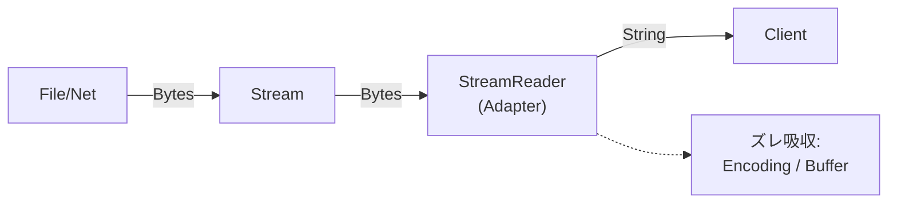

# 第35章：Adapter ②：.NET定番（Stream → StreamReader）📚

## ねらい 🎯✨

* 「バイト列の世界（Stream）」と「文字の世界（TextReader）」のズレを、どう吸収してるか体感するよ🙂
* StreamReader が **“変換の責務”** を引き受けることで、呼び出し側がラクになるポイントをつかむよ🧠💡
* 「差し替え点（Encoding / buffer / leaveOpen）」を見抜ける目を作るよ👀🔍

---

## 到達目標 🏁🌸

* Stream と TextReader の違い（責務の違い）を一言で説明できる🙂🗣️
* StreamReader が Adapter として何を“隠しているか”を3つ言える✅
* 自分のコードで「TextReader を受け取る」設計にして、テストをラクにできる🧪✨

---

## 手順 🧭🧩

### 1) まず「ズレ」を言葉にする 🧠🔌


* Stream：**バイト列**（ファイル/ネットワーク/メモリ…何でも来る）📦
* TextReader：**文字列**（行で読む、テキストとして扱う）📝
* つまりズレはここ👇

  * 「どの文字コード？（Encoding）」
  * 「どこでバッファする？（buffer）」
  * 「ストリーム閉じる？閉じない？（leaveOpen）」

StreamReader はこのズレを吸収して、Stream を “文字として読める形” にしてくれるよ🎁✨




---

### 2) IntelliSenseで「Adapterっぽい匂い」を嗅ぐ 👃📌

StreamReader のコンストラクタを見ると、Adapterの“仕事”がそのまま出てくるよ🔍

* 入力が Stream（ズレ元）
* 出力（ふるまい）が TextReader っぽい（ReadLine/ReadToEnd など）
* しかも「変換に必要な材料」が引数にある（Encoding 等）

特に注目👇✨

* Encoding（文字コード）🈁
* detectEncodingFromByteOrderMarks（BOMなどの自動判定）🧭
* bufferSize（読み取り効率）🚀
* leaveOpen（Streamの寿命をどっちが持つか）🧯

---

### 3) “呼び出し側が知らなくていいこと”を3つ書き出す ✍️💡

StreamReader を使うと、呼び出し側は例えばこれを意識しなくて済む（または意識が減る）よ🙂

1. バイト列→文字列への変換ロジック（Encoding変換）🧵
2. ちょうど良い読み取り単位（行/文字）への操作📝
3. バッファリングや効率の細かい話（ある程度お任せ）🚄

---

### 4) ミニ模倣コードで「ズレが消える瞬間」を作る 🪄✨

ここが一番おいしいところ😋
**受け取りを TextReader にしておくと**、本番はファイルでもネットでも、テストは文字列でもいけるよ🎉

#### ✅ パース側（TextReaderだけ見てればOK）

```csharp
using System;
using System.Collections.Generic;
using System.Globalization;
using System.IO;

public sealed record OrderRow(string OrderId, decimal Total);

public static class OrderCsvParser
{
    // 「テキストを読む」という責務に寄せる：TextReaderを受け取るのがポイント✨
    public static List<OrderRow> Parse(TextReader reader)
    {
        var result = new List<OrderRow>();

        string? line;
        while ((line = reader.ReadLine()) is not null)
        {
            if (string.IsNullOrWhiteSpace(line)) continue;

            // 例: "A001,1200.50"
            var parts = line.Split(',');
            if (parts.Length != 2) throw new FormatException($"Invalid CSV line: {line}");

            var id = parts[0].Trim();
            var total = decimal.Parse(parts[1].Trim(), NumberStyles.Number, CultureInfo.InvariantCulture);

            result.Add(new OrderRow(id, total));
        }

        return result;
    }
}
```

#### ✅ 本番側：Stream → StreamReader で“適合”させる（Adapter）🔌

```csharp
using System;
using System.IO;
using System.Text;

public static class OrderImportService
{
    public static void ImportFromFile(string path)
    {
        using var stream = File.OpenRead(path);

        // Stream を TextReader に変換するのが StreamReader の役目（Adapter）✨
        using var reader = new StreamReader(
            stream,
            Encoding.UTF8,
            detectEncodingFromByteOrderMarks: true,
            bufferSize: 1024,
            leaveOpen: false
        );

        var rows = OrderCsvParser.Parse(reader);

        Console.WriteLine($"Imported: {rows.Count} rows");
    }
}
```

#### ✅ テスト側：ファイル不要！StringReaderでOK 🧪🌸

```csharp
using Microsoft.VisualStudio.TestTools.UnitTesting;
using System.IO;

[TestClass]
public class OrderCsvParserTests
{
    [TestMethod]
    public void Parse_reads_lines_and_returns_rows()
    {
        var csv = "A001,1200.50\nA002,300\n";
        using var reader = new StringReader(csv);

        var rows = OrderCsvParser.Parse(reader);

        Assert.AreEqual(2, rows.Count);
        Assert.AreEqual("A001", rows[0].OrderId);
        Assert.AreEqual(1200.50m, rows[0].Total);
    }
}
```

ここで起きてること👇💡

* パース処理は「TextReader」だけ知ってればいい🙂
* 本番は「Stream」を StreamReader で TextReader に合わせる（Adapter）🔌
* テストは StringReader（同じTextReader）で差し替え完了🧪✨

---

### 5) “契約”を読み落とさない（Dispose / leaveOpen）🧯⚠️

ここ超大事！💥

* StreamReader は IDisposable（片付けが必要）🧹
* ふつうは using でOK✅
* でも「Stream の寿命をどっちが持つ？」は考えよう🙂

**よくある方針**👇

* 「読み取り全体をここで完結」→ leaveOpen: false（普通これ）👍
* 「Streamは別の人が後で使う」→ leaveOpen: true（上級寄り）🧠

---

## よくある落とし穴 😵‍💫🕳️

* 文字コードを“なんとなく”で済ませて文字化け👻🈁

  * 対策：Encoding を明示する or 仕様で固定する📌
* using を忘れてファイルがロックされたまま🔒😱

  * 対策：using var を癖にする🧹
* ReadToEnd で巨大ファイルを一気読みしてメモリ爆発💥🐘

  * 対策：ReadLine で逐次処理、またはストリーム処理にする🚰
* Adapter層（変換層）に業務ルールを混ぜて肥大化🍔🍟

  * 対策：Adapterは“変換だけ”、業務ルールはドメイン側へ🏠✨

---

## ミニ演習（10〜30分）⏱️🎮

### 演習A：Stream → StreamReader を “自分の手”で体感する 💪🔌

1. MemoryStream に UTF-8 のCSV文字列を入れる🧪
2. StreamReader で読んで OrderCsvParser.Parse に渡す
3. 期待件数になってるかテストする✅

```csharp
using Microsoft.VisualStudio.TestTools.UnitTesting;
using System.IO;
using System.Text;

[TestClass]
public class AdapterExerciseTests
{
    [TestMethod]
    public void Stream_to_StreamReader_to_TextReader_pipeline_works()
    {
        var csv = "A010,10\nA011,11\n";
        var bytes = Encoding.UTF8.GetBytes(csv);

        using var stream = new MemoryStream(bytes);
        using var reader = new StreamReader(stream, Encoding.UTF8, detectEncodingFromByteOrderMarks: true);

        var rows = OrderCsvParser.Parse(reader);

        Assert.AreEqual(2, rows.Count);
        Assert.AreEqual("A010", rows[0].OrderId);
    }
}
```

### 演習B：差し替え点を1個だけ触る（leaveOpen）🧯✨

* StreamReader を leaveOpen: true にして、Parse後も stream.Position を触れるか確認してみよう🙂
* 「誰が資源の寿命を持つのか」感覚が掴めるよ🧠🎯

---

## 自己チェック ✅🧡

* Stream と TextReader のズレを一言で言える？（バイト vs 文字）🗣️
* StreamReader が隠してくれるものを3つ言える？（Encoding/読み方/バッファ等）🔍
* 自分の処理を「TextReader を受け取る設計」にできた？（テストがラクになった？）🧪✨
* using（Dispose）を忘れない形になってる？🧹✅
