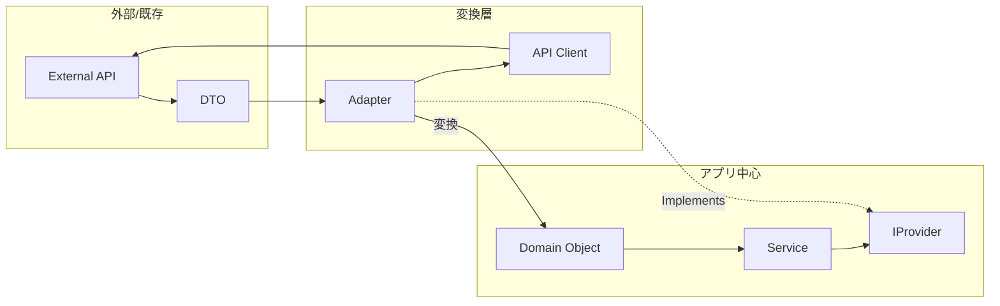

# 第36章：Adapter ③：演習（外部APIレスポンスをドメインへ）🌐

## ねらい 🎯✨

外部APIのレスポンス（DTO）を、そのままアプリの中心（ドメイン）へ流し込むと、**呼び出し側が外部都合に引っ張られて壊れやすく**なります😵‍💫
そこで Adapter を使って、**外部APIの型のクセを吸収して、ドメインの形に整える**練習をします🧼✨

---

## 到達目標 🏁🌸

* 外部APIのDTOを、ドメインの型へ **薄く変換**できる（Adapterの責務を守れる）🧩
* 呼び出し側（例：注文処理）が **HttpClient/DTOを知らない**状態にできる🙈✨
* テストで **差し替え（スタブ/フェイク）** ができて、変更に強いことを確認できる🧪✅
* `HttpClient` は **IHttpClientFactory で作る**流れを押さえられる🧠✨ ([Microsoft Learn][1])

---

## 手順 🛠️🧁

### 1) 今回の外部APIレスポンス例を決める 📦🌐

例：配送見積もりAPIがこんなJSONを返す想定にします（中身は架空でOK）🙂

* `feeYen`: 配送料（円）
* `etaDays`: 到着までの日数
* `carrier`: 配送会社コード

---

### 2) ドメイン側の型を “先に” 決める 🧠🏠

外部APIがどうであれ、アプリの中心は **自分たちの言葉** で持ちたいです💪✨
（ここがブレると、ずっと外部都合に振り回されます😵）

```csharp
namespace MyApp.Domain;

public readonly record struct Money(decimal Amount, string Currency)
{
    public static Money Jpy(decimal amount) => new(amount, "JPY");
}

public sealed record ShippingQuote(Money Fee, int EstimatedDays, string Carrier);
```

ポイント💡

* `Money` は「通貨つき金額」っていうドメインの言葉🪙✨
* `ShippingQuote` は注文処理が欲しい形そのもの📦💛

---

### 3) 導入前：素朴実装で “つらさ” を固定する 😅🧷

まずはありがちな形を作って、**何がつらいか**を見える化します👀

```csharp
using System.Net.Http.Json;
using MyApp.Domain;

namespace MyApp.App;

public sealed class OrderService_Before
{
    private readonly HttpClient _http;

    public OrderService_Before(HttpClient http) => _http = http;

    public async Task<ShippingQuote> GetShippingQuoteAsync(string postalCode, CancellationToken ct)
    {
        // 呼び出し側がDTO/URL/JSON都合を全部背負ってる😵
        var dto = await _http.GetFromJsonAsync<ShippingQuoteResponseDto>(
            $"api/shipping/quote?postalCode={Uri.EscapeDataString(postalCode)}",
            cancellationToken: ct);

        if (dto is null) throw new InvalidOperationException("Shipping API returned null.");

        // ここに変換が混ざって肥大化しがち…😇
        return new ShippingQuote(
            Fee: Money.Jpy(dto.FeeYen),
            EstimatedDays: dto.EtaDays,
            Carrier: dto.Carrier
        );
    }

    private sealed record ShippingQuoteResponseDto(decimal FeeYen, int EtaDays, string Carrier);
}
```

ここがつらい😵‍💫

* `OrderService` が **HTTPの知識**（URL/JSON）まで持っちゃう
* DTO変更・API変更が来ると、注文処理のコードが巻き込まれる
* テストがしにくい（HttpClientを絡めたくなる）

`GetFromJsonAsync` みたいな JSON拡張は便利だけど、**中心に置きすぎ注意**です🧯✨ ([Microsoft Learn][2])

---

### 4) 外部API用の “クライアント” を分離する 📡🧩

外部APIの都合（URL/DTO/JSON）は、**外部に寄せて隔離**します🏝️✨
ここは `IHttpClientFactory` で作るのが今どきの基本です🧠 ([Microsoft Learn][1])

```csharp
using System.Net.Http.Json;

namespace MyApp.External;

public interface IShippingApiClient
{
    Task<ShippingQuoteResponseDto> GetQuoteAsync(string postalCode, CancellationToken ct);
}

// 外部APIのDTO（外部の言葉）📦
public sealed record ShippingQuoteResponseDto(decimal FeeYen, int EtaDays, string Carrier);

public sealed class ShippingApiClient : IShippingApiClient
{
    private readonly HttpClient _http;

    public ShippingApiClient(HttpClient http) => _http = http;

    public async Task<ShippingQuoteResponseDto> GetQuoteAsync(string postalCode, CancellationToken ct)
    {
        var dto = await _http.GetFromJsonAsync<ShippingQuoteResponseDto>(
            $"api/shipping/quote?postalCode={Uri.EscapeDataString(postalCode)}",
            cancellationToken: ct);

        return dto ?? throw new InvalidOperationException("Shipping API returned null.");
    }
}
```

ここまでで「外部APIの知識」を `MyApp.External` に押し込められました📦✨
（注文処理から HTTP が消える第一歩！）

---




### 5) Adapter を作る：外部DTO → ドメイン型へ変換する 🧼🧩


いよいよ本題！
注文処理が欲しいのは **ドメインの `ShippingQuote`**。
でも外部が返すのは **`ShippingQuoteResponseDto`**。
この “ズレ” を吸収するのが Adapter です🔌✨

```csharp
using MyApp.Domain;
using MyApp.External;

namespace MyApp.App;

// ドメインが欲しい形（注文側の期待）🍰
public interface IShippingQuoteProvider
{
    Task<ShippingQuote> GetQuoteAsync(string postalCode, CancellationToken ct);
}

// Adapter：外部クライアントを包んで、ドメインへ変換🧩
public sealed class ShippingQuoteProviderAdapter : IShippingQuoteProvider
{
    private readonly IShippingApiClient _api;

    public ShippingQuoteProviderAdapter(IShippingApiClient api) => _api = api;

    public async Task<ShippingQuote> GetQuoteAsync(string postalCode, CancellationToken ct)
    {
        var dto = await _api.GetQuoteAsync(postalCode, ct);

        // 変換は「薄く」🪶：業務ルールは混ぜない！
        if (dto.EtaDays < 0) throw new InvalidOperationException("Invalid ETA from API.");

        return new ShippingQuote(
            Fee: Money.Jpy(dto.FeeYen),
            EstimatedDays: dto.EtaDays,
            Carrier: dto.Carrier
        );
    }
}
```

“薄い”ってこういうこと💡

* ここでやるのは **整形（型・単位・必須チェック）** まで
* 「送料無料条件」とか「配送会社の優先順位」みたいな業務ルールは **別の場所**へ🚫

---

### 6) 呼び出し側（注文処理）を Adapter の期待側へ寄せる 🛒✨

注文処理は **IShippingQuoteProvider** だけ知っていればOKになります🙈💕

```csharp
using MyApp.Domain;

namespace MyApp.App;

public sealed class OrderService
{
    private readonly IShippingQuoteProvider _shipping;

    public OrderService(IShippingQuoteProvider shipping) => _shipping = shipping;

    public async Task<Money> CalculateTotalAsync(Money itemsTotal, string postalCode, CancellationToken ct)
    {
        var quote = await _shipping.GetQuoteAsync(postalCode, ct);
        return new Money(itemsTotal.Amount + quote.Fee.Amount, itemsTotal.Currency);
    }
}
```

ここが気持ちいいところ🥰

* 注文処理から **HttpClient が消えた**
* 注文処理から **DTOが消えた**
* 外部APIが変わっても、被害は主に “外側” で止まる

---

### 7) DI登録：IHttpClientFactory で HttpClient を組み立てる 🧩🔧

`AddHttpClient` を使うと、`IHttpClientFactory` 経由で `HttpClient` を安全に作れます✨ ([Microsoft Learn][1])
（よくあるトラブルの観点も公式にまとまってます📚） ([Microsoft Learn][3])

```csharp
using Microsoft.Extensions.DependencyInjection;
using MyApp.App;
using MyApp.External;

namespace MyApp;

public static class ServiceRegistration
{
    public static IServiceCollection AddMyApp(this IServiceCollection services)
    {
        // typed client（IShippingApiClient を HttpClient 付きで構築）
        services.AddHttpClient<IShippingApiClient, ShippingApiClient>(client =>
        {
            client.BaseAddress = new Uri("https://example-shipping.local/"); // 例
        });

        // Adapter
        services.AddTransient<IShippingQuoteProvider, ShippingQuoteProviderAdapter>();

        // App service
        services.AddTransient<OrderService>();

        return services;
    }
}
```

---

### 8) テスト：差し替えできるかを最短で確認 🧪🌸

#### 8-1) Adapter の単体テスト：フェイクでOK 🙆‍♀️

HttpClientに触らず、DTOを返すフェイクで十分です✨（ここが Adapter の強み！）

```csharp
using Microsoft.VisualStudio.TestTools.UnitTesting;
using MyApp.App;
using MyApp.Domain;
using MyApp.External;

namespace MyApp.Tests;

[TestClass]
public sealed class ShippingQuoteProviderAdapterTests
{
    private sealed class FakeShippingApiClient : IShippingApiClient
    {
        public Task<ShippingQuoteResponseDto> GetQuoteAsync(string postalCode, CancellationToken ct)
            => Task.FromResult(new ShippingQuoteResponseDto(FeeYen: 550m, EtaDays: 2, Carrier: "YAMATO"));
    }

    [TestMethod]
    public async Task Adapter_converts_dto_to_domain()
    {
        var adapter = new ShippingQuoteProviderAdapter(new FakeShippingApiClient());

        var quote = await adapter.GetQuoteAsync("100-0001", CancellationToken.None);

        Assert.AreEqual("JPY", quote.Fee.Currency);
        Assert.AreEqual(550m, quote.Fee.Amount);
        Assert.AreEqual(2, quote.EstimatedDays);
        Assert.AreEqual("YAMATO", quote.Carrier);
    }
}
```

#### 8-2) 外部クライアントのテスト：HttpMessageHandler をスタブ化 🧪📨

`System.Net.Http.Json` のデシリアライズ経路を軽く通したいときに便利です✨
（`JsonSerializer` 系の挙動も公式にまとまってます📚） ([Microsoft Learn][4])

```csharp
using System.Net;
using System.Net.Http;
using System.Text;
using Microsoft.VisualStudio.TestTools.UnitTesting;
using MyApp.External;

namespace MyApp.Tests;

[TestClass]
public sealed class ShippingApiClientTests
{
    private sealed class StubHandler : HttpMessageHandler
    {
        protected override Task<HttpResponseMessage> SendAsync(HttpRequestMessage request, CancellationToken cancellationToken)
        {
            var json = """{"feeYen":550,"etaDays":2,"carrier":"YAMATO"}""";

            var res = new HttpResponseMessage(HttpStatusCode.OK)
            {
                Content = new StringContent(json, Encoding.UTF8, "application/json")
            };
            return Task.FromResult(res);
        }
    }

    [TestMethod]
    public async Task Client_reads_json_to_dto()
    {
        var http = new HttpClient(new StubHandler())
        {
            BaseAddress = new Uri("https://unit.test/")
        };

        var client = new ShippingApiClient(http);

        var dto = await client.GetQuoteAsync("100-0001", CancellationToken.None);

        Assert.AreEqual(550m, dto.FeeYen);
        Assert.AreEqual(2, dto.EtaDays);
        Assert.AreEqual("YAMATO", dto.Carrier);
    }
}
```

---

## よくある落とし穴 ⚠️🥺

* Adapter に **業務ルール** を混ぜちゃう（例：送料無料判定までやる）
  → Adapterは “変換/整形/最低限の妥当性” までにする🧼✨
* DTOが増えるたびに、変換が巨大化する📈😵
  → 変換は **ドメインの型ごとに小さく**、1クラス1責務🪶
* `HttpClient` を都度 `new` してしまう（長期的にしんどい）
  → `IHttpClientFactory` の推奨に寄せるのが安心💡 ([Microsoft Learn][1])
* 外部APIのエラー時の契約があいまい（null/例外/HTTPエラー）😇
  → 「nullは返さない」「例外はどこで投げる」だけは決めておく🧷

---

## 演習 10〜30分 ⏱️🍰

1. 外部DTOに `campaignCode`（string?）を追加したことにして、Adapterは **ドメインに不要なら無視**してOKにする🙂
2. `etaDays` が `-1` のときは例外にする（すでに入ってるけど、テストを追加して確かめる）🧪✅
3. Gitコミットを2つに分ける💡

   * コミットA：導入前（Before）
   * コミットB：External + Adapter 導入後
4. AI補助を使うなら、DTOやテストの雛形は出してもらってOK🤖✨

   * ただし **Adapterが業務ロジックを抱えてないか** だけは人間が目視チェック👀

---

## チェック ✅🌸

* 注文処理のコードに `HttpClient` が出てこない？🙈
* 注文処理のコードに DTO が出てこない？🙈
* Adapterは「変換」だけで、業務ルールが入ってない？🧼
* テストで `IShippingApiClient` をフェイクに差し替えられる？🧪
* `IHttpClientFactory` の作法で `HttpClient` を構築している？🔧 ([Microsoft Learn][1])

[1]: https://learn.microsoft.com/en-us/dotnet/core/extensions/httpclient-factory "https://learn.microsoft.com/en-us/dotnet/core/extensions/httpclient-factory"
[2]: https://learn.microsoft.com/ja-jp/dotnet/api/system.net.http.json.httpclientjsonextensions.getfromjsonasync?view=net-8.0 "https://learn.microsoft.com/ja-jp/dotnet/api/system.net.http.json.httpclientjsonextensions.getfromjsonasync?view=net-8.0"
[3]: https://learn.microsoft.com/ja-jp/dotnet/core/extensions/httpclient-factory-troubleshooting "https://learn.microsoft.com/ja-jp/dotnet/core/extensions/httpclient-factory-troubleshooting"
[4]: https://learn.microsoft.com/ja-jp/dotnet/api/system.text.json.jsonserializer.deserializeasync?view=net-9.0 "https://learn.microsoft.com/ja-jp/dotnet/api/system.text.json.jsonserializer.deserializeasync?view=net-9.0"
