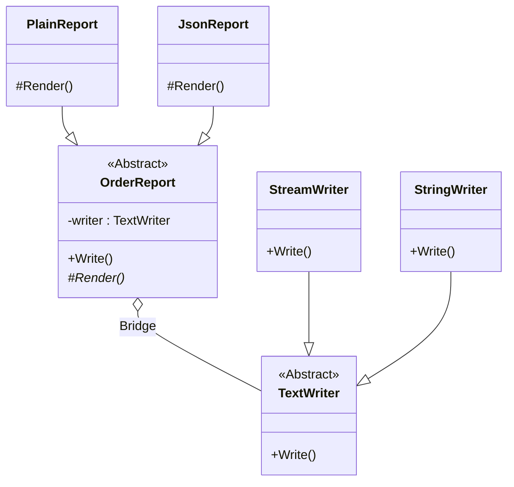

# 第37章：Bridge ①：2軸が増えるときに分離する🌉

## ねらい 🎯✨

* 「機能が増えるたびにクラスが爆増する…😵」を防ぐために、**増え方が“2方向（2軸）”になった瞬間**を見抜けるようになるよ🌱
* Bridge（ブリッジ）が解く困りごと＝**“抽象（使い方）”と“実装（中身）”が、それぞれ別々に増える**状況を整理できるようにするよ🧠💡
  （抽象と実装を分けて、組み合わせ自由にするイメージ🎀）([Microsoft Learn][1])

---

## 到達目標 🏁🌟

この章が終わったら、次ができるようになってね😊💪

* ✅ 「これは2軸だ！」を具体例で説明できる（例：**レポート形式 × 出力先**）
* ✅ Bridgeを使う/使わない判断ができる（“1軸しかないなら不要”が言える）
* ✅ .NET標準の設計（`Stream` や ADO.NET）に Bridgeっぽい発想を見つけられる👀✨

---

## 手順 🧭✨（Bridgeの考え方を“外さない”手順）

### 1) まず「増え方」を2軸で書き出す📝


「増える種類」を2列に分けて書くのがコツだよ🎀

例）注文レポートを出したいケース🛒

* 軸A（抽象＝“何をしたい？”）：レポート形式 → **PlainText / JSON / CSV…**
* 軸B（実装＝“どこへ出す？”）：出力先 → **Console / File / Memory…**

ここで大事なのは、**“Aが増えるたびにBも増える”状態**になってるかどうか😵

* もし `PlainTextConsole`, `PlainTextFile`, `JsonConsole`, `JsonFile` …みたいに増えそうなら、かなりBridge候補🌉✨

---

### 2) 「抽象」と「実装」を決める（ここが最重要🥇）

Bridgeはざっくりこう👇




* **抽象（Abstraction）**：利用者が呼ぶ側の“やりたいこと”
* **実装（Implementor）**：裏で実際に動く“差し替えたい部品”([Microsoft Learn][1])

今回の例なら：

* 抽象：`OrderReport`（レポートを作る側）
* 実装：`TextWriter`（どこへ書くかを受け持つ側）

---

### 3) .NET標準クラスを“実装側（Implementor）”に採用する✨

ここがこの教材の大事ポイントだよ💖
Bridgeの “実装側インターフェース” を、自作しなくてもOKなことが多いの！

* `TextWriter`（文字の出力先を抽象化する標準の型）
* `Stream`（バイト列の読み書きを抽象化する標準の型）

たとえば `Stream` は抽象の入り口として用意されていて、`MemoryStream` みたいな具体実装に差し替えできる発想を持ってるよ🧃✨([Microsoft Learn][2])

---

### 4) 最小のBridge例を“体で覚える”💪🌉（レポート形式 × 出力先）

「レポート形式」を増やせる（抽象側）＋「出力先」を差し替えられる（実装側）を、最小コードで体感しよ✨

```csharp
using System;
using System.IO;
using System.Text;
using System.Text.Json;
using System.Threading.Tasks;

// 例題ドメイン（最小）
public readonly record struct Money(decimal Amount, string Currency = "JPY");
public sealed record Order(Guid Id, Money Total);

// --- Abstraction（抽象）：レポート（形式が増える側） ---
public abstract class OrderReport
{
    protected TextWriter Writer { get; }

    protected OrderReport(TextWriter writer)
        => Writer = writer ?? throw new ArgumentNullException(nameof(writer));

    public async Task WriteAsync(Order order)
    {
        var text = Render(order);
        await Writer.WriteLineAsync(text);
        await Writer.FlushAsync();
    }

    protected abstract string Render(Order order);
}

// Refined Abstraction（抽象の派生）：形式を追加できる！
public sealed class PlainTextOrderReport : OrderReport
{
    public PlainTextOrderReport(TextWriter writer) : base(writer) { }

    protected override string Render(Order order)
        => $"OrderId={order.Id}, Total={order.Total.Amount} {order.Total.Currency}";
}

public sealed class JsonOrderReport : OrderReport
{
    public JsonOrderReport(TextWriter writer) : base(writer) { }

    protected override string Render(Order order)
        => JsonSerializer.Serialize(order);
}
```

✅ ここで起きてること

* レポート形式（PlainText/JSON）を増やしても、出力先はそのまま使い回せる🎁
* 出力先（Console/File/Memory）を増やしても、レポート形式はそのまま使い回せる🎀
  → **2軸が独立して増やせる＝Bridgeの勝ち🌉✨**

---

### 5) 出力先を差し替えて動かす（Console / File / Memory）🖥️📁🧪

```csharp
// Consoleへ（Console.Out は TextWriter）
var order = new Order(Guid.NewGuid(), new Money(1200m, "JPY"));
var report1 = new PlainTextOrderReport(Console.Out);
await report1.WriteAsync(order);

// Fileへ（StreamWriter は TextWriter）
await using (var file = new StreamWriter("order.txt", append: false, Encoding.UTF8))
{
    var report2 = new JsonOrderReport(file);
    await report2.WriteAsync(order);
}

// Memoryへ（StringWriter は文字列へ書ける）
using var sw = new StringWriter();
var report3 = new PlainTextOrderReport(sw);
await report3.WriteAsync(order);

var captured = sw.ToString(); // テストで検証しやすい🎉
Console.WriteLine("Captured: " + captured);
```

ポイント💡

* `StringWriter` は “文字列に書き込む”用途で使えるから、**テストで出力を捕まえる**のに超便利だよ🧪✨([Microsoft Learn][3])
* `StreamWriter` / `Stream` 系はリソース管理があるので、`using` / `await using` を忘れないでね⚠️

---

### 6) 「Bridgeっぽい」.NET標準の例を読む👀📚

Bridgeは“パターン図どおり”だけが正解じゃなくて、**発想**を掴むのが大事だよ🌷

**例A：`Stream` の抽象と実装**

* `Stream` を受け取るAPIは、「中身がファイルか、メモリか」を知らなくていい✨
* `MemoryStream` みたいに、実体は差し替えできる🧃([Microsoft Learn][2])

**例B：ADO.NET の `DbCommand`**

* `DbCommand` は共通の“命令（コマンド）”の抽象を提供して、裏側はプロバイダーごとに実装がある（という設計の匂いがする）🗄️✨([Microsoft Learn][4])
  ※ これは Abstract Factory 的な顔もあるので、「Bridgeそのもの！」と決めつけるより、**“抽象で受けて差し替える”設計感覚**として掴むのが◎だよ🙆‍♀️

---

## よくある落とし穴 🕳️⚠️

### 落とし穴1：2軸じゃないのにBridgeしちゃう😇

* 1軸しか増えないのに分けると、ただクラスが増えてしんどい💦
  👉 **増えるのが1方向なら、Strategyや単純な分離で十分**なことが多いよ✨

### 落とし穴2：分離する軸の見極めミス🎯💥

* 「形式」と「出力先」を混ぜると、結局組み合わせ爆発が戻ってくる😵
  👉 迷ったら「**if/switchが増えてる理由**」を見てね（形式？出力先？両方？）

### 落とし穴3：追跡が難しい“レイヤ増殖”📚📚📚

* 分けすぎると読みづらい
  👉 **最初は2〜3クラスで成立する最小**から！

### 落とし穴4：Dispose忘れ💧

* `Stream` 系は寿命管理があることが多いよ（ファイルハンドル等）
  👉 `using` を習慣にするのが安全🌱

---

## ミニ演習（10〜30分）🧪🌸

### 演習A：あなたのコードから“2軸”を1つ見つける🔍

次のテンプレを埋めてね📝✨

* 軸A（抽象：やりたいこと）：＿＿＿＿＿＿
* 軸B（実装：差し替えたい部品）：＿＿＿＿＿＿
* いま困ってること（組み合わせ爆発/if増殖/テスト困難）：＿＿＿＿＿＿

**ヒント**💡

* 「表示形式 × 出力先」
* 「通知内容 × 通知チャネル」
* 「保存先（DB/ファイル） × 保存ルール（圧縮/暗号化）」など🎀

### 演習B：さっきの `OrderReport` を1つ拡張する🌟

どれか1個でOK🙆‍♀️

* `CsvOrderReport` を追加する📄
* 出力先を `File` → `Memory` に差し替えても同じレポートが書けるのを確認する🧪
* `StringWriter` に出した結果をテストで `Contains("Total=")` みたいに検証する🔎([Microsoft Learn][3])

---

## 自己チェック ✅💕

* ✅ 「増え方が2軸」になってるか、言葉で説明できた？🌉
* ✅ “抽象（使い方）” と “実装（中身）” を分けて言えた？🧠
* ✅ 出力先を `Console.Out` → `StringWriter` に差し替えても、レポート側のコードを変えずに済んだ？🧪✨
* ✅ `Stream` が抽象として用意され、`MemoryStream` などに差し替えられる感覚を説明できた？🧃([Microsoft Learn][2])

[1]: https://learn.microsoft.com/en-us/dotnet/api/system.io.stream?view=net-10.0 "https://learn.microsoft.com/en-us/dotnet/api/system.io.stream?view=net-10.0"
[2]: https://learn.microsoft.com/ja-jp/dotnet/api/system.io.stream?view=net-10.0 "https://learn.microsoft.com/ja-jp/dotnet/api/system.io.stream?view=net-10.0"
[3]: https://learn.microsoft.com/en-us/dotnet/api/system.io.stringwriter.write?view=net-10.0 "https://learn.microsoft.com/en-us/dotnet/api/system.io.stringwriter.write?view=net-10.0"
[4]: https://learn.microsoft.com/ja-jp/dotnet/api/system.data.common.dbcommand?view=net-10.0 "https://learn.microsoft.com/ja-jp/dotnet/api/system.data.common.dbcommand?view=net-10.0"
