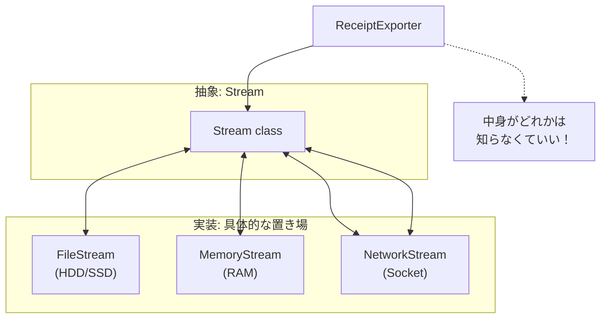

# 第38章：Bridge ②：.NETの感覚（Streamの実装差し替え）🧃

## ねらい 🎯✨

* Bridge（ブリッジ）を「図で覚える」じゃなくて、**.NETの“当たり前の設計”として体感**するよ🧠💡
* 特に **`Stream`（抽象）** と **`FileStream` / `MemoryStream`（実装）** を使って、
  「使う側が中身を知らなくていい」って感覚を、**手を動かして掴む**のがゴールだよ🫶📦
  `Stream` は抽象クラスで、バイト列の読み書きの共通インターフェースを提供するよ。([Microsoft Learn][1])

---

## 到達目標 🏁😊

* `Stream` を引数に取るメソッドが、**ファイルでもメモリでも同じように動く**理由を説明できる🗣️✨（抽象と実装の分離）
* 「どこが差し替え点？」「呼び出し側が知らなくていいことは何？」を、**3つ以上**言える👀✅
* テストで `MemoryStream` を使って、**I/O（ファイル）に依存しないテスト**が書ける🧪💕

---

## 手順 🧭🛠️

### 1) まず“Bridgeっぽさ”を見つける 👀🌉




Bridgeのコアはこれ👇

* **抽象（Abstraction）**：呼び出し側が触る“窓口”
* **実装（Implementation）**：裏で実際に仕事する“中身”
* そして **両方がそれぞれ増えても、組み合わせ爆発しにくい**✨

.NETだと、`Stream` がまさにその代表例だよ🧃

* `Stream`（抽象）…「バイト列を読む/書く」という共通の約束を持つ([Microsoft Learn][1])
* `FileStream`（実装）…ファイルに対して読む/書く（`Stream` の具体）([Microsoft Learn][2])
* `MemoryStream`（実装）…メモリ上に対して読む/書く（`Stream` の具体）([Microsoft Learn][3])

### 2) Visual Studioで“APIの設計”を読む 📚🔍

やることはシンプル✨

* `Stream` を F12（定義へ移動）して、**abstract** になってるのを確認👀
* プロパティ（`CanRead`, `CanWrite`, `CanSeek`）と、主要メソッド（`Read/Write`, `CopyTo` 系）を眺める🧠
* 「この抽象があるから、呼び出し側は **FileかMemoryかを意識しない**で済むんだな〜」を言葉にする💬✨

### 3) “呼び出し側が知らなくていい情報”を洗い出す 📝💡

たとえば `Stream` を使う側は、普通こんなのを知らなくてOKだよ👇

* データの置き場が **ファイル**なのか **メモリ**なのか 🗂️🧠
* ファイルなら「共有モードどうする？」とか「バッファどうする？」とか、細かいI/O設定 🧩
* 具体型ごとの最適化（OSやデバイス依存の都合）🧰

※ もしファイル側の細かい設定をしたい時は、`FileStreamOptions` みたいな標準の仕組みで調整する感じになるよ🧃🔧([Microsoft Learn][4])

### 4) “ミニ模倣コード”で体感（同じ処理をStreamで受ける）🧪✨

ここでは「領収書テキストをUTF-8で書く」だけの超ミニ例でいくよ🧾💕

* 呼び出し側は `Stream` だけ渡す
* 中身は `FileStream` でも `MemoryStream` でもOK
  → これが **“実装差し替え”の感覚**だよ🌉✨

```csharp
using System.Text;

public static class ReceiptExporter
{
    // ⭐ ここがポイント：具体型じゃなく Stream を受け取る（抽象に依存）
    public static async Task WriteReceiptAsync(Stream destination, string text, CancellationToken ct = default)
    {
        // このメソッドは destination の「所有者」じゃない想定だよ👛
        // だから Dispose しない！（契約をハッキリさせるの大事）
        var bytes = Encoding.UTF8.GetBytes(text);
        await destination.WriteAsync(bytes, ct);

        // Stream によってはバッファを持つことがあるので Flush しておくと安心🧼
        await destination.FlushAsync(ct);
    }
}
```

### 5) 差し替えを“テストで証明”する ✅🧪

ファイルを書いちゃうテストは遅いし壊れやすい💦
だから **`MemoryStream`** を使って「書けたこと」だけを検証しよ🫶

```csharp
using Microsoft.VisualStudio.TestTools.UnitTesting;
using System.Text;

[TestClass]
public class ReceiptExporterTests
{
    [TestMethod]
    public async Task WriteReceiptAsync_WritesUtf8Bytes_ToMemoryStream()
    {
        using var ms = new MemoryStream();

        await ReceiptExporter.WriteReceiptAsync(ms, "Hello 🧃");

        // 書き込んだ内容を取り出して確認
        var written = Encoding.UTF8.GetString(ms.ToArray());
        Assert.AreEqual("Hello 🧃", written);
    }
}
```

### 6) 同じ処理をファイルへ（実装を差し替えるだけ）📁✨

呼び出し側は “Fileにする” と決めたら `FileStream` を作って渡すだけだよ🙂
`File.OpenRead` みたいに、標準APIで `Stream` を返してくれるのも「抽象に寄せた設計」って感じだね🧠✨([Microsoft Learn][5])

```csharp
using System.Text;

var path = Path.Combine(Environment.CurrentDirectory, "receipt.txt");

await using (var fs = new FileStream(path, FileMode.Create, FileAccess.Write, FileShare.None))
{
    await ReceiptExporter.WriteReceiptAsync(fs, "Order#123 ✅");
}

Console.WriteLine("出力できたよ🧾✨ " + path);
```

### 7) （おまけ）DB版のBridge感覚：`DbConnection` / `DbCommand` 🗄️🌉

`Stream` と同じノリで、DBも “抽象を握る” 文化があるよ🙂

* `DbConnection` は抽象クラスで、DB接続のコアの振る舞いを定義してる([Microsoft Learn][2])
* `DbCommand` も抽象クラスで、SQL実行の基本を定義してる([Microsoft Learn][6])

つまり「SQL ServerでもPostgreSQLでも、同じ形で扱える」方向に寄せられる…って感覚ね🫶✨
（ただし実務ではプロバイダ差や機能差があるから、無理に完全共通化しない判断も大事だよ😇）

---

## よくある落とし穴 ⚠️🌀

* **`Dispose` の責任があいまい**問題😵

  * 「渡された `Stream` をこのメソッドが閉じていいの？」を決めないと事故る💥
  * ルール例：*“作った側がDisposeする”* を基本にして、メソッドは Dispose しない、など🧾
* **Position（位置）を戻し忘れる**📍

  * `MemoryStream` で書いたあと、読むときに `Position = 0` が必要なことあるよ（今回のテストは `ToArray()` だからOK）
* **`CanSeek` 前提で書いちゃう**🚫

  * `Stream` は Seek できない実装もあるよ（ネットワーク系とか）
* **ファイルI/Oをテストに持ち込む**🐢💦

  * 速度・権限・並列実行でコケやすい…
  * まず `MemoryStream` でロジックを固めるのが安定だよ🫶
* **BridgeとDecorator/Adapterがごっちゃ**😵‍💫

  * `Stream` の “中身差し替え” は Bridgeっぽい
  * `BufferedStream` や `GZipStream` みたいな “包む” は Decoratorっぽい
  * `StreamReader` で “バイト→文字” に変換するのは Adapterっぽい
    （この辺、.NETは教材の宝庫〜！📚✨）

---

## 演習 🏋️‍♀️🌸（10〜30分）

### 演習A：CSVエクスポートをStreamで作る 🛒🧾

1. `ExportOrdersAsCsvAsync(Stream destination, IEnumerable<Order> orders)` を作る
2. テストは `MemoryStream` で「CSV文字列が期待通り」を検証🧪
3. コンソールからは `FileStream` を渡して `orders.csv` を出力📁✨

※ `Order` は最小でOK：`Id`, `Total` くらいで十分だよ🙂🛒

### 演習B：AIに“読み方”を手伝わせる 🤖📚

AIにこんな感じで聞いてみて、**必ず自分でソース/ドキュメントで裏取り**してね👀✨

* 「`Stream` の抽象としての責務を3つに要約して」
* 「`MemoryStream` をテストに使うメリットを具体例で」
* 「`Dispose` の責務分担の決め方の例を出して」

---

## 自己チェック ✅💖

* `Stream` を引数にするメリットを **3つ**言える？（例：差し替え・テスト容易・呼び出し側が単純）
* `ReceiptExporter.WriteReceiptAsync` が `FileStream` / `MemoryStream` で動く理由を説明できる？🌉
* 「このメソッドは `Stream` を Dispose しない」みたいな **契約**を、言葉で説明できる？🧾✨

---

（次の第39章は、Bridgeを“自分のドメイン”でやる回だよ🔔✉️ ここで掴んだ「抽象を受け取る」感覚が、そのまま効いてくる〜！🎉）

[1]: https://learn.microsoft.com/ja-jp/dotnet/api/system.io.memorystream?view=net-8.0&utm_source=chatgpt.com "MemoryStream クラス (System.IO)"
[2]: https://learn.microsoft.com/en-us/dotnet/api/system.data.common.dbconnection?view=net-10.0&utm_source=chatgpt.com "DbConnection Class (System.Data.Common)"
[3]: https://learn.microsoft.com/ja-jp/dotnet/api/system.io.filestream?view=net-8.0&utm_source=chatgpt.com "FileStream クラス (System.IO)"
[4]: https://learn.microsoft.com/en-us/dotnet/api/system.io.filestream?view=net-10.0&utm_source=chatgpt.com "FileStream Class (System.IO)"
[5]: https://learn.microsoft.com/ja-jp/dotnet/api/system.data.common.dbcommand?view=net-10.0&utm_source=chatgpt.com "DbCommand Class (System.Data.Common)"
[6]: https://learn.microsoft.com/ko-kr/dotnet/api/system.data.common.dbcommand?view=net-10.0&viewFallbackFrom=net-9.0-pp&utm_source=chatgpt.com "DbCommand Class (System.Data.Common)"
