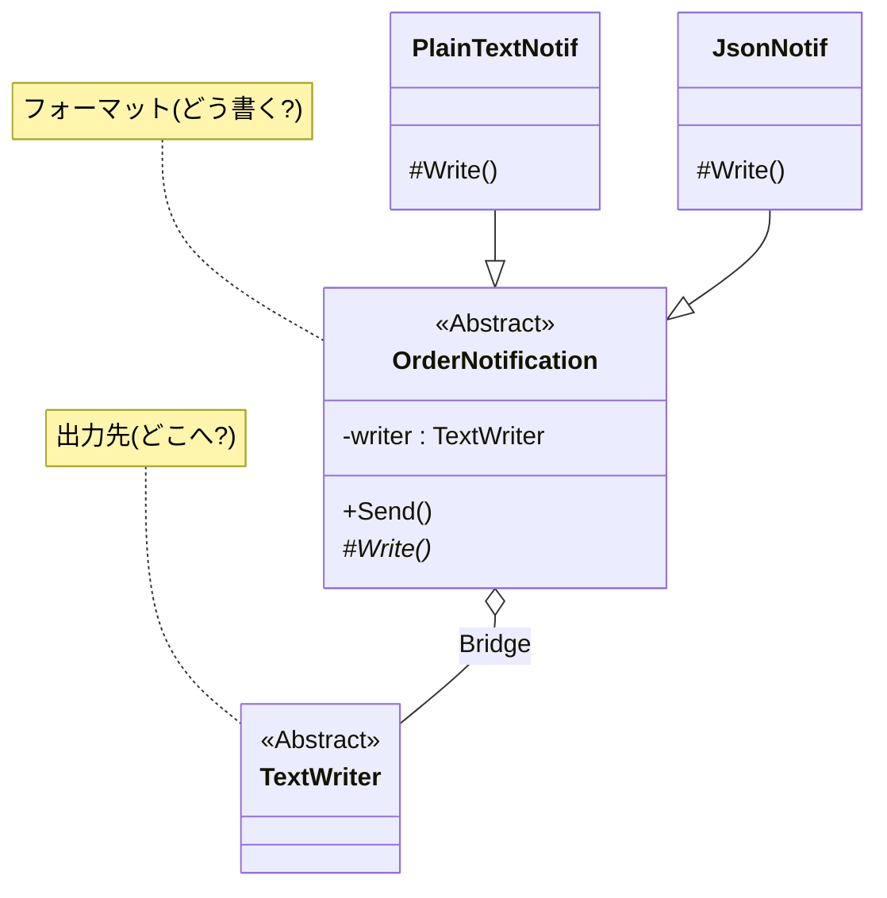

# 第39章：Bridge ③：演習（通知フォーマット×通知先）🔔✉️

## ねらい 🎯

* 「通知フォーマット（例：プレーン/JSON）」と「通知先（例：コンソール/ファイル）」の**2軸が独立して増える**ときに、`if/switch`の掛け算地獄を回避する🌪️
* Bridgeで、**“何を送るか（フォーマット）”** と **“どこへ送るか（通知先）”** を分離して、差し替えやすくする🌉✨
* テスト（MSTest）で「差し替えできてる感」をちゃんと体験する🧪💕

---

## 到達目標 ✅

* 2軸が増える問題（組み合わせ爆発）を、**言葉で説明**できる🙂
* “導入前”の素朴実装を作り、**テストで現状を固定**できる🧷
* Bridgeでリファクタし、**新しいフォーマット/通知先の追加がラク**になったと説明できる🎉
* `TextWriter` / `StringWriter` / `StreamWriter` など **標準クラス中心**で実装できる🧰✨

---

## 手順 🧭

### 1) 導入前：掛け算地獄の素朴実装を作る😵‍💫

まずは「ありがちな形」を作ります。ポイントは、**通知サービスが“フォーマット”も“通知先”も全部知ってる**状態になってること💥

* `NotificationFormat`（フォーマット）
* `NotificationTarget`（通知先）
* `NotificationServiceLegacy`（全部知ってる神クラス化しがち😇→⚠️）

```csharp
using System;
using System.IO;
using System.Text;
using System.Text.Json;

public enum NotificationFormat
{
    PlainText,
    Json,
}

public enum NotificationTarget
{
    Console,
    File,
}

public sealed record Order(string OrderId, string CustomerEmail, decimal Total);

public sealed class NotificationServiceLegacy
{
    public void Notify(
        Order order,
        NotificationFormat format,
        NotificationTarget target,
        string? filePath = null)
    {
        // “通知先”ごとに微妙に仕様が違う…とかが始まると、だいたいこうなる😇
        switch (target)
        {
            case NotificationTarget.Console:
                switch (format)
                {
                    case NotificationFormat.PlainText:
                        Console.WriteLine(BuildPlainText(order));
                        break;

                    case NotificationFormat.Json:
                        // 例えば「コンソールでは見やすくインデントしたい」みたいな差が出ると分岐が太る🍖
                        Console.WriteLine(BuildJson(order, indented: true));
                        break;
                }
                break;

            case NotificationTarget.File:
                if (filePath is null) throw new ArgumentNullException(nameof(filePath));

                switch (format)
                {
                    case NotificationFormat.PlainText:
                        File.AppendAllText(filePath, BuildPlainText(order) + Environment.NewLine, Encoding.UTF8);
                        break;

                    case NotificationFormat.Json:
                        // ファイルは1行JSONが良い、などまた差が出る🌀
                        File.AppendAllText(filePath, BuildJson(order, indented: false) + Environment.NewLine, Encoding.UTF8);
                        break;
                }
                break;
        }
    }

    private static string BuildPlainText(Order order)
        => $"OrderId={order.OrderId}, Email={order.CustomerEmail}, Total={order.Total}";

    private static string BuildJson(Order order, bool indented)
        => JsonSerializer.Serialize(order, new JsonSerializerOptions { WriteIndented = indented });
}
```

ここでの「つらさ」ポイント😇💦

* フォーマットを1個増やす → `switch(format)` が増える
* 通知先を1個増やす → `switch(target)` が増える
* しかも「通知先ごとの微妙な仕様差」が混ざって、**ネストが深くなる**🌋

---

### 2) テストで“現状”を固定する🧪🧷

この章は**演習**なので、「壊さない」ために最初にテストで縛ります✨

MSTest は NuGet 上で **MSTest.TestFramework 4.1.0 / MSTest.TestAdapter 4.1.0** が 2026-02-03 更新になっています。([nuget.org][1])
（テストプロジェクト作成時に合わせて入ることが多いけど、NuGet 更新日はこういう感じだよ〜🗓️✨）
`Microsoft.NET.Test.Sdk` は **18.0.1（2025-11-11 更新）** が見えています。([nuget.org][2])

**テストの狙い**：

* Console 出力できてる？（`Console.SetOut` で捕まえる🎣）
* File 出力できてる？（一時ファイルで確認📄）

```csharp
using Microsoft.VisualStudio.TestTools.UnitTesting;
using System;
using System.IO;

[TestClass]
public class NotificationServiceLegacyTests
{
    [TestMethod]
    public void Notify_Console_PlainText_WritesMessage()
    {
        var svc = new NotificationServiceLegacy();
        var order = new Order("A-001", "a@example.com", 1200m);

        var original = Console.Out;
        try
        {
            using var sw = new StringWriter();
            Console.SetOut(sw);

            svc.Notify(order, NotificationFormat.PlainText, NotificationTarget.Console);

            var text = sw.ToString();
            StringAssert.Contains(text, "OrderId=A-001");
        }
        finally
        {
            Console.SetOut(original); // 後片付け大事🙏
        }
    }

    [TestMethod]
    public void Notify_File_Json_WritesMessage()
    {
        var svc = new NotificationServiceLegacy();
        var order = new Order("B-999", "b@example.com", 999m);

        var temp = Path.GetTempFileName();
        try
        {
            svc.Notify(order, NotificationFormat.Json, NotificationTarget.File, filePath: temp);

            var text = File.ReadAllText(temp);
            StringAssert.Contains(text, "\"OrderId\"");
            StringAssert.Contains(text, "B-999");
        }
        finally
        {
            File.Delete(temp);
        }
    }
}
```

ここまでで、まず **「今の動き」をテストが保証**してくれます🧪✨
（このあと安心してリファクタできる〜！🎉）

---

### 3) Bridgeへリファクタ：2軸を分離する🌉✨




ここからが本番！

今回の“Bridgeの形”はこうします👇

* **フォーマット側（抽象/派生）**：通知本文をどう作る？どう書き出す？📝
* **通知先側（実装）**：どこへ書き出す？（標準の `TextWriter` を採用）✍️

`TextWriter` は最初から「書き込み先の抽象」なので、Bridgeの“実装側”にピッタリ💖

* コンソール：`Console.Out`
* ファイル：`StreamWriter`
* テスト：`StringWriter`（神👼✨）

#### 3-1) Bridgeのコード（最小）🧩

```csharp
using System;
using System.IO;
using System.Text;
using System.Text.Json;

// “抽象(Abstraction)”：通知という概念
public abstract class OrderNotification
{
    protected TextWriter Writer { get; }

    protected OrderNotification(TextWriter writer)
        => Writer = writer ?? throw new ArgumentNullException(nameof(writer));

    public void Send(Order order)
    {
        if (order is null) throw new ArgumentNullException(nameof(order));

        Write(order);
        Writer.WriteLine(); // 行区切りは共通ルールにしておくとラク✨
        Writer.Flush();
    }

    // “差分”だけを派生側へ
    protected abstract void Write(Order order);
}

// “派生(RefinedAbstraction)”：プレーンテキスト通知
public sealed class PlainTextOrderNotification : OrderNotification
{
    public PlainTextOrderNotification(TextWriter writer) : base(writer) { }

    protected override void Write(Order order)
    {
        Writer.Write($"OrderId={order.OrderId}, Email={order.CustomerEmail}, Total={order.Total}");
    }
}

// “派生(RefinedAbstraction)”：JSON通知
public sealed class JsonOrderNotification : OrderNotification
{
    private readonly JsonSerializerOptions _options;

    public JsonOrderNotification(TextWriter writer, bool indented)
        : base(writer)
    {
        _options = new JsonSerializerOptions { WriteIndented = indented };
    }

    protected override void Write(Order order)
    {
        var json = JsonSerializer.Serialize(order, _options);
        Writer.Write(json);
    }
}

// 使い方サンプル（通知先はTextWriterで差し替える）
public static class NotificationExamples
{
    public static void SendToConsole(Order order)
    {
        OrderNotification n = new PlainTextOrderNotification(Console.Out);
        n.Send(order);
    }

    public static void SendToFile(Order order, string path)
    {
        using var writer = new StreamWriter(path, append: true, encoding: Encoding.UTF8);
        OrderNotification n = new JsonOrderNotification(writer, indented: false);
        n.Send(order);
    }
}
```

#### 3-2) 何が嬉しいの？😍

* フォーマット追加（例：Markdown）→ `OrderNotification` の派生を1個増やすだけ🎁
* 通知先追加（例：ネットワーク/別ストレージ）→ `TextWriter` を差し替える or それっぽいWriterを用意🧰
* **通知サービスが「掛け算」を抱えない**！これが超大事🌈

---

### 4) テストを“Bridge版”に寄せる🧪🎉

Bridge化したら、テストがめちゃ楽になります💕

* 通知先に `StringWriter` を刺すだけでOK（副作用ゼロ！）✨
* ファイルも `StreamWriter` で確認できる📄

```csharp
using Microsoft.VisualStudio.TestTools.UnitTesting;
using System.IO;

[TestClass]
public class OrderNotificationBridgeTests
{
    [TestMethod]
    public void PlainText_ToStringWriter_WritesMessage()
    {
        using var sw = new StringWriter();

        OrderNotification n = new PlainTextOrderNotification(sw);
        n.Send(new Order("C-100", "c@example.com", 100m));

        var text = sw.ToString();
        StringAssert.Contains(text, "OrderId=C-100");
        StringAssert.Contains(text, "Total=100");
    }

    [TestMethod]
    public void Json_ToStringWriter_WritesJson()
    {
        using var sw = new StringWriter();

        OrderNotification n = new JsonOrderNotification(sw, indented: false);
        n.Send(new Order("D-200", "d@example.com", 200m));

        var text = sw.ToString();
        StringAssert.Contains(text, "\"OrderId\"");
        StringAssert.Contains(text, "D-200");
    }

    [TestMethod]
    public void Json_ToFile_WritesToDisk()
    {
        var temp = Path.GetTempFileName();
        try
        {
            using (var writer = new StreamWriter(temp, append: false))
            {
                OrderNotification n = new JsonOrderNotification(writer, indented: false);
                n.Send(new Order("E-300", "e@example.com", 300m));
            }

            var text = File.ReadAllText(temp);
            StringAssert.Contains(text, "E-300");
        }
        finally
        {
            File.Delete(temp);
        }
    }
}
```

---

## よくある落とし穴 ⚠️😵

* **WriterのDispose責務が曖昧**

  * `OrderNotification` が `Dispose()` しちゃうと、`Console.Out` みたいな“外から渡されるWriter”を壊す事故が起きる😇
  * この章では「Writerの寿命は呼び出し側が管理」に寄せてるよ🧯✨

* **フォーマット側に業務ルールを混ぜる**

  * 例：「合計が1万円以上なら文言変える」みたいなのをフォーマッタに入れると、責務が太る🍖💦
  * まずは“表示”だけに集中しよ〜🙂

* **Flush/改行のルールがバラバラ**

  * “どこで改行する？”が散らばると地味に崩壊する🌀
  * 今回は `Send()` 側で統一（最後に `WriteLine()`）してるよ✨

* **Console.SetOutの後始末忘れ**

  * ほかのテストに伝染するので、必ず戻す🙏

---

## ミニ演習（10〜30分）🧁⏱️

1. **フォーマットを1個追加**してみよう🎀

* 例：Markdownっぽい通知

  * `## Order`
  * `- OrderId: ...`
  * `- Total: ...`

2. **通知先を増やす（でも標準寄せ）**📦

* 例：`StreamWriter` を `BufferedStream` で包んで高速化（書き込みが多い想定）

  * 「通知先の改善」を、フォーマットに触れずにできたら勝ち🏆✨

3. **Copilot / AI拡張に頼むときのプロンプト例**🤖💬

* 「`OrderNotification` を抽象クラスにして、`TextWriter` を受け取り、`PlainText` と `Json` の派生を作って。Disposeはしないで。MSTestのテストも3本（StringWriter/Json/File）で。」
  👉 出てきたコードは、**Dispose責務**と**改行/Flushの場所**を必ず人間がレビューしてね👀💕

---

## 自己チェック ✅🔍

* 「フォーマット追加」と「通知先追加」が、**別々の変更**としてできる？（片方を足すときにもう片方のコードを触ってない？）
* `switch` を増やす代わりに、**クラス追加だけ**で拡張できる？
* テストで `StringWriter` を刺したとき、**余計な準備なし**で検証できる？
* “通知の本文ロジック”と“書き込み先ロジック”が混ざってない？（責務が薄い？）✨

[1]: https://www.nuget.org/packages/MSTest.TestFramework "https://www.nuget.org/packages/MSTest.TestFramework"
[2]: https://www.nuget.org/packages/Microsoft.NET.Test.Sdk "https://www.nuget.org/packages/Microsoft.NET.Test.Sdk"
