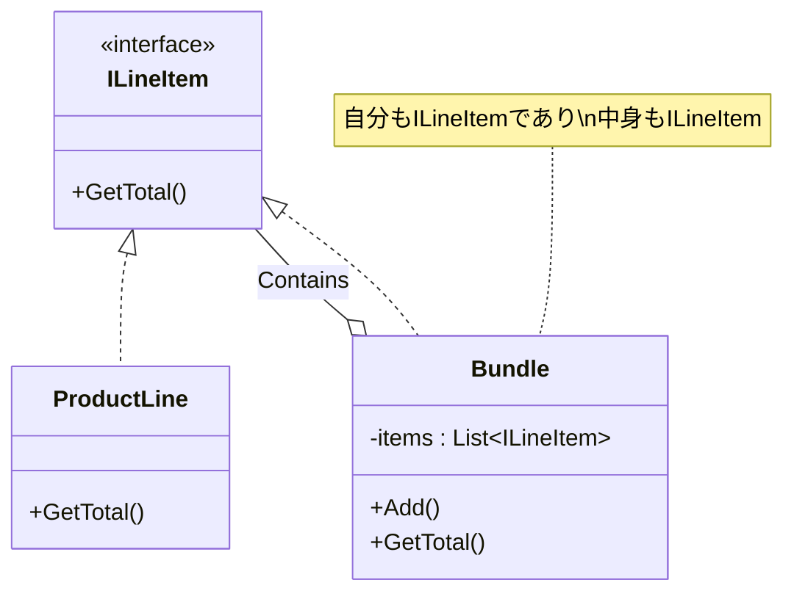

# 第40章：Composite ①：ツリーを同じ扱いにする🌳

## ねらい🎯✨

Composite（コンポジット）は、**ツリー構造（木構造）**を「葉（単品）」と「枝（まとめ）」で分けつつ、**呼び出し側からは“同じもの”として扱える**ようにするパターンだよ🌳💕

たとえばこんなときに役立つよ👇

* 🧾 明細が「単品行」と「セット（中に明細を持つ）」で混ざる
* 📁 フォルダの中に「ファイル」と「フォルダ（中に…）」が混ざる
* 🧩 UIが「ボタン（葉）」と「パネル（子を持つ）」で混ざる

ポイントはこれ✨

* 呼び出し側の `if` / `switch` を減らして、**“同じ操作”で処理できる**ようにする🙆‍♀️

（ちなみに今どきの学習環境は .NET 10 が軸で、C# 14 もその上でサポートされてるよ📦✨）([Microsoft Learn][1])

---

## 到達目標✅🌟

この章が終わったら、次のことができるようになるよ💪😊

* 🌳 Compositeが解く「困りごと」を自分の言葉で説明できる
* 🧠 「葉（Leaf）」と「枝（Composite）」を **同じインターフェイスで扱う**意味がわかる
* 🧾 “単品”と“セット”が混ざる明細でも、`GetTotal()` みたいな **同一操作で合計できる**
* 📁 .NETの身近な例（フォルダ階層っぽい発想）に結びつけて理解できる

---

## 手順🧭🛠️

### 1) まず「困りごと」を1行にする📝

Compositeが必要になる典型はこれ👇

> 「単品」と「まとめ」が混ざってるのに、呼び出し側で毎回分岐しててつらい🥲

例：明細の合計を出したいのに…

* 単品なら `単価×数量`
* セットなら `中身を全部足す`
  …って、呼び出し側が判定して回り始める💦

### 2) “同じ扱い”の入口（Component）を決める🚪✨




まずは **同じ操作** を1つ決めるよ！
今回は「合計金額」を例にして `GetTotal()` にするね🧾💰

* Component：`ILineItem`（明細っぽいものの共通口）
* Leaf：`ProductLine`（単品行）
* Composite：`Bundle`（セット＝子を持つ）

### 3) Leaf（単品）は“自分だけで完結”🌱

Leafは「子を持たない」ので、合計は単純だよ🙂

### 4) Composite（まとめ）は“子に委譲して足す”🌿➕

Compositeは自分の中に子（Component）を持って、同じ操作を子に投げるよ✨
この **“再帰っぽさ”** がCompositeの気持ちよさポイント🌳💕

---

### 5) 最小コードで体感しよう（業務っぽい明細モデル）🧪✨

「単品」と「セット」を同じ `ILineItem` として扱う例だよ👇
（学習用に小さくしてるけど、考え方は実務でもそのまま使える💡）

```csharp
using System;
using System.Collections.Generic;
using System.Linq;

public interface ILineItem
{
    decimal GetTotal();
}

public sealed class ProductLine : ILineItem
{
    public ProductLine(string name, decimal unitPrice, int quantity)
    {
        Name = name;
        UnitPrice = unitPrice;
        Quantity = quantity;
    }

    public string Name { get; }
    public decimal UnitPrice { get; }
    public int Quantity { get; }

    public decimal GetTotal() => UnitPrice * Quantity;
}

public sealed class Bundle : ILineItem
{
    private readonly List<ILineItem> _items = new();

    public Bundle(string name) => Name = name;

    public string Name { get; }

    // コレクション初期化子 { item1, item2 } を使いたいので Add を用意💡
    public void Add(ILineItem item) => _items.Add(item);

    public decimal GetTotal() => _items.Sum(x => x.GetTotal());
}

// 使い方サンプル
public static class Demo
{
    public static decimal Calc()
    {
        ILineItem cart = new Bundle("カート")
        {
            new ProductLine("りんご", 120m, 2),
            new ProductLine("バナナ", 80m, 1),
            new Bundle("お菓子セット")
            {
                new ProductLine("チョコ", 150m, 1),
                new ProductLine("クッキー", 200m, 1),
            }
        };

        // cart が「単品」でも「セット」でも、同じ GetTotal() でOK✨
        return cart.GetTotal();
    }
}
```

ポイント🎀

* 呼び出し側は「単品か？セットか？」を **知らなくてOK** 🙆‍♀️
* どれも `ILineItem` として **同じメッセージ（GetTotal）** を送るだけ📨✨

---

### 6) .NET標準の“それっぽさ”も見ておく📁✨

Compositeの発想は、フォルダ階層みたいな世界と相性がいいよ📁🌳
.NETのライブラリも毎年いろいろ強化されてるから、公式の “What’s new” を追う習慣があると強い💪📚([Microsoft Learn][2])

「ツリーを同じ扱いにする」ノリだけ、`DirectoryInfo` で雰囲気を味わうならこんな感じ👇

```csharp
using System;
using System.IO;

public static class FileTreePrinter
{
    public static void Print(FileSystemInfo node, int indent = 0)
    {
        Console.WriteLine($"{new string(' ', indent)}- {node.Name}");

        if (node is DirectoryInfo dir)
        {
            // ファイル/フォルダをまとめて列挙できるAPIがあるのが嬉しい✨
            foreach (var child in dir.EnumerateFileSystemInfos())
            {
                Print(child, indent + 2);
            }
        }
    }
}
```

ここでは `FileSystemInfo` を「共通口」として扱ってて、気分はCompositeっぽいよね☺️
（ただし **子を列挙できるのは DirectoryInfo だけ** なので、そこは `is DirectoryInfo` で分岐してるよ〜）

---

## よくある落とし穴⚠️😵

* **子の管理責務があいまい**（誰が `Add/Remove` するの？）🤔
  → 追加・削除のルール（重複OK？順序いる？）を決めよ✨
* **循環参照**（親が子を持ち、子が親を持ち…でぐるぐる）🌀
  → まずは「親参照なし」で始めるのが安全🙆‍♀️
* **“同じ操作”が増えすぎる**📈
  → Component に操作を詰め込みすぎると、全クラスの修正が増えてしんどい💦
* **CompositeがGod Object化**（何でも持ち始める）👾
  → 「合計」「列挙」「表示」みたいに責務が混ざったら分ける合図🚦
* **テストしづらい**（中が大きすぎる）🧪
  → “小さいセット”からテストして、階層を1段ずつ増やすのがコツ💕

---

## ミニ演習（10〜30分）✍️🌸

### 演習A：分岐を消して合計を出す🧾➕

次のどっちかを選んで、Compositeで `GetTotal()` を作ってみてね✨

* 🍱 メニュー（単品/セット/セットの中にセットOK）
* 🛒 カート（単品/まとめ買いパック/ギフトセット）

条件👇

* 呼び出し側は **`if/switch` なし** で合計が出ること
* テストを1本でいいから書くこと🧪✨

```csharp
// MSTestの超ミニ例（雰囲気）
using Microsoft.VisualStudio.TestTools.UnitTesting;

[TestClass]
public class CompositeTests
{
    [TestMethod]
    public void Total_is_sum_of_tree()
    {
        ILineItem cart = new Bundle("カート")
        {
            new ProductLine("りんご", 120m, 2),
            new Bundle("お菓子セット")
            {
                new ProductLine("チョコ", 150m, 1),
                new ProductLine("クッキー", 200m, 1),
            }
        };

        Assert.AreEqual(120m * 2 + 150m + 200m, cart.GetTotal());
    }
}
```

### 演習B：AIに雛形を作らせるなら（短い指示でOK）🤖📝

* 「Compositeで、単品とセットを同じ `GetTotal()` で扱いたい。
  `ILineItem` / `ProductLine` / `Bundle` を最小で。
  余計な抽象クラスや汎用フレームワークは禁止。テストも1つ」
  みたいに **禁止事項を先に書く** のがコツだよ🚫✨

---

## 自己チェック✅🔍

* 「葉と枝を同一視する」って何？を **30秒で説明**できる？⏱️🙂
* 呼び出し側が「単品/セット」を判定してない？（`if` が残ってない？）👀
* Composite側の責務が増えすぎてない？（合計以外も抱えすぎてない？）🎒💦
* ツリーが1段深くなっても、テストがすぐ書ける設計になってる？🧪✨

（次章の「身近な例」で、さらに“腑に落ちる”感じになるよ📁💕）

[1]: https://learn.microsoft.com/en-us/dotnet/desktop/winforms/whats-new/net100 "https://learn.microsoft.com/en-us/dotnet/desktop/winforms/whats-new/net100"
[2]: https://learn.microsoft.com/ja-jp/dotnet/core/whats-new/dotnet-10/overview "https://learn.microsoft.com/ja-jp/dotnet/core/whats-new/dotnet-10/overview"
