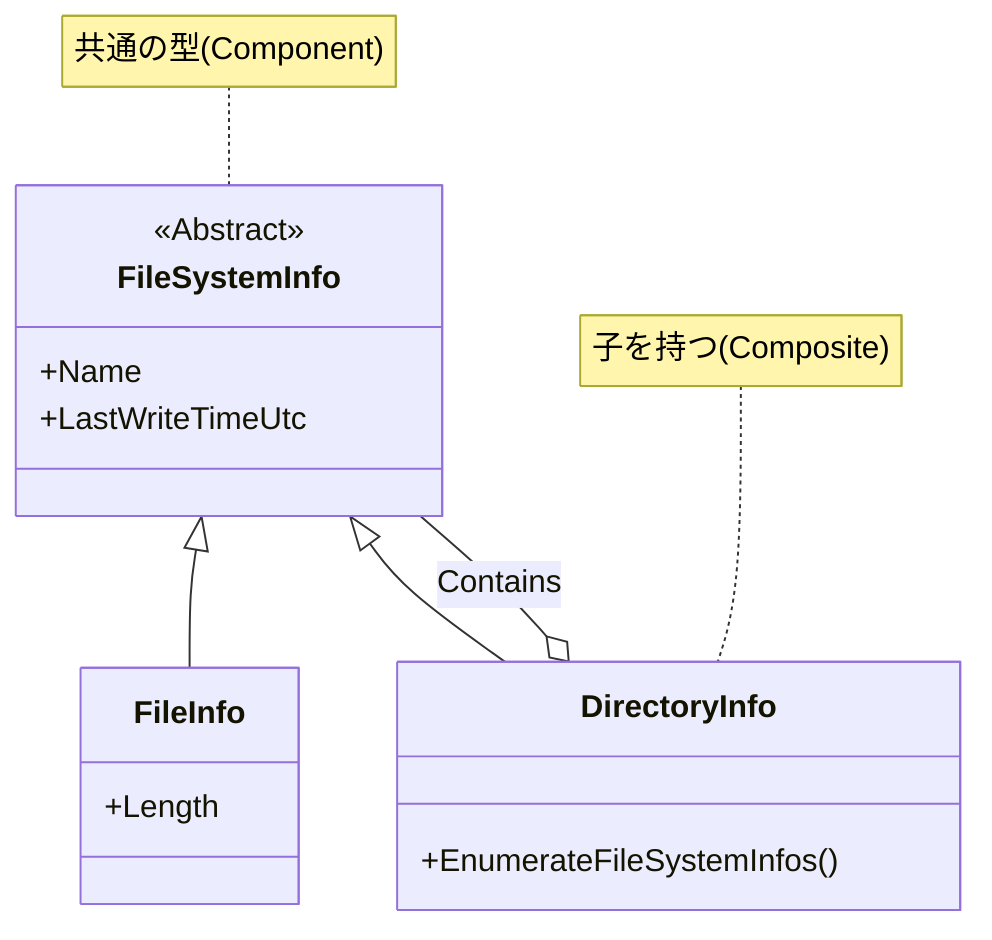

# 第41章：Composite ②：身近な例で理解（フォルダ階層の発想）📁

## ねらい 🎯✨

* Composite（コンポジット）が「**ツリー構造を同じ扱いにする**」って感覚を、フォルダ階層でスッと理解する🌳💡
* .NET の **DirectoryInfo / FileInfo / FileSystemInfo** を読みながら、「どこがCompositeっぽい？」を見抜けるようになる👀📚

---

## 到達目標 ✅🌸

* 「**File（葉）** と **Directory（枝）** を、同じ型（基底）として扱える理由」を説明できる🙂
* `DirectoryInfo` から子要素を列挙して、**同じ処理（表示/集計）** をツリー全体に適用できる🧩✨
* 「`Get...` と `Enumerate...` の違い」を、使いどころと一緒に言える📦🚶‍♀️

---

## 手順 🧭🛠️

### 1) まず「Compositeの登場人物」をフォルダで当てはめる 🧩🌳


Compositeはざっくりこう👇

* **Component（共通インターフェイス/基底）**：共通で扱える型
* **Leaf（葉）**：子を持たない
* **Composite（枝）**：子を持つ（中にぶら下がる）

ファイルシステムだとこうなるよ👇

* **Component**：`FileSystemInfo`（`FileInfo` と `DirectoryInfo` の共通の基底クラス）([Microsoft Learn][1])
* **Leaf**：`FileInfo`（ファイル）
* **Composite**：`DirectoryInfo`（フォルダ。中身＝子要素を持てる）

この「**共通の型で、ファイルもフォルダも受け取れる**」って時点で、Compositeの空気が出てる☺️✨




---

### 2) 子要素を取るAPIを “読む”（ここが .NET のCompositeっぽさ）📚👀

`DirectoryInfo` は、子要素（ファイル/フォルダ）を **まとめて `FileSystemInfo` として返せる** よ🙌

* `EnumerateFileSystemInfos()`：列挙（`IEnumerable<FileSystemInfo>`）([Microsoft Learn][2])
* `GetFileSystemInfos()`：配列で一括取得（`FileSystemInfo[]`）([Microsoft Learn][3])

つまり、呼び出し側は **「それがファイルかフォルダか」だけを必要なときに見分ければOK**。
構造（ツリー）を “同じ扱い” に近づけられるってことだね🙂🌿

---

### 3) ミニ実装：フォルダツリーを「同じ操作」で表示する 📁➡️🌳

ポイントはこれ👇

* 子要素は `FileSystemInfo` として受け取る（= Component）
* `DirectoryInfo` だったら再帰（= Compositeとして子へ）
* `FileInfo` なら表示だけ（= Leaf）

```csharp
using System;
using System.IO;

public static class Program
{
    public static void Main(string[] args)
    {
        var path = args.Length > 0 ? args[0] : Environment.CurrentDirectory;
        var root = new DirectoryInfo(path);

        if (!root.Exists)
        {
            Console.WriteLine($"見つからないよ: {root.FullName}");
            return;
        }

        PrintTree(root, depth: 0, maxDepth: 3);
    }

    private static void PrintTree(DirectoryInfo dir, int depth, int maxDepth)
    {
        if (depth > maxDepth) return;

        Console.WriteLine($"{Indent(depth)}📁 {dir.Name}");

        try
        {
            foreach (var entry in dir.EnumerateFileSystemInfos())
            {
                // 取得したメタ情報が古い可能性があるので更新（必要なときだけでOK）
                entry.Refresh();

                // ジャンクション/シンボリックリンク等で無限ループしやすいので軽く回避
                if ((entry.Attributes & FileAttributes.ReparsePoint) != 0)
                {
                    Console.WriteLine($"{Indent(depth + 1)}🪝 {entry.Name}（リンク系っぽいのでスキップ）");
                    continue;
                }

                switch (entry)
                {
                    case DirectoryInfo childDir:
                        PrintTree(childDir, depth + 1, maxDepth);
                        break;

                    case FileInfo file:
                        Console.WriteLine($"{Indent(depth + 1)}📄 {file.Name}");
                        break;

                    default:
                        Console.WriteLine($"{Indent(depth + 1)}❓ {entry.Name}");
                        break;
                }
            }
        }
        catch (UnauthorizedAccessException)
        {
            Console.WriteLine($"{Indent(depth + 1)}🔒 アクセスできないフォルダなので中身は見れなかったよ");
        }
        catch (DirectoryNotFoundException)
        {
            Console.WriteLine($"{Indent(depth + 1)}⚠️ 途中でフォルダが消えた/移動したみたい");
        }
        catch (IOException ex)
        {
            Console.WriteLine($"{Indent(depth + 1)}⚠️ IOエラー: {ex.Message}");
        }
    }

    private static string Indent(int depth) => new string(' ', depth * 2);
}
```

`DirectoryInfo.Exists` で存在確認できるよ([Microsoft Learn][4])。
あと `FileSystemInfo.Attributes` を見るときは、取得した値がキャッシュされることがあるので、必要なら `Refresh()` を使うのが安心🙆‍♀️([Microsoft Learn][5])

---

### 4) もう一歩：ツリー全体に「同じルール」をかける（更新日時でフィルタ）⏰🔎

Compositeが嬉しいのは、「**構造（ツリー）** と **操作（やりたいこと）** を分けやすい」こと！

たとえば「最終更新が古いものだけ見たい」ってとき👇
`LastWriteTimeUtc` も `FileSystemInfo` 側にあるから、ファイル/フォルダを同じ目線で扱えるよ✨([Microsoft Learn][6])

* **同じ型で受ける**（= `FileSystemInfo`）
* **同じ条件で判定**（更新日時）
* 必要なら `Refresh()`（値が古い可能性）([Microsoft Learn][6])

（実装は3) の `entry.Refresh()` → `entry.LastWriteTimeUtc` を見て `continue` するだけでOKだよ🙂🌸）

---

### 5) `Get...` と `Enumerate...` の使い分け（実務で超大事）📦⚡

* `GetFileSystemInfos()` は **配列で全部取る**（一括）([Microsoft Learn][3])

  * 小さめのフォルダなら手軽✨
* `EnumerateFileSystemInfos()` は **列挙で順に取る**（foreachで流せる）([Microsoft Learn][2])

  * 件数が多いところで強い💪

「まず1件だけ探して見つかったら止めたい」みたいなときは、`Enumerate...` の方が相性いいことが多いよ😊

---

## よくある落とし穴 ⚠️😵‍💫

* **リンク系（ジャンクション/シンボリックリンク）で無限ループ**：`ReparsePoint` を雑にでも避けるのが安全🪝
* **アクセス拒否で例外が飛ぶ**：`UnauthorizedAccessException` は普通に起きるもの🔒
* **巨大フォルダで `Get...` 一括→重い**：件数が多そうなら `Enumerate...` を優先しよ🙂
* **メタ情報が古いまま使っちゃう**：`Attributes` や `LastWriteTimeUtc` は必要なら `Refresh()` を挟む🙆‍♀️([Microsoft Learn][5])
* **“Composite用の自作ツリークラス”を作り始める**：今回は標準クラスで体感する回だから、まずは `DirectoryInfo/FileInfo` で十分だよ🧘‍♀️✨

---

## 演習 📝🎀（10〜30分）

1. **深さ制限を変えてみよう**

* `maxDepth` を 1 / 2 / 5 に変えて、表示の変化を確認👀

2. **ツリー集計：ファイル数とフォルダ数を数えよう**

* `FileSystemInfo` を受け取って、`DirectoryInfo` なら再帰、`FileInfo` ならカウント加算📊

3. **“更新が古いものだけ”表示**

* 「30日より古い」みたいな条件でフィルタして、古い順に出す（できたら最高💯✨）

---

## チェック ✅💖

* `DirectoryInfo` から取れる子要素を、**共通の型 `FileSystemInfo` で扱える**って説明できる？([Microsoft Learn][1])
* “葉（File）” と “枝（Directory）” を **同じ処理の枠で回せる**って、コードで見せられる？🌳
* `GetFileSystemInfos()` と `EnumerateFileSystemInfos()` の違い（配列/列挙）を言える？([Microsoft Learn][3])
* アクセス拒否やリンクで詰まらない工夫（例外処理/`ReparsePoint`）が入ってる？🔒🪝

[1]: https://learn.microsoft.com/ja-jp/dotnet/api/system.io.filesysteminfo.lastwritetime?view=net-8.0&utm_source=chatgpt.com "FileSystemInfo.LastWriteTime プロパティ (System.IO)"
[2]: https://learn.microsoft.com/ja-jp/dotnet/api/system.io.directoryinfo.enumeratefilesysteminfos?view=net-8.0 "DirectoryInfo.EnumerateFileSystemInfos メソッド (System.IO) | Microsoft Learn"
[3]: https://learn.microsoft.com/ja-jp/dotnet/api/system.io.directoryinfo.getfilesysteminfos?view=net-8.0 "DirectoryInfo.GetFileSystemInfos メソッド (System.IO) | Microsoft Learn"
[4]: https://learn.microsoft.com/ja-jp/dotnet/api/system.io.filesysteminfo.fullname?view=net-8.0&utm_source=chatgpt.com "FileSystemInfo.FullName プロパティ (System.IO)"
[5]: https://learn.microsoft.com/ja-jp/dotnet/api/system.io.filesysteminfo.attributes?view=net-8.0&utm_source=chatgpt.com "FileSystemInfo.Attributes プロパティ (System.IO)"
[6]: https://learn.microsoft.com/ja-jp/dotnet/api/system.io.filesysteminfo.lastwritetimeutc?view=net-10.0&utm_source=chatgpt.com "FileSystemInfo.LastWriteTimeUtc Property (System.IO)"
