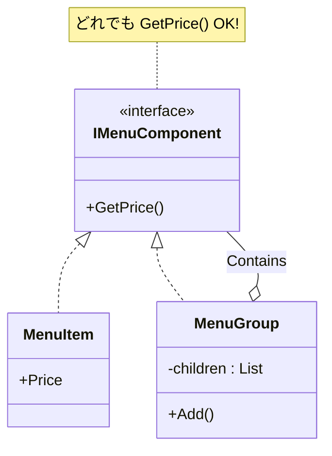

# 第42章：Composite ③：演習（メニュー構造をCompositeで）🍱

## ねらい 🎯✨

* 「単品」「セット」「カテゴリ」みたいに、**階層（ツリー）**になってるデータを“同じ扱い”で操作できるようにするよ〜😊
* `if (型チェック)` や `switch` で分岐しまくるコードを、**再帰（ツリーのたどり）**でスッキリさせるよ〜🧹✨
* フォルダ構造（ファイル/フォルダ）を扱う感覚に近いので、**“あ〜こういうやつね！”** になりやすいパターンだよ📁💡

---

## 到達目標 ✅🌸

* 「メニュー（カテゴリ）」「メニュー（単品）」を**同じインターフェイス**で扱える 🍔🥗
* どの階層でも `GetPrice()` で **合計金額**が取れる 💰✨
* テストで「合計が合ってる」「葉（単品）は子がいない」を確認できる 🧪✅
* 「Compositeを入れるべき状況/やめるべき状況」が言えるようになる 🧠🔍

---

## 手順 🧭👣

### 1) まず“Compositeが欲しくなる前”を体験 😵‍💫🔥


「単品」と「セット（中に単品が入る）」を別クラスで持つと、合計計算がこうなりがち👇

```csharp
// こういう「型で分岐」スタイルが増えるとつらい…😭
public sealed class MenuItem
{
    public string Name { get; }
    public decimal Price { get; }
    public MenuItem(string name, decimal price) { Name = name; Price = price; }
}

public sealed class MenuSet
{
    public string Name { get; }
    public List<object> Items { get; } = new(); // object混在がつらい…😇
    public MenuSet(string name) { Name = name; }
}

public static decimal CalcTotal(object menu)
{
    if (menu is MenuItem item) return item.Price;

    if (menu is MenuSet set)
    {
        decimal total = 0;
        foreach (var x in set.Items)
            total += CalcTotal(x); // 再帰自体は良いけど、型分岐が増えがち😵
        return total;
    }

    throw new InvalidOperationException("Unknown menu type");
}
```

ポイントはここ👇

* 「新しい種類（例：割引セット、期間限定カテゴリ…）」が増えるたびに `if/switch` が増える 😭
* `object` で混ぜ始めると、型安全が崩れて事故りやすい 💥

---

### 2) “同じ扱い”のための共通インターフェイスを作る 🧩✨

Compositeの基本はこれだよ〜👇

* **葉（Leaf）**：単品メニュー 🍙
* **枝（Composite）**：カテゴリ/セット（子を持つ） 🍱🌳
* **共通操作**：`GetPrice()` と `GetChildren()`（子の列挙）

```csharp
using System.Collections.Generic;

public interface IMenuComponent
{
    string Name { get; }
    decimal GetPrice();                      // どの階層でも「価格（合計）」を返せる💰
    IEnumerable<IMenuComponent> GetChildren(); // 子を列挙（単品は空）🌿
}
```




---

### 3) 葉（単品）を実装する 🍔✨

単品は子を持たないから、`GetChildren()` は空でOKだよ😊

```csharp
using System;
using System.Collections.Generic;

public sealed class MenuItem : IMenuComponent
{
    public string Name { get; }
    public decimal Price { get; }

    public MenuItem(string name, decimal price)
    {
        if (string.IsNullOrWhiteSpace(name)) throw new ArgumentException("name is required", nameof(name));
        if (price < 0) throw new ArgumentOutOfRangeException(nameof(price));
        Name = name;
        Price = price;
    }

    public decimal GetPrice() => Price;

    public IEnumerable<IMenuComponent> GetChildren() => Array.Empty<IMenuComponent>();
}
```

---

### 4) 枝（カテゴリ/セット）を実装する 🍱🌳

中に子を持てるクラスだよ〜。合計は **子の合計**✨

```csharp
using System;
using System.Collections.Generic;
using System.Linq;

public sealed class MenuGroup : IMenuComponent
{
    private readonly List<IMenuComponent> _children = new();

    public string Name { get; }

    public MenuGroup(string name)
    {
        if (string.IsNullOrWhiteSpace(name)) throw new ArgumentException("name is required", nameof(name));
        Name = name;
    }

    // ツリー構築用（Fluentで書けて便利だけど、やりすぎ注意😉）
    public MenuGroup Add(IMenuComponent child)
    {
        _children.Add(child ?? throw new ArgumentNullException(nameof(child)));
        return this;
    }

    public decimal GetPrice() => _children.Sum(c => c.GetPrice());

    public IEnumerable<IMenuComponent> GetChildren() => _children;
}
```

---

### 5) ツリーを作って、同じ操作で合計を取る 💰🎉

「単品」「セット」「カテゴリ」どれでも `GetPrice()` でOKになるのが嬉しいところ🥰

```csharp
var lunch = new MenuGroup("ランチ🍝")
    .Add(new MenuItem("パスタ", 900m))
    .Add(new MenuItem("ドリンク", 200m));

var special = new MenuGroup("スペシャル🍰")
    .Add(lunch)
    .Add(new MenuItem("デザート", 300m));

Console.WriteLine(special.GetPrice()); // 1400
```

---

### 6) 表示（ツリーの再帰）も“同じ扱い”でできる 📜✨

「どのノードでも子を列挙できる」から、表示も素直に書けるよ〜😊

```csharp
using System.Text;

public static class MenuPrinter
{
    public static string ToPrettyString(this IMenuComponent root)
    {
        var sb = new StringBuilder();
        Append(root, sb, 0);
        return sb.ToString();
    }

    private static void Append(IMenuComponent node, StringBuilder sb, int depth)
    {
        sb.Append(' ', depth * 2);
        sb.Append(node.Name);
        sb.Append(" : ");
        sb.Append(node.GetPrice().ToString("0.##"));
        sb.AppendLine();

        foreach (var child in node.GetChildren())
            Append(child, sb, depth + 1);
    }
}
```

---

### 7) テストで「合計が正しい」を固定する 🧪✅

MSTestは標準で扱いやすいよ〜。最近の更新もちゃんと追えるのが安心ポイント💖

* `MSTest.TestFramework` は 4.0.2 が 2026-02-05 更新だよ ([nuget.org][1])
* `MSTest.TestAdapter` は 4.1.0 が 2026-02-03 更新だよ ([nuget.org][2])
* `Microsoft.NET.Test.Sdk` は 17.13.0 が 2026-02-04 更新だよ ([nuget.org][3])

```csharp
using Microsoft.VisualStudio.TestTools.UnitTesting;
using System.Linq;

[TestClass]
public class MenuCompositeTests
{
    [TestMethod]
    public void GroupPrice_is_sum_of_children()
    {
        var lunch = new MenuGroup("ランチ")
            .Add(new MenuItem("パスタ", 900m))
            .Add(new MenuItem("ドリンク", 200m));

        Assert.AreEqual(1100m, lunch.GetPrice());
    }

    [TestMethod]
    public void NestedGroupPrice_is_sum_recursively()
    {
        var lunch = new MenuGroup("ランチ")
            .Add(new MenuItem("パスタ", 900m))
            .Add(new MenuItem("ドリンク", 200m));

        var special = new MenuGroup("スペシャル")
            .Add(lunch)
            .Add(new MenuItem("デザート", 300m));

        Assert.AreEqual(1400m, special.GetPrice());
    }

    [TestMethod]
    public void Leaf_has_no_children()
    {
        var item = new MenuItem("コーヒー", 200m);
        Assert.IsFalse(item.GetChildren().Any());
    }
}
```

---

### 8) AI補助（Copilot/Codex）を“安全に”使うコツ 🤖🧠✨

AIにお願いする時は、**やりすぎ抽象化**を止める一文が超大事だよ〜⚠️😆

* ✅ こう頼む（おすすめ）

  * 「`IMenuComponent` と `MenuItem`, `MenuGroup` を **最小構成**で作って」
  * 「`GetPrice()` は **合計のみ**、汎用フレームワーク化しないで」
  * 「例外/引数チェックは最低限で」

* ❌ こうなると危険（戻そう）

  * `BaseComposite<T>` とか謎の抽象階層が増える
  * 汎用コンテナ・ビルダー・ファクトリが大量発生する 😇
  * “何でもできる”けど、教材の目的（ツリーを同じ扱い）が霞む

---

## よくある落とし穴 ⚠️😵

1. **「追加/削除」まで共通化しようとして泥沼**🌀

* Compositeは「同じ操作で扱う」が目的。
* 今回は `GetPrice()` と `GetChildren()` に絞ってるからシンプルだよ😊✨

2. **子が可変で、途中状態が壊れる**💥

* 例：合計計算の前提が崩れる
* まずは小さく（`Add()`だけ）でOK👌

3. **“表示”が目的でCompositeを入れてしまう**🖼️

* 表示だけならDTO整形で済むことも多いよ〜
* 「階層に対して同じ操作（合計/探索/フィルタ）」が複数ある時が本命🔥

---

## ミニ演習（10〜30分）⏱️🍀

### 演習A：検索（ツリー探索）を1つ追加 🔍✨

* 「名前に `"ドリンク"` が入るノードだけ列挙」みたいな関数を作ってみよう😊
* ヒント：`GetChildren()` を再帰でたどるだけ！

### 演習B：ツリー表示をテストで固定 🧪📝

* `ToPrettyString()` の出力に `"  "` のインデントが入ってるか、`StringAssert.Contains` で確認してみよう✨

---

## チェック ✅💮

* [ ] `MenuItem` と `MenuGroup` を **同じ型（IMenuComponent）** として扱えてる？ 🧩
* [ ] `GetPrice()` の呼び出し側に **型分岐（if/switch）** が無い？ 🚫
* [ ] テストで「合計」「ネスト」「葉に子がない」を固定できた？ 🧪✅
* [ ] 新しい種類（例：季節カテゴリ）を足しても、呼び出し側が増改築にならないイメージが持てた？ 🌸🏗️

---

[1]: https://www.nuget.org/packages/MSTest.TestFramework/ "
        NuGet Gallery
        \| MSTest.TestFramework 4.1.0
    "
[2]: https://www.nuget.org/packages/MSTest.TestAdapter/ "
        NuGet Gallery
        \| MSTest.TestAdapter 4.1.0
    "
[3]: https://www.nuget.org/packages/Microsoft.NET.Test.Sdk/ "
        NuGet Gallery
        \| Microsoft.NET.Test.Sdk 18.0.1
    "
