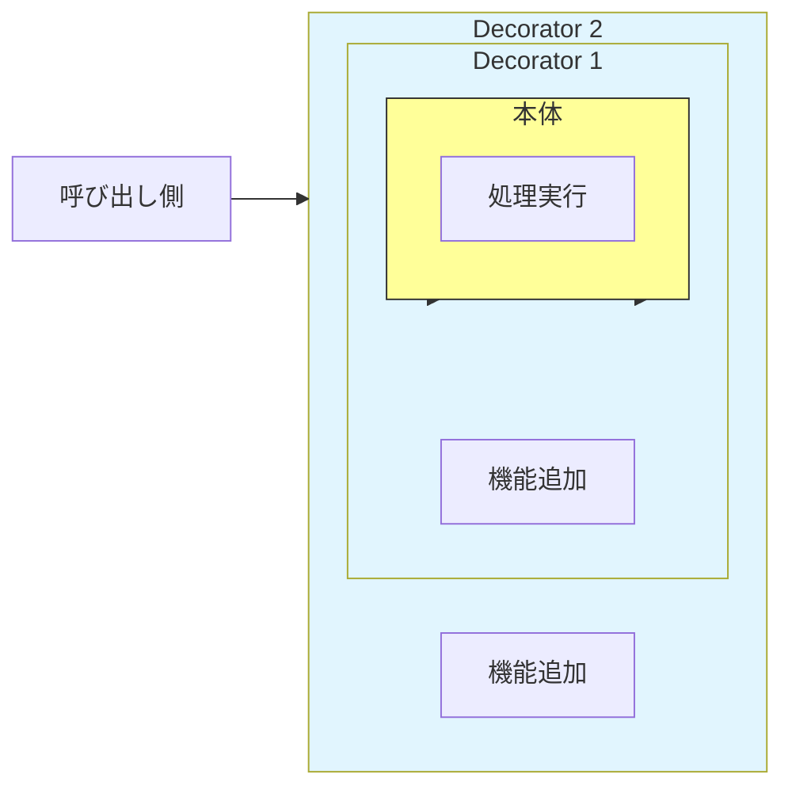

# 第43章：Decorator ①：包んで機能を足す🎁✨

## ねらい

Decorator（デコレータ）は、**既存の処理（本体）を壊さずに**、あとから「機能を上乗せ」していくための考え方だよ〜😊✨
ポイントは **継承じゃなくて“包む（wrap）”** こと！

.NETだと `Stream` 周りが超わかりやすい例で、`BufferedStream`（バッファ）や `GZipStream`（圧縮）みたいに、**別のStreamを包んで機能を足す**のが定番だよ💧🧵 ([hanachiru-blog.com][1])

---

## 到達目標

この章が終わったら、次ができるようになろう🧡

* Decoratorが解決する「困りごと」を自分の言葉で言える🗣️✨
* 「Decoratorっぽい場面」かどうか見分けられる👀🎯
* **“同じインターフェースのまま包む”** っていう構造を作れる🎁
* **順番・Dispose・例外**みたいな落とし穴に先回りできる⚠️🧯

---

## 手順

### 1) まず「困りごと」を1行で言う📝


Decoratorがハマる症状はこれ👇

* もとの処理は同じなのに、**ログ・計測・リトライ・圧縮**みたいな“横から足す機能”が増える📈🧩
* `if` や「オプション引数の増殖」で呼び出し側がぐちゃぐちゃになる😵‍💫
* 組み合わせ（ログあり×圧縮あり×暗号化あり…）が増えて爆発する💥




---

### 2) 「本体（Component）」の契約を決める🤝✨

Decoratorは **本体と同じ契約**（interface）を守るのが大事💡
例：通知を送る契約を `INotificationSender` にする、みたいな感じ📣

ここで意識するのは👇

* 引数・戻り値・例外・`CancellationToken` を “契約” として揃える🧾✅
* Decoratorが勝手に契約を変えない（返す型変えたり、例外握りつぶしたりしない）🙅‍♀️

---

### 3) Decoratorの“骨格”を作る🦴🎁

Decoratorの形はいつもシンプル！

* 自分も `INotificationSender` を実装する
* 中に `INotificationSender inner` を持つ
* 基本は **innerに委譲して、その前後に処理を足す** ✨

---

### 4) 「足したい機能」ごとに1つずつ分ける🍰➡️🍰🍰

Decoratorは **1クラス=1つの“付け足し”** が読みやすいよ😊
（ログ＋計測を1クラスにまとめると、後で外したい時に困りがち💦）

---

### 5) 組み合わせは“順番”が命🧩🔁

包む順番で意味が変わることがあるよ⚠️

* `Stream` だと **圧縮→暗号化** と **暗号化→圧縮** は全然ちがう（暗号化するとランダムっぽくなるから圧縮しにくい、など）🗜️🔐
* ログとリトライも、どっちを外側に置くかでログ量が変わる📝🔁

---

### 6) .NETの超定番で感覚を掴む（Stream）💧✨

`BufferedStream` は「別のStreamにバッファ層を足す」ものだよ🧵 ([hanachiru-blog.com][1])
`GZipStream` は「別のStreamを包んで圧縮/解凍するStream」だよ🗜️ ([Microsoft Learn][2])
さらに `CryptoStream` みたいに「暗号化を足す」タイプもあるよ🔐 ([Microsoft Learn][3])

---

### 7) AI補助を使うなら“骨格だけ”作らせる🤖✍️

AIに頼むときは、これだけ先に書いちゃうと事故りにくいよ👇

* 「**同じインターフェースのまま** inner に委譲すること」
* 「**契約（例外/戻り値）を変えない**こと」
* 「**汎用フレームワーク化しない**（今回のドメインだけでOK）」

---

## 落とし穴

Decoratorは便利だけど、ここでつまずきやすいよ〜⚠️💦

1. **順番で挙動が変わる**
   「どれを外側にする？」を意識しないと、あとで混乱する😵‍💫🔁

2. **Dispose（資源管理）がズレる**
   たとえば `GZipStream` は、`Dispose` 時に下のストリームも閉じることがあるよ。
   必要なら `leaveOpen` で「下は閉じない」を指定できる（公式の引数説明にあるよ）🧯 ([Microsoft Learn][4])

3. **本体が見えなくなる（包みすぎ問題）**
   Decoratorが5枚くらい重なると「いま何が起きてるの？」ってなる😂
   👉 対策：**“目的が説明できる分だけ”** にする、外側で組み立てを見える化する👀✨

4. **Decoratorが契約を変えちゃう**
   例外を握りつぶす、勝手にリトライしてタイムアウト無視する…とかは危険😇
   👉 “本体と同じ契約”を守るのがルール🧾✅

---

## 演習

### 演習1：Streamを“重ねて”Decorator感を体に入れる💧🧩（10〜20分）

* `FileStream` に対して `BufferedStream` を噛ませる
* さらに `GZipStream` を噛ませて、テキストを書き込む
* 「どれを `using` で包んでるか」を見て、“包む”を体感してね😊✨
  （`BufferedStream` が別のStreamにバッファ層を足す、って説明は公式にもあるよ） ([hanachiru-blog.com][1])

---

### 演習2：業務ミニ例でDecoratorを作る🎁📝（20〜30分）

下のコードは「通知送信」にログと計測を足す例だよ📣✨
ログは .NET の `ILogger` を使うのが定番（拡張ロギングの仕組み）📝 ([Microsoft Learn][5])

```csharp
using System.Diagnostics;
using Microsoft.Extensions.Logging;
using Microsoft.Extensions.Logging.Abstractions;

public sealed record Notification(string To, string Subject, string Body);

public interface INotificationSender
{
    Task SendAsync(Notification notification, CancellationToken ct = default);
}

// 本体（ConcreteComponent）
public sealed class EmailNotificationSender : INotificationSender
{
    public Task SendAsync(Notification notification, CancellationToken ct = default)
    {
        // 本物の送信は別章でOK。ここでは「送れたことにする」だけ🙂
        return Task.CompletedTask;
    }
}

// Decorator（ログを足す）
public sealed class LoggingNotificationSender : INotificationSender
{
    private readonly INotificationSender _inner;
    private readonly ILogger<LoggingNotificationSender> _logger;

    public LoggingNotificationSender(INotificationSender inner, ILogger<LoggingNotificationSender> logger)
    {
        _inner = inner ?? throw new ArgumentNullException(nameof(inner));
        _logger = logger ?? throw new ArgumentNullException(nameof(logger));
    }

    public async Task SendAsync(Notification notification, CancellationToken ct = default)
    {
        _logger.LogInformation("Sending to {To} 📣", notification.To);
        await _inner.SendAsync(notification, ct).ConfigureAwait(false);
        _logger.LogInformation("Sent! ✅");
    }
}

// Decorator（計測を足す）
public sealed class TimingNotificationSender : INotificationSender
{
    private readonly INotificationSender _inner;
    private readonly ILogger<TimingNotificationSender> _logger;

    public TimingNotificationSender(INotificationSender inner, ILogger<TimingNotificationSender> logger)
    {
        _inner = inner ?? throw new ArgumentNullException(nameof(inner));
        _logger = logger ?? throw new ArgumentNullException(nameof(logger));
    }

    public async Task SendAsync(Notification notification, CancellationToken ct = default)
    {
        var sw = Stopwatch.StartNew();
        try
        {
            await _inner.SendAsync(notification, ct).ConfigureAwait(false);
        }
        finally
        {
            sw.Stop();
            _logger.LogInformation("SendAsync took {ElapsedMs}ms ⏱️", sw.ElapsedMilliseconds);
        }
    }
}

// 使い方（組み立て）
public static class Demo
{
    public static async Task RunAsync()
    {
        var baseSender = new EmailNotificationSender();

        // ロガーはとりあえず NullLogger でOK（出力しない）🙂
        var logLogger = NullLogger<LoggingNotificationSender>.Instance;
        var timeLogger = NullLogger<TimingNotificationSender>.Instance;

        INotificationSender sender =
            new TimingNotificationSender(
                new LoggingNotificationSender(baseSender, logLogger),
                timeLogger);

        await sender.SendAsync(new Notification("a@example.com", "Hi", "Hello!"));
    }
}
```

---

### 演習3：テストで「ちゃんと委譲してる？」を確認🧪✅（10〜20分）

Decoratorは「中身を1回呼んでる」ことが大事だよね？それをテストで固定するよ〜✨

```csharp
using Microsoft.VisualStudio.TestTools.UnitTesting;
using Microsoft.Extensions.Logging.Abstractions;

[TestClass]
public sealed class DecoratorTests
{
    private sealed class SpySender : INotificationSender
    {
        public int CallCount { get; private set; }

        public Task SendAsync(Notification notification, CancellationToken ct = default)
        {
            CallCount++;
            return Task.CompletedTask;
        }
    }

    [TestMethod]
    public async Task Logging_decorator_calls_inner_once()
    {
        var spy = new SpySender();
        var logger = NullLogger<LoggingNotificationSender>.Instance;

        INotificationSender sut = new LoggingNotificationSender(spy, logger);

        await sut.SendAsync(new Notification("x", "s", "b"));

        Assert.AreEqual(1, spy.CallCount);
    }
}
```

---

## チェック

最後にこれが言えたらOKだよ🎉✅

* Decoratorは「**同じ契約のまま包んで、前後に機能を足す**」🧩🎁
* “横から足す機能”が増えてきたらDecorator候補👀✨
* **順番**が大事なことがある（Streamやログ/リトライ）🔁⚠️
* **Dispose/leaveOpen** を意識できる（`GZipStream` の `leaveOpen` みたいに）🧯 ([Microsoft Learn][4])
* テストで「Decoratorがinnerをちゃんと呼ぶ」ことを固定できる🧪✅

[1]: https://www.hanachiru-blog.com/entry/2023/09/11/120000 "〖C#〗IBufferWriter<T>の使い方・実装の仕方について学んでいく(公式のArrayBufferWriter<T>の内部実装を見ながら) - はなちるのマイノート"
[2]: https://learn.microsoft.com/en-us/dotnet/api/system.security.cryptography.cryptostream?view=net-10.0 "CryptoStream Class (System.Security.Cryptography) | Microsoft Learn"
[3]: https://learn.microsoft.com/en-us/dotnet/api/system.security.cryptography?view=net-10.0&utm_source=chatgpt.com "System.Security.Cryptography Namespace"
[4]: https://learn.microsoft.com/en-us/dotnet/api/system.io.compression.gzipstream.-ctor?view=net-10.0 "GZipStream Constructor (System.IO.Compression) | Microsoft Learn"
[5]: https://learn.microsoft.com/en-us/dotnet/api/system.io.bufferedstream.-ctor?view=net-10.0 "BufferedStream Constructor (System.IO) | Microsoft Learn"
