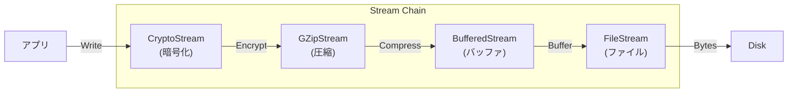

# 第44章：Decorator ②：.NET最強例（Streamデコレータ）💧

## ねらい 🎯✨

* **Decorator（デコレータ）＝「同じインターフェースのまま、機能を重ね着する」**を、.NETのど真ん中で体感するよ🧥➕🧥
* 特に **`Stream` まわり**は “デコレータの宝庫” なので、ここが分かると一気に設計が気持ちよくなる☺️🌈

---

## 到達目標 ✅🌟

* `Stream`系APIを見たときに「これDecoratorっぽい！」を見抜ける👀✨
* `BufferedStream` / `GZipStream` / `CryptoStream` を「重ね着」して使える🧩💫
* **Dispose / close / leaveOpen / FlushFinalBlock** の “事故りポイント” を回避できる🧯⚠️

---

## 手順 🧭💡

### 1) まず “土台” を確認：`Stream` は契約（インターフェース）そのもの 📜


`Stream` は **すべてのストリームの抽象基底クラス**で、読み書きの共通メソッドを提供するよ📦✨
つまり「ここ（`Stream`）を満たしていれば、差し替えOK」っていう強い契約！ ([Microsoft Learn][1])

**Decoratorで重要なのはここ👇**

* “包む側” も “包まれる側” も **同じ型（`Stream`）として扱える**
* だから **チェーン（重ね着）** ができる 🔗✨




---

### 2) 見抜き方：Decoratorっぽい `.NET` API の特徴 🔍✨

次のどれかが見えたら、だいたいDecorator候補だよ🕵️‍♀️

* **コンストラクタで `Stream` を受け取る**（＝中身を抱えて包む）
* 自分も `Stream` を継承してる（＝同じ顔でふるまう）
* “付け足し機能” を持つ（バッファ / 圧縮 / 暗号化 など）

---

### 3) `BufferedStream`：速度（バッファ）を後付けする 🚀🧃

`BufferedStream` は **別の `Stream` に対して、読み書きのバッファ層を追加する**クラスだよ🧤✨（まさにデコレータ） ([Microsoft Learn][2])
しかも、`bufferSize` を省略すると **4096バイト**が既定になる（この数字、地味に重要）🧠📌 ([Microsoft Learn][3])

**使いどころイメージ**

* 小さい書き込みを何回もする → バッファ無しだと遅くなりやすい😵‍💫
* そこで `BufferedStream` を “1枚羽織る” → まとめて書いてくれる✨

**ミニ例（ファイルにバイト列を書くだけ）📝**

```csharp
using System.Text;

var path = "sample.bin";
var data = Encoding.UTF8.GetBytes("Hello BufferedStream! 🧡");

await using var file = File.Create(path);
await using var buffered = new BufferedStream(file); // 既定 4096 bytes

await buffered.WriteAsync(data);
await buffered.FlushAsync();
```

---

### 4) `GZipStream`：圧縮を後付けする 🗜️🎀

`GZipStream` も `Stream` を受け取って包めるから、チェーンに参加できるよ🔗✨
そして重要なのが `leaveOpen`：**必要に応じて、下のストリームを開いたままにできる**やつ！ ([Microsoft Learn][4])
さらに、`GZipStream` は “包んだ下のストリーム” を **所有して Dispose する**（＝勝手に閉じる）側の動きが基本になる点も押さえてね🧯 ([Microsoft Learn][4])

**圧縮して保存→復元の最小サンプル（MemoryStreamで安全に）🧪**

```csharp
using System.IO.Compression;
using System.Text;

static byte[] CompressUtf8(string text)
{
    var input = Encoding.UTF8.GetBytes(text);

    using var output = new MemoryStream();
    using (var gzip = new GZipStream(output, CompressionLevel.Optimal, leaveOpen: true))
    {
        gzip.Write(input, 0, input.Length);
    } // gzipをDispose → 圧縮の終端を書いてくれる
    return output.ToArray();
}

static string DecompressUtf8(byte[] gzData)
{
    using var input = new MemoryStream(gzData);
    using var gzip = new GZipStream(input, CompressionMode.Decompress);
    using var plain = new MemoryStream();
    gzip.CopyTo(plain);
    return Encoding.UTF8.GetString(plain.ToArray());
}

var gz = CompressUtf8("Hello GZipStream! 🗜️✨");
var text = DecompressUtf8(gz);
Console.WriteLine(text);
```

---

### 5) `CryptoStream`：暗号化を後付けする 🔐✨

`CryptoStream` は **暗号変換（Transform）をストリームにかぶせる**超ど真ん中のDecoratorだよ🧙‍♀️🔗
しかも公式にも、**複数の `CryptoStream` をチェーンできる**って書いてある（重ね着OK！） ([Microsoft Learn][5])

ここで最重要⚠️
`CryptoStream` は **最後のブロック（終端）を書かないと復号できない**事故が起きやすいの…😇
だから「終わり」を確実にする必要があるよ👇

* `FlushFinalBlock()` を呼ぶと **下のデータソースを更新して内部バッファをクリア**してくれる ([Microsoft Learn][6])
* さらに `Close()` は **`FlushFinalBlock()` を呼び、下のストリームも Close する**（つまり using/Dispose が超大事） ([Microsoft Learn][6])

---

### 6) “重ね着”こそ本番：圧縮→暗号化（書く）/ 復号→解凍（読む）🔗🧥✨

Decoratorは **順番で意味が変わる**よ！ここが楽しくて怖いところ😆⚠️

**おすすめの考え方（超ざっくり）**

* 書くとき：**圧縮 → 暗号化**（圧縮したいのは “平文” 側だから）🗜️➡️🔐
* 読むとき：**復号 → 解凍**（書いた順の逆）🔐➡️🗜️

**ファイルに「圧縮してから暗号化して保存」する例🧩**

```csharp
using System.IO.Compression;
using System.Security.Cryptography;
using System.Text;

static void WriteCompressedEncrypted(string path, string text, byte[] key, byte[] iv)
{
    var plain = Encoding.UTF8.GetBytes(text);

    using var aes = Aes.Create();
    aes.Key = key;
    aes.IV = iv;

    using var file = File.Create(path);

    // file <- crypto(encrypt) <- gzip(compress) <- Write(plain)
    using var crypto = new CryptoStream(file, aes.CreateEncryptor(), CryptoStreamMode.Write);
    using var gzip = new GZipStream(crypto, CompressionLevel.Optimal);

    gzip.Write(plain, 0, plain.Length);
    // gzip.Disposeで圧縮の終端が出る → crypto.DisposeでFlushFinalBlock相当も確実に走るイメージ✨
}

static string ReadDecryptedDecompressed(string path, byte[] key, byte[] iv)
{
    using var aes = Aes.Create();
    aes.Key = key;
    aes.IV = iv;

    using var file = File.OpenRead(path);

    // file -> crypto(decrypt) -> gzip(decompress) -> plain
    using var crypto = new CryptoStream(file, aes.CreateDecryptor(), CryptoStreamMode.Read);
    using var gzip = new GZipStream(crypto, CompressionMode.Decompress);

    using var plain = new MemoryStream();
    gzip.CopyTo(plain);
    return Encoding.UTF8.GetString(plain.ToArray());
}
```

**ポイントまとめ🧠✨**

* `using` で外側から順に Dispose される → 終端処理が自動で走りやすい🙆‍♀️
* `leaveOpen` は「このデコレータを外したあとも下を使う」必要があるときだけ使う（多用しない） ([Microsoft Learn][4])
* `CryptoStream` の “終端” は超重要（Dispose/Close で確実に）([Microsoft Learn][6])

---

### 7) Visual Studioで “Decoratorの証拠” を取るコツ 🕵️‍♀️🧾

APIを見たら、次をチェックして「Decoratorだ！」って確信しよう💪✨

* 型が `Stream` 派生か（`class X : Stream` 的な） ([Microsoft Learn][1])
* コンストラクタに `Stream` があるか（包んでるか）
* `leaveOpen` みたいな “下を閉じる/閉じない” の選択肢があるか ([Microsoft Learn][4])
* ドキュメントに「下のストリームをDisposeする」系が書いてあるか ([Microsoft Learn][4])

---

## よくある落とし穴 🕳️⚠️

1. **順番ミスで意味が変わる** 🔄😵
   圧縮と暗号化は “順番が仕様” になりがち。読む側は必ず逆順！

2. **`leaveOpen` の誤用** 🧷💥
   便利だからって全部 `leaveOpen: true` にすると、今度は「誰が閉じるの？」問題が発生しがち🫠
   → “最後に閉じる担当” を1つに決めるのがコツ！

3. **CryptoStreamの終端事故** 🔐💣
   `FlushFinalBlock()` / `Close()` / `Dispose()` のどれかを確実に通さないと、復号で壊れることがあるよ😇
   → `using` を信じて、チェーンを綺麗に組む！ ([Microsoft Learn][6])

4. **全部盛りにしてデバッグ不能** 🍔💦
   一気に `Buffered + GZip + Crypto + ...` にすると、どこで壊れたか分からなくなる😭
   → 1枚ずつ足して、テストで固定しよう🧪✨

---

## ミニ演習（10〜30分）🧪🎀

次を **この順で** やってね（1つずつ成功させるのがコツ）🌱

1. `MemoryStream` + `GZipStream` で「文字列の圧縮→復元」✅🗜️
2. 1が通ったら、次に `CryptoStream` を足して「圧縮→暗号化→復号→解凍」✅🔐
3. 最後に `BufferedStream` を足して、処理時間（or 体感）を比べる✅🚀

**テスト観点（最低これだけ）**

* 復元文字列が元と一致する
* 空文字でも動く
* ちょい長文（1万文字くらい）でも動く

---

## 自己チェック ✅🔍

* `Stream` を受け取るコンストラクタを見たら「Decoratorかも」と思える？👀
* `leaveOpen` を “必要なときだけ” 使う判断ができる？🧷
* `CryptoStream` は `using` で終端処理まで確実に通す意識がある？🔐✨ ([Microsoft Learn][6])
* 圧縮と暗号化の順番を説明できる？🗜️➡️🔐 / 🔐➡️🗜️

[1]: https://learn.microsoft.com/en-us/dotnet/api/system.io.stream?view=net-10.0 "Stream Class (System.IO) | Microsoft Learn"
[2]: https://learn.microsoft.com/ja-jp/dotnet/api/system.io.bufferedstream?view=net-8.0 "BufferedStream クラス (System.IO) | Microsoft Learn"
[3]: https://learn.microsoft.com/en-us/dotnet/api/system.io.bufferedstream.-ctor?view=net-10.0 "BufferedStream Constructor (System.IO) | Microsoft Learn"
[4]: https://learn.microsoft.com/ja-jp/dotnet/api/system.io.compression.gzipstream?view=net-8.0 "GZipStream クラス (System.IO.Compression) | Microsoft Learn"
[5]: https://learn.microsoft.com/en-us/dotnet/api/system.security.cryptography.cryptostream?view=net-10.0 "CryptoStream Class (System.Security.Cryptography) | Microsoft Learn"
[6]: https://learn.microsoft.com/ja-jp/dotnet/api/system.security.cryptography.cryptostream.flushfinalblock?view=net-10.0 "CryptoStream.FlushFinalBlock メソッド (System.Security.Cryptography) | Microsoft Learn"
