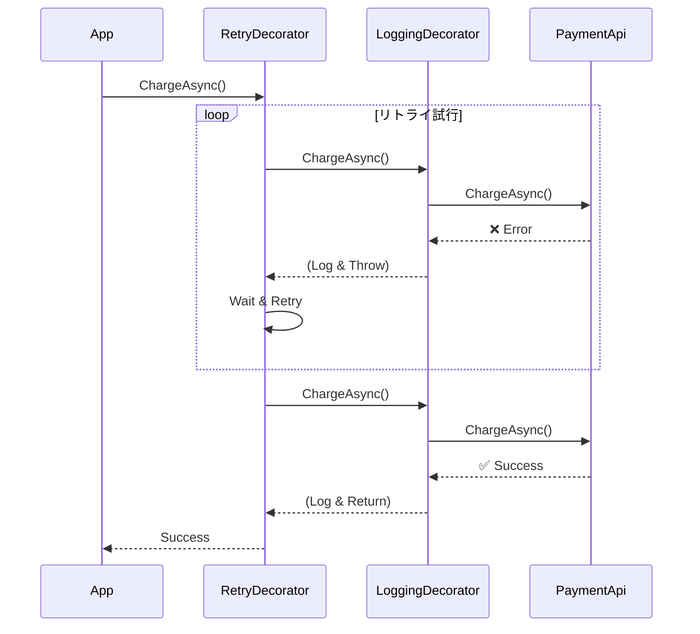

# 第45章：Decorator ③：演習（ログ付与 / リトライ付与）📝🔁

## ねらい 🎯✨

* 「本体の処理（業務）」に手を入れずに、**ログ**や**リトライ**みたいな“横断的な関心ごと”を後付けできるようになるよ〜😊
* **Decorator = 同じインターフェイスのまま包む**、を “手で実装して体に入れる” 回だよ💪🌸
* .NETの世界では `Stream` がまさにデコレータ祭りで、`BufferedStream` / `GZipStream` / `CryptoStream` みたいに「Streamを受け取って包む」作りになってるよ〜💧🎁（この感覚を自分のコードでも再現する！）([Microsoft Learn][1])

---

## 到達目標 🏁🌷

* ✅ `IPaymentGateway`（例）みたいな **小さな契約（interface）** を決めて、そこに **Logging Decorator** と **Retry Decorator** を重ねられる
* ✅ 「ログはログだけ」「リトライはリトライだけ」っていう **責務の薄さ** を守れる🥰
* ✅ テストで「○回失敗→○回目で成功」「上限超えたら例外」などの挙動が確認できる🧪✨
* ✅ 実務寄りの最新トピックとして、HTTP系は **.NETのResilience（回復性）拡張**で組むのが今どき、まで押さえる🌊🛟([Microsoft Learn][2])

---

## 手順 🧭🍀

### 1) まず「導入前」のつらさを見る 😵‍💫🌀


ありがちな地獄👇

* どのメソッドにも `try/catch` と `for retry` と `logger.Log...` が散らばる
* 変更するときに「ログ消えた」「リトライ忘れた」が起きる
* テストもしづらい（本体に横断処理が混ざってるから）💦

この章では、**本体は本体の仕事だけ**に戻して、横断処理は **Decoratorで外に出す**よ🎁✨




---

### 2) “本体の契約” を最小で決める 📜🧸

例として「外部の支払いAPIを叩く係」を想定するよ💳🌐

* 契約（interface）は小さく！
* 引数・戻り値・例外の方針を雑にしない！（超大事）⚠️

```csharp
using System.Net.Http;

public sealed record Order(string Id, decimal Amount);
public sealed record PaymentResult(bool Succeeded, string? Error);

public interface IPaymentGateway
{
    Task<PaymentResult> ChargeAsync(Order order, CancellationToken ct);
}
```

---

### 3) 本体（中身）は“本体の仕事だけ”にする 🧼✨

今回は「HTTPで叩く」想定の最小例（※ログもリトライもしない！）📨

```csharp
using System.Net.Http.Json;

public sealed class PaymentApiGateway(HttpClient http) : IPaymentGateway
{
    public async Task<PaymentResult> ChargeAsync(Order order, CancellationToken ct)
    {
        using var resp = await http.PostAsJsonAsync("/charge", order, ct);

        // 失敗は例外に寄せる（この例では単純化）
        resp.EnsureSuccessStatusCode();

        return await resp.Content.ReadFromJsonAsync<PaymentResult>(cancellationToken: ct)
               ?? new PaymentResult(false, "empty response");
    }
}
```

---

### 4) Logging Decorator を作る 📝🌸

ポイント👇

* **同じ `IPaymentGateway` を実装**して、**中身を受け取って委譲**するだけ
* ログの標準は `ILogger<T>` が基本だよ🧡（.NETのログの中心）([Microsoft Learn][3])
* 例外は握りつぶさず、ログしてそのまま投げる（`throw;`）⚡

```csharp
using System.Diagnostics;
using Microsoft.Extensions.Logging;

public sealed class LoggingPaymentGatewayDecorator(
    IPaymentGateway inner,
    ILogger<LoggingPaymentGatewayDecorator> logger) : IPaymentGateway
{
    public async Task<PaymentResult> ChargeAsync(Order order, CancellationToken ct)
    {
        using var scope = logger.BeginScope(new Dictionary<string, object>
        {
            ["OrderId"] = order.Id
        });

        var sw = Stopwatch.StartNew();
        logger.LogInformation("Charge start. Amount={Amount}", order.Amount);

        try
        {
            var result = await inner.ChargeAsync(order, ct);

            logger.LogInformation(
                "Charge end. Success={Success} ElapsedMs={ElapsedMs}",
                result.Succeeded, sw.ElapsedMilliseconds);

            return result;
        }
        catch (Exception ex) when (!ct.IsCancellationRequested)
        {
            logger.LogWarning(ex, "Charge failed. ElapsedMs={ElapsedMs}", sw.ElapsedMilliseconds);
            throw;
        }
    }
}
```

---

### 5) Retry Decorator を作る 🔁🔥

ポイント👇

* **“リトライする例外” を決める**（なんでもリトライは事故るよ🚑）
* `CancellationToken` を尊重する（待機も `Task.Delay(delay, ct)`）
* Backoff（待ち時間が伸びる）＋小さなJitter（ゆらぎ）が定番✨

```csharp
using Microsoft.Extensions.Logging;

public sealed record RetryOptions(int MaxAttempts, TimeSpan BaseDelay)
{
    public TimeSpan GetDelay(int attempt)
    {
        // 2^(attempt-1) * BaseDelay に軽いジッター
        var pow = Math.Pow(2, attempt - 1);
        var ms = BaseDelay.TotalMilliseconds * pow;

        var jitter = Random.Shared.NextDouble() * 0.2 + 0.9; // 0.9..1.1
        return TimeSpan.FromMilliseconds(ms * jitter);
    }
}

public sealed class RetryPaymentGatewayDecorator(
    IPaymentGateway inner,
    ILogger<RetryPaymentGatewayDecorator> logger,
    RetryOptions options) : IPaymentGateway
{
    public async Task<PaymentResult> ChargeAsync(Order order, CancellationToken ct)
    {
        Exception? last = null;

        for (int attempt = 1; attempt <= options.MaxAttempts; attempt++)
        {
            try
            {
                return await inner.ChargeAsync(order, ct);
            }
            catch (Exception ex) when (IsTransient(ex) && attempt < options.MaxAttempts && !ct.IsCancellationRequested)
            {
                last = ex;

                var delay = options.GetDelay(attempt);
                logger.LogWarning(
                    ex,
                    "Transient error. Retry {Attempt}/{MaxAttempts} after {DelayMs}ms",
                    attempt, options.MaxAttempts, (int)delay.TotalMilliseconds);

                await Task.Delay(delay, ct);
            }
        }

        throw last ?? new InvalidOperationException("Retry failed without exception.");
    }

    private static bool IsTransient(Exception ex)
        => ex is HttpRequestException or TimeoutException;
}
```

---

### 6) “重ね方（順番）” を理解する 🎂✨

Decoratorは「どっちが外側？」でログの出方が変わるよ〜！

* ✅ **Retry（外） → Logging（内） → 本体**

  * 各試行ごとに「start/end/fail」が出る（調査向き🔍）
* ✅ **Logging（外） → Retry（内） → 本体**

  * 1回の操作としてまとまって見える（運用向き📊）

まずは分かりやすい **Retry外**でいこう〜🔁💛

```csharp
using Microsoft.Extensions.Logging.Abstractions;

IPaymentGateway inner = new PaymentApiGateway(httpClient);

IPaymentGateway gateway =
    new RetryPaymentGatewayDecorator(
        new LoggingPaymentGatewayDecorator(inner, NullLogger<LoggingPaymentGatewayDecorator>.Instance),
        NullLogger<RetryPaymentGatewayDecorator>.Instance,
        new RetryOptions(MaxAttempts: 3, BaseDelay: TimeSpan.FromMilliseconds(200)));
```

---

### 7) DIで“本番っぽく”組み立てる 🧩✨

標準のDIは `IServiceCollection` に登録して、最後に `IServiceProvider` から取るよ〜📦
（ファクトリ登録で「包む」を表現できるのがポイント！）([Microsoft Learn][4])

```csharp
using Microsoft.Extensions.DependencyInjection;
using Microsoft.Extensions.Logging;

var services = new ServiceCollection();

services.AddLogging(b => b.AddConsole());

services.AddHttpClient<PaymentApiGateway>(client =>
{
    client.BaseAddress = new Uri("https://example.test/");
});

services.AddSingleton<IPaymentGateway>(sp =>
{
    IPaymentGateway gw = sp.GetRequiredService<PaymentApiGateway>();

    gw = new LoggingPaymentGatewayDecorator(
        gw,
        sp.GetRequiredService<ILogger<LoggingPaymentGatewayDecorator>>());

    gw = new RetryPaymentGatewayDecorator(
        gw,
        sp.GetRequiredService<ILogger<RetryPaymentGatewayDecorator>>(),
        new RetryOptions(MaxAttempts: 3, BaseDelay: TimeSpan.FromMilliseconds(200)));

    return gw;
});

using var provider = services.BuildServiceProvider();
var gateway = provider.GetRequiredService<IPaymentGateway>();
```

---

### 8) （最新寄り）HTTPのリトライは “Resilience拡張” が今どき 🌊🛟

HTTP系は、.NETの拡張で **標準の回復性（Retry/Timeout/Circuit Breakerなど）** を組める流れが強いよ〜！([Microsoft Learn][2])
昔よく見た `Microsoft.Extensions.Http.Polly` は **非推奨（deprecated）** 扱いになっていて、置き換え先が案内されてるよ⚠️([Microsoft Learn][5])

この章の演習は「Decoratorを自分で書く」練習だけど、実務では **HttpClientFactory + Resilience Handler** を検討すると事故りにくいよ🧯✨([Microsoft Learn][2])

---

## よくある落とし穴 🕳️😇

* **例外を握りつぶす**（ログしたら `throw;` で返す！）⚠️
* **なんでもリトライ**（認証失敗やバリデーションエラーまでリトライすると地獄👹）
* **デコレータ順序の罠**（ログの粒度・回数が変わる）🎂
* **キャンセル無視**（Delayも含めて `CancellationToken` を渡す）🧊
* **ログがうるさすぎる**（情報/警告のレベルを分ける、スコープで絞る）📣
* （HTTP系）自前リトライを積みすぎて、あとで **Resilience拡張**に移行すると二重化しがち😵‍💫([Microsoft Learn][2])

---

## 演習 ✍️🌷（30〜60分）

### 演習A：テスト用に “失敗する本体” を用意する 🧪🔥

* `IPaymentGateway` を実装した `FlakyGateway` をテスト側に作ってね
* 「最初のN回は `HttpRequestException` を投げる → その後成功」を再現するよ！

```csharp
public sealed class FlakyGateway : IPaymentGateway
{
    private int _remainingFailures;
    public int CallCount { get; private set; }

    public FlakyGateway(int failures) => _remainingFailures = failures;

    public Task<PaymentResult> ChargeAsync(Order order, CancellationToken ct)
    {
        CallCount++;
        if (_remainingFailures-- > 0)
            throw new HttpRequestException("transient");

        return Task.FromResult(new PaymentResult(true, null));
    }
}
```

---

### 演習B：Retry Decorator のテストを書く ✅🔁

* 2回失敗して3回目で成功すること
* `CallCount` が 3 になること

```csharp
using Microsoft.Extensions.Logging.Abstractions;
using Microsoft.VisualStudio.TestTools.UnitTesting;

[TestClass]
public sealed class RetryDecoratorTests
{
    [TestMethod]
    public async Task Retry_retries_until_success()
    {
        var inner = new FlakyGateway(failures: 2);

        var retry = new RetryPaymentGatewayDecorator(
            inner,
            NullLogger<RetryPaymentGatewayDecorator>.Instance,
            new RetryOptions(MaxAttempts: 3, BaseDelay: TimeSpan.FromMilliseconds(1)));

        var result = await retry.ChargeAsync(new Order("O1", 100m), CancellationToken.None);

        Assert.IsTrue(result.Succeeded);
        Assert.AreEqual(3, inner.CallCount);
    }

    [TestMethod]
    public async Task Retry_throws_after_max_attempts()
    {
        var inner = new FlakyGateway(failures: 10);

        var retry = new RetryPaymentGatewayDecorator(
            inner,
            NullLogger<RetryPaymentGatewayDecorator>.Instance,
            new RetryOptions(MaxAttempts: 3, BaseDelay: TimeSpan.FromMilliseconds(1)));

        await Assert.ThrowsExceptionAsync<HttpRequestException>(async () =>
            await retry.ChargeAsync(new Order("O2", 100m), CancellationToken.None));

        Assert.AreEqual(3, inner.CallCount);
    }
}
```

---

### 演習C：Logging Decorator を “外側” にしてみる 📝🎀

* `Logging → Retry → inner` に組み替えて、ログが「1回の操作」に見えるか確認してね👀✨
* 逆に `Retry → Logging → inner` だと「各試行」が見えるよ🔍

---

### 演習D：チェック用の “採用判断メモ” を1行で書く 🧠📝

例👇

* 「外部APIの一時障害に備えてRetry、運用調査のためにAttempt単位のログを残す」みたいに✨

---

## 自己チェック ✅💖

* [ ] 本体 `PaymentApiGateway` に **ログ/リトライ** が混ざってない？（混ざってたら負け〜😆）
* [ ] Decoratorは **同じinterface** を実装して、基本は **委譲だけ** になってる？🎁
* [ ] Retryは **回数上限** があり、**リトライ対象の例外** が決まってる？🔁
* [ ] `CancellationToken` を尊重してる？（Delayも！）🧊
* [ ] テストで「成功ケース」「上限超えケース」が確認できた？🧪✨
* [ ] （HTTP系）最新の流れとして、必要なら **Resilience拡張**での実装方針もイメージできた？🌊🛟

[1]: https://learn.microsoft.com/ja-jp/dotnet/api/system.security.cryptography.cryptostream.-ctor?view=net-10.0&viewFallbackFrom=xamarinios-10.8 "https://learn.microsoft.com/ja-jp/dotnet/api/system.security.cryptography.cryptostream.-ctor?view=net-10.0&viewFallbackFrom=xamarinios-10.8"
[2]: https://learn.microsoft.com/en-us/dotnet/core/resilience/http-resilience "https://learn.microsoft.com/en-us/dotnet/core/resilience/http-resilience"
[3]: https://learn.microsoft.com/en-us/dotnet/core/extensions/logging "https://learn.microsoft.com/en-us/dotnet/core/extensions/logging"
[4]: https://learn.microsoft.com/ja-jp/dotnet/core/extensions/dependency-injection/usage "https://learn.microsoft.com/ja-jp/dotnet/core/extensions/dependency-injection/usage"
[5]: https://learn.microsoft.com/en-us/dotnet/core/resilience/ "Introduction to resilient app development - .NET | Microsoft Learn"
