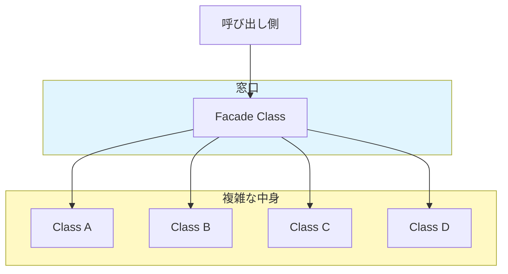

# 第46章：Facade ①：入口を簡単にする🚪🙂

## ねらい🎯✨

* 「中はけっこう複雑なんだけど、使う人には“かんたんな入口”だけ見せたい」問題を解くよ🙂
* 呼び出し側に散らばりがちな **手順（あれして→これして→最後にこれ）** を、スッキリまとめるよ🧹✨
* Facade（ファサード）は、複数の部品（サブシステム）に対して **“まとめて使える窓口”** を用意するパターンだよ🚪🪟（「複雑なサブシステムに対する簡単なインターフェイス」みたいなイメージ）([sourcemaking.com][1])

---

## 到達目標🧁✅

この章を読み終わったら、次ができるようになるよ😊✨

* Facadeを **「いつ使う？」→「なにが嬉しい？」** の順で説明できる📣
* 「呼び出し側が知りすぎ問題（手順・型・例外・後始末…）」を見つけて、Facadeで“入口”を作れる🔎🚪
* Facadeが **God Object（なんでも屋）化** しないように、サイズ感の判断ができる🐘⚠️

---

## 手順🧭🛠️

### 1) まず「困りごと」を言葉にする📝💭




Facadeが刺さるのは、だいたいこんな症状のとき👇

* 呼び出し側が **複数クラスを順番に呼ぶ手順** を覚えなきゃいけない😵‍💫
* 同じ手順があちこちにコピペされてる📋📋📋
* 例外処理・リソース解放・戻り値の扱いが毎回バラバラ💥
* 「これ、どこまで呼べば完了なの？」が分からない🤔

---

### 2) “中で起きてること”を棚卸しする📦🔍

例として「ファイルに保存して、必要ならHTTPで送る」みたいな処理だと、呼び出し側はこんな道具を同時に扱いがち👇

* ファイル・フォルダ操作：Directory / File（保存・作成など）([Microsoft Learn][2])
* HTTP通信：HttpClient（リクエスト送信など）([Microsoft Learn][3])
* （安全運用のための）HttpClient生成と寿命管理：IHttpClientFactory([Microsoft Learn][4])

ここで大事なのは、**呼び出し側が全部を理解する必要はない**ってことだよ🙂✨

---

### 3) 利用者が欲しい“単位”にまとめて、入口を作る🚪🍰

FacadeのAPIは、だいたいこういう形が強いよ👇

* 「名詞」より **“動詞”** で命名（例：SaveReceiptAsync / PlaceOrderAsync）🗣️✨
* 入力は少なめ（必要最低限）✂️
* 結果が分かりやすい（戻り値 or 例外のルールが明確）📌

---

### 4) Facadeの“やること/やらないこと”を決める⚖️🙂

Facadeは「入口」なので…

✅ やること

* 手順をまとめる（オーケストレーション）🎼
* 使い手が迷わない最短ルートを提供する🛣️✨

❌ やらないこと（混ぜると事故りがち）

* 業務ルールを抱え込む（ドメインの中心を奪う）😢
* なんでも入れて巨大化する（God Object化）🐘💥

---

### 5) “Facade導入前→導入後”を見比べる👀✨

#### ❌ 導入前：呼び出し側が知りすぎ😵‍💫

（例：保存フォルダ作成 → テキスト作成 → 保存 → HTTP送信…を呼び出し側が全部やる）

```
using System.Net.Http;
using System.Text;
using System.IO;

async Task SaveAndUploadAsync(string orderId, decimal total, string baseDir, Uri endpoint, HttpClient http)
{
    var dir = Path.Combine(baseDir, "receipts");
    Directory.CreateDirectory(dir);

    var path = Path.Combine(dir, $"{orderId}.txt");
    var text = $"OrderId={orderId}\nTotal={total}";
    await File.WriteAllTextAsync(path, text, Encoding.UTF8);

    using var content = new MultipartFormDataContent
    {
        { new StreamContent(File.OpenRead(path)), "file", Path.GetFileName(path) }
    };

    var res = await http.PostAsync(endpoint, content);
    res.EnsureSuccessStatusCode();
}
```

「動く」けど、呼び出し側が **手順も後始末も例外も** 抱えがちだよね🥲

---

#### ✅ 導入後：Facadeに“入口”を寄せる🚪✨

Facadeが「保存して送る」をまとめてくれる。呼び出し側は **1回呼べばOK** 😆

```
using System;
using System.IO;
using System.Net.Http;
using System.Text;
using System.Threading;
using System.Threading.Tasks;

public sealed class ReceiptFacade
{
    private readonly HttpClient _http;

    public ReceiptFacade(HttpClient http)
    {
        _http = http;
    }

    public async Task<string> SaveAsync(string orderId, decimal total, string baseDir, CancellationToken ct = default)
    {
        var dir = Path.Combine(baseDir, "receipts");
        Directory.CreateDirectory(dir);

        var path = Path.Combine(dir, $"{orderId}.txt");
        var text = $"OrderId={orderId}\nTotal={total}";
        await File.WriteAllTextAsync(path, text, Encoding.UTF8, ct);

        return path;
    }

    public async Task UploadAsync(string filePath, Uri endpoint, CancellationToken ct = default)
    {
        using var content = new MultipartFormDataContent
        {
            { new StreamContent(File.OpenRead(filePath)), "file", Path.GetFileName(filePath) }
        };

        var res = await _http.PostAsync(endpoint, content, ct);
        res.EnsureSuccessStatusCode();
    }

    // ✅ “入口”メソッド：使い手がこれだけ呼べばOK
    public async Task<string> SaveAndUploadAsync(
        string orderId,
        decimal total,
        string baseDir,
        Uri endpoint,
        CancellationToken ct = default)
    {
        var path = await SaveAsync(orderId, total, baseDir, ct);
        await UploadAsync(path, endpoint, ct);
        return path;
    }
}
```

ポイントはこれ👇😊

* **複数の操作（Directory / File / HttpClient）を、使い手が意識しなくていい** ✨([Microsoft Learn][2])
* “入口”が決まるから、チームでも使い方がブレにくい🤝💕

---

### 6) 「.NET標準のFacadeっぽさ」を味わう🍵✨

実は、.NET自体にも「Facadeっぽい」ものがあるよ🙂

* **File / Directory**：ファイルI/Oのよくある操作を、分かりやすい静的メソッドで提供してくれる📁✨([Microsoft Learn][2])
* **HttpClient**：HTTP要求を送るための高レベルAPIになってる🌐📨([Microsoft Learn][3])
* **IHttpClientFactory**：HttpClientを“いい感じ”に作って管理する入口（作り方・寿命の悩みを減らす）🧰✨([Microsoft Learn][4])

「Facadeって特別な魔法じゃなくて、**“使いやすさの窓口づくり”**なんだな〜」って感覚が掴めればOKだよ😊🪄

---

## 落とし穴⚠️💥

### 1) Facadeが巨大化（God Object化）🐘💣

* 「便利だから全部ここに」→ 結果、誰も把握できないクラスに…😇
  対策：
* 入口は **ユースケース単位** で分ける（例：ReceiptFacade / OrderFacade みたいに）🍱✨

### 2) 例外や契約があいまいになる🌫️

* Facadeが例外を握りつぶすと、トラブル時に詰む😵‍💫
  対策：
* 例外は基本そのまま流す or “この例外はこう返す”を決める📌

### 3) “中身の自由”を奪いすぎる🧷

* Facadeを通さないと何もできない設計にすると、逆に窮屈になることも😢
  対策：
* Facadeは **推奨ルート** にする（必要なら下の層を直で使える余地も残す）🙂

---

## 演習（10〜30分）🏃‍♀️💨

### 演習A：ファイル保存だけの小さなFacadeを作る📁✨

1. ReceiptFacadeの SaveAsync だけ切り出してOK（Uploadは無し）🙂
2. 引数はこのくらいで十分：orderId, total, baseDir
3. できたら、**本当にファイルが作られるか** をテストで確認しよう🧪🌸

テストのイメージ（超ざっくり）👇

```
using Microsoft.VisualStudio.TestTools.UnitTesting;
using System;
using System.IO;
using System.Net.Http;
using System.Threading.Tasks;

[TestClass]
public class ReceiptFacadeTests
{
    [TestMethod]
    public async Task SaveAsync_creates_file()
    {
        var temp = Path.Combine(Path.GetTempPath(), Guid.NewGuid().ToString("N"));
        Directory.CreateDirectory(temp);

        try
        {
            var facade = new ReceiptFacade(new HttpClient());
            var path = await facade.SaveAsync("A001", 1234m, temp);

            Assert.IsTrue(File.Exists(path));
            var text = await File.ReadAllTextAsync(path);
            StringAssert.Contains(text, "OrderId=A001");
        }
        finally
        {
            if (Directory.Exists(temp)) Directory.Delete(temp, recursive: true);
        }
    }
}
```

演習のゴールは「Facade＝入口が1つにまとまって、呼び出しがラク！」を体感することだよ🥳🎉

---

## チェック✅🎀

* 「Facadeって何？」を **“入口を簡単にする”** という一言で言える🙂
* 呼び出し側の「手順コピペ」が減る未来が想像できる📉✨
* Facadeに入れるのは **手順（オーケストレーション）中心**、業務ルールは入れすぎないって言える⚖️💡
* “入口メソッド”の名前が **動詞（Save/Upload/Place…）** になってる🗣️✨

[1]: https://sourcemaking.com/design-patterns-and-tips "101 Design Patterns & Tips for Developers"
[2]: https://learn.microsoft.com/en-us/dotnet/api/system.io.directory?view=net-10.0 "Directory Class (System.IO) | Microsoft Learn"
[3]: https://learn.microsoft.com/ja-jp/dotnet/core/extensions/httpclient-factory "IHttpClientFactory を使用する - .NET | Microsoft Learn"
[4]: https://learn.microsoft.com/ja-jp/dotnet/architecture/microservices/implement-resilient-applications/use-httpclientfactory-to-implement-resilient-http-requests "IHttpClientFactory を使用して回復性のある HTTP 要求を実装する - .NET | Microsoft Learn"
