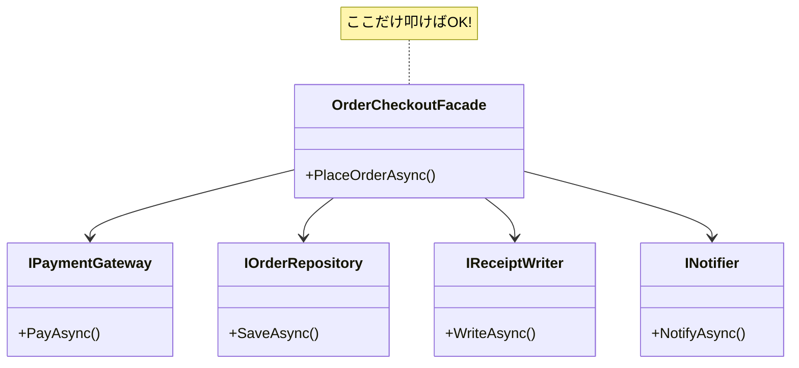

# 第48章：Facade ③：演習（注文処理の窓口クラス）🛒

## ねらい 🎯✨

* “注文確定”みたいな一連の処理を、**呼び出し側から見て超カンタン**にする（入口を1つにする）🚪😊
* 内部のゴチャゴチャ（支払い、保存、レシート、通知…）を**Facadeの中に押し込めて隠す**🙈✨
* テストで「入口がラクになった」「差し替えやすい」を体感する🧪🌸

---

## 到達目標 ✅🌟

* 呼び出し側が `PlaceOrderAsync(...)` みたいな **1メソッド**で注文処理できるようにできる🧁
* Facadeの中は複数の部品（支払い/保存/通知など）に分けて、**責務が薄い**状態にできる🧩✨
* テストで、成功/失敗（支払い失敗など）を**部品差し替えで再現**できる🔁🧪

---

## 手順 🧭🛠️

### 1) まず「導入前」を作って、つらさを固定する 😵‍💫➡️🧪

呼び出し側が全部やると、こんな感じになりがち👇（手順・例外・順序・後始末が散らばる）

```csharp
// 例：導入前（呼び出し側が全部知ってる）
var paymentResult = await paymentGateway.PayAsync(order, ct);
if (!paymentResult.Succeeded)
{
    return CheckoutResult.Failed("payment failed");
}

await orderRepository.SaveAsync(order, ct);

var receiptPath = await receiptWriter.WriteAsync(order, ct);

await notifier.NotifyAsync(order.CustomerEmail, "注文ありがとう！", ct);

return CheckoutResult.Succeeded(order.Id, receiptPath);
```

ポイント：

* 呼び出し側が **「何を」「どの順番で」**やるか全部知ってる😇
* 失敗時の扱い（保存しない、通知しない…）があちこちに増える🌋

この“つらさ”を、次でFacadeにまとめて消すよ✨

---

### 2) 部品の“契約”を小さく決める（差し替え用）🧩🔌

Facadeの中で使う部品を、**小さなinterface**で分けるよ（オレオレ汎用フレームワーク化は禁止🙅‍♀️、でも「業務の部品」はOK🙆‍♀️）

```csharp
public interface IPaymentGateway
{
    Task<PaymentResult> PayAsync(Order order, CancellationToken ct);
}

public interface IOrderRepository
{
    Task SaveAsync(Order order, CancellationToken ct);
}

public interface IReceiptWriter
{
    Task<string> WriteAsync(Order order, CancellationToken ct);
}

public interface INotifier
{
    Task NotifyAsync(string toEmail, string message, CancellationToken ct);
}

public sealed record PaymentResult(bool Succeeded, string? Error = null);
```

---

### 3) Facade（窓口）を作る🚪🛒





呼び出し側が知らなくていいことを、ぜんぶ中へ👇
**入口はユースケース単位で1つ**が基本（ここでは「注文確定」）

```csharp
using Microsoft.Extensions.Logging;

public sealed class OrderCheckoutFacade
{
    private readonly IPaymentGateway _payment;
    private readonly IOrderRepository _orders;
    private readonly IReceiptWriter _receipts;
    private readonly INotifier _notifier;
    private readonly ILogger<OrderCheckoutFacade> _logger;

    public OrderCheckoutFacade(
        IPaymentGateway payment,
        IOrderRepository orders,
        IReceiptWriter receipts,
        INotifier notifier,
        ILogger<OrderCheckoutFacade> logger)
    {
        _payment = payment;
        _orders = orders;
        _receipts = receipts;
        _notifier = notifier;
        _logger = logger;
    }

    public async Task<CheckoutResult> PlaceOrderAsync(Order order, CancellationToken ct)
    {
        ArgumentNullException.ThrowIfNull(order);

        _logger.LogInformation("PlaceOrder started. OrderId={OrderId}", order.Id);

        // 1) 支払い
        var pay = await _payment.PayAsync(order, ct);
        if (!pay.Succeeded)
        {
            _logger.LogWarning("Payment failed. OrderId={OrderId} Error={Error}", order.Id, pay.Error);
            return CheckoutResult.Failed("支払いに失敗しました🙇‍♀️");
        }

        // 2) 保存
        await _orders.SaveAsync(order, ct);

        // 3) レシート作成
        var receiptPath = await _receipts.WriteAsync(order, ct);

        // 4) 通知
        await _notifier.NotifyAsync(order.CustomerEmail, "ご注文ありがとうございます🎉", ct);

        _logger.LogInformation("PlaceOrder completed. OrderId={OrderId}", order.Id);
        return CheckoutResult.Succeeded(order.Id, receiptPath);
    }
}

public sealed record CheckoutResult(bool Succeeded, Guid? OrderId, string? ReceiptPath, string? Error)
{
    public static CheckoutResult Succeeded(Guid orderId, string receiptPath)
        => new(true, orderId, receiptPath, null);

    public static CheckoutResult Failed(string error)
        => new(false, null, null, error);
}
```

✅ これで呼び出し側は「入口」だけ見ればOKになるよ〜！😊✨

---

### 4) 呼び出し側は“入口だけ”になる（Facadeの勝ち）🏆✨

```csharp
var result = await facade.PlaceOrderAsync(order, ct);

if (!result.Succeeded)
{
    Console.WriteLine(result.Error);
    return;
}

Console.WriteLine($"注文OK！ OrderId={result.OrderId} Receipt={result.ReceiptPath}");
```

---

### 5) テストで「差し替えが効く」を確認する🧪🌸

ここが超大事！✨
**Facadeは“入口”だから、テストも入口からだけ叩く**のが気持ちいい💗

#### テスト用のフェイク（最小）

```csharp
public sealed class FakePaymentGateway : IPaymentGateway
{
    public bool Called { get; private set; }
    public PaymentResult Result { get; set; } = new(true);

    public Task<PaymentResult> PayAsync(Order order, CancellationToken ct)
    {
        Called = true;
        return Task.FromResult(Result);
    }
}

public sealed class InMemoryOrderRepository : IOrderRepository
{
    public List<Order> Saved { get; } = new();

    public Task SaveAsync(Order order, CancellationToken ct)
    {
        Saved.Add(order);
        return Task.CompletedTask;
    }
}

public sealed class InMemoryReceiptWriter : IReceiptWriter
{
    public List<Order> Written { get; } = new();

    public Task<string> WriteAsync(Order order, CancellationToken ct)
    {
        Written.Add(order);
        return Task.FromResult($"memory://receipts/{order.Id}.txt");
    }
}

public sealed class CapturingNotifier : INotifier
{
    public List<(string To, string Message)> Sent { get; } = new();

    public Task NotifyAsync(string toEmail, string message, CancellationToken ct)
    {
        Sent.Add((toEmail, message));
        return Task.CompletedTask;
    }
}
```

#### MSTest：成功ケース🎉

```csharp
using Microsoft.VisualStudio.TestTools.UnitTesting;
using Microsoft.Extensions.Logging.Abstractions;

[TestClass]
public sealed class OrderCheckoutFacadeTests
{
    [TestMethod]
    public async Task PlaceOrder_Success_CallsAllAndReturnsReceipt()
    {
        var pay = new FakePaymentGateway();
        var repo = new InMemoryOrderRepository();
        var receipts = new InMemoryReceiptWriter();
        var notifier = new CapturingNotifier();
        var logger = NullLogger<OrderCheckoutFacade>.Instance;

        var facade = new OrderCheckoutFacade(pay, repo, receipts, notifier, logger);

        var order = new Order(Money.Jpy(1200), "a@example.com", PaymentMethod.Card);

        var result = await facade.PlaceOrderAsync(order, CancellationToken.None);

        Assert.IsTrue(result.Succeeded);
        Assert.AreEqual(order.Id, result.OrderId);

        Assert.IsTrue(pay.Called);
        Assert.AreEqual(1, repo.Saved.Count);
        Assert.AreEqual(1, receipts.Written.Count);
        Assert.AreEqual(1, notifier.Sent.Count);
    }
}
```

#### MSTest：支払い失敗ケース💥（保存も通知もしない）

```csharp
[TestMethod]
public async Task PlaceOrder_PaymentFails_DoesNotSaveOrNotify()
{
    var pay = new FakePaymentGateway { Result = new PaymentResult(false, "declined") };
    var repo = new InMemoryOrderRepository();
    var receipts = new InMemoryReceiptWriter();
    var notifier = new CapturingNotifier();
    var logger = NullLogger<OrderCheckoutFacade>.Instance;

    var facade = new OrderCheckoutFacade(pay, repo, receipts, notifier, logger);

    var order = new Order(Money.Jpy(1200), "a@example.com", PaymentMethod.Card);

    var result = await facade.PlaceOrderAsync(order, CancellationToken.None);

    Assert.IsFalse(result.Succeeded);

    Assert.AreEqual(0, repo.Saved.Count);
    Assert.AreEqual(0, receipts.Written.Count);
    Assert.AreEqual(0, notifier.Sent.Count);
}
```

---

### 6) Copilot/Codexに頼むときの“良い頼み方”🤖✍️

（そのまま貼って使える系）

* 「`OrderCheckoutFacade` のMSTestを書いて。**成功/支払い失敗**の2ケース。**Moqは禁止**、フェイククラスはテスト内に最小で」
* 「Facadeのpublic APIは `PlaceOrderAsync(Order, CancellationToken)` だけ。**内部の部品を外に漏らさない**構成にして」
* 「例外は増やしすぎず、失敗は `CheckoutResult` で返す」

---

## 落とし穴 ⚠️😇

* **FacadeがGod Object化**：何でも詰め込みすぎて、巨大クラスになる📦💥

  * 対策：入口は“ユースケース単位”にする（PlaceOrder/Cancel/Refund…を無理に1個にしない）🧁
* **契約があいまい**：失敗時に何が起きるか分からない（保存される？通知される？）🤔💦

  * 対策：失敗パターンをテストで固定🧪
* **内部の例外をそのまま漏らす**：呼び出し側が例外の種類を覚え始める😵

  * 対策：Facadeの戻り値（Result）か、例外を“少数の種類”にまとめる
* **アップグレードで挙動が変わる系**：言語バージョン更新でオーバーロード解決が変わることもあるよ（例：C# 14のSpan変換周り）⚙️🌀 ([Microsoft Learn][1])

---

## 演習 📝💪（10〜30分）

1. **“入口がラク”を増やす**🧁

* `CancelOrderAsync(orderId)` をFacadeに追加してみよう
* ただし、内部の部品（Repository/Notifierなど）をむやみに増やさず、最小で✨

2. **レシートを“本物のファイル”にする**📄🪟

* `IReceiptWriter` の実装を `FileReceiptWriter` にして
* `Path.Combine(Environment.GetFolderPath(...), ...)` で保存先を決めよう
* テストは `InMemoryReceiptWriter` のままでOK（差し替えできるから！）🔁

3. **呼び出し側のifを減らす**✂️

* Facade導入前のコードを見て、ifが増えやすい場所にコメントしてみてね
* 「Facadeに入れるべき責務」と「呼び出し側に残すべき責務」を分ける👀✨

---

## チェック ✅🧡

* 呼び出し側が **“入口1つ”**だけ見れば注文処理できる？🚪
* Facadeの中の部品は、**小さい契約（interface）**で差し替えできる？🔌
* 「支払い失敗」のときに、**保存/レシート/通知が走らない**のをテストで保証できた？🧪
* Facadeが巨大化しそうな兆候が出たら、**ユースケース単位に分割**する判断ができる？🧁

---

※ ちなみに、2026年初頭に“LTS優先”で進めるなら .NET 10 を軸にするのが自然だよ（サポート方針的に）✨ ([Microsoft Learn][2])

[1]: https://learn.microsoft.com/en-us/dotnet/csharp/whats-new/breaking-changes/compiler%20breaking%20changes%20-%20dotnet%2010?utm_source=chatgpt.com "C# compiler breaking changes since C# 13"
[2]: https://learn.microsoft.com/ja-jp/dotnet/core/extensions/httpclient-factory?utm_source=chatgpt.com "IHttpClientFactory を使用する - .NET"
