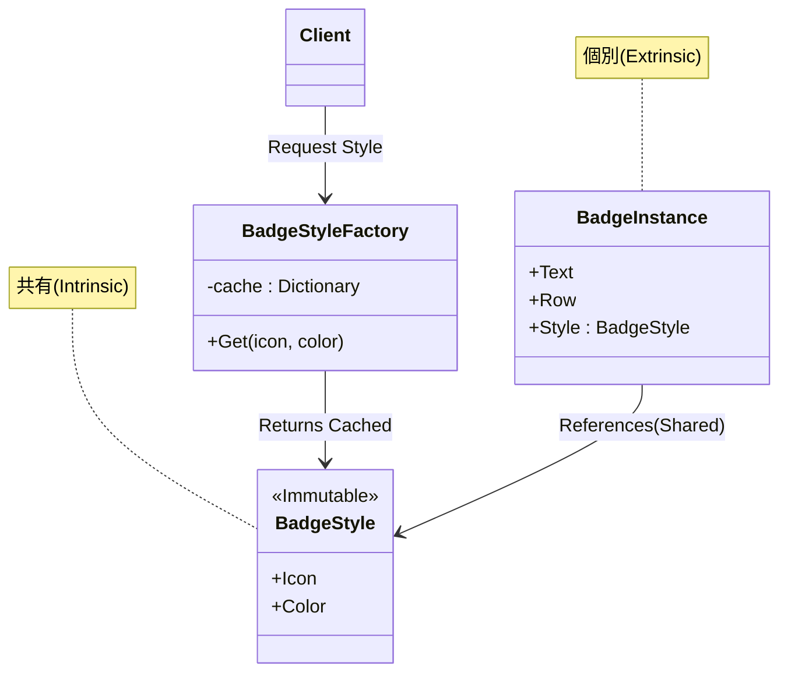

# 第49章：Flyweight ①：大量オブジェクトを軽く🪶

## ねらい 🎯✨

* **同じ情報を“何万回も持ってしまう”ムダ**を減らして、メモリ使用量とGC（ガベコレ）の負担を軽くするよ🧠🧹
* 「共有していい部分（共通）」と「毎回変わる部分（個別）」を分ける考え方を身につけるよ✂️📦
* C#/.NETでの“現実的な近い例”として **`string` の共有** と **`ArrayPool<T>`** の使いどころも触るよ🧵📦

---

## 到達目標 ✅🌸

* Flyweightが必要になる状況を、具体例つきで説明できる🙂🗣️
* 「共有（Intrinsic）」と「個別（Extrinsic）」を分けて設計できる✂️✨
* **小さなFactory（キャッシュ）**でFlyweightを再利用できる🧰🔁
* `ArrayPool<T>` を使うときの **“返し忘れ/クリア/使い回し事故”** を避けられる🛡️⚠️

---

## 手順 🧭🪄

### 1) Flyweightが効く“症状”を見つける 🔍😵‍💫


Flyweightは「速くしたい！」より **“メモリと割り当て（allocation）が多すぎる！”**ときに効くことが多いよ💡
特に、**同じ見た目/同じ設定/同じ文字列**を持つオブジェクトが大量にあるとき👇

* 画面に表示する「ラベル」や「バッジ」が数万個🏷️🏷️🏷️
* ログ用イベントが大量で、同じカテゴリ名やタグが何度も出る📝🔁
* 大きめの配列を何回も `new` してGCが忙しい📈😵




> 参考：大きい配列の割り当ては **LOH（Large Object Heap）**に入りやすく、負担になりやすいよ（目安として **約85,000バイト以上**）。([Microsoft Learn][1])

---

### 2) “共有していい部分”と“毎回変わる部分”を分ける ✂️🧠

Flyweightのキモはこれだけ！👏

* **共有していい部分（Intrinsic）**：みんな同じ。変えない。
* **毎回変わる部分（Extrinsic）**：表示位置、注文ID、行番号、数量…など毎回違う。

例：注文一覧に表示する「ステータスバッジ」🏷️

* 共有（Intrinsic）：アイコン、色、枠線、文言テンプレ（例：「支払い済み」）
* 個別（Extrinsic）：何行目に出すか、どの注文のバッジか、右に出す数値…

ここで大事なのは **共有部分を“不変（immutable）”に寄せる**ことだよ🧊✨
（共有してるのに書き換えたら、全員の見た目が同時に変わって事故る😇）

---

### 3) まずは“やりがちな素朴版”を書いてみる 🐣

「毎回newしちゃう」版👇（悪いわけじゃないけど、大量だとつらい）

```csharp
public sealed record StatusBadge(
    string Text,
    string Icon,
    ConsoleColor Color
);

public static List<StatusBadge> BuildBadgesNaive(int count)
{
    var list = new List<StatusBadge>(count);
    for (int i = 0; i < count; i++)
    {
        // 例えば「支払い済み」が大量に並ぶと、同じIcon/Colorを何度も持つ
        list.Add(new StatusBadge("Paid", "💳", ConsoleColor.Green));
    }
    return list;
}
```

この例だと、**中身が全部同じ**なのに `StatusBadge` が count回作られるよね🙂💦
（小さいオブジェクトでも、数十万〜数百万になると効いてくる）

---

### 4) Flyweight版：共有（Style）と個別（Instance）に分ける 🪶✨

共有していい情報を **`BadgeStyle`** に寄せて、個別の情報だけを **`BadgeInstance`** に持たせるよ🧩

```csharp
public sealed record BadgeStyle(string Icon, ConsoleColor Color);

public readonly record struct BadgeInstance(
    BadgeStyle Style,
    string Text, // 表示文字（今回は固定でもOK）
    int Row      // 例：表示する行
);
```

ただしこれだけだと、`BadgeStyle` をどこで共有するの？ってなるので…👇

---

### 5) Flyweight Factory：同じStyleを使い回す“キャッシュ係”を作る 🧰🔁

ここがFlyweightの“パターン部分”だよ🪶
同じキーなら同じ `BadgeStyle` を返す（=共有）！

```csharp
using System.Collections.Concurrent;

public readonly record struct BadgeStyleKey(string Icon, ConsoleColor Color);

public sealed class BadgeStyleFactory
{
    private readonly ConcurrentDictionary<BadgeStyleKey, BadgeStyle> _cache = new();

    public BadgeStyle Get(string icon, ConsoleColor color)
    {
        var key = new BadgeStyleKey(icon, color);
        return _cache.GetOrAdd(key, k => new BadgeStyle(k.Icon, k.Color));
    }

    public int CachedCount => _cache.Count;
}
```

使う側はこう👇

```csharp
public static List<BadgeInstance> BuildBadgesFlyweight(int count, BadgeStyleFactory factory)
{
    var list = new List<BadgeInstance>(count);

    // 同じスタイルは1回だけ生成 → 以後ずっと使い回し🪶
    var paidStyle = factory.Get("💳", ConsoleColor.Green);

    for (int i = 0; i < count; i++)
    {
        list.Add(new BadgeInstance(paidStyle, "Paid", Row: i));
    }
    return list;
}
```

**ポイント**💡

* `BadgeStyle` は **不変**（recordでOK）🧊
* `BadgeStyleFactory` は「キー→共有オブジェクト」を管理するだけ🧰
* “共有候補が無限に増える”状況だと、キャッシュが増え続けて逆に危険⚠️

  * 「種類（キー）がだいたい有限」なときに効くよ🙂

---

### 6) テストで“本当に共有できてる？”を確認する 🧪🔍

共有の確認は **参照が同じか（AreSame）**でOK！

```csharp
using Microsoft.VisualStudio.TestTools.UnitTesting;

[TestClass]
public sealed class FlyweightTests
{
    [TestMethod]
    public void Factory_ReturnsSameInstance_ForSameKey()
    {
        var factory = new BadgeStyleFactory();

        var a = factory.Get("💳", ConsoleColor.Green);
        var b = factory.Get("💳", ConsoleColor.Green);

        Assert.AreSame(a, b);                 // 共有できてる🪶✨
        Assert.AreEqual(1, factory.CachedCount);
    }

    [TestMethod]
    public void Factory_ReturnsDifferentInstance_ForDifferentKey()
    {
        var factory = new BadgeStyleFactory();

        var a = factory.Get("💳", ConsoleColor.Green);
        var b = factory.Get("📦", ConsoleColor.Yellow);

        Assert.AreNotSame(a, b);
        Assert.AreEqual(2, factory.CachedCount);
    }
}
```

---

### 7) 近い“標準のFlyweight”：`string` の共有（Intern）🧵✨

`string` は「同じ内容なら共有したい」ケースの代表だよ🙂
.NETには **文字列をインターン（共有）**する仕組みがあって、`String.Intern` を使うと **同じ内容の文字列を共有プールに置いて再利用**できるよ。([Microsoft Learn][2])

ただし！ここは注意が必要⚠️
インターンした文字列は **プロセスが生きている間ずっと残りやすい**ので、むやみにやるとメモリが戻らない原因になるよ（「種類が少ない」前提が大事）。

雰囲気コード👇（“使いどころを選ぶ”例）

```csharp
public static string NormalizeTag(string tag)
{
    // 例：タグ種類が少ないと確信できるなら候補になる
    // （無限に増える入力だと危険⚠️）
    return string.Intern(tag);
}
```

「すでにインターンされてる？」を知りたい時は `String.IsInterned` が使えるよ（インターンされてなければ `null` が返る）。

---

### 8) もう一つの“現実的Flyweight”：`ArrayPool<T>` で配列を使い回す 📦🔁

大量処理で「一時バッファ配列」を何度も `new` すると、割り当てが増えてGCが忙しくなるよ😵
そこで **`ArrayPool<T>`** が便利！共有プールから配列を借りて、使い終わったら返す仕組みだよ🪶📦 ([Microsoft Learn][3])

* 借りる：`Rent(minimumLength)`（実際に返る配列は **minimumより大きい**ことがある）([Microsoft Learn][4])
* 返す：`Return(array, clearArray: true/false)`（必要なら中身を消して返せる）

安全な型（返し忘れ防止）はこう👇（**try/finally** が命！💀➡️🛡️）

```csharp
using System.Buffers;

public static int CountDigitsFast(ReadOnlySpan<char> input)
{
    char[] buffer = ArrayPool<char>.Shared.Rent(input.Length);
    try
    {
        input.CopyTo(buffer);

        int count = 0;
        for (int i = 0; i < input.Length; i++)
        {
            if (buffer[i] is >= '0' and <= '9') count++;
        }
        return count;
    }
    finally
    {
        // 機密データを扱うなら clearArray:true を検討🧼
        ArrayPool<char>.Shared.Return(buffer, clearArray: false);
    }
}
```

**ここがFlyweightっぽい理由**🪶

* “同じサイズ帯の配列”をみんなで共有して使い回すから
* 一時オブジェクト（配列）を大量に作るムダを減らせるから

---

## よくある落とし穴 ⚠️😇

1. **共有対象が可変（mutable）**で事故る

* 共有してるのに `Style.Color = ...` みたいに変えたら、全員に影響💥
* 共有するものは **record/readonly/セッター無し**に寄せる🧊✨

2. **キャッシュのキーが無限に増える**（実質メモリリーク）

* 入力文字列を全部キーにすると、永遠に増えがち😵‍💫
* 「種類が有限」か、「上限を設ける」かを考える🧠

3. **“共有してはいけないもの”を共有**してしまう

* ユーザー別に違う設定、注文ごとに変わる値、権限や個人情報などは共有NG🙅‍♀️

4. `ArrayPool<T>` の **返し忘れ**

* 返さないと“借りっぱなし”で、結局メモリ効率が悪くなる🫠

5. `ArrayPool<T>` の **返した配列を使い続ける**

* 返した時点で「別の人が借りる」可能性があるよ😇
* 返したら **その配列は触らない**！絶対！🛑

6. `String.Intern` を“なんとなく”で使う

* インターンは強力だけど、残り続けやすいから慎重にね⚠️

---

## 演習 🏋️‍♀️🎀

### 演習A：ステータスバッジをFlyweight化しよう 🏷️🪶

1. `BadgeStyleFactory` を作る（今回の例をそのままでもOK）🧰
2. 注文ステータス（`Paid`, `Shipped`, `Cancelled`）ごとに

   * `Icon` と `Color` を決めて `BadgeStyle` を共有する🎨✨
3. `List<BadgeInstance>` を1万件作っても、`CachedCount` が **ステータス数ぶん**になっていることを確認する✅

**追加ミッション（余裕あれば）**🌟

* 「色は同じだけどアイコンが違う」みたいなケースを増やして、キャッシュ数の増え方を観察する🔍

### 演習B：`ArrayPool<byte>` で“一時バッファ”を借りて返す 📦🔁

* 何か文字列（例：注文ID）をUTF-8に変換して、一時バッファで処理してみよう
* `try/finally` で必ず返す🛡️
* 返却時の `clearArray` を `true/false` で切り替えて違いを言葉で説明してみよう🧼🙂 ([Microsoft Learn][4])

---

## チェック ✅🧡

* Flyweightの目的を「**大量の似たオブジェクト**」という言葉で説明できる？🪶
* 共有（Intrinsic）と個別（Extrinsic）を、具体例で分けて言える？✂️
* 共有対象を **不変**にしてる？（セッター無い？）🧊
* キャッシュのキーは **増え続けない**前提になってる？（種類は有限？）⚠️
* `ArrayPool<T>` を使ったら **try/finallyでReturn**できてる？📦🛡️

[1]: https://learn.microsoft.com/en-us/aspnet/core/fundamentals/best-practices?view=aspnetcore-10.0&utm_source=chatgpt.com "ASP.NET Core Best Practices"
[2]: https://learn.microsoft.com/en-us/dotnet/api/system.string.intern?view=net-10.0&utm_source=chatgpt.com "String.Intern(String) Method (System)"
[3]: https://learn.microsoft.com/en-us/dotnet/api/system.string.isinterned?view=net-9.0 "String.IsInterned(String) Method (System) | Microsoft Learn"
[4]: https://learn.microsoft.com/en-us/dotnet/api/system.string.intern?view=net-10.0 "String.Intern(String) Method (System) | Microsoft Learn"
