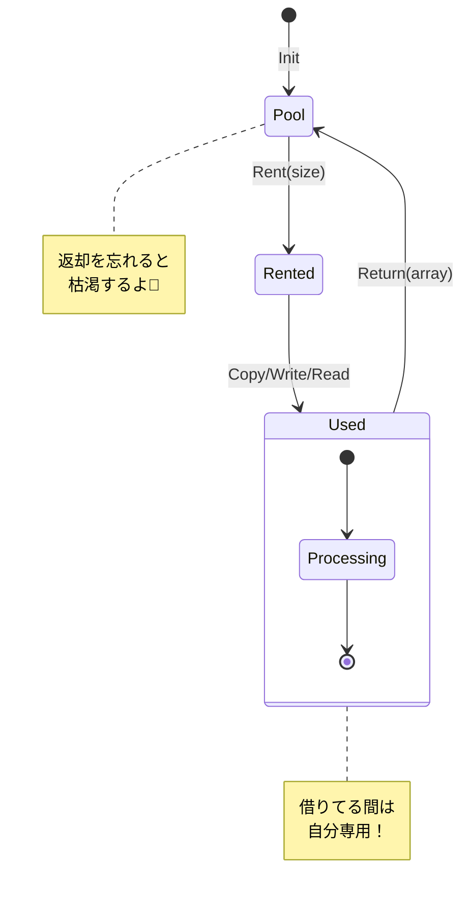

# 第50章：Flyweight ②：.NET定番（stringの共有 / ArrayPool<T>）🧵📦

## ねらい 🎯✨

* Flyweight（フライウェイト）を「**共有して軽くする**」って感覚でつかむ🪶🙂
* .NETの“現実のFlyweightっぽさ”として **string** と **ArrayPool<T>** を読んで体感する👀📚
* 「どこが共有されて」「どこが共有しちゃダメか」を見抜けるようになる🔍⚠️

---

## 到達目標 ✅🌸

* Flyweightのキモ（**共有できるのは“だいたい不変”**）を1文で言える🗣️✨
* `string` で「共有されやすいもの／されないもの」の違いを説明できる🧵🙂
* `ArrayPool<T>.Shared` の基本形（Rent→使う→Return）を迷わず書ける📦🔁
* “共有の副作用”の代表例（可変・クリア漏れ・サイズ勘違い）を避けられる🧯😵‍💫

---

## 手順 🧭🧩

### 1) Flyweightを一言で言う🪶

* **「同じものは共有して使い回し、メモリとGCの負担を下げる」** だよ🙂✨
* ただし、共有できるのはだいたい **不変（immutable）** なものが中心⚠️

  * 共有してるのに中身を変えたら、全員に影響しちゃうからね😱💥

---

### 2) `string` の“共有っぽさ”を読む🧵👀

#### A. 文字列リテラルは「メタデータからロードされる」📌

* C#の `"hello"` みたいな **文字列リテラル** は、IL的には `ldstr` 命令で読み込まれるよ📦
* `ldstr` は「アセンブリのメタデータにある文字列リテラル」を扱う命令として説明されてるよ📚([Microsoft Learn][1])

> ここで言いたいことはシンプルで、**同じ文字列が大量に出る世界**では「共有（または共有に近い挙動）」が効いてくる、って感覚を持つこと🙂🪶

#### B. 「共有していい文字列」と「共有が危ない文字列」⚖️

* 共有して嬉しい例：

  * 商品カテゴリ名、ステータス名、固定のキー（`"Paid"`, `"Shipped"` みたいな）🏷️✨
* 共有が危ない（または意味が薄い）例：

  * ユーザー入力、ログ本文、1回しか出ない長文🧾💦
  * 共有の管理コストの方が高いことが多い😵

---

### 3) `ArrayPool<T>` は“バッファのFlyweight”📦🪶





#### A. 何が嬉しい？（超ざっくり）🙂

* `byte[]` とか `char[]` を処理のたびに `new` すると、**大量確保→GC** がしんどくなる😵‍💫🗑️
* そこで **配列をプール（使い回し）** して、割り当てを減らすのが `ArrayPool<T>` 📦✨

#### B. .NET公式でも「ArrayPool<T>.Shared を使って割り当て回避」って文脈で出てくる📚

* たとえば `ReadOnlySequence<T>` を連続バッファとして扱いたいとき、
  `ToArray()` はヒープに新規配列を作るのでホットパスでは避けたい → `ArrayPool<T>.Shared` でコピーして割り当て回避、みたいな説明があるよ🧠✨([Microsoft Learn][2])

#### C. ASP.NET Coreの例でも “プールした配列を借りて返す” が普通に出てくる🌐📦

* ミドルウェア例で `ArrayPool<byte>.Shared.Rent(...)` → 使う → `Return(...)` の形が出てくるよ🔁([Microsoft Learn][3])

---

### 4) ArrayPoolの“基本の型”を覚える（これだけでOK）🧠✅

**合言葉：Rent → 使う（実長で！）→ finally で Return** 🔁✨

* `Rent(minLength)`

  * 返ってくる配列は **minLength以上**（ピッタリとは限らない）📏🙂
* “実際に使った長さ”は **自分で管理** する（ここ超重要！）🧷⚠️
* `Return(array, clearArray: true/false)`

  * 秘密データ（トークン、個人情報など）が入るなら `clearArray: true` が安心🧼🔐

---

## 落とし穴 ⚠️😵‍💫

* **共有対象が可変**で事故る（Flyweight最大の地雷）💣

  * 共有した配列・共有した参照の中身を変えたら、別の処理が壊れる😱
* `ArrayPool<T>` で **「借りた配列は自分のもの」だと思い込む**

  * 返し忘れ（Return漏れ）→ プールが効かない → 逆に遅い😵
  * 2回返す（ダブルReturn）→ だいたい地獄👹
* **配列サイズの勘違い**

  * `Rent(1024)` したら 2048 が来ることもある → 末尾はゴミが残ってるかも🗑️
  * “実長”を無視して全部処理するとバグる😵‍💫
* **クリア漏れ**

  * 秘密が入ったバッファを `clearArray:false` で返すと、別の処理に残骸が混ざる可能性😨🔐

---

## 演習 🏃‍♀️💨🧪

### 演習1：`string` の“共有感”をテストで確認🧵🔍

* MSTestで **参照が同じか** を見てみよう🙂✨

```csharp
using Microsoft.VisualStudio.TestTools.UnitTesting;

namespace DesignPatterns.Tests;

[TestClass]
public class FlyweightStringTests
{
    [TestMethod]
    public void String_Sharing_Basics()
    {
        // 同じリテラル
        string a = "hello";
        string b = "hello";

        // 参照が同じになりやすい（＝共有っぽい挙動が起きることが多い）
        Assert.IsTrue(object.ReferenceEquals(a, b));

        // new string は別インスタンスになりやすい
        string c = new string(new[] { 'h', 'e', 'l', 'l', 'o' });
        Assert.IsFalse(object.ReferenceEquals(a, c));

        // Internで共有側に寄せる（※使いどころは慎重に！）
        string d = string.Intern(c);
        Assert.IsTrue(object.ReferenceEquals(a, d));
    }
}
```

✅ポイント

* `ReferenceEquals` が **true/false になる理由**を、自分の言葉でメモしてね📝🙂

---

### 演習2：`ArrayPool<byte>` で“使い回しバッファ”を体験📦🔁

* ストリームを最後まで読む処理を、`ArrayPool<byte>` で書いてみよう🌊✨
* 目的は「**毎回 `new byte[]` しない**」ことだよ🙂

```csharp
using System.Buffers;

public static class PooledIo
{
    public static async Task<byte[]> ReadAllBytesPooledAsync(
        Stream stream,
        CancellationToken ct = default)
    {
        const int BufferSize = 16 * 1024;

        var pool = ArrayPool<byte>.Shared;
        byte[] buffer = pool.Rent(BufferSize);

        try
        {
            using var ms = new MemoryStream();

            while (true)
            {
                int read = await stream.ReadAsync(buffer.AsMemory(0, BufferSize), ct);
                if (read == 0) break;

                ms.Write(buffer, 0, read);
            }

            // 最終結果は「必要な分だけ」新規配列にする（戻り値が扱いやすい）
            return ms.ToArray();
        }
        finally
        {
            // 重要：必ず返す！ 秘密データが混ざる可能性があるなら clearArray:true
            pool.Return(buffer, clearArray: true);
        }
    }
}
```

テスト例（軽くでOK）🧪🙂

```csharp
using Microsoft.VisualStudio.TestTools.UnitTesting;
using System.Text;

namespace DesignPatterns.Tests;

[TestClass]
public class FlyweightArrayPoolTests
{
    [TestMethod]
    public async Task ReadAllBytesPooledAsync_ReadsAll()
    {
        string text = new string('a', 100_000);
        byte[] src = Encoding.UTF8.GetBytes(text);

        using var stream = new MemoryStream(src);

        byte[] result = await PooledIo.ReadAllBytesPooledAsync(stream);

        Assert.AreEqual(src.Length, result.Length);
        CollectionAssert.AreEqual(src, result);
    }
}
```

✅ポイント

* `finally` で `Return` してる？（ここ命！）🔁⚠️
* `read` の長さだけ `Write` してる？（実長管理！）📏✅

---

## チェック ✅📌

* Flyweightを「共有して軽くする」って説明できた？🪶🙂
* 共有していい条件を言えた？（だいたい“不変”！）🧊✅
* `ArrayPool<T>` の基本形を暗記せずに書けた？（Rent→try/finally→Return）📦🔁
* `Rent` の配列が “ピッタリサイズじゃない” 前提で扱えてる？📏⚠️
* `clearArray:true` を使う場面（秘密データ）を言えた？🧼🔐

[1]: https://learn.microsoft.com/en-us/dotnet/communitytoolkit/high-performance/stringpool?utm_source=chatgpt.com "StringPool - Community Toolkits for .NET"
[2]: https://learn.microsoft.com/ja-jp/dotnet/standard/io/buffers?utm_source=chatgpt.com "System.Buffers - .NET"
[3]: https://learn.microsoft.com/en-us/dotnet/api/communitytoolkit.highperformance.buffers.memoryowner-1.allocate?view=dotnet-comm-toolkit-8.4&utm_source=chatgpt.com "MemoryOwner<T>.Allocate Method"
