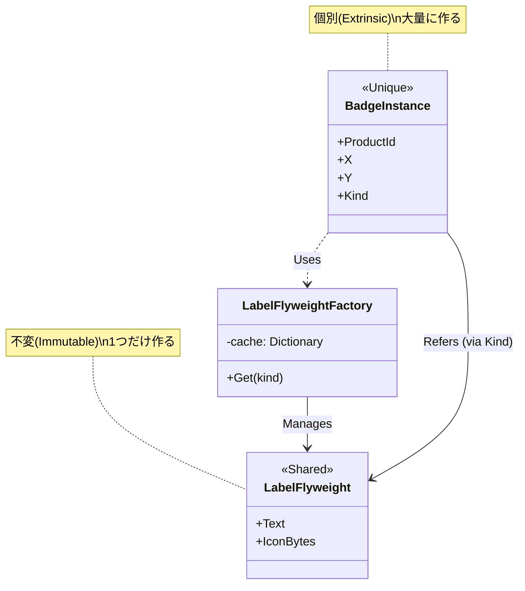

# 第51章：Flyweight ③：演習（大量生成するラベル/アイコン情報）🏷️

## ねらい 🎯

* 大量の「同じラベル／同じアイコン」を何度も作ってメモリが重くなる問題を、**共有（Flyweight）**で軽くする感覚を身につけるよ😊
* **共有していい情報（変わらない）**と、**共有しちゃダメな情報（個別に変わる）**を、きれいに分けられるようになるよ🧠✨
* “クラスを増やす”のが目的じゃなくて、**オブジェクト数とメモリを減らす**のが目的だよ🧹🪄

---

## 到達目標 ✅

* 「共有してOKな情報（Intrinsic）」と「個別に持つ情報（Extrinsic）」を説明できる📌
* 同じラベル情報を **1回だけ生成して共有**できる（Factory/Cacheで管理）🏭🧊
* テストで「共有できてる！」を **参照同一性（ReferenceEquals）**で確認できる🧪✨
* ざっくりでいいので、割り当て（allocation）が減ったことを数字で見られる📉（`GC.GetAllocatedBytesForCurrentThread()`） ([Microsoft Learn][1])

---

## 手順 🛠️✨

### 1) まず「導入前」素朴版を作る 🐣


状況：ECの管理画面で、商品に「NEW」「SALE」みたいな **バッジ（ラベル＋アイコン）**をいっぱい表示したい📦🛒
でも素朴にやると、商品1件ごとに同じラベル情報を **何度もnew** しちゃう😵💦

* **素朴版の考え方**

  * `ProductBadge` が `Badge`（文字＋アイコンデータ）を毎回まるごと持つ
  * 1万件あったら `Badge` も1万個…🫠

### 2) 共有対象（Intrinsic）と個別情報（Extrinsic）を分ける ✂️🧠

* **共有してOK（Intrinsic）**：ラベル文字、アイコンデータ（※同じ種類なら同じ）
* **個別（Extrinsic）**：どの商品に付くか、表示位置、表示優先度…など

ここがFlyweightのキモ！🪶✨
「変わらない部品」を共通化して、個別データは軽く持つよ🙂




### 3) Flyweight（共有オブジェクト）をFactoryで管理する 🏭🧊

* 種類（`LabelKind`）ごとに **共有インスタンスを1個だけ作る**
* 取り出しは `LabelFlyweightFactory.Get(kind)` の1行でOKにする✨

> 種類が固定なら、最初に全部作ってしまうのが一番ラク＆安全だよ😊
> （遅延生成したいなら `Lazy<T>` や `ConcurrentDictionary` にしてもOK）

### 4) テストで「共有できてる」を確認する 🧪🔍

* 素朴版：アイコン配列が**全部別物**になってるはず（最悪パターン）
* Flyweight版：アイコン配列の参照は **種類の数だけ**のはず（理想）🎉

### 5) メモリ差は “プロファイラ” でも見てみる（任意）🧰👀

Visual Studioの **Memory Usage**（メモリ分析）を使うと、どの型が増えてるか見えるよ📊 ([Microsoft Learn][2])

### 6) AI補助（雛形づくりだけに使う）🤖✍️

例：Copilot/Codexにこう頼むと早いよ👇

* 「MSTestで、素朴版とFlyweight版の生成コードとテストを作って。オブジェクト共有が参照同一性で検証できるようにして」
* **注意**：生成されたコードはそのまま採用せず、

  * 共有対象が可変になってない？
  * Factoryが責務過多になってない？
  * テストが “共有を本当に検証” できてる？
    をチェックするよ👀✨

---

## 実装例 🧩（素朴版 → Flyweight版）

※説明しやすいように「アイコン」を `byte[]`（ダミー）で表現するよ。**同じ種類のアイコンが毎回newされると激重**っていう再現がしやすいの🥺💦

```csharp
using System;
using System.Collections.Generic;
using System.Linq;

namespace ECommerce.Badges;

// バッジの種類（= 共有キー）
public enum LabelKind
{
    New,
    Sale,
    Limited
}

// --------------------
// 素朴版（導入前）🐣
// --------------------
public sealed record Badge(string Text, byte[] IconBytes);

public sealed record ProductBadge_Naive(int ProductId, int X, int Y, Badge Badge);

// --------------------
// Flyweight版（導入後）🪶
// --------------------
// 共有してOKなもの：Text, IconBytes（不変にして扱うのが大事✨）
public sealed record LabelFlyweight(string Text, ReadOnlyMemory<byte> IconBytes);

// 個別に持つもの：どの商品か、座標など
public readonly record struct BadgeInstance(int ProductId, int X, int Y, LabelKind Kind);

public static class LabelFlyweightFactory
{
    // 種類が固定なら「最初に全部作る」が簡単＆速い😊
    private static readonly IReadOnlyDictionary<LabelKind, LabelFlyweight> Cache =
        new Dictionary<LabelKind, LabelFlyweight>
        {
            { LabelKind.New,     new LabelFlyweight("NEW",     CreateFakeIconBytes(size: 4096, seed: 1)) },
            { LabelKind.Sale,    new LabelFlyweight("SALE",    CreateFakeIconBytes(size: 4096, seed: 2)) },
            { LabelKind.Limited, new LabelFlyweight("LIMITED", CreateFakeIconBytes(size: 4096, seed: 3)) },
        };

    public static LabelFlyweight Get(LabelKind kind) => Cache[kind];

    private static byte[] CreateFakeIconBytes(int size, byte seed)
    {
        var bytes = new byte[size];
        // それっぽく差をつけるだけ（中身は何でもOK）
        Array.Fill(bytes, seed);
        return bytes;
    }
}
```

---

## テスト例（MSTest）🧪✨

「共有できてる？」を **参照の数**で確認するよ🔍
ついでに割り当て量も “ざっくり” 比較してみるよ（差が大きいので安定しやすい）📉 ([Microsoft Learn][1])

```csharp
using Microsoft.VisualStudio.TestTools.UnitTesting;
using System;
using System.Collections.Generic;
using System.Linq;
using ECommerce.Badges;

namespace ECommerce.Tests;

[TestClass]
public class FlyweightBadgeTests
{
    public TestContext? TestContext { get; set; }

    [TestMethod]
    public void Naive_creates_tons_of_duplicate_icons()
    {
        var badges = CreateNaive(count: 10_000);

        // byte[] は参照型なので Distinct() で「参照の違い」が見れるよ✅
        int distinctIconArrays = badges.Select(x => x.Badge.IconBytes).Distinct().Count();

        Assert.AreEqual(badges.Count, distinctIconArrays, "素朴版は毎回newしてるので全部別参照になるはず😵");
    }

    [TestMethod]
    public void Flyweight_shares_icons_by_kind()
    {
        var instances = CreateFlyweightInstances(count: 10_000);

        // 各インスタンスが参照する Flyweight のアイコン配列参照を集計
        var iconRefs = instances
            .Select(i => LabelFlyweightFactory.Get(i.Kind).IconBytes)
            .Select(mem => mem.ToArray()) // ※ToArrayは新規配列になるので本当はNG
            .ToList();

        // ↑ これはわざとダメ例😇：
        // ReadOnlyMemory<byte> から ToArray() すると毎回コピーで増える！
        // 正しくは「元のbyte[]参照」を共有しているかを見たいので、Factory側を少しだけ工夫するよ👇
    }

    [TestMethod]
    public void Flyweight_shares_underlying_icon_arrays()
    {
        // Factoryの共有確認をしやすくするため「参照取得」を用意してテストするのがコツ✨
        // （下の GetIconArrayRef を使う）
        var kinds = new[] { LabelKind.New, LabelKind.Sale, LabelKind.Limited };

        // 共有の参照が「種類数」だけに収束することを確認
        var list = Enumerable.Range(0, 10_000)
            .Select(i => kinds[i % kinds.Length])
            .Select(GetIconArrayRef)
            .ToList();

        int distinct = list.Distinct().Count();
        Assert.AreEqual(3, distinct, "Flyweightなら共有は種類数だけになるよ🎉");
    }

    [TestMethod]
    public void Allocation_is_much_smaller_with_flyweight()
    {
        // ざっくり比較（JIT等の影響を減らすために軽くウォームアップ）
        _ = CreateNaive(10);
        _ = CreateFlyweightInstances(10);
        _ = GetIconArrayRef(LabelKind.New);

        long beforeNaive = GC.GetAllocatedBytesForCurrentThread();
        _ = CreateNaive(10_000);
        long naiveAllocated = GC.GetAllocatedBytesForCurrentThread() - beforeNaive;

        long beforeFly = GC.GetAllocatedBytesForCurrentThread();
        _ = CreateFlyweightInstances(10_000);
        long flyAllocated = GC.GetAllocatedBytesForCurrentThread() - beforeFly;

        TestContext?.WriteLine($"Naive allocated: {naiveAllocated:n0} bytes");
        TestContext?.WriteLine($"Flyweight allocated: {flyAllocated:n0} bytes");

        // アイコン配列（4096 bytes）が毎回newされる vs 種類分だけ なので差は超でかいはず💥
        Assert.IsTrue(naiveAllocated - flyAllocated > 20_000_000, "差が小さいなら共有できてないかも😵‍💫");
    }

    // --- helpers ---

    private static List<ProductBadge_Naive> CreateNaive(int count)
    {
        var kinds = new[] { LabelKind.New, LabelKind.Sale, LabelKind.Limited };
        var list = new List<ProductBadge_Naive>(count);

        for (int i = 0; i < count; i++)
        {
            var kind = kinds[i % kinds.Length];
            // 毎回new（=地獄🔥）
            var badge = kind switch
            {
                LabelKind.New => new Badge("NEW", new byte[4096]),
                LabelKind.Sale => new Badge("SALE", new byte[4096]),
                _ => new Badge("LIMITED", new byte[4096]),
            };
            list.Add(new ProductBadge_Naive(ProductId: i, X: i % 300, Y: i % 200, Badge: badge));
        }

        return list;
    }

    private static List<BadgeInstance> CreateFlyweightInstances(int count)
    {
        var kinds = new[] { LabelKind.New, LabelKind.Sale, LabelKind.Limited };
        var list = new List<BadgeInstance>(count);

        for (int i = 0; i < count; i++)
        {
            var kind = kinds[i % kinds.Length];
            list.Add(new BadgeInstance(ProductId: i, X: i % 300, Y: i % 200, Kind: kind));
        }

        return list;
    }

    // Factoryの内部で作った「元のbyte[]参照」をそのまま取りたいので、
    // ここでは Get(kind).IconBytes が ReadOnlyMemory<byte> を持ってる前提で、
    // その "元配列" を参照できるようにする（演習として Factory に小さく足すのがオススメ✨）
    private static byte[] GetIconArrayRef(LabelKind kind)
    {
        var fly = LabelFlyweightFactory.Get(kind);

        // ReadOnlyMemory<byte> から元配列を取る（TryGetArray）
        if (System.Runtime.InteropServices.MemoryMarshal.TryGetArray(fly.IconBytes, out ArraySegment<byte> seg)
            && seg.Array is not null
            && seg.Offset == 0
            && seg.Count == seg.Array.Length)
        {
            return seg.Array;
        }

        Assert.Fail("IconBytes が配列を直接参照してないよ（コピーやスライスになってるかも）😵‍💫");
        return Array.Empty<byte>();
    }
}
```

> ✅ポイント
> `ReadOnlyMemory<byte>` を “安全な読み取りビュー” として持ちつつ、内部は `byte[]` を共有するのが分かりやすいよ🙂
> **`ToArray()` はコピー**だから、共有確認のときは使わないでね（増えちゃう）😇

---

## よくある落とし穴 ⚠️😵‍💫

* **共有対象が可変**（あとから書き換えちゃう）
  → Flyweightは基本「不変」として扱うのが安全だよ🧊✨
* **Factoryが何でも屋**になって、依存が集まりすぎる（God Factory化）
  → “ラベル共有”だけを責務にしてね🏷️
* **`string.Intern` を雑に使う**
  → 文字列共有の考え方としては便利だけど、インターンされた文字列は長く生きやすいので、入力が無限に増える系には注意だよ⚠️ ([Microsoft Learn][3])
* **配列プールを借りたら返すの忘れる（ArrayPool）**
  → 借りたら `Return`！が基本だよ🧼（配列再利用の仕組み） ([Microsoft Learn][4])

---

## ミニ演習 10〜30分 🧁⏱️

1. 上の素朴版を動かして、`Naive_creates_tons_of_duplicate_icons` を通す🧪✅
2. Flyweight版を入れて、`Flyweight_shares_underlying_icon_arrays` が通るようにする🪶🎉
3. `Allocation_is_much_smaller_with_flyweight` を実行して、出力の数値を眺める📉👀
4. 追加課題（できたら✨）

   * `LabelKind` を1つ増やしても、**変更箇所がFactoryだけ**で済むのを確認する🧠💡
   * Visual Studioの Memory Usage で、`Badge` や `byte[]` が減っているのを見てみる📊 ([Microsoft Learn][2])

---

## 自己チェック ✅🌸

* 「共有していい情報」と「個別に持つ情報」を、例を挙げて言える？🗣️
* 共有インスタンスが “種類数だけ” に収まってる？（参照同一性で確認できた？）🔍
* `ToArray()` みたいな **コピーで台無し**をやってない？😇
* “軽くしたい理由”が1文で言える？（例：大量生成でメモリとGCがつらい）🪶💦

---

### おまけ豆知識 🫘✨

* 今のLTSは **.NET 10**（2025-11-11リリース、2028-11-14までサポート）なので、長く使う教材・サンプルはLTSに寄せると安心だよ😊 ([Microsoft Learn][5])

[1]: https://learn.microsoft.com/en-us/dotnet/api/system.gc.getallocatedbytesforcurrentthread?view=net-8.0&utm_source=chatgpt.com "GC.GetAllocatedBytesForCurrentThread Method (System)"
[2]: https://learn.microsoft.com/ja-jp/dotnet/api/system.buffers.arraypool-1?view=net-10.0&utm_source=chatgpt.com "ArrayPool<T> Class (System.Buffers)"
[3]: https://learn.microsoft.com/ja-jp/dotnet/api/system.string.intern?view=net-9.0&utm_source=chatgpt.com "String.Intern(String) メソッド (System)"
[4]: https://learn.microsoft.com/fr-fr/dotnet/api/system.gc.getallocatedbytesforcurrentthread?view=xamarinios-10.8&utm_source=chatgpt.com "GC.GetAllocatedBytesForCurrentThread Method (System)"
[5]: https://learn.microsoft.com/en-us/dotnet/core/whats-new/dotnet-10/overview?utm_source=chatgpt.com "What's new in .NET 10"
