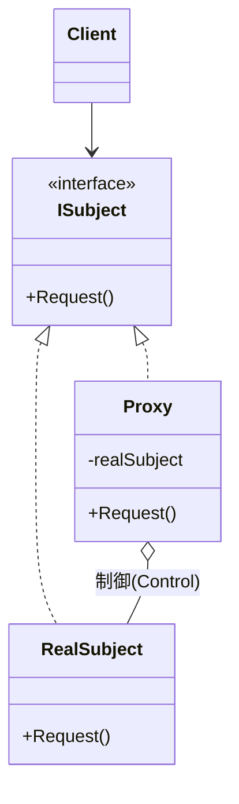

# 第52章：Proxy ①：本人の代わりに制御する🪞🚧

## ねらい 🎯

* **本体（本物のオブジェクト）に触る前後**で、ちょい足しの制御を入れられるようになる（遅延・キャッシュ・制限・ログなど）🧊🧾🔐
* 「機能追加はDecorator？入口簡略化はFacade？」みたいに、**“似てるけど違う”を見分ける軸**を作る👀✨
* C#で「Proxyっぽいこと」をやるときに、まず思い出す定番（`Lazy<T>` など）をつかむ⏳🧠

---

## 到達目標 ✅

* Proxyが解く困りごとを **1文**で言える（例：*“本体アクセスの前後に制御を挟みたい”*）🗣️
* Proxyを使うべき状況を **具体例3つ**で説明できる（遅延/キャッシュ/アクセス制限 など）🧠🧩
* **手書きProxy（小さく）**で「キャッシュProxy」か「遅延Proxy」を作って、テストで効果を確認できる🧪✨

---

## 手順 🧭✨

### 1) Proxyってなに？（超ざっくり）🪞


Proxyは「**本人（Real Subject）に見せかけた“代理人”**」だよ〜！😺
呼び出し側からは **本体と同じインターフェース**に見えるけど、裏でこういうことをする👇

* 本体を**必要になるまで作らない**（遅延 / Virtual Proxy）⏳
* 結果を**覚えておいて**次回を高速化（キャッシュ / Caching Proxy）🧊
* 条件が満たされないと**通さない**（保護 / Protection Proxy）🔐
* 呼ぶ前後で**ログ・計測・リトライ**などを入れる（制御 / Smart Proxy）🧾📏🔁




---

### 2) ProxyとDecoratorの違い（ここ大事）🧠✨

どっちも「包む」けど目的が違うよ〜！🎁

* **Proxy**：アクセスを“制御”する（遅延・制限・キャッシュ・ログ）🚧
* **Decorator**：機能を“盛る”（組み合わせて機能追加）🎀

見分けの一言👇

* 「**通していい？今作る？覚えてる？**」→ Proxyっぽい🪞🚧
* 「**機能を付け足していきたい**」→ Decoratorっぽい🎁✨

---

### 3) C#でProxyをやる“定番3ルート”🛣️

この章はまず「小さく・安全に」いくよ〜🙂

1. **手書きProxy（最推し）**：読める、デバッグしやすい、やりすぎない👌
2. **`Lazy<T>`**：遅延（Virtual Proxy）の最短ルート⏳（`Lazy<T>` は複数のコンストラクタやスレッド安全モードを持つよ）([Microsoft Learn][1])
3. **`DispatchProxy`**：動的Proxy（次章で詳しく）。ただし **動的コードが必要**な場面があり得るので注意（AOT/トリミング等）([Microsoft Learn][2])

ちなみに2026年時点のLTSは **.NET 10** が目安（開始日などのライフサイクル情報は公式に載ってる）📅✨([Microsoft Learn][3])
（こういう“今のLTSはどれ？”は年で変わるから、公式のライフサイクルを見るクセが強い💪）

---

### 4) ミニ実装：キャッシュProxy（＋遅延も混ぜる）🧊⏳

題材は「大量に参照されるアイコン情報」🏷️
本体は重い（外部から取る・ファイル読む・DB叩く等）想定で、Proxyが **キャッシュ**して高速化するよ〜🚀

ポイント：

* Proxyは **本体と同じインターフェース**を実装する
* Proxyは **本体を抱える（委譲する）**
* Proxyが **制御（今回はキャッシュ）**を挟む

```csharp
using System.Collections.Concurrent;

public sealed record IconInfo(string Key, string Svg);

// 本体もProxyも「同じ見た目」にする
public interface IIconStore
{
    Task<IconInfo> GetAsync(string key, CancellationToken ct = default);
}

// 本体（重い処理がある想定）
public sealed class RealIconStore : IIconStore
{
    public async Task<IconInfo> GetAsync(string key, CancellationToken ct = default)
    {
        // 例：外部取得っぽい遅延（ここでは疑似）
        await Task.Delay(50, ct);
        return new IconInfo(key, $"<svg><!-- {key} --></svg>");
    }
}

// Proxy（キャッシュで制御する）
public sealed class CachingIconStoreProxy : IIconStore
{
    private readonly IIconStore _inner;

    // keyごとに「最初の1回だけ本体を呼ぶ」仕掛け
    private readonly ConcurrentDictionary<string, Lazy<Task<IconInfo>>> _cache = new();

    public CachingIconStoreProxy(IIconStore inner)
        => _inner = inner;

    public Task<IconInfo> GetAsync(string key, CancellationToken ct = default)
    {
        // NOTE: ct はキャッシュと相性が悪い（呼び出しごとに違う）ので、
        // まずは「キャッシュするAPIは ct なし」に分ける設計もよくあるよ🙂
        var lazy = _cache.GetOrAdd(
            key,
            k => new Lazy<Task<IconInfo>>(() => _inner.GetAsync(k, CancellationToken.None))
        );

        return lazy.Value;
    }
}
```

💡ここがProxyの気持ちいいところ：

* 呼び出し側は `IIconStore` しか見ない（本体かProxyか知らない）😌
* “制御（キャッシュ）”を**呼び出し側から追い出せる**🧹✨

---

### 5) テストで「本体の呼び出し回数」を固定する🧪🔒

Proxyは便利だけど、**挙動がズレると地獄**😵
だからテストで「本体が何回呼ばれたか」を押さえるよ〜！

```csharp
using Microsoft.VisualStudio.TestTools.UnitTesting;

[TestClass]
public class ProxyTests
{
    private sealed class CountingIconStore : IIconStore
    {
        public int CallCount { get; private set; }

        public Task<IconInfo> GetAsync(string key, CancellationToken ct = default)
        {
            CallCount++;
            return Task.FromResult(new IconInfo(key, "<svg/>"));
        }
    }

    [TestMethod]
    public async Task CachingProxy_CallsInnerOnlyOnce_PerKey()
    {
        var inner = new CountingIconStore();
        IIconStore proxy = new CachingIconStoreProxy(inner);

        var a1 = await proxy.GetAsync("cart");
        var a2 = await proxy.GetAsync("cart");
        var b1 = await proxy.GetAsync("mail");

        Assert.AreEqual(2, inner.CallCount, "cart(1回) + mail(1回) の想定");
        Assert.AreEqual("cart", a1.Key);
        Assert.AreEqual("cart", a2.Key);
        Assert.AreEqual("mail", b1.Key);
    }
}
```

---

### 6) “本体アクセス前後の制御”のネタ帳（Proxyの使いどころ）🗂️✨

Proxyの制御は、だいたいこのへんに落ち着くよ〜🙂

* **遅延（Lazy）**：重い依存を必要になるまで作らない⏳

  * `Lazy<T>` の生成・モード（`LazyThreadSafetyMode`）で挙動を選べるよ([Microsoft Learn][1])
* **キャッシュ**：同じ結果を何度も取りに行かない🧊
* **アクセス制限**：権限・状態・回数制限🔐🚦
* **ログ/計測**：前後でログ、時間測定、監査🧾⏱️
* **リモート呼び出しの“手前”**：通信を隠す🌐（Remote Proxy）
* **HTTPまわりの“代理”**：`HttpClient` の内部は `HttpMessageHandler` を差し替えてパイプラインを作れる（近縁の発想）📨🧩([Microsoft Learn][4])

---

### 7) AI補助（Copilot / Codex）で雛形を作るときのコツ🤖✍️

ProxyはAIが“盛りがち”なので、最初から縛るのが勝ち！😺✨

プロンプト例👇

* 「`IIconStore` は変更しないで、`CachingIconStoreProxy` を**手書き**で作って」
* 「キャッシュは `ConcurrentDictionary` のみ。**独自フレームワーク禁止**」
* 「テストは“本体呼び出し回数”を検証して」

レビュー観点はこれだけでOK🙆‍♀️

* Proxyが**余計な責務**を持ってない？（業務ロジック混ぜてない？）🧼
* 例外・戻り値が本体とズレてない？⚠️
* キャッシュのキーや寿命は妥当？（永遠キャッシュになってない？）🧊🕰️

---

## よくある落とし穴 ⚠️😵

* **Proxyが“何でも屋”になる**（ログも認可もリトライも全部入れて太る）🐘
  → まずは1種類だけ（例：キャッシュだけ）にする🙂
* **本体とProxyで例外や戻り値の契約がズレる**💥
  → テストで「ズレちゃダメなところ」を固定する🧪🔒
* **キャッシュにCancellationTokenを混ぜてカオス**🌀
  → “キャッシュするAPI”は token を分ける／tokenは外側で扱う、が定番だよ🙂
* **共有（キャッシュ）するのに中身が可変**で破綻🧨
  → 共有するなら「不変」寄り（record等）にするのが安心🧾✨

---

## 演習（30〜60分）🛠️🎮

1. **遅延Proxyを作る**⏳

* `Lazy<IIconStore>` を使って「最初の呼び出しまで本体を作らない」Proxyを作る
* テスト：`IsValueCreated`（またはカウント）で **本体が遅れて作られる**ことを確認

2. **保護Proxyを作る**🔐

* `Func<bool> canAccess` を受け取って、falseなら例外にするProxyを作る
* テスト：許可あり/なしの2パターン

3. **“Proxyに入れるべきでない処理”を見抜く**👀

* うっかりProxyに業務ルール（例：割引計算）を入れてしまった版を作る
* それを外に戻して、Proxyの責務を「制御」に戻す（コミット分けると最高）✨

---

## チェック ✅📌

* Proxy導入理由を「遅延 / キャッシュ / 制限 / ログ」みたいに**制御の言葉**で言えてる？🪞🚧
* 呼び出し側が **具体クラス（RealIconStore）を知らず**に済んでる？🙆‍♀️
* テストで「本体が何回呼ばれたか」「Proxyが何を守っているか」を固定できてる？🧪🔒
* Proxyが太ってない？（“ついでに便利機能”を詰め込みすぎてない？）🐘💦

[1]: https://learn.microsoft.com/fr-fr/dotnet/api/system.lazy-2.-ctor?view=net-9.0&utm_source=chatgpt.com "Lazy<T,TMetadata> Constructor (System)"
[2]: https://learn.microsoft.com/lt-lt/dotNet/api/system.reflection.dispatchproxy.invoke?view=net-6.0&utm_source=chatgpt.com "DispatchProxy.Invoke(MethodInfo, Object[]) Method"
[3]: https://learn.microsoft.com/en-us/lifecycle/products/microsoft-net-and-net-core?utm_source=chatgpt.com "Microsoft .NET and .NET Core - Microsoft Lifecycle"
[4]: https://learn.microsoft.com/nb-no/DOTNET/api/system.reflection.dispatchproxy.create?view=net-6.0&utm_source=chatgpt.com "DispatchProxy.Create Method (System.Reflection)"
